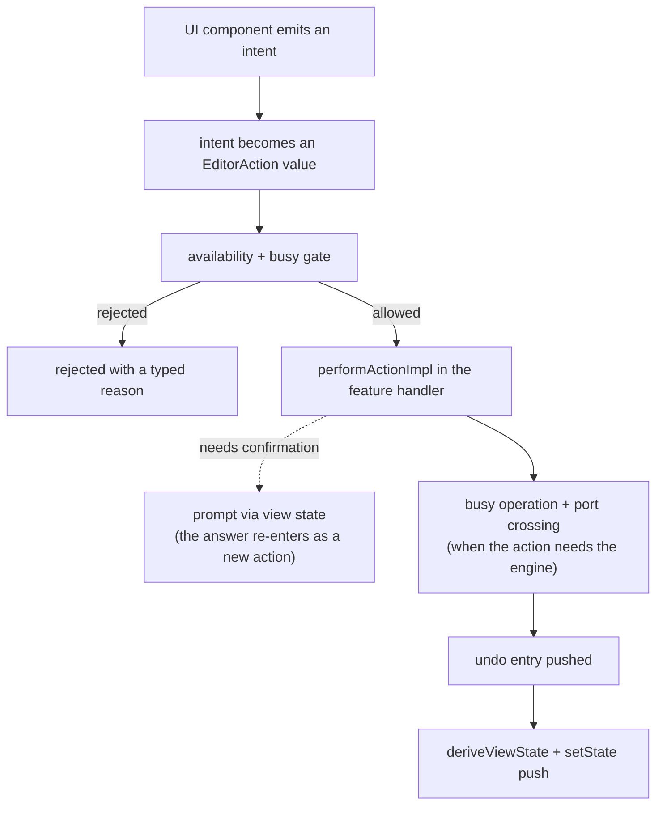

\page guide_action_anatomy Anatomy of an Editor Action

*Applies to: Editor-only.*

This page traces one real feature — importing a tone file into the current project — from the
button click to the audible result and the undo entry. Tone import is chosen because it touches
everything an editor operation can touch: a confirmation prompt, a busy operation, asynchronous
engine work, a port crossing, and undo capture. Once you can follow this flow, you can follow any
editor operation, because **every action walks the same pipeline** — simpler actions just skip
stages.

# Stage 1 — The UI emits an intent

The Import button lives in `SignalChainView` (`rock-hero-editor/ui/src/signal_chain/`). Its click
handler does one thing: it calls `onImportTonePressed()` on the view's nested `Listener`
interface. The component does not know what importing means — it reports a gesture.

`EditorView` (`rock-hero-editor/ui/src/main_window/editor_view.cpp`) implements that listener. It
owns the one genuinely UI-shaped step: showing the asynchronous JUCE `FileChooser`. When the user
picks a file, `EditorView` calls `onImportToneFileRequested(...)` on the controller interface.
UI involvement ends here; everything after this point is headless and testable.

Keystrokes enter at this same stage: the command mapping set resolves a registered chord and
`EditorView::perform` calls the identical intent method a button click would (grammar keys
decode in `EditorView::keyPressed` the same way), so from the controller inward a keybind and a
click are indistinguishable. \ref guide_keyboard traces that entry path — focus, the two
dispatchers, and the keys that bypass actions entirely for the caret grammar.

# Stage 2 — The intent becomes an action

`EditorController::onImportToneFileRequested` wraps the request into a value —
`EditorAction::ImportToneFile` — and hands it to `runAction(...)`
(`rock-hero-editor/core/src/controller/editor_controller.cpp`). From here on, the operation is
data, and the pipeline treats every operation identically.

# Stage 3 — The gate

`runAction` asks the availability policy (`editor_action_availability.cpp`) whether this action
is allowed right now: is a session loaded, is a prompt already open, is a busy operation running
and if so does this action supersede it? These are exhaustive switches over the action id — every
action answered these questions at compile time. If the answer is no, the action is rejected with
a typed reason (`actionUnavailableReason`) and nothing happens.

# Stage 4 — Dispatch to the feature handler

`performAction` does a `std::visit` on the action variant, landing in the typed overload
`performActionImpl(EditorAction::ImportToneFile)` — which lives in
`rock-hero-editor/core/src/tone_designer/tone_designer_handlers.cpp`, the tone designer's handler
file, not in the controller's own file. That is the multi-TU pattern: one controller object,
member definitions filed by feature.

This handler owns the import's *policy*. It checks whether the import would destroy existing tone
automation; if so it does not proceed — it stashes the action and raises a confirmation prompt
via view state. The user's answer arrives later as a *new* action (`ResolveToneImportPrompt`),
which re-enters the pipeline at stage 2 and, on confirmation, rejoins the flow below.

# Stage 5 — The busy operation begins

`runToneImport` captures everything undo will later need (the before-state of the signal chain
and the identities of the current plugins), then starts a busy operation: the busy overlay is
requested, a busy token is minted, and the actual work is deferred until the overlay has really
painted — a paint fence, because on Windows a flood of posted messages can starve paint events.

# Stage 6 — Across the port

The handler calls `m_live_rig.replaceAudibleToneFromFile(...)`. `m_live_rig` is an
`ILiveRig&` — a port. Editor core does not know (or link against) what is on the other side; in
production it is the `Engine`, in tests it is a fake. This single call is the only place the
whole feature crosses from editor policy into audio integration.

# Stage 7 — Inside the engine

`Engine::replaceAudibleToneFromFile` (`rock-hero-common/audio/src/engine/engine_live_rig.cpp`)
guards its preconditions, then delegates the file work to `readToneFile`
(`src/live_rig/tone_file.cpp`): open the archive, parse and version-check the tone document
(`tone_document.cpp`). With a validated document in hand, the engine instantiates the required
plugins *cooperatively* — one per message-loop turn, so the UI stays alive — collects any that
are missing, and finally swaps the audible chain transactionally: the old chain stays audible
until the new one is ready.

# Stage 8 — Completion, undo, and the round trip home

The engine reports completion through a callback. Back in the handler, `finishToneImport` first
validates its busy token (a stale completion from a superseded import is dropped silently), then
rewrites tone automation for the new chain, mints fresh durable plugin identities, and pushes a
single `IEdit` undo entry built from the before-state captured in stage 5 — one Ctrl+Z now
reverses the whole import.

Finally the controller re-derives view state (`deriveViewState()`) and pushes it to the UI via
`setState(...)`. The signal chain view re-renders from that state. The circle closes exactly
where it began — but the component that started it never learned what happened; it just drew the
new state it was given.

# The template

Every editor action is some subset of this: **intent → action value → gate → feature handler →
(prompt?) → (busy + port crossing?) → undo capture → view state push**. Transport play skips the
prompt, the busy operation, and undo; saving a project adds a worker-thread offload; but the
stages always appear in this order, in these files. When tracing an unfamiliar action, start at
its `performActionImpl` overload and read outward in both directions.

