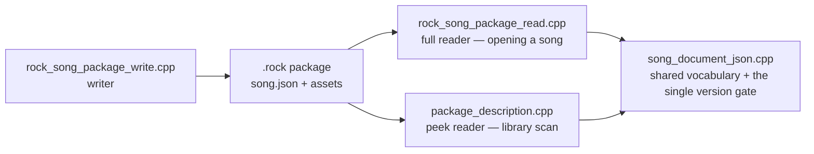

\page guide_package_format Changing the Package Format

*Applies to: Repo-wide — the editor writes packages, the game reads them.*

Use this checklist when `song.json` or anything else inside a `.rock` package changes. The format
code lives in `rock-hero-common/core/src/package/`.

**The one standing trap:** the package has *two independent readers*, and they must speak an
identical field vocabulary. Most format bugs are a field taught to one reader and not the other.

# The moving parts

- **Writer** — `rock_song_package_write.cpp` (`writeRockSongPackageDirectory`) emits `song.json`
  and the package layout; the `formatVersion` literal is written here.
- **Full reader** — `rock_song_package_read.cpp`, used when the editor or game actually opens a
  song.
- **Peek reader** — `package_description.cpp`, used by the game's library scan to read metadata
  from hundreds of packages quickly without loading them.
- **Shared vocabulary and the version gate** — `song_document_json.h`/`.cpp`. The single version
  check (`requireSupportedSongDocumentVersion`) lives here; **no other call site may test the
  version**. The migration/tolerance ladder that will eventually replace the hard gate is planned
  in `docs/plans/roadmap/10-format-versioning-and-chart-identity.md`.

# Part A — The compiler walks you through these {#package_format_part_a}

Change the domain model first — the field's home in
`rock-hero-common/core/include/rock_hero/common/core/song/` (`song.h`, `arrangement.h`,
`audio_asset.h`, ...) — and designated initializers plus exhaustive handling will surface most
struct consumers. That is where compiler help ends; everything serialization-shaped is silent.

# Part B — Silent steps: nothing fails if you forget {#package_format_part_b}

1. **Write it** in `rock_song_package_write.cpp`.
2. **Read it in both readers** — the full read *and* the peek read, if the field is (or ever
   becomes) part of the description surface. Prefer putting shared field walks in
   `song_document_json.cpp` so there is only one spelling of the key.
3. **Normalize it.** Save is publish: invariants normalize rather than reject
   (tone rules live in `core/src/tone/tone_track_normalize.cpp` and `tone_track_rules.cpp`; song
   and arrangement invariants in `core/src/song/`). A field without normalization rules is a
   field whose illegal states get persisted.
4. **Version policy.** Decide whether old packages remain readable. There is no
   backward-compatibility obligation at this stage of the project — formats just change — but the
   *decision* must be deliberate, and the gate lives only in `song_document_json.cpp` (reader)
   and the write literal.
5. **Do not confuse the editor's project file.** `rock-hero-editor/core/src/project/project_io.cpp`
   has its own separate `project.json` with its own version — a package-format change does not
   belong there, and vice versa.
6. **Downstream consumers.** The game's library projection
   (`rock-hero-game/core/src/library/rock_song_package_describer.cpp` and friends) consumes
   `PackageDescription`; extend it if the new field should surface in the library.
7. **Tests.** `test_rock_song_package.cpp`, `test_package_description.cpp`, and `test_song.cpp`
   under `rock-hero-common/core/tests/` — cover write→read round-trip through *both* readers.
8. **Corpus smoke.** After any read-path change, run the local corpus-smoke check (it loads every
   package in the local corpus). It is strictly local — the corpus never enters git or CI — so
   this is a step only you can run, and nothing will remind you.
9. **The format reference.** Update \ref guide_file_formats in the same commit — it documents
   every field, and a field it doesn't know about makes it a lie.
