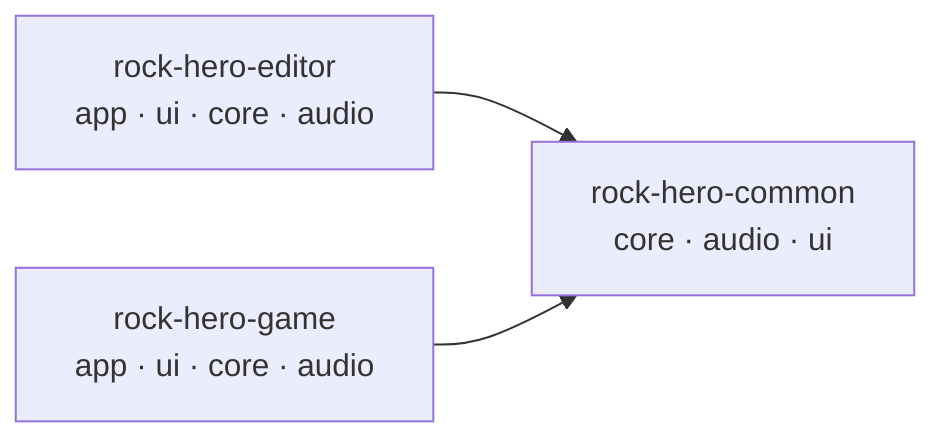

\page guide Developer Guide

This guide is the practical companion to the design documents: it explains the concepts a
contributor meets on day one in plain language, walks through one real feature end to end, and
provides checklists for the most common kinds of change so that nothing is left half-wired.

The documentation has three tiers:

1. **`CONTRIBUTING.md`** (repository root) — how to build, test, and submit a change.
2. **This guide** (`docs/developer/`) — what the moving parts are, why they exist, and the exact
   touchpoints each common change must visit.
3. **The design documents** (\ref design) — the binding rules: architecture, structural
   constraints, coding conventions, and documentation conventions.

The design documents are the source of truth. This guide restates nothing; it explains and points.
If this guide and a design document ever disagree, the design document wins — and the guide has a
bug worth fixing.

**Maintenance rule:** if a commit changes any file, function, or step this guide names, update the
guide in the same commit.

# Repository Orientation

The repository is a grid. The rows are **product scopes**: `rock-hero-common` (shared by both
products), `rock-hero-editor` (the chart-authoring tool), and `rock-hero-game` (the playable
game). The columns are **library roles** inside each scope: `core` (headless logic, no UI or
audio hardware), `audio` (audio contracts and integration), `ui` (presentation), and `app` (the
executable that wires everything together).

Dependencies flow one way: product code may use `common`, never the reverse, and the editor and
game never depend on each other. Inside a scope, `app` composes `ui`, `core`, and `audio`. The
full rules live in \ref design_architectural_principles.

Each deep-dive page in this guide is tagged with where it applies:

- **Editor-only** — the machinery exists only in `rock-hero-editor`.
- **Repo-wide** — the pattern applies to every scope and library.
- **Game** — specific to `rock-hero-game`.

# Core Concepts

Read these in order the first time; later they work as a reference. Each concept says what the
thing is, why it exists, and where to go deeper.

## Ports and Adapters {#guide_ports_and_adapters}

A *port* is a small interface the project owns — `ITransport`, `ILiveRig`, `ISongAudio` — that
describes a capability without naming the framework that provides it. Production code implements
the port with Tracktion Engine or JUCE; tests implement it with a small fake written by hand.

Ports exist so that the vast majority of behavior can be tested without an audio device, a
window, or a plugin scan, and so that framework types never leak into headless code. Almost every
port has exactly one production implementation — the seam is for testing and isolation, not
polymorphism, and that is deliberate.

Deeper: "Ports and Adapters" in \ref design_architectural_principles;
\ref guide_add_port.

## The Audio Engine

`common::audio::Engine` is the single object that talks to Tracktion Engine. It implements every
audio port at once (transport, song audio, plugin hosting, live rig, tone automation, and so on),
and both applications construct one `Engine` and hand it to consumers as the port types they
need. Its implementation is split across per-port files — `engine_transport.cpp`,
`engine_live_rig.cpp`, `engine_plugin_host.cpp` — that all define members of one class.

The engine exists so Tracktion has exactly one home. Tracktion headers never appear outside
`rock-hero-common/audio` implementation files; the engine's public header exposes only
project-owned types. When a change needs new framework behavior, it lands here, behind a port.

Deeper: "Multi-TU Coordination Objects" and "Framework-Adapter Units" in
\ref design_architectural_principles; \ref guide_add_port.

## Editor Actions

An `EditorAction` is a plain value describing one user intent — "play/pause", "import a tone
file", "delete the selected region" — held in one `std::variant` of small structs. Every editor
operation, whether triggered by a menu, a keystroke, or a button, becomes an action and flows
through a single pipeline: availability gating, busy policy, optional prompts, dispatch to a
handler, and undo capture.

Actions exist so that per-operation policy is impossible to forget. Because availability, busy
handling, deferral, and undo all range over the one variant in exhaustive switches, adding an
action without deciding those policies does not compile. The alternative — each feature wiring
its own path from UI to engine — is exactly how loose ends happen.

Deeper: \ref guide_action_anatomy; \ref guide_add_action; "Sum Types vs Interfaces" in
\ref design_architectural_principles.

## The Editor Controller

`EditorController` is the editor's coordination hub: the UI calls it, it runs the action
pipeline, and it owns editor session state. It is one class whose member functions are spread
across per-feature files — `project_handlers.cpp`, `tone_handlers.cpp`,
`signal_chain_handlers.cpp`, `tone_designer_handlers.cpp` — so the file you open matches the
feature you are working on, while the object stays unified.

It exists because editor policy (what is allowed when, what prompts first, what becomes an undo
entry) must live in headless, testable code, not in JUCE components. To find where an action is
handled, search for `performActionImpl` and the action's struct name; the hit will be in the
feature's handler file.

Deeper: \ref guide_action_anatomy; "Multi-TU Coordination Objects" in
\ref design_architectural_principles.

## View State and Intents

Editor UI components are deliberately unintelligent. Data flows in one direction each way: the
controller derives a plain *view-state* struct (`deriveViewState()`) and pushes it into
components via `setState(...)`; components report user gestures back through small nested
`Listener` interfaces, which ultimately become editor actions. A component never reaches into the
engine, the session, or the filesystem.

This exists so that behavior lives where it can be tested headlessly, and so a component can be
understood — and replaced — by looking only at the state it renders and the intents it emits.

Deeper: \ref guide_add_view; "UI Modules" in \ref design_architectural_principles.

## Undo

Editor undo is RockHero-owned: each undoable operation captures its own before/after mementos in
a small `IEdit` object (defined per feature in `*_edits.h` files) and pushes it onto
`EditorUndoHistory`. Capture is two-phase — an edit is committed only after its side effects
succeed — and Tracktion's built-in undo is never the product undo stack.

This exists because undo fidelity is a hard requirement: one Ctrl+Z must reverse one user
gesture, across domains (chart, tones, plugins, automation), even where the underlying framework
would batch or reorder changes.

Deeper: \ref guide_invariants; \ref guide_add_action.

## Busy Operations

Anything slower than an instant — opening a project, scanning plugins, importing a tone — runs as
a *busy operation*: the controller shows a busy overlay, hands out a monotonically increasing
token, and only accepts a completion whose token is still current. A newer operation can
supersede an older one, whose late completion is then dropped silently.

Tokens exist because asynchronous completions outlive the state they were started against;
without the token check, a stale completion would happily overwrite newer state — a classic
silent bug this codebase structurally prevents.

Deeper: \ref guide_invariants; "Async Choreography" in \ref design_architectural_principles.

## Asynchronous Work in the Editor

Editor async uses exactly three idioms, and new code picks one rather than inventing a fourth:
worker offload with tokened completion (CPU/IO work off the message thread), paint-fenced
message-thread work (blocking work that must wait until the busy overlay has actually painted),
and yielding continuation chains (long message-thread sequences that keep the UI pumping). Every
deferred callback checks a liveness guard before touching its owner.

Deeper: "Async Choreography" in \ref design_architectural_principles; \ref guide_invariants.

## The Song Package Format

A song ships as a `.rock` package: an archive containing `song.json` (the song, arrangements, and
timeline data) plus audio and art assets. Two independent readers must understand it: the full
reader (`rock_song_package_read.cpp`, used when a song is opened) and the description peek
(`package_description.cpp`, used by the game's library scan to read metadata quickly without
loading the package). One shared translation unit owns the version gate.

Two readers exist for speed — the game library lists hundreds of packages without opening them —
but they create the format's one standing trap: a field added to one reader and not the other.

Deeper: \ref guide_package_format.

## The Gameplay Session

`GameplaySession` is the game's headless spine: a state machine (`GameplaySessionStage`, from
`Idle` through `Loading`, `PreparingRig`, `Ready`, and `Playing`) that loads a package, prepares
the live rig, and drives playback — consuming the same common audio ports as the editor. The game
has **no** editor machinery: no actions variant, no undo history, no busy tokens.

It exists so gameplay logic is testable with fakes, and so the game and editor share one audio
engine rather than two integrations.

Deeper: \ref guide_game.

## What the Frameworks Own

JUCE owns the editor's windows, components, message loop, and utility types (`juce::File`,
`juce::String`); Tracktion Engine owns audio playback, plugin hosting, and audio-file IO; SDL3
and bgfx own the game's window and 3D rendering. RockHero owns everything the user would call
behavior: the song model, editing policy, undo, scoring, timing, and every port contract.
Headless `core` libraries may use narrow `juce_core` utilities; full framework integration stays
in `audio`, `ui`, and `app`.

Deeper: "Library Roles" and "Core JUCE Utility Use" in \ref design_architectural_principles;
\ref design_architecture for the full system shape.

# Where Does Your Feature Go?

Match what you want to build against this table; it names the pages to read and the checklist to
follow. Whatever the feature, \ref guide_patterns shows the building blocks it should be made of,
and \ref guide_add_file answers where its files live.

| You want to... | Read | Then follow |
|---|---|---|
| Add/change an editor operation | \ref guide_action_anatomy | \ref guide_add_action |
| Add or change a keyboard shortcut | \ref guide_keyboard | its silent steps |
| Add UI to the editor's timeline stack | \ref guide_2d_views | \ref guide_add_view |
| Add any other editor UI | \ref guide_action_anatomy | \ref guide_add_view |
| Work on plugins or the signal chain | \ref guide_signal_chain | its extension checklist |
| Change what the 3D highway shows | \ref guide_3d_highway | its extension checklists |
| Give the engine a new audio capability | \ref guide_tracktion_adapter | \ref guide_add_port |
| Touch project open/save/import/publish | \ref guide_project_lifecycle | its silent steps |
| Change device routing or config persistence | \ref guide_audio_device | its silent steps |
| Add or change persisted song/package data | \ref guide_file_formats | \ref guide_package_format |
| Touch anything timing- or tempo-related | \ref guide_musical_time | \ref guide_2d_views |
| Make something undoable | \ref guide_undo | its silent steps |
| Build game-side behavior (menus, session, library) | \ref guide_game | the recipes it maps |
| Touch busy operations or async work | \ref guide_invariants | \ref guide_patterns |

# Deep Dives

Start with the walkthrough — it turns the concepts above into one concrete story — then the area
tours, then use the recipes as checklists while you work:

**Walkthrough and building blocks**

- \subpage guide_action_anatomy — one feature traced end to end. *(Editor-only)*
- \subpage guide_patterns — every deliberate pattern, with real code and where it recurs.
  *(Repo-wide)*

**Area tours**

- \subpage guide_2d_views — the editor's timeline rows: waveform, tab, tone track, automation.
  *(Editor-only)*
- \subpage guide_keyboard — a keystroke's route end to end: focus, decode, and the two dispatch
  paths. *(Editor-only)*
- \subpage guide_3d_highway — the shared 3D renderer and how both products consume it.
  *(Repo-wide)*
- \subpage guide_signal_chain — the plugin rack across all three layers. *(Editor + engine)*
- \subpage guide_tracktion_adapter — the framework units behind the engine. *(Repo-wide)*
- \subpage guide_audio_device — device routing, the settings sub-MVC, and the config stores.
  *(Editor + game)*
- \subpage guide_project_lifecycle — open/save/import/publish and the dirty gate. *(Editor-only)*
- \subpage guide_file_formats — every serialized format, field by field. *(Repo-wide)*
- \subpage guide_musical_time — grid positions, the tempo map, and the playback clock.
  *(Repo-wide)*
- \subpage guide_undo — the unified memento history and the engine's capture machinery.
  *(Editor-only)*
- \subpage guide_game — what is different on the game side. *(Game)*

**Recipes**

- \subpage guide_add_action — checklist for a new editor operation. *(Editor-only)*
- \subpage guide_add_view — checklist for a new editor UI component. *(Editor-only)*
- \subpage guide_add_port — checklist for new audio-engine capability. *(Repo-wide)*
- \subpage guide_package_format — checklist for song/package format changes. *(Repo-wide)*
- \subpage guide_add_file — where files go and what registers them. *(Repo-wide)*

**Rules that prevent bug classes**

- \subpage guide_invariants — the cross-cutting reminders. *(Repo-wide)*
