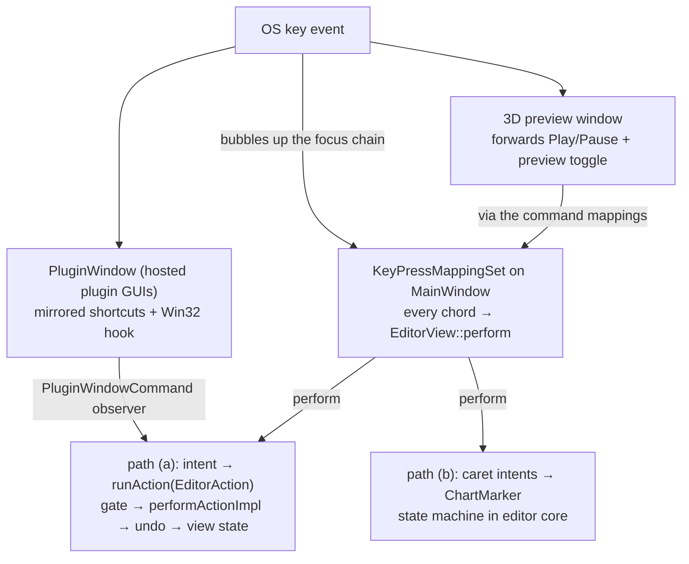

\page guide_keyboard Keyboard Input and Keybinds

*Applies to: Editor-only (the game's separate input path is summarized at the end).*

This page traces a keystroke from the operating system to its effect. The editor has **one key
dispatcher** (the command registry landed 2026-07-20; the grammar decoder dissolved into it
with total rebindability, plan 53 Phase 1b): every keybind — undo/redo, Space, the File-menu
chords, *and* the interaction grammar's arrows, digits, Delete, Insert, Esc, and `+`/`-`
grid/zoom keys — is a registered command in one `juce::ApplicationCommandManager` owned by
`EditorView`. Its `KeyPressMappingSet` is attached as a key listener on `MainWindow`, matches
chords exactly, checks enablement, and invokes `EditorView::perform`, which emits the same
controller intents the menus use. The registry table behind it is
`rock-hero-editor/ui/src/keybinds/editor_command_registry.cpp`; one command exists per
(chord, verb) pair, so the `Ctrl` precision/reach tiers are separate commands and the
interaction grammar's modifier algebra survives as the *shape of the default map*, not as an
enforced restriction.

From the controller inward, a keystroke still travels one of **two paths**: the editor-action
pipeline (\ref guide_action_anatomy) or the caret/marker interaction model. Keymap
**persistence and the actions dialog are live** (below), and **every binding is
user-rebindable with no exceptions** — Undo/Redo/Play-Pause mirror into hosted plugin windows
through an injected, layout-neutral binding seam, and the grammar verbs rebind like anything
else ("bad keybinds are the user's problem; the defaults are the fallback", the 2026-07-20
direction that reversed the earlier fixed-grammar policy).

# Where key events enter

`EditorView` is the keyboard-focus owner (`setWantsKeyboardFocus(true)`); unconsumed keys
bubble up the parent chain to `MainWindow`, where the command mapping set matches registered
chords. Everything else is plumbing that keeps focus in the right place:

- **`MainWindow`** (`ui/src/main_window/main_window.cpp`) attaches the command manager's
  `KeyPressMappingSet` as a key listener in its constructor. Attached to the window shell, it
  covers both the focused editor (unhandled keys bubble up to it) and keys that arrive while
  native focus sits on the shell itself — which is why no manual key forwarding exists: the
  old `MainWindow::keyPressed` forwarder existed solely to reach the grammar decoder from
  shell focus, and dissolved with the decoder (plan 53 Phase 1b).
- **Interactive children decline focus** so keys stay with `EditorView`. The load-bearing case is
  the timeline viewport (`ui/src/timeline/track_viewport.h`): a stock `juce::Viewport` grabs
  focus and converts arrow keys into scrolling, which would silently steal the caret grammar —
  so it sets `setWantsKeyboardFocus(false)` and overrides `keyPressed` to return `false`.
  Transport, signal-chain, and plugin-tile buttons decline focus for the same reason.
- **The 3D preview window** wants focus for itself (its render surface hosts a native child
  window). It forwards a whitelist — the Play/Pause and preview-toggle *commands* only, resolved
  through the command mappings rather than hardcoded chords, so future rebinds of rebindable
  commands stay honored — through a `std::function` injected by `EditorView` (44-Q4: transport
  keys only; editing shortcuts stay with the main window). One layer below JUCE, the preview surface
  installs a Win32 window proc that bounces `WM_SETFOCUS` off the bgfx render child back to the
  JUCE peer (`ui/src/preview/preview_surface.cpp`) — without it the native child swallows every
  key. That focus-bounce is a recorded watch item; treat it as an invariant of the preview port.
- **Modal overlays own their keys.** `BusyOverlay::keyPressed` grabs focus and swallows
  everything while a busy operation runs; the themed message box and the audio-device failure
  overlay handle Return/Esc themselves. A key that "does nothing" during busy is the overlay
  working as designed.
- **Hosted plugin windows** are the special case — see the seam section below.

# Decoding

All chords match exactly: the mapping set compares `juce::KeyPress` values with exact modifier
state, so the old hand-written guards come free — `Ctrl+Z` does not fire on `Ctrl+Alt+Z` (Alt
is the grammar's default authoring modifier) or `Ctrl+Shift+Z` (which is Redo's registered
alternative), and each tiered verb (plain caret step vs. `Ctrl` measure jump) is its own
command on its own chord. Chords register lowercase letters — the mapping set asserts on
uppercase-without-shift — and letter matching is case-insensitive against OS key codes.
Key-shape variance is expressed as **alternative default chords** on one command: each digit
command registers its main-row *and* numpad chords, and the grid/zoom commands register the
old decoder's `=`/`+`/numpad union as alternatives (the shapes JUCE reports vary with WM_CHAR
timing).

Where the same chord needs different verbs by context (the old decoder's sequential dispatch),
the mechanism is enablement: `KeyPressMappingSet::keyPressed` visits every command mapped to a
chord, skips disabled ones and keeps looking, and returns false when nothing enabled fired
(juce_KeyPressMappingSet.cpp:322-357) — the recorded future mechanism for modal scopes like
the plugin-chain section. Today every chord has exactly one owner; context branching lives
*inside* each command's `perform` (the digit try-order, the Esc ladder), and the verbs whose
old branches declined silently stay **always-active and self-gate in perform**, because a
disabled command whose chord matches makes JUCE play the system alert sound.

# Path (a): keys that become editor actions

Space, Ctrl+Z, Ctrl+Y, and Ctrl+Shift+Z are registered commands: the mapping set resolves the
chord, checks enablement via `getCommandInfo`, and `EditorView::perform` emits the intent
(`onPlayPausePressed`, `onUndoRequested`, `onRedoRequested`), whose implementations wrap an
`EditorAction` value and call `runAction(...)`. From there the keystroke is indistinguishable
from a menu click or button press: availability gate, dispatch to `performActionImpl`, undo
capture, view-state push — the whole pipeline of \ref guide_action_anatomy. A keybind on this
path is nothing but *one more trigger* for an action; the policy all lives downstream. The
File-menu chords (`Ctrl+O`, `Ctrl+Shift+O`, `Ctrl+S`, `Ctrl+Shift+S`, `Ctrl+Shift+P`, `Ctrl+W`)
ride the same route, and command-backed menu items display their live shortcut automatically —
the popup queries the mapping set per item.

`Ctrl+T` (insert a tone change at the playhead) is a registered command whose `perform` opens a
UI popup (the tone picker) before any action runs, and `F3`/`F8` are commands that toggle UI
panels directly — trigger-only commands with no core policy. Two more UI-only families ride the
same shape: `GridFiner`/`GridCoarser` step the grid through
`GridSpacingSelector::stepNoteValue` (emitting via the selector's listener, the same path as a
combo pick, so the controller still owns the applied value), and `ZoomIn`/`ZoomOut` zoom
through `TrackViewport::zoomByStep` — the keyboard twin of Ctrl+wheel, sharing its
clamp/recenter/report path. The old decoder's `=`/`+`/numpad key-shape union lives on as these
commands' alternative default chords.

# Path (b): keys that drive the caret grammar

Arrows, Home/End, PageUp/PageDown, their Shift time-selection forms, Alt+arrows,
Alt+Shift+arrows, digits, Delete, Insert, and Esc are registered commands like everything
else, but they are not editor *actions*. Their `perform` cases route to dedicated controller
intents —
`onChartCaretStepRequested`, `onChartCaretJumpRequested(ChartCaretJump)` (the Home/End and
PageUp/Down leaps, one sum type over start/end/previous-section/next-section),
`onTimeSelectionExtendRequested` (Shift+ the same navigation family: grid, measure, section,
and chart-bound extends of the grid-locked `TimeSelection` — the range edge reuses the caret's
shared destination helpers, so the two can never drift on the same motion),
`onSelectionMoveRequested`, `onChartSustainAdjustRequested(direction, fine)`,
`onChartFretShiftRequested`, `onChartFretDigitTyped`, `onSelectionDeleteRequested`,
`onNeutralInsertRequested`, `onChartEscapePressed` — implemented in editor core against the
marker state machine: `ChartMarker = std::variant<ChartCursor, ChartCaret>`
(`rock-hero-editor/core/src/controller/editor_controller_impl.h`), always present, exactly one
state (passive cursor or armed caret; a `ChartCaret` holds a grid position, a string, and
optionally an automation-lane row).

The split within path (b) is deliberate:

- **Pure navigation** (caret steps, arming, Esc's disarm rungs) mutates the marker and calls
  `updateView()` directly — it never enters the action pipeline, because moving a caret is not
  an operation with availability policy or an undo entry. These intents self-gate instead: each
  begins with `isBusy()` / transport-playing checks.
- **Mutating verbs** (move, delete, insert, retype) plan a model edit and replay it through the
  action dispatch, so gating and undo behave exactly as if the edit had arrived any other way.
  When one of these dispatches, it first copies the selection or caret it read **by value** —
  the dispatch may replace the very variant the reference pointed into (see
  \ref guide_invariants).

The *semantics* of this grammar — what each modifier means, the union stop set, the two-state
marker, one selection editor-wide — are owned by
`docs/plans/in-progress/editing-interaction-model.md`; this page only documents the wiring.
*The full keybind × surface matrix is signed off (`docs/plans/in-progress/keymap-matrix.md`,
2026-07-20) and now tracks the plan 53 build: unbuilt rows there (the tone-region row, the
plugin-chain scope, lane multi-select) land phase by phase.*

# Gating: three layers that agree by construction

1. **The pipeline gate is authoritative.** Path (a) keys land in `runAction`, whose availability
   policy (`editor_action_availability.cpp`) is the real decision.
2. **The UI pre-gates against published view-state flags.** For menu-visible commands this is
   `getCommandInfo`'s `setActive` (undo/redo against `undo_enabled`/`redo_enabled`, and so on) —
   the mapping set refuses disabled commands and lets the key propagate, menus gray out, and
   `perform` mirrors the same guards so direct invocation paths stay safe; `setState` calls
   `commandStatusChanged()` on every push to keep it current. The grammar-verb commands gate in
   `perform` instead (Delete against `selection_present`, caret steps against `chartShown()`) —
   see the always-active/alert-sound note under Decoding. Both derive from
   `deriveViewState()`'s *same* availability calls, so the layers cannot disagree.
3. **Modal layers swallow first.** The busy overlay consumes everything before keys reach the
   window's listener. Path (b) intents self-gate in core, as above.

# Keymap persistence

`EditorKeymapPersistence` (`ui/src/keybinds/editor_keymap_persistence.cpp`, owned by the
`Editor` composition wrapper) stores user rebinds through the `IEditorSettings` port as an
opaque blob: the mapping set's **diff-versus-defaults** XML, so shipped default changes merge
under user overrides, and a defaults-only keymap clears the stored value entirely. Three
invariants live here:

- **Restore order is a contract**: every command must be registered before `restoreFromXml`,
  which the composition guarantees by constructing persistence after the view.
- **Stored entries are filtered before restore**: unknown command ids (a newer editor's blob
  would trip the mapping set's debug assertion) are dropped. A corrupt blob falls back to pure
  defaults; the next mapping change overwrites it.
- **Saves are equality-gated** against the stored blob, so the restore's own change broadcast
  and repeated notifications write nothing.

# The actions dialog

"Edit > Actions..." — default chord `?`, REAPER's actions-list key — opens `ActionsWindow`
(`ui/src/keybinds/actions_window.cpp`): a non-modal tool window hosting the
**custom** `KeymapEditorView` (`keymap_editor_view.cpp`) over the editor's one mapping set.
The user-facing name follows the adopted REAPER actions model (the registry is one
trigger-agnostic action list); internally the vocabulary stays "commands", the same
user-facing/internal split REAPER itself uses.
The stock `juce::KeyMappingEditorComponent` shipped first per the plan 46 Phase 3 decision,
and its recorded custom-rebuild trigger fired the same day — the themed stock dialog read as
off-product in live use — so the custom view replaced it (the registry/persistence substrate
is dialog-agnostic, which is what made the swap cheap). The view lists registry commands under
their categories with binding chips per chord: chip click offers change/remove, the `+` chip
opens the press-a-key capture dialog (a themed `AlertWindow` subclass with live "currently
assigned to..." preview), and conflicts resolve through the overwrite-and-clear flow — a
themed confirm naming the current owner, then **remove-then-add** against the public mapping
set (`addKeyPress` alone must never be trusted to resolve conflicts; its documented removal
does not exist in code). Right-clicking a row (or any chip's menu) offers **per-command reset to
default** — disabled when already at defaults, and reclaiming a default chord from whichever
command took it meanwhile, since the mapping set's own `resetToDefaultMapping` performs no
conflict cleanup. Rows rebuild on the mapping set's own change
broadcasts, so rebinds apply live and persist immediately — dispatch, menu shortcut text, the
keymap persistence, and the plugin-window mirror all listen to the same set.

The dialog is also the complete keymap reference: every registry command appears under its
category — File through Tone, then the grammar-verb categories (Navigation, Selection,
Editing, Value Entry, Grid & Zoom) — and **every row is rebindable with no exceptions** (plan
53 Phase 1b dissolved the earlier fixed grammar section and its reservation refusal). Any
chord can move between commands through the owner-naming conflict confirm, and per-command
reset reclaims a command's default chords from whichever command took them. Rebinding a
grammar verb can of course shatter its composed modifier family — that is deliberately the
user's prerogative now, with per-command and reset-all defaults as the fallback.

Every user-facing rendering of a chord goes through **one formatter**,
`keyChordText` (`ui/src/keybinds/key_chord_text.cpp`): dialog chips, the capture preview, the
conflict prompts, and menu shortcut text (menus via `addEditorCommandItem`, which mirrors
`PopupMenu::addCommandItem` but pre-fills the item's shortcut text — the popup derives its own
raw text only when that field arrives empty). The formatter collapses a shifted chord to the
character it types — `Shift+/` renders as "?", `Ctrl+Shift+/` as "ctrl + ?" — when that differs
from the base character by more than case (letters keep the explicit "shift + Z" form), and
resolves the character through the **live keyboard layout** (the unit's one Win32 seam;
unsupported platforms simply never collapse). It deliberately does not use the captured
`KeyPress::textCharacter`: JUCE's keymap XML round-trips description strings and drops it, so
capture-time data would show "?" today and regress to "shift + /" after a restart. Never call
`getTextDescription` or raw `addCommandItem` on a user-facing surface — a second rendering path
is exactly the drift this unit exists to prevent.

# The Esc ladder

Esc (the `CancelDismiss` command) is one chord with a priority ladder inside its `perform`:
the view first cancels any in-flight pointer gesture it still owns (lane and tone-track edge
drags), then hands off to `onChartEscapePressed`, whose core ladder steps drag-gesture → chart
gesture → disarm the caret → clear the tone-region selection → clear the selection. One rung
per press; a new cancellable thing must pick its rung deliberately.

# The plugin-window seam

The Undo/Redo/Play-Pause chords — whatever the user has bound them to — must work while a
hosted plugin's own GUI window has focus; plugins must never see them. `PluginWindow`
(`rock-hero-common/audio/src/tracktion/plugin_window.cpp`) matches incoming keys against the
injected binding set, and on Windows additionally installs a
`WH_GETMESSAGE` hook that intercepts key messages *before* a focused native plugin view can
swallow them (the Play-Pause chord yields to plugin text fields by command identity; undo/redo
never yield). Matches post a
`PluginWindowCommand`, which the controller's observer maps back onto the very same intents
(`onUndoRequested`, `onRedoRequested`, `onPlayPausePressed`) — so a plugin-window Ctrl+Z and an
editor Ctrl+Z are literally the same code path from the controller inward.

The hand-synchronized predicate copies are **gone**: the binding knowledge has exactly one
source — the key mapping set. `PluginWindowShortcutSync` (`ui/src/keybinds/`) converts the
trio's current chords into the layout-neutral model of
`rock_hero/common/audio/plugin/plugin_window_shortcuts.h` (a chord names a base *character*,
matched on Windows by translating the incoming virtual key through the active keyboard layout
so an `Alt+;` binding follows the `;` key across layouts, or a *named* non-character key) and
pushes them through `IPluginHost::setPluginWindowShortcuts` after keymap restore and on every
mapping change. Both plugin-window decode paths — JUCE `keyPressed` and the Win32 hook — match
the same injected set through one shared, headlessly tested matcher; built-in defaults keep an
editor-less engine on the editor's default keymap. The mechanism itself is the
industry-standard one (REAPER-class hosts intercept at the plugin window's message loop the
same way), but its interaction with real VST3 focus handling cannot be proven headlessly — any
change to this seam re-earns the manual real-plugin verification (Nolly/Gateway; last passed
2026-07-20).

# Adding or changing a keybind — silent steps

This checklist strings into \ref guide_add_action — its Part B step "the trigger" is exactly
this list when the trigger is a key. There is one dispatcher: every keybind is a registered
command.

Standing convention (plan 53, adopted 2026-07-20): **every new user-triggerable verb registers
as a command** rather than shipping as an ad-hoc handler, even when it has no default chord.
The registry is the editor's trigger-agnostic action list — REAPER's "Actions" model in JUCE
form, which the actions dialog is named for — and only registered commands appear in that
dialog, show live shortcut text in menus, and become bindable by future input front-ends (MIDI
bindings are planned: `docs/plans/todo/midi-command-bindings.md`). A verb that bypasses the
registry is invisible to all of them, and since Phase 1b there is no carve-out.

For any new keybind (`rock-hero-editor/ui/src/keybinds/`):

1. **Append an `EditorCommandId` value** (`editor_command_id.h`) — explicit, append-only, never
   reused, in the id block matching its category; the hex value is the persistence key forever.
2. **Add the registry row** (`editor_command_registry.cpp`): name, category,
   default chords (lowercase letters; alternatives are first-class — key-shape variance like
   main-row vs. numpad is expressed as alternative chords on one command). One command per
   (chord, verb) pair: a `Ctrl` precision/reach tier is its own command, per the interaction
   model's operation-not-key rule.
3. **Extend both `EditorView` switches**: the `getCommandInfo` case (enablement from view-state
   flags, tick state, any live name augmentation) and the `perform` case (emit the controller
   intent, mirroring the enablement guard). A new *operation* means building the action first
   (\ref guide_add_action); a new *caret verb* means a new `on...Requested` intent on
   `IEditorController` — the pure virtual forces the `EditorController` forwarder, the `Impl`
   member, and the `RecordingEditorController` override. **Gating**: menu-visible operations
   gate via `getCommandInfo` `setActive`; verbs that must decline silently (no beep, no menu
   row to gray) register always-active and self-gate in `perform` — see Decoding.
4. **Update the locked-table test** (`test_editor_view_state.cpp`, "Editor command registry
   locks ids and default chords") — it fails on any unrecorded id or default change by design.
5. **Menu items go through `addEditorCommandItem`** (`key_chord_text.h`), never raw
   `addCommandItem` — one line in `getMenuForIndex`, and the live shortcut text renders through
   the shared `keyChordText` formatter so menus never drift from the dialog chips.
6. **Plugin-window mirroring is automatic** for the trio (the sync pushes every mapping
   change); a *new* command that should also fire from plugin windows means extending the
   `PluginWindowShortcutBindings` seam, not adding predicates. The 3D preview whitelist is
   command-id based and needs a change only if the preview should honor a new command.
7. **Record it** in `docs/plans/in-progress/keymap-matrix.md` (the binding inventory) and, if
   it changes grammar semantics, `editing-interaction-model.md`.
8. **Tests**: drive the intent through the editor-core harness; for view-layer wiring, assert
   the `RecordingEditorController` call through the mapping set
   (`commandManager().getKeyMappings()->keyPressed(...)`).

# The game side, briefly

The game does not share any of this. SDL3 delivers key events to a poll loop in
`rock-hero-game/ui/src/surface/game_window.cpp`, which maps physical keys to a small `GameKey`
enum for gameplay and passes raw keycodes to `MenuBindings`
(`rock-hero-game/core/.../input/menu_bindings.h`) — a headless, rebindable trigger→action
resolver for menus. The two systems stay deliberately parallel (decided 2026-07-20, 46-Q2):
only conventions are shared, and a watch-item records the trigger for ever extracting
`MenuBindings` to common (the editor wanting non-keyboard input).

Adding a game input touches **two channels**, and the event struct is the silent trap:
`GameWindowEvents` carries both `keys_pressed` (mapped `GameKey`, for gameplay) and
`key_codes_pressed` (raw codes, for the menu resolver), populated together in `pollEvents`. The
gameplay chain is compiler-guarded (`GameKey` enumerator → `toGameKey` switch → the exhaustive
switch in `Game::handleWindowEvents`); the menu chain is not (a `MenuAction` enumerator, its
default binding in the `Game` constructor, and its arm in `SongSelectMenu::handle` are all
silent). A key wired into only one channel works in gameplay but not menus, or vice versa. See
\ref guide_game.
