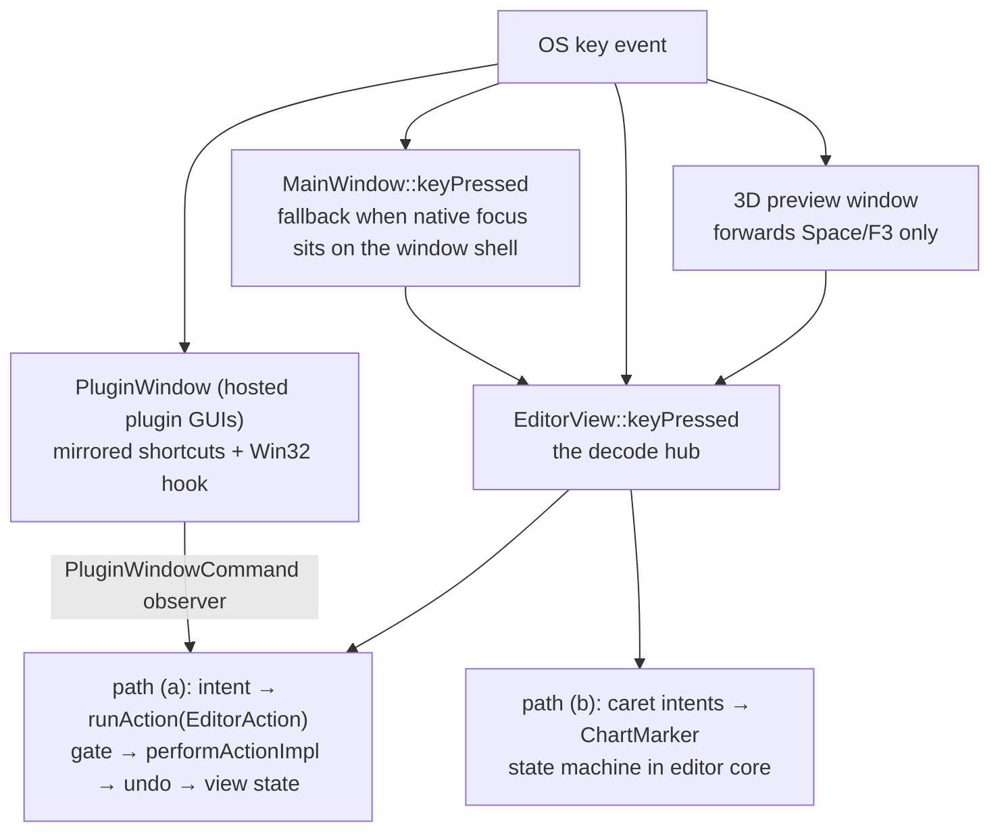

\page guide_keyboard Keyboard Input and Keybinds

*Applies to: Editor-only (the game's separate input path is summarized at the end).*

This page traces a keystroke from the operating system to its effect. The headline: the editor has
**no command manager and no keymap table** — no `juce::ApplicationCommandManager`, no
`KeyPressMappingSet`, no registry. Every shortcut is hand-decoded in one `keyPressed` hub and
routed to a controller intent, and from there down one of **two paths**: the editor-action
pipeline (\ref guide_action_anatomy) or the caret/marker interaction model. A command registry
with rebinding is now in execution (`docs/plans/roadmap/46-editor-keybinds.md`, gates closed
2026-07-20, running as `docs/plans/roadmap/53-editor-keyboard-and-pointer-completion.md`
Phase 1); until it lands, this page documents the hand-wired reality.

# Where key events enter

`EditorView` is the keyboard-focus owner (`setWantsKeyboardFocus(true)`), and
`EditorView::keyPressed` (`rock-hero-editor/ui/src/main_window/editor_view.cpp`) is the single
decode hub for editor shortcuts. Everything else is plumbing that keeps focus there or forwards
keys back:

- **`MainWindow::keyPressed`** (`ui/src/main_window/main_window.cpp`) is a fallback forwarder:
  when native focus lands on the `DocumentWindow` shell instead of the editor component, it hands
  the key to `EditorView::keyPressed` — unless a modal component blocks the editor
  (`isCurrentlyBlockedByAnotherModalComponent`), in which case the key goes to the base class.
- **Interactive children decline focus** so keys stay with `EditorView`. The load-bearing case is
  the timeline viewport (`ui/src/timeline/track_viewport.h`): a stock `juce::Viewport` grabs
  focus and converts arrow keys into scrolling, which would silently steal the caret grammar —
  so it sets `setWantsKeyboardFocus(false)` and overrides `keyPressed` to return `false`.
  Transport, signal-chain, and plugin-tile buttons decline focus for the same reason.
- **The 3D preview window** wants focus for itself (its render surface hosts a native child
  window). It forwards a whitelist — Space and F3 only — back into `EditorView::keyPressed`
  through a `std::function` injected by `EditorView`. One layer below JUCE, the preview surface
  installs a Win32 window proc that bounces `WM_SETFOCUS` off the bgfx render child back to the
  JUCE peer (`ui/src/preview/preview_surface.cpp`) — without it the native child swallows every
  key. That focus-bounce is a recorded watch item; treat it as an invariant of the preview port.
- **Modal overlays own their keys.** `BusyOverlay::keyPressed` grabs focus and swallows
  everything while a busy operation runs; the themed message box and the audio-device failure
  overlay handle Return/Esc themselves. A key that "does nothing" during busy is the overlay
  working as designed.
- **Hosted plugin windows** are the special case — see the seam section below.

# Decoding

Decoding is a hand-written `if`/`switch` chain over `juce::KeyPress` at the top of
`EditorView::keyPressed`, with small predicate helpers in the file's anonymous namespace. Three
conventions matter when touching it:

- **Command shortcuts refuse Alt.** `hasCommandShortcutModifier` requires the command key down
  *and Alt up*, because Alt is the interaction grammar's authoring modifier
  (`docs/plans/in-progress/editing-interaction-model.md`) — without the guard, Ctrl+Alt chords
  meant as authoring verbs would trigger command shortcuts as a side effect.
- **Digits match both rows.** Fret/value entry accepts `'0'..'9'` and
  `juce::KeyPress::numberPad0..9` explicitly; a new digit binding must handle both.
- **Modifiers are read per-block** (`key.getModifiers().isCtrlDown()` and friends) and given
  meaning by the operation, not the key — Ctrl is a measure jump on plain arrows, the 1/960 fine
  tier on authoring verbs, per the interaction model.

# Path (a): keys that become editor actions

Space, Ctrl+Z, and Ctrl+Y route to intent methods on the controller interface
(`onPlayPausePressed`, `onUndoRequested`, `onRedoRequested`), whose implementations wrap an
`EditorAction` value and call `runAction(...)`. From there the keystroke is indistinguishable
from a menu click or button press: availability gate, dispatch to `performActionImpl`, undo
capture, view-state push — the whole pipeline of \ref guide_action_anatomy. A keybind on this
path is nothing but *one more trigger* for an action; the policy all lives downstream.

Ctrl+T (insert a tone change at the playhead) is decoded in the same hub but opens a UI popup
(the tone picker) before any action runs, and F3/F8 toggle UI panels directly — trigger-only
keys with no core policy. Two more UI-only families live here: plain `+`/`-` steps the grid one
preset finer/coarser through `GridSpacingSelector::stepNoteValue` (emitting via the selector's
listener, the same path as a combo pick, so the controller still owns the applied value), and
`Ctrl`+`+`/`-` zooms through `TrackViewport::zoomByStep` — the keyboard twin of Ctrl+wheel,
sharing its clamp/recenter/report path. The `+`/`-` match is deliberately a union of key codes,
text characters, and numpad codes, because JUCE reports these keys differently across layouts
and the text character is unreliable while Ctrl is held.

# Path (b): keys that drive the caret grammar

Arrows, Home/End, PageUp/PageDown, their Shift time-selection forms, Alt+arrows,
Alt+Shift+arrows, digits, Delete, Insert, and Esc are not editor actions. They route to
dedicated controller intents —
`onChartCaretStepRequested`, `onChartCaretJumpRequested(ChartCaretJump)` (the Home/End and
PageUp/Down leaps, one sum type over start/end/previous-section/next-section),
`onTimeSelectionExtendRequested` (Shift+ the same navigation family: grid, measure, section,
and chart-bound extends of the grid-locked `TimeSelection` — the range edge reuses the caret's
shared destination helpers, so the two can never drift on the same motion),
`onSelectionMoveRequested`, `onChartSustainAdjustRequested(direction, fine)`,
`onChartFretShiftRequested`, `onChartFretDigitTyped`, `onSelectionDeleteRequested`,
`onNeutralInsertRequested`, `onChartEscapePressed` — implemented in editor core against the
marker state machine: `ChartMarker = std::variant<ChartCursor, ChartCaret>`
(`rock-hero-editor/core/src/controller/editor_controller_impl.h`), always present, exactly one
state (passive cursor or armed caret; a `ChartCaret` holds a grid position, a string, and
optionally an automation-lane row).

The split within path (b) is deliberate:

- **Pure navigation** (caret steps, arming, Esc's disarm rungs) mutates the marker and calls
  `updateView()` directly — it never enters the action pipeline, because moving a caret is not
  an operation with availability policy or an undo entry. These intents self-gate instead: each
  begins with `isBusy()` / transport-playing checks.
- **Mutating verbs** (move, delete, insert, retype) plan a model edit and replay it through the
  action dispatch, so gating and undo behave exactly as if the edit had arrived any other way.
  When one of these dispatches, it first copies the selection or caret it read **by value** —
  the dispatch may replace the very variant the reference pointed into (see
  \ref guide_invariants).

The *semantics* of this grammar — what each modifier means, the union stop set, the two-state
marker, one selection editor-wide — are owned by
`docs/plans/in-progress/editing-interaction-model.md`; this page only documents the wiring.
*Design in flux: the full keybind × surface matrix is being verified in
`docs/plans/in-progress/keymap-matrix.md`, and several bindings there are scheduled to change.*

# Gating: three layers that agree by construction

1. **The pipeline gate is authoritative.** Path (a) keys land in `runAction`, whose availability
   policy (`editor_action_availability.cpp`) is the real decision.
2. **The UI pre-gates a few keys** against published view-state flags — undo/redo against
   `undo_enabled`/`redo_enabled`, Delete against `selection_present`, F3 against project/preview
   state. These flags are derived in `deriveViewState()` from the *same* availability calls, so
   the two layers cannot disagree; the pre-gate exists so a dead key returns `false` and lets
   the event propagate rather than being swallowed.
3. **Modal layers swallow first.** The busy overlay consumes everything; `MainWindow` refuses to
   forward while modally blocked. Path (b) intents self-gate in core, as above.

# The Esc ladder

Esc is one key with a priority ladder split across the two layers: the view first cancels any
in-flight pointer gesture it still owns (lane and tone-track edge drags), then hands the key to
`onChartEscapePressed`, whose core ladder steps drag-gesture → chart gesture → disarm the caret
→ clear the tone-region selection → clear the selection. One rung per press; a new cancellable
thing must pick its rung deliberately.

# The plugin-window seam

Cmd/Ctrl+Z, Ctrl+Y, and Space must work while a hosted plugin's own GUI window has focus —
plugins must never see them. `PluginWindow`
(`rock-hero-common/audio/src/tracktion/plugin_window.cpp`) re-implements the same three
shortcut predicates, and on Windows additionally installs a
`WH_GETMESSAGE` hook that intercepts key messages *before* a focused native plugin view can
swallow them (Space yields to plugin text fields; undo/redo never yield). Matches post a
`PluginWindowCommand`, which the controller's observer maps back onto the very same intents
(`onUndoRequested`, `onRedoRequested`, `onPlayPausePressed`) — so a plugin-window Ctrl+Z and an
editor Ctrl+Z are literally the same code path from the controller inward.

This means the binding knowledge exists in **three hand-synchronized copies** (the editor hub,
the plugin-window predicates, and the hook's VK-code form). Changing any global accelerator
means changing all three. Undo/Redo/Play-Pause are **non-rebindable core commands** (decided
2026-07-20), so the copies stay correct under the coming registry; collapsing them into one
shared helper is plan 46's rescoped Phase 4.

# Adding or changing a keybind — silent steps

This checklist strings into \ref guide_add_action — its Part B step "the trigger" is exactly
this list when the trigger is a key:

1. **Decode it in `EditorView::keyPressed`**, in the block matching its family (command
   shortcut, arrow/caret, digit, function key). Respect the conventions above: command chords
   guard against Alt; digits cover the numpad; new arrows/verbs read modifiers per the
   operation-not-key rule.
2. **Route it to an intent.** An existing operation → call its controller intent. A new
   operation → build the action first (\ref guide_add_action); the keybind is only its trigger.
   A new caret verb → a new `on...Requested` intent on `IEditorController` — the pure virtual
   forces the `EditorController` public forwarder, the `Impl` member (where the behavior
   lives), and the `RecordingEditorController` override — implemented against the marker state
   machine.
3. **Decide the gating layer.** Pipeline-gated action, view pre-gate flag (extend
   `EditorViewState` + `deriveViewState()` if the view must know), or core self-gate for caret
   intents — and remember dead keys should return `false`, not be swallowed.
4. **Update the mirrors if it is a global accelerator**: the plugin-window predicate trio and,
   if it should work from the 3D preview, the preview forwarding whitelist.
5. **Record it** in `docs/plans/in-progress/keymap-matrix.md` (the binding inventory) and, if it
   changes grammar, `editing-interaction-model.md`.
6. **Tests**: drive the intent through the editor-core harness; for view-layer decode wiring,
   assert the `RecordingEditorController` call from a `juce::KeyPress` through the UI harness.

# The game side, briefly

The game does not share any of this. SDL3 delivers key events to a poll loop in
`rock-hero-game/ui/src/surface/game_window.cpp`, which maps physical keys to a small `GameKey`
enum for gameplay and passes raw keycodes to `MenuBindings`
(`rock-hero-game/core/.../input/menu_bindings.h`) — a headless, rebindable trigger→action
resolver for menus. The two systems stay deliberately parallel (decided 2026-07-20, 46-Q2):
only conventions are shared, and a watch-item records the trigger for ever extracting
`MenuBindings` to common (the editor wanting non-keyboard input).

Adding a game input touches **two channels**, and the event struct is the silent trap:
`GameWindowEvents` carries both `keys_pressed` (mapped `GameKey`, for gameplay) and
`key_codes_pressed` (raw codes, for the menu resolver), populated together in `pollEvents`. The
gameplay chain is compiler-guarded (`GameKey` enumerator → `toGameKey` switch → the exhaustive
switch in `Game::handleWindowEvents`); the menu chain is not (a `MenuAction` enumerator, its
default binding in the `Game` constructor, and its arm in `SongSelectMenu::handle` are all
silent). A key wired into only one channel works in gameplay but not menus, or vice versa. See
\ref guide_game.
