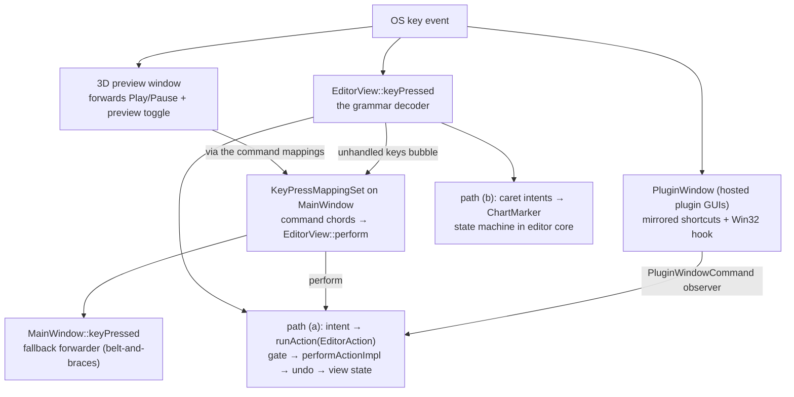

\page guide_keyboard Keyboard Input and Keybinds

*Applies to: Editor-only (the game's separate input path is summarized at the end).*

This page traces a keystroke from the operating system to its effect. The editor has **two key
dispatchers with a clean split** (the command registry landed 2026-07-20; plan 46 / plan 53
Phase 1):

- **Command accelerators** — undo/redo, Space, `Ctrl+T`, `F3`/`F8`, and the File-menu chords —
  live in one `juce::ApplicationCommandManager` owned by `EditorView`. Its `KeyPressMappingSet`
  is attached as a key listener on `MainWindow`, matches chords exactly, checks enablement, and
  invokes `EditorView::perform`, which emits the same controller intents the menus use. The
  registry table behind it is `rock-hero-editor/ui/src/keybinds/editor_command_registry.cpp`.
- **The interaction grammar** — arrows, digits, Delete, Insert, Esc, and the `+`/`-` grid/zoom
  family — stays hand-decoded in the `EditorView::keyPressed` grammar decoder: sequential,
  context-ordered dispatch that is an input grammar, not a command set. Grammar chords are
  reserved in the registry's conventions and never assigned as command defaults.

From the controller inward, a keystroke still travels one of **two paths**: the editor-action
pipeline (\ref guide_action_anatomy) or the caret/marker interaction model. Rebinding
(persistence + the shortcuts dialog) is the registry's next phase; Undo/Redo/Play-Pause are
**non-rebindable core commands** by decision.

# Where key events enter

`EditorView` is the keyboard-focus owner (`setWantsKeyboardFocus(true)`); its `keyPressed`
(`rock-hero-editor/ui/src/main_window/editor_view.cpp`) decodes the interaction grammar first,
and any key it declines bubbles up the parent chain to `MainWindow`, where the command mapping
set matches registered chords. Everything else is plumbing that keeps focus there or forwards
keys back:

- **`MainWindow`** (`ui/src/main_window/main_window.cpp`) attaches the command manager's
  `KeyPressMappingSet` as a key listener in its constructor — key listeners run before a
  component's own `keyPressed` at each level, so at the window shell the mapping set fires
  first. `MainWindow::keyPressed` stays behind it as a belt-and-braces fallback forwarder into
  `EditorView::keyPressed` for grammar keys when native focus sits on the shell — unless a modal
  component blocks the editor (`isCurrentlyBlockedByAnotherModalComponent`). The forwarding is
  scheduled for deletion once the shortcuts-dialog era proves mapping-set parity (plan 46
  Phase 3).
- **Interactive children decline focus** so keys stay with `EditorView`. The load-bearing case is
  the timeline viewport (`ui/src/timeline/track_viewport.h`): a stock `juce::Viewport` grabs
  focus and converts arrow keys into scrolling, which would silently steal the caret grammar —
  so it sets `setWantsKeyboardFocus(false)` and overrides `keyPressed` to return `false`.
  Transport, signal-chain, and plugin-tile buttons decline focus for the same reason.
- **The 3D preview window** wants focus for itself (its render surface hosts a native child
  window). It forwards a whitelist — the Play/Pause and preview-toggle *commands* only, resolved
  through the command mappings rather than hardcoded chords, so future rebinds of rebindable
  commands stay honored — through a `std::function` injected by `EditorView` (44-Q4: transport
  keys only; editing shortcuts stay with the main window). One layer below JUCE, the preview surface
  installs a Win32 window proc that bounces `WM_SETFOCUS` off the bgfx render child back to the
  JUCE peer (`ui/src/preview/preview_surface.cpp`) — without it the native child swallows every
  key. That focus-bounce is a recorded watch item; treat it as an invariant of the preview port.
- **Modal overlays own their keys.** `BusyOverlay::keyPressed` grabs focus and swallows
  everything while a busy operation runs; the themed message box and the audio-device failure
  overlay handle Return/Esc themselves. A key that "does nothing" during busy is the overlay
  working as designed.
- **Hosted plugin windows** are the special case — see the seam section below.

# Decoding

Command accelerators and grammar keys decode differently, and the conventions differ with them:

- **Command chords match exactly.** The mapping set compares `juce::KeyPress` values with exact
  modifier state, so the old hand-written guards come free: `Ctrl+Z` does not fire on
  `Ctrl+Alt+Z` (Alt is the grammar's authoring modifier) or `Ctrl+Shift+Z` (which is Redo's
  registered alternative). Chords register lowercase letters — the mapping set asserts on
  uppercase-without-shift — and letter matching is case-insensitive against OS key codes.
- **Grammar decoding is a hand-written `if`/`switch` chain** over `juce::KeyPress` in
  `EditorView::keyPressed`. Digits match both rows (`'0'..'9'` *and*
  `juce::KeyPress::numberPad0..9`); modifiers are read per-block and given meaning by the
  operation, not the key — Ctrl is a measure jump on plain arrows, the 1/960 fine tier on
  authoring verbs, per the interaction model.

# Path (a): keys that become editor actions

Space, Ctrl+Z, Ctrl+Y, and Ctrl+Shift+Z are registered commands: the mapping set resolves the
chord, checks enablement via `getCommandInfo`, and `EditorView::perform` emits the intent
(`onPlayPausePressed`, `onUndoRequested`, `onRedoRequested`), whose implementations wrap an
`EditorAction` value and call `runAction(...)`. From there the keystroke is indistinguishable
from a menu click or button press: availability gate, dispatch to `performActionImpl`, undo
capture, view-state push — the whole pipeline of \ref guide_action_anatomy. A keybind on this
path is nothing but *one more trigger* for an action; the policy all lives downstream. The
File-menu chords (`Ctrl+O`, `Ctrl+Shift+O`, `Ctrl+S`, `Ctrl+Shift+S`, `Ctrl+Shift+P`, `Ctrl+W`)
ride the same route, and command-backed menu items display their live shortcut automatically —
the popup queries the mapping set per item.

`Ctrl+T` (insert a tone change at the playhead) is a registered command whose `perform` opens a
UI popup (the tone picker) before any action runs, and `F3`/`F8` are commands that toggle UI
panels directly — trigger-only commands with no core policy. Two UI-only families stay in the
*grammar decoder* instead: plain `+`/`-` steps the grid one preset finer/coarser through
`GridSpacingSelector::stepNoteValue` (emitting via the selector's listener, the same path as a
combo pick, so the controller still owns the applied value), and `Ctrl`+`+`/`-` zooms through
`TrackViewport::zoomByStep` — the keyboard twin of Ctrl+wheel, sharing its
clamp/recenter/report path. They cannot move to the mapping set: the `+`/`-` match is
deliberately a union of key codes, text characters, and numpad codes, because JUCE reports
these keys differently across layouts and the text character is unreliable while Ctrl is held —
shapes exact `KeyPress` matching cannot express.

# Path (b): keys that drive the caret grammar

Arrows, Home/End, PageUp/PageDown, their Shift time-selection forms, Alt+arrows,
Alt+Shift+arrows, digits, Delete, Insert, and Esc are not editor actions. They route to
dedicated controller intents —
`onChartCaretStepRequested`, `onChartCaretJumpRequested(ChartCaretJump)` (the Home/End and
PageUp/Down leaps, one sum type over start/end/previous-section/next-section),
`onTimeSelectionExtendRequested` (Shift+ the same navigation family: grid, measure, section,
and chart-bound extends of the grid-locked `TimeSelection` — the range edge reuses the caret's
shared destination helpers, so the two can never drift on the same motion),
`onSelectionMoveRequested`, `onChartSustainAdjustRequested(direction, fine)`,
`onChartFretShiftRequested`, `onChartFretDigitTyped`, `onSelectionDeleteRequested`,
`onNeutralInsertRequested`, `onChartEscapePressed` — implemented in editor core against the
marker state machine: `ChartMarker = std::variant<ChartCursor, ChartCaret>`
(`rock-hero-editor/core/src/controller/editor_controller_impl.h`), always present, exactly one
state (passive cursor or armed caret; a `ChartCaret` holds a grid position, a string, and
optionally an automation-lane row).

The split within path (b) is deliberate:

- **Pure navigation** (caret steps, arming, Esc's disarm rungs) mutates the marker and calls
  `updateView()` directly — it never enters the action pipeline, because moving a caret is not
  an operation with availability policy or an undo entry. These intents self-gate instead: each
  begins with `isBusy()` / transport-playing checks.
- **Mutating verbs** (move, delete, insert, retype) plan a model edit and replay it through the
  action dispatch, so gating and undo behave exactly as if the edit had arrived any other way.
  When one of these dispatches, it first copies the selection or caret it read **by value** —
  the dispatch may replace the very variant the reference pointed into (see
  \ref guide_invariants).

The *semantics* of this grammar — what each modifier means, the union stop set, the two-state
marker, one selection editor-wide — are owned by
`docs/plans/in-progress/editing-interaction-model.md`; this page only documents the wiring.
*The full keybind × surface matrix is signed off (`docs/plans/in-progress/keymap-matrix.md`,
2026-07-20) and now tracks the plan 53 build: unbuilt rows there (the tone-region row, the
plugin-chain scope, lane multi-select) land phase by phase.*

# Gating: three layers that agree by construction

1. **The pipeline gate is authoritative.** Path (a) keys land in `runAction`, whose availability
   policy (`editor_action_availability.cpp`) is the real decision.
2. **The UI pre-gates against published view-state flags.** For commands this is
   `getCommandInfo`'s `setActive` (undo/redo against `undo_enabled`/`redo_enabled`, and so on) —
   the mapping set refuses disabled commands and lets the key propagate, menus gray out, and
   `perform` mirrors the same guards so direct invocation paths stay safe; `setState` calls
   `commandStatusChanged()` on every push to keep it current. The grammar decoder pre-gates the
   same way inline (Delete against `selection_present`). Both derive from `deriveViewState()`'s
   *same* availability calls, so the layers cannot disagree; a dead key returns `false` and
   propagates rather than being swallowed.
3. **Modal layers swallow first.** The busy overlay consumes everything; `MainWindow` refuses to
   forward while modally blocked. Path (b) intents self-gate in core, as above.

# The Esc ladder

Esc is one key with a priority ladder split across the two layers: the view first cancels any
in-flight pointer gesture it still owns (lane and tone-track edge drags), then hands the key to
`onChartEscapePressed`, whose core ladder steps drag-gesture → chart gesture → disarm the caret
→ clear the tone-region selection → clear the selection. One rung per press; a new cancellable
thing must pick its rung deliberately.

# The plugin-window seam

Cmd/Ctrl+Z, Ctrl+Y, and Space must work while a hosted plugin's own GUI window has focus —
plugins must never see them. `PluginWindow`
(`rock-hero-common/audio/src/tracktion/plugin_window.cpp`) re-implements the same three
shortcut predicates, and on Windows additionally installs a
`WH_GETMESSAGE` hook that intercepts key messages *before* a focused native plugin view can
swallow them (Space yields to plugin text fields; undo/redo never yield). Matches post a
`PluginWindowCommand`, which the controller's observer maps back onto the very same intents
(`onUndoRequested`, `onRedoRequested`, `onPlayPausePressed`) — so a plugin-window Ctrl+Z and an
editor Ctrl+Z are literally the same code path from the controller inward.

The editor side of this binding knowledge now lives in the command registry (the old editor-hub
predicate copy is deleted), but the plugin-window side still keeps **two hand-synchronized
copies** (the JUCE predicates and the hook's VK-code form) — plus the registry's chords as the
third statement of the same facts. Undo/Redo/Play-Pause are **non-rebindable core commands**
(decided 2026-07-20), so the copies stay correct by construction; the `Ctrl+Shift+Z` redo
alternative is registered editor-side but **not yet mirrored** in the plugin-window copies —
adding it there and collapsing the pair into one shared helper is plan 46's rescoped Phase 4.

# Adding or changing a keybind — silent steps

This checklist strings into \ref guide_add_action — its Part B step "the trigger" is exactly
this list when the trigger is a key. First decide which dispatcher owns it: a **command
accelerator** (a chorded shortcut for an operation) goes in the registry; an **interaction
grammar key** (a caret/selection verb, payload entry, or anything with context-ordered
fallthrough) goes in the grammar decoder.

For a command accelerator (`rock-hero-editor/ui/src/keybinds/`):

1. **Append an `EditorCommandId` value** (`editor_command_id.h`) — explicit, append-only, never
   reused; the hex value is the persistence key forever.
2. **Add the registry row** (`editor_command_registry.cpp`): name, category, rebindable flag,
   default chords (lowercase letters; alternatives are first-class). Grammar chords are
   reserved — never assign them as defaults.
3. **Extend both `EditorView` switches**: the `getCommandInfo` case (enablement from view-state
   flags, tick state, any live name augmentation) and the `perform` case (emit the controller
   intent, mirroring the enablement guard).
4. **Update the locked-table test** (`test_editor_view_state.cpp`, "Editor command registry
   locks ids and default chords") — it fails on any unrecorded id or default change by design.
5. **Menu display is free** if the command has a menu item (`addCommandItem` shows the live
   shortcut); a new menu item means one `addCommandItem` line in `getMenuForIndex`.

For a grammar key:

1. **Decode it in `EditorView::keyPressed`**, in the block matching its family (arrow/caret,
   digit, editing verb). Digits cover the numpad; new arrows/verbs read modifiers per the
   operation-not-key rule.
2. **Route it to an intent.** An existing operation → call its controller intent. A new
   operation → build the action first (\ref guide_add_action); the keybind is only its trigger.
   A new caret verb → a new `on...Requested` intent on `IEditorController` — the pure virtual
   forces the `EditorController` public forwarder, the `Impl` member (where the behavior
   lives), and the `RecordingEditorController` override — implemented against the marker state
   machine.
3. **Decide the gating layer.** Pipeline-gated action, view pre-gate flag (extend
   `EditorViewState` + `deriveViewState()` if the view must know), or core self-gate for caret
   intents — and remember dead keys should return `false`, not be swallowed.

Either way:

- **Update the mirrors if it is a plugin-window-mirrored accelerator**: the plugin-window
  predicate pair (JUCE + VK-hook forms). The 3D preview whitelist is command-id based and needs
  a change only if the preview should honor a *new* command.
- **Record it** in `docs/plans/in-progress/keymap-matrix.md` (the binding inventory) and, if it
  changes grammar, `editing-interaction-model.md`.
- **Tests**: drive the intent through the editor-core harness; for view-layer wiring, assert
  the `RecordingEditorController` call — through the mapping set
  (`commandManager().getKeyMappings()->keyPressed(...)`) for commands, through
  `view.keyPressed` for grammar keys.

# The game side, briefly

The game does not share any of this. SDL3 delivers key events to a poll loop in
`rock-hero-game/ui/src/surface/game_window.cpp`, which maps physical keys to a small `GameKey`
enum for gameplay and passes raw keycodes to `MenuBindings`
(`rock-hero-game/core/.../input/menu_bindings.h`) — a headless, rebindable trigger→action
resolver for menus. The two systems stay deliberately parallel (decided 2026-07-20, 46-Q2):
only conventions are shared, and a watch-item records the trigger for ever extracting
`MenuBindings` to common (the editor wanting non-keyboard input).

Adding a game input touches **two channels**, and the event struct is the silent trap:
`GameWindowEvents` carries both `keys_pressed` (mapped `GameKey`, for gameplay) and
`key_codes_pressed` (raw codes, for the menu resolver), populated together in `pollEvents`. The
gameplay chain is compiler-guarded (`GameKey` enumerator → `toGameKey` switch → the exhaustive
switch in `Game::handleWindowEvents`); the menu chain is not (a `MenuAction` enumerator, its
default binding in the `Game` constructor, and its arm in `SongSelectMenu::handle` are all
silent). A key wired into only one channel works in gameplay but not menus, or vice versa. See
\ref guide_game.
