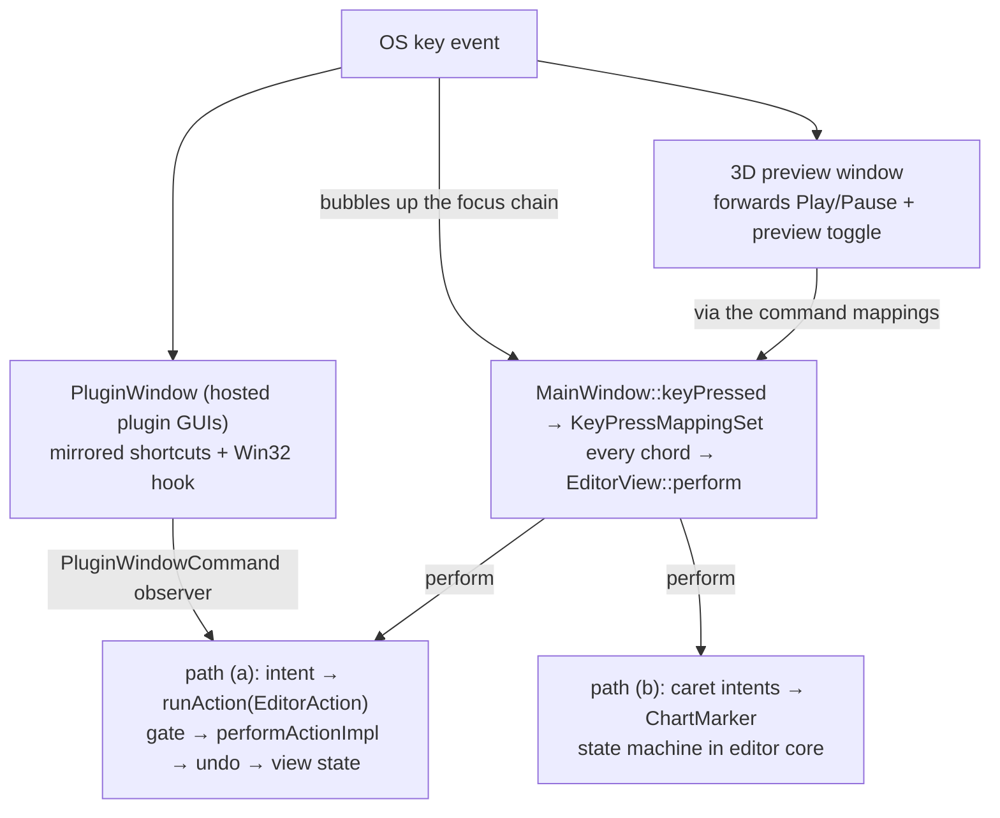

\page guide_keyboard Keyboard Input and Keybinds

*Applies to: Editor-only (the game's separate input path is summarized at the end).*

This page traces a keystroke from the operating system to its effect. The editor has **one key
dispatcher** (the command registry landed 2026-07-20; the grammar decoder dissolved into it
with total rebindability, plan 53 Phase 1b): every keybind — undo/redo, Space, the File-menu
chords, *and* the interaction grammar's arrows, digits, Delete, Insert, Esc, and `+`/`-`
grid/zoom keys — is a registered command in one `juce::ApplicationCommandManager` owned by
`EditorView`. `MainWindow::keyPressed` hands each press to that manager's `KeyPressMappingSet`,
which matches chords exactly, checks enablement, and invokes `EditorView::perform`, which emits
the same controller intents the menus use. The registry table behind it is
`rock-hero-editor/ui/src/keybinds/editor_command_registry.cpp`; one command exists per
(chord, verb) pair, so the `Ctrl` precision/reach tiers are separate commands and the
interaction grammar's modifier algebra survives as the *shape of the default map*, not as an
enforced restriction.

From the controller inward, a keystroke still travels one of **two paths**: the editor-action
pipeline (\ref guide_action_anatomy) or the caret/marker interaction model. Keymap
**persistence and the actions dialog are live** (below), and **every binding is
user-rebindable with no exceptions** — Undo/Redo/Play-Pause mirror into hosted plugin windows
through an injected, layout-neutral binding seam, and the grammar verbs rebind like anything
else ("bad keybinds are the user's problem; the defaults are the fallback", the 2026-07-20
direction that reversed the earlier fixed-grammar policy).

```mermaid
flowchart TB
    os["OS key event"]
    kpms["`MainWindow::keyPressed → KeyPressMappingSet
    every chord → EditorView::perform`"]
    pw["`PluginWindow (hosted plugin GUIs)
    mirrored shortcuts + Win32 hook`"]
    pv["`3D preview window
    forwards Play/Pause + preview toggle`"]
    action["`path (a): intent → runAction(EditorAction)
    gate → performActionImpl → undo → view state`"]
    caret["`path (b): caret intents → ChartMarker
    state machine in editor core`"]
    os -- bubbles up the focus chain --> kpms
    os --> pw -- PluginWindowCommand observer --> action
    os --> pv -- via the command mappings --> kpms
    kpms -- perform --> action
    kpms -- perform --> caret
```

# Where key events enter

`EditorView` is the keyboard-focus owner (`setWantsKeyboardFocus(true)`); unconsumed keys
bubble up the parent chain to `MainWindow`, where the command mapping set matches registered
chords. Everything else is plumbing that keeps focus in the right place:

- **The window follows the keyboard by three rules.** (1) *A moved position keeps its measure in
  view.* The controller publishes where the keyboard stands (`EditorViewState::keyboard_position`:
  the armed caret's slot, else a time selection's moving edge, else the paused cursor, with its
  measure's span; nothing while playing) and `EditorView::setState` fits that measure into view
  whenever the position's time changes — a step, a click that arms, Tab onto the next marker, an
  extend — through `TrackViewport::ensureMeasureVisible`, the minimal shift in either direction, as
  Guitar Pro does. (2) *A verb on a selection centres it if it is not fully on screen.*
  `EditorView::perform` is the one funnel for chords, menu items and presses forwarded from the 3D
  preview; for a command `editorCommandActsOnSelection` classifies (read off the registry
  category: the selection, authoring, value-entry and marker verbs; not navigation, file, history,
  view, transport, grid or menu commands, nor the section and tone-change author chords) it reads,
  BEFORE the command runs, the selection's first member
  (`EditorViewState::selection_start_seconds` — the earliest selected note or point, the selected
  marker's start, else the armed caret) and whether that was fully on screen: it asks the surface
  that drew it for the glyph's bounds (`TimelineRuler::selectedChipBounds`,
  `ToneTrackView::selectedRegionLabelBounds`, `TabView::selectedNoteHeadBounds`,
  `ToneAutomationLanesView::selectedPointBounds` — a chip or label PINNED at the edge for a marker
  standing elsewhere reports nothing, so the marker's own column answers) and puts them to
  `TrackViewport::isSelectionVisible`. A selection that was on screen is left alone, even when the
  verb moved it: `Alt+←` pushing a chip off the edge is followed by rule 1's measure fit of the
  cursor that went with it. One that was not is centred (`TrackViewport::centerOnTime`) where the
  verb left it, or where it stood when the verb destroyed it, so Delete centres the deleted place.
  (3) *Selecting never scrolls*: a chip click, a click on an existing note
  and a walk onto the marker that already holds the cursor publish no moved position and act on
  nothing; a walk whose column rule seeks the cursor into a far-off marker is a move, and rule 1
  follows it. Zoom (`applyZoomAroundCursor`)
  pivots on the cursor in place while it is on screen and centres on it first when it is not, for
  keys and wheel alike. A new registry category must be classified in
  `editorCommandActsOnSelection`.

- **`MainWindow::keyPressed`** (`ui/src/main_window/main_window.cpp`) is where a press becomes a
  command, and it is gated on typing: it hands the press to the command manager's
  `KeyPressMappingSet` only while **no text field in the window is being edited**
  (`ComponentPeer::findCurrentTextInputTarget`, which skips read-only and disabled editors), and
  otherwise declines it. Sitting on the window shell, it covers both the focused editor (unhandled
  keys bubble up to it) and keys that arrive while native focus sits on the shell itself. Two
  consequences of the gate:
  - **While a field is open, no keyboard command runs at all.** The short inline edits that reach
    this window — the grid value box and the output-gain text box — keep every key they decline
    (Tab and its variants, Insert, `Alt`+arrows, `Ctrl+PageUp/PageDown`, the F-keys, and
    `Ctrl+Z`/`Ctrl+Y` once the field's own undo history is spent) instead of leaking them to the
    chart behind the field. The menus still work by mouse, and a mouse click commits the typed
    value first. There is no per-command datum and no registry column.
  - **Tab in a text field moves focus.** Declining hands the key to nothing — the field has already
    refused it — except JUCE's own unused-Tab fallback, `moveKeyboardFocusToSibling`
    (`ComponentPeer::handleKeyPress`), so Tab and `Shift+Tab` traverse focus and commit the value.
    That is why `EditorView::stepToRowObject` needs no text-field check: a Tab that reaches it is
    always the row step.
- **Interactive children decline focus** so keys stay with `EditorView`. The load-bearing case is
  the timeline viewport (`ui/src/timeline/track_viewport.h`): a stock `juce::Viewport` grabs
  focus and converts arrow keys into scrolling, which would silently steal the caret grammar —
  so it sets `setWantsKeyboardFocus(false)` and overrides `keyPressed` to return `false`.
  Transport, signal-chain, and plugin-tile buttons decline focus for the same reason.
- **The 3D preview window** wants focus for itself (its render surface hosts a native child
  window). It forwards a whitelist of seventeen *commands* through a `std::function` injected by
  `EditorView`; membership is resolved through the command mappings rather than hardcoded
  chords, so future rebinds of rebindable commands stay honored. The seventeen are Play/Pause,
  the preview toggle, the horizontal caret travel (arrows, measure jumps, chart bounds, sections,
  and the four Tab object steps), and the grid trio (44-Q4: transport keys only; editing
  shortcuts and the vertical walk stay with the main window). The five `Ctrl+Shift`+letter row
  jumps stay with the main window for the same reason as the walk: they select rows the highway
  does not draw.
- **The preview surface bounces native focus back.** One layer below JUCE, it installs a Win32
  window proc that bounces `WM_SETFOCUS` off the bgfx render child back to the JUCE peer
  (`ui/src/preview/preview_surface.cpp`) — without it the native child swallows every key. That
  focus-bounce is a recorded watch item; treat it as an invariant of the preview port.
- **Modal overlays own their keys.** `BusyOverlay::keyPressed` grabs focus and swallows
  everything while a busy operation runs; the themed message box and the audio-device failure
  overlay handle Return/Esc themselves. A key that "does nothing" during busy is the overlay
  working as designed.
- **Hosted plugin windows** are the special case — see the seam section below.

# Held modifiers: the one key that is a state, not a chord

Everything above turns a keystroke into a *verb*. One key does not: **holding `Alt` while this
application is in the foreground reveals each visible note's actual ring in the 2D tab lane**, and
releasing it clips every note back to its presented tail except the ones the selection names.
Nothing is invoked, nothing is undoable, and the mapping set is not involved at all — the whole
path is `EditorView::syncAltHeldState` → `TabView::setActualRingReveal`, repainting only on a
change. `Alt` is the key because `Alt` is already the authoring gate, and the ring it shows is
exactly what `Alt`+wheel edits. It is the whole-lane half of a per-note rule — a SELECTED note
draws its ring with no key held at all — so see \ref guide_2d_views for the pick and the mark it
makes.

There is nothing registrable beside it: the mark the reveal makes was decided on 2026-08-23 (the
lane redraws in the actual form) and the `F6` toggle that had let the two candidates be flipped
between is gone with the losing one. The 3D preview once had its own `F1` rig for the same datum
and that is gone too, so `Alt` is the whole of this idiom on either surface.

`Alt`+letter chords now exist: `Alt+F`, `Alt+E`, `Alt+V` open the menu-bar menus (the platform's
access-key convention, implemented by the app because JUCE's menu bar has no mnemonic handling).
Pressing one flashes the reveal for the chord's duration, the same way `Alt`+digit and `Alt`+arrows
always have. The held-Alt poll feeds both hints from one sample: `EditorView::syncAltHeldState`
pushes the same boolean to `TabView::setActualRingReveal` and to
`MenuLookAndFeel::setAccessKeysVisible`, which underlines the access letter in every menu title
while the key is down, so the two can never disagree about whether `Alt` is held.

A held modifier is not a keystroke, and JUCE has no callback that reliably reports one. The rule
and its four facts, before adding a second held-modifier state:

- **The rule is one predicate, and it ignores the pointer.** The reveal is on exactly while
  `juce::Process::isForegroundProcess()` and
  `juce::ComponentPeer::getCurrentModifiersRealtime().isAltDown()` both hold. "The app" is the
  *process*: the editor window or the 3D preview being the active window both count, and the answer
  never depends on where the pointer is or which of this app's windows holds the keyboard. The
  user's framing: `Alt` should work if and only if the app is in focus, and not change based on
  where the mouse is in the app.
- **`modifierKeysChanged` cannot feed it, by construction.** JUCE delivers that callback to the
  component under the mouse pointer, falling back to the focused one when the pointer is over none
  (`ComponentPeer::handleModifierKeysChange`), and `Component`'s own implementation forwards it up
  *that component's* parent chain. So a change while the pointer is over the 3D preview walks the
  preview's chain and ends there; a widget may override it *without* forwarding (`juce::Slider`
  does); and a release delivered while another application holds the keyboard (`Alt`+Tab) never
  arrives at all. Pointer position and per-window focus are exactly the axis the rule must ignore,
  and they are the axis every modifier callback is keyed on — which is why the old event-driven
  samplers (an override on `EditorView`, a forwarding hook on `PreviewWindow`, a deep mouse
  listener, a focus callback) were each wrong in a different pointer position and were all deleted
  together.
- **Both halves are process-wide OS queries.** `Process::isForegroundProcess` compares the
  foreground window's process to ours on Windows (`GetForegroundWindow`,
  juce_Windowing_windows.cpp:5649), asks `[NSApp isActive]` on macOS (juce_Threads_mac.mm:193), and
  reads the peer's focus-in/out flag on Linux (juce_Windowing_linux.cpp:685). The *realtime*
  modifier query asks the OS for the key (`GetAsyncKeyState` on Windows, `[NSEvent modifierFlags]`
  on macOS), where the cached `ModifierKeys::currentModifiers` is whatever a window last saw.
  Neither knows what the pointer is over, so neither can be wrong about it. (Linux is the gap JUCE
  leaves: its realtime query refreshes only Shift and Ctrl from the X pointer mask,
  juce_XWindowSystem_linux.cpp:2537, and keeps Alt as the last X key or pointer event left it, so
  there the reveal can lag one such event.)
- **One sampler: `EditorView`'s per-frame vblank attachment, for the view's whole life.** The same
  `juce::VBlankAttachment` that samples the meters and the time readout re-reads the predicate
  every frame and pushes the answer to the lane, which repaints only on a change — in that same
  frame, since JUCE runs vblank listeners before it flushes repaints. There is no timer, no
  start/stop logic, and no second reader of the key — one way to answer the question, not two
  (\ref guide_patterns, "VBlank sampling, never Timer").

# Decoding

All chords match exactly: the mapping set compares `juce::KeyPress` values with exact modifier
state, so the old hand-written guards come free — `Ctrl+Z` does not fire on `Ctrl+Alt+Z` (Alt
is the grammar's default authoring modifier) or `Ctrl+Shift+Z` (which is Redo's registered
alternative), and each tiered verb (plain caret step vs. `Ctrl` measure jump) is its own
command on its own chord. Chords register lowercase letters — the mapping set asserts on
uppercase-without-shift — and letter matching is case-insensitive against OS key codes.
Key-shape variance is expressed as **alternative default chords** on one command: each digit
command registers its main-row *and* numpad chords (the digits are the only keys JUCE's
Windows path remaps to `numberPad*` codes), while the numpad add/subtract keys arrive as their
plain character key codes — `doKeyDown` has no VK_ADD/VK_SUBTRACT case and `doKeyChar`'s
numpad remap covers digits only (juce_Windowing_windows.cpp:3141-3161, :3178-3195) — so the
bare `'+'`/`'-'` chords *are* the numpad bindings and `numberPadAdd/Subtract` chords would be
lying entries that never match. Chords that render identically ("display-equal" OS key-shape
twins like `Shift+=` and the numpad-arrival `'+'`) group into **one chip** in the actions
dialog and one entry in menu shortcut text; the chip's change/remove operate on every chord in
its group, so no ghost binding can survive a visible removal.

**`Alt` changes which digit key arrives, and Windows composes a character out of the chord.** Under
`Alt` a numpad digit reaches JUCE with the TOP-ROW key code on Windows — `doKeyDown` resolves the
character through `MapVirtualKey` before the numpad remap can claim it — so the `Alt`+digit commands
register both shapes as alternatives and it is the top-row chord that matches there. Worse, Windows
reads the chord as an **Alt code**: it accumulates numpad digits while `Alt` is held and delivers
the COMPOSED CHARACTER as a bare key press on the release, so `Alt`+7 `Alt`+6 would arrive as a
plain `L` and fire the legato verb, and the codes 27 and 32 would arrive as cancel and play/pause.
Each top-level window therefore filters at its key entry — `MainWindow` and `PreviewWindow`, the two
places keys enter this application — through `ComposedCharacterFilter`
(`ui/src/main_window/composed_character_filter.h`), a key listener that swallows a press carrying NO
modifiers whose own key is not physically down (`juce::KeyPress::isKeyCurrentlyDown`). That one
datum is the whole rule: every platform records a real press in its key-state table before
dispatching it, so anything the user struck reads as held, while a character the OS synthesized
holds nothing. Two mechanics are load-bearing. The filter runs ahead of command dispatch with no
ordering rule to maintain: JUCE offers a component's key listeners the press BEFORE that
component's own `keyPressed` (`juce_ComponentPeer.cpp:200-217`), and each window dispatches
commands from its `keyPressed`, so the filter is a keymap-level guarantee rather than a
per-command guard. And nothing upstream can prevent the composition itself: it happens inside
`TranslateMessage`, which JUCE calls for every message it pumps.

Where the same chord needs different verbs by context (the old decoder's sequential dispatch),
the mechanism is enablement: `KeyPressMappingSet::keyPressed` visits every command mapped to a
chord, skips disabled ones and keeps looking, and returns false when nothing enabled fired
(juce_KeyPressMappingSet.cpp:322-357) — the recorded future mechanism for modal scopes like
the plugin-chain section. Today every chord has exactly one owner; context branching lives
*inside* each command's `perform` (the digit try-order, the Esc ladder), and the verbs whose
old branches declined silently stay **always-active and self-gate in perform**, because a
disabled command whose chord matches makes JUCE play the system alert sound.

# Path (a): keys that become editor actions

Space, Ctrl+Z, Ctrl+Y, and Ctrl+Shift+Z are registered commands: the mapping set resolves the
chord, checks enablement via `getCommandInfo`, and `EditorView::perform` emits the intent
(`onPlayPausePressed`, `onUndoRequested`, `onRedoRequested`), whose implementations wrap an
`EditorAction` value and call `runAction(...)`. From there the keystroke is indistinguishable
from a menu click or button press: availability gate, dispatch to `performActionImpl`, undo
capture, view-state push — the whole pipeline of \ref guide_action_anatomy. A keybind on this
path is nothing but *one more trigger* for an action; the policy all lives downstream. The
File-menu chords (`Ctrl+O`, `Ctrl+I`, `Ctrl+S`, `Ctrl+Shift+S`, `Ctrl+E`, `Ctrl+W`)
ride the same route, and command-backed menu items display their live shortcut automatically —
the popup queries the mapping set per item.

`Ctrl+T` (the tone-change chord) is a registered command whose `perform` opens a UI popup (the tone
picker) before any action runs, and `Ctrl+M` is the section command with the same shape. Under the
marker grammar (2026-09-14) neither chord decides anything: the CORE publishes the VERB each one
would perform at the cursor — `EditorViewState::tone_chord_target` as nothing /
`RetoneRegionTarget{region_id, tone_document_ref}` / `SplitToneRegionTarget{position,
containing_tone_document_ref}`, and `section_chord_target` as nothing /
`RenameSectionTarget{position, name}` / `InsertSectionTarget{downbeat}` — and the view opens the
picker or prompt that variant names. The chords read the CURSOR and never the selection: the armed
caret, else the paused cursor (`cursorPosition(quantum)`, at the placement quantum for the tone's
slot and at the tick for the section's measure downbeat). "Nothing" carries the playback and no-song
gates, stated once in the projection rather than in five UI guards, so a chord typed while the
transport rolls finds no verb to perform. `F3`/`F8` are commands that
toggle UI panels directly — trigger-only commands with no core policy. Two more UI-only families
ride the same shape: `GridFiner`/`GridCoarser` step the grid through
`GridSpacingSelector::stepNoteValue` (emitting via the selector's listener, the same path as a
combo pick, so the controller still owns the applied value), and `ZoomIn`/`ZoomOut` zoom
through `TrackViewport::zoomByStep` — the keyboard twin of Ctrl+wheel, sharing its
clamp/relayout/pivot/report path. Their default chords are the `+`/`-` family (main-row and numpad
shapes, plus the unshifted `=` convenience alias) — see the key-shape note under Decoding.

`Ctrl+G` (`ToggleGridSnap`) is a path (a) command beside them, but it is not UI-only: it flips
the editor's session grid-snap switch, which is the one fact behind the **placement quantum**
(`placementQuantumNoteValue` in `tempo_grid_geometry.h`). With snap on, every verb that quantizes
a time position lands on the session grid; with it off they land on the tick lattice
(`g_tick_quantum_note_value`, 1/3840 of a whole note — the MIDI PPQ tick). There is no per-verb
modifier tier: `Ctrl` composes nothing on a placement, on any surface. The switch is session-only,
never persisted, and reset to on at every project boundary (see
`docs/plans/in-progress/grid-snap.md`). A verb needing a musical DURATION — the ring a placement
authors — keeps reading the grid VALUE, which is why the two are separate readers in the
controller (`chartGridStepBeats` for the duration, `placementQuantum` for the position).

It is also the one command whose keystroke does not always take effect: turning snapping OFF is
**warned about first, every time**. `performActionImpl(ToggleGridSnap)` raises
`EditorViewState::grid_snap_warning_prompt` instead of flipping the switch, `EditorView` presents
`GridSnapWarningDialog` (warning register, "Keep Snapping On (Recommended)" carrying both Return
and Escape), and only `onGridSnapWarningDecision(TurnSnappingOff)` moves the switch — every other
way out of the dialog reports `KeepSnappingOn`. Turning snapping back on is never gated. The gate
lives in the action, not in the view, so the `Ctrl+G` the 3D preview window forwards is warned
about exactly like the one typed in the authoring window; the dialog belongs to the main editor
window either way. Nothing suppresses the warning and nothing records it — see the ruling in
`docs/plans/in-progress/grid-snap.md`. The dialog's copy names the binding itself (an accidental
press is exactly the case where the user does not know what they pressed), reading it live from
the mapping set through `commandChordText`, so a rebind moves the dialog's text with the menus'.

# Path (b): keys that drive the caret grammar

Arrows, Home/End, PageUp/PageDown, their Shift time-selection forms, Alt+arrows,
Alt+Shift+arrows, `Tab`/`Shift+Tab` and their `Ctrl` twins, the five `Ctrl+Shift`+letter row jumps,
digits, `Alt`+digits, `Enter`, `Ctrl+R`, Delete, Insert (the lanes' and the tone row's neutral
create — the chart's `Insert` verbs were retired 2026-09-11 when every note became typed), and Esc
are registered commands like everything else. Their `perform` cases route to dedicated controller
intents, and since 2026-08-21 every
one of those intents except Esc is ITSELF an `EditorAction` case (`StepChartCaret`,
`StepToRowObject`, `JumpToFocusRow`,
`JumpChartCaret`, `ExtendTimeSelection`, `MoveSelection`, `DeleteSelection`, `InsertLanePoint`,
`TypeChartFretDigit`, `ShiftChartFrets`, `AdjustChartSustain`, `ToggleChartTechnique`,
`ChooseChartHarmonic`, `SetChartHarmonicNode`, `SetChartLeftTap`, `ToggleChartSilentHold`,
`ToggleChartJunction`) — so
path (b) is path (a) with
a different trigger: the availability policy
owns the busy gate, the chart/transport/selection preconditions, and the logging, and
`runAction`'s prologue settles the pending fret entry for all of them. The prologue's ONE exemption
is the keystroke that CONTINUES the live entry rather than acting against it, asked as
`chartFretEntryContinuedBy(action)`: a DIGIT widens the typed value, and nothing else does — the
harmonic node picker is a popup that commits on the row chosen, so no verb leaves a value
provisional, and a run of those choices folds into one undo entry rather than pending. EVERY digit continues a live entry, bare or under
`Alt` — the FIRST digit's modifier is what decided the entry's target, and the ones after it only
widen the value, so no keystroke re-derives what the entry creates. What stays per-verb is reading
its own operand. Esc remains a direct ladder because its first rung is the invalid pending
value itself. The intents —
`onChartCaretStepRequested` (which also carries the one EXIT from a time selection: a plain arrow
under a Shift selection arms one grid step past the span's start or end in the press's direction —
the caret leaves the span the way it leaves a slot, so the extend and the step read as one motion;
`StepChartCaret`'s passive branch),
`onChartCaretJumpRequested(ChartCaretJump)` (the Home/End and
PageUp/Down leaps, one sum type over start/end/previous-section/next-section),
`onTimeSelectionExtendRequested` (Shift+ the same navigation family: grid, measure, section,
and chart-bound extends of the grid-locked `TimeSelection` — the range edge reuses the caret's
shared destination helpers, so the two can never drift on the same motion),
`onSelectionMoveRequested` (Alt+arrows, and the one verb whose operand is BOTH chart selection
kinds: the time step moves a note by its slot and a keyframe by its OFFSET along the ring it rides,
one plan and one entry even for a mixed selection, while the string step reaches notes alone — a
keyframe has no string, and a selected head carries its path across by construction. A selected
note's own keyframes ride at unchanged offsets, since an offset is relative to the onset it hangs
from. Every bound on a stepped offset is the rule authority's, reached through the finalize gate,
so crossing a neighbour REFUSES rather than swapping — the offset IS the keyframe's identity. The
step re-keys every moved point, so the verb names the new selection itself (`select_exactly`)
instead of leaving the default follow pointing at offsets nothing sits on),
`onChartSustainAdjustRequested(direction)` (THE duration verb —
a run of presses is one GESTURE: each press appends its step to the run's list, the selection
re-plans by replaying that list over the rings the run started at, and the whole run stays one undo
entry, ruled 2026-08-22; see \ref guide_undo. A step moves the ring's END onto the adjacent line of
the placement quantum's lattice — so a ring left between lines snaps back onto them — which is why
the run records steps, each carrying the note value it snapped by, rather than summing them into
one delta. Its operand is every note the selection reaches through either kind, since a keyframe
sits on the tail this verb acts on; the head verbs do not reach through a keyframe. A step that
moves no ring — every note at its floor or bound — is refused and never recorded, so no unseen
overshoot builds up at a bound),
`onChartFretShiftRequested`, `onChartFretDigitTyped` (the two fret verbs, and both reach a selected
KEYFRAME as well as a head: a point on a slide states a fret exactly as a head does, so one
`planRetypeFrets` call takes the selection's two key lists and transposes off ONE anchor over both.
No third `ChartStopChannel` value and no second entry kind — the selection KIND is what says which
stop the digit reached, and a keyframe has one position channel and no satellite),
`onSelectionDeleteRequested`,
`onLanePointInsertRequested` (the lanes' on-curve point — the `Insert` key's whole remaining
create; the chart lane no longer answers it) and the entry gestures around it — **every note is TYPED, a click never creates, and
`Alt` creates only the slide-out**. Every entry case on the lane follows from that one sentence.
The DIGITS (`TypeDigit0`–`9`, "Type Digit N") are the whole of chart entry: at the armed caret, on
an EMPTY slot and at a ring's EXACT END alike, a HEAD at the typed fret — at the end it is simply
the next note, since the ring already stops there, which is why sequential entry is safe — and on a
slot a ring COVERS, a POINT on that note's path at the typed fret, planted and selected with the
caret on it so the technique keys address it as they address any keyframe. `Alt`+digits
(`TypePathDigit0`–`9`, "Type Path Digit N") differ in exactly ONE cell: at a ring's exact end where
nothing yet stands, the typed fret is the SLIDE-OUT, the release keyframe — the only thing `Alt`
creates on this lane. Everywhere else the two chords land the same product, so a mistimed `Alt`
costs nothing. A pointer press creates nothing under any modifier: it arms the caret and selects
what is there (`Alt` keeps the ring reveal, the wheel and the arrows). Where a slide-out already
ends on the slot, arming the caret selects its chip, so a digit retypes the fall by the ordinary
selection rule.
A point that merely restates the fret the path is already running on says NOTHING, so it is silent
authoring state (the commit law below): typing the same fret on a tail and stopping there leaves
nothing behind. A fret-stating point inside an OPEN STRING's tail is refused by chart law
(`OpenStringSlide`) — nothing is pressed to glide — and the pending box paints red.
**THE SPLIT IS TWO KEYSTROKES, and `planToggleJunctions` is its one home** — a digit plants the
point where the division belongs, `Shift+L` splits it there (below). The point becomes the new
head; the original note ends exactly on it; the new note opens in the state the hand holds — its
stated fret, a bend in force as its onset bend, a shake in force opening it shaking — and every
keyframe after it rides the new note, a slide-out included; the first note's arrival retreats clear
of the new head, at the clearance `latestStatementBeforeStrike` gives every unauthored statement —
one margin back, or halfway from the last leg's start when the leg is shorter than a margin, which
is what lets a grid-step ring split at all — unless the point says nothing the first note's path
does not already say (`keyframeSaysNothingNew`), in which case it has no leg and the first note
sheds it, ending on a plain tail. That segment walk has ONE caller, so there is one rule
and one place it lives. NOTHING SINGLE-PRESS TRUNCATES A RING OR CLIPS A KEYFRAME: the ring clamp
and the clearance repair remain the authorities for load, for import, and for the MOVE verb — the
one editing gesture that re-strikes by truncation and can clip payload, deliberately, since a moved
note brings its own payload and there is nothing coherent to merge. Even it never DELETES a
statement: a landing that would clip any other keyframe off the tail is refused whole.
THE COMMIT LAW, `keyframeSaysNothingNew` (`chart.h`): a point that says nothing — no
bend, no shake, a fret the path passes through anyway — is AUTHORING STATE. The history records
written states (`writtenChartPlan`), so planting one pushes no entry and the edit that gives it a
meaning carries its creation; it dissolves, again with no entry, when its NOTE leaves focus
(`dissolveSilentKeyframes` at the settle, and before undo or redo replays); and the document writer
and the load repair both shed it (`documentChart`, `ChartRepair::SilentKeyframe`). A charter
therefore places a point first, walks the tail to where the slide lands, and gives it its meaning
second.
A typed digit reaches every product through the SAME pending entry — the box at the slot, red where
the gate refuses the fret, a valid plan projected into the 2D lane immediately without touching the
stored chart or history, and the product planted and selected when it settles — and what the slot
decides is only which beginning that entry takes (`ChartFretEntry::CreateKeyframe` is the point
one). A non-empty selection is retyped by a digit either way, bare or under `Alt`, because a
selection is an operand neither chord has to choose between; only a digit at a bare caret standing
on a ring's exact end has anything to choose at all),
`onChartTechniqueToggleRequested(ChartTechnique)` (THE technique
toggle verb — one method for palm mute, dead note, tremolo, vibrato, wide vibrato, accent, ghost,
pick slide, right-hand tap, slap, pop, pinch harmonic, and legato, each a row of
`chartTechniqueLaw` in `chart_edits.h` except legato, which plans through the resolver;
uniform scope over the selection, one compound undo entry, one toggle
window. Every row but the vibrato pair reads `selection.notes()` alone. **Vibrato has two
authoring scopes because it is the one interval STATE here**: the note's own field is the
channel's statement at offset zero and a selected KEYFRAME states a change from there, so one
planner (`planSetVibrato`) writes both. It is also one of two technique FAMILIES sharing a field
rather than owning a flag: its two rows are one shared row shape handed their own width, so `V`
toggles the ordinary (narrow) tier and `Shift+V` the wide one, and pressing either on a scope
already at the OTHER tier is an ordinary set that replaces it in one entry — never a clear
followed by a set, and never a cycle. The four ATTACK rows (`Shift+X` pick slide, `T` right-hand
tap, `S` slap, `P` pop) are the second such family and take the identical shape one level up
(`attackLaw` beside `vibratoTierLaw`): the attack field holds exactly one value, so each row
toggles its own against the plain pick and replaces any other in a single entry. **`Shift+H`'s pinch
is the family's ONE harmonic row**, and the one row whose CLEAR belongs to a verb outside the family:
it re-hands the note to the picking thumb through the attack verb, and clears with
`planClearPinchHarmonic` rather than `planSetAttack(Pick)`, because the row's noun is a harmonic so
its clear must remove one — the thumb's own clear, which returns the note to the plain pick and drops
the node while leaving the fret alone. The fret-hand harmonic `H` was the second harmonic row until 2026-09-16, when
it stopped being a toggle and left `chartTechniqueLaw` — `ChartTechnique::Harmonic` went with it —
for the stating verb described below. Every
compatibility consequence a conversion owes belongs to `planSetAttack` and the rule authority
behind it in BOTH directions — the scrape's path and terminal drop when a note converts away, a
tap with nothing to strike is skipped (E4), an attack on a silent hold is refused for the ring it
would have to keep — so a row states none of it. `Shift+T`'s left-hand tap is deliberately NOT a
row: it is a statement no toggle may withdraw, so it keeps its own stating verb
(`onChartLeftTapRequested`) over the same planner.
The planner applies the generalized dissolve law to what it wrote,
dropping a statement that restates the state already in force and letting the strip authority
take a keyframe the drop emptied — all SILENT when they apply nothing, because the view's only
reporting seam is a modal error box and "nothing to do" is not an error — legato counts its skips
and their dominant reason
in `ChartLegatoPlan` for the non-modal channel W5 will build, and shows nothing until then),
`onChartLeftTapRequested`,
`onChartSilentHoldToggleRequested` (the arpeggio hold verb, `N` — selection-scoped like every chart
verb, with the typing family's caret fallback behind it (`chartVerbSlots`, the one place the
empty-scope rule is written): a whole chord converts in one press and one entry, and an empty armed
slot — the one thing a selection cannot name, since nothing is there to select — gains a hold at the
open string, which the charter then types a stop onto. A sounding note is CONVERTED, keeping its
slot and its fret and losing the ring and techniques its new attack cannot state; a hold is sounded
again as a plain pick at the session's grid step, and the direction is the scope's as a whole, like
every technique toggle's. A second press inside the verb's own window reverses the first exactly,
which is the only thing that can restore what a conversion stripped. Silent with no scope, and
silent when the press would state nothing — a held stop that reaches no shape is removed by the
settle, so a press whose own product it would remove refuses whole rather than deleting the note it
was asked to hold. The verb draws no mark of its own: what shows a hold is the arpeggio bracket its
stop reaches the posture through — user ruling 2026-08-27, recorded in
`docs/plans/todo/arpeggio-authoring.md`),
`onChartJunctionToggleRequested` (the junction toggle, `Shift+L` — one verb with two directions,
because a junction has exactly two states and the press moves each selected one to the other. A
selected KEYFRAME becomes a head: the note's path ends there and a new head takes the remainder,
carrying the channel states in force so the sound does not change across the cut. **This is the
lane's whole SPLIT, in two keystrokes**: the digit that plants the point is the first half, this
press the second, so a charter divides a ringing note by saying where and then saying so. A
selected HEAD becomes a point on its same-string predecessor's path: the two rings lie end to end,
the head's own keyframes ride along rebased, and everything a STRIKE states — attack, mutes, node,
tremolo, emphasis, held stop — goes with the head, because the join is the statement that no strike
happens there. The join is written as the split's exact INVERSE, so split-then-join restores the
chart byte for byte, and W10's TIE falls out of it rather than being built: on an equal-fret
junction the point says nothing the path does not already say, so the commit law sheds it and what
is recorded is one longer ring with one note fewer. `planToggleJunctions` has no other caller — the
entry gestures never split — which is what keeps the walk one rule in one place.
Both halves run in one press and one compound undo entry. Selection-scoped, refused at a keyframe
stating no fret (a head must sit on a stated fret) and wherever a predecessor cannot hand its
string over, and silent with nothing selected. No verb window is armed and none is needed: the
SELECTION carries the toggle, since each press leaves exactly what it made selected — a split's new
heads, a join's new point — so pressing again reverses it),
`onChartHarmonicRequested()` (the fret-hand harmonic, `H` — NOT a toggle since 2026-09-16, and the
one chart verb whose law is **offer every CHANGE the selection allows, and ask only where there is
more than one**. WHICH ROWS CHANGE ANYTHING IS THE PLANNER'S ANSWER, never a count made beside it:
the verb plans each node row (`planSetHarmonic`) and the clear (`planClearHarmonic`) over the live
chart, and a plan of `NoChange` is a row that would do nothing — so ZERO changes is an inert press,
ONE applies in the keystroke, and two or more ask. The node rows come from the member whose label
names the MOST nodes — a carrier's label being the fret its node lies at, `harmonicLabelFret` in
`chart_edits.cpp`, the same authority the clear presses back down, so a note touching 4.98 is offered
the 13th and 15th partials of a 5 — and EVERY one of them is shown, a ticked row included, so the
tick can say where the finger is; the "No harmonic" row LEADS them, ruled off by a separator, only
where the clear itself changes something. The payload is
`ChartHarmonicNodePicker{note, choices, preselected}`, `choices` a
`std::vector<ChartHarmonicChoice>` — a variant of
`ChartHarmonicNodeChoice{node, partial, current}` and `ChartHarmonicClearChoice` — the clear row
FIRST when offered, then the node rows ascending by partial, and `preselected` an index into that
list, so "a clear row that was never offered" cannot be preselected or chosen. The TICKED row is the node the
ANCHOR member is touching — the note the rows were read from, the head the menu sits on — rather than
a statement about the selection as a whole, and Return takes the clear where every selected note
carries a fret-hand harmonic (`carriesNeckHarmonic`: a node whose attack keeps it on the neck, a pinch
excluded), else the lowest partial that changes something. Labels naming nothing, an open string or a
pinch, are inert; and the clear is the FRET HAND's alone — `planClearHarmonic` writes only notes that
`carriesNeckHarmonic`, so a pinch selected beside a carrier is left alone by it, the picking thumb's
node being `planClearPinchHarmonic`'s to clear. SEVERAL changes make the CONTROLLER ask, below the
settle prologue, handing the rows to
the view port (`IEditorView::showChartHarmonicNodePicker`) and returning with nothing written and no
undo entry — a menu is a question, not an edit, so opening it ends nothing another verb staged, while
the chosen row's WRITE does through `applyChartEditPlan`'s disarm. Consecutive choices on one
selection FOLD: the verb runs the shared gesture authority `commitChartGestureStep` with an empty
`ChartHarmonicGesture` alternative, so a run replaces one undo entry and a choice back to the pre-run
state retires it, which is why `H` `Return` `H` `Return` leaves no trace of a carrier the VERB itself
produced; an imported carrier whose payload (a bend, a shake) the set normalized away keeps an entry
describing that strip, which is a real edit rather than a defect. There is no second-press
reversal, so the exact restore of a node no label can name — an imported artificial 17.0 on a fret 5
— is `Ctrl+Z` only; that is the price of a multi-valued "on", where "restore what the last press
removed" and "set" cannot be the same act),
`onChartHarmonicNodeRequested(std::optional<int> partial)` (the picker's ONE landing — the row chosen
in the popup the controller asked the view to open arrives here, an absent partial being the
"No harmonic" row, and a chosen row is already a deliberate choice, so it applies at once through the
same `planSetHarmonic` / `planClearHarmonic` a choiceless press runs, with the same uniform scope and
one undo entry, folded into the run above as one more step),
`onChartEscapePressed` —
implemented in editor core against the
marker state machine: `ChartMarker = std::variant<ChartCursor, ChartCaret>`
(`rock-hero-editor/core/src/controller/editor_controller_impl.h`), always present, exactly one
state (passive cursor or armed caret; a `ChartCaret` holds a grid position, a string, and
optionally an automation-lane row, and a `ChartCursor` remembers the row the next arming lands on —
the string, and the lane while the caret rode one — plus the exact position the editor last put
the cursor at, which `pausedCursorPosition(quantum)` trusts only while the transport still stands
there — one trust rule, read at the placement quantum by an arming and at the tick by the marker
rows, which coincide once snap is off. `cursorPosition(quantum)` is its ARMED-AWARE wrapper: the
armed caret's position, else that paused answer, and nothing at all while playing or with no song.
That wrapper is the one position authority every marker verb reads). Up/Down walk ONE stack of
focus rows through `stepFocusRow`
— the ruler's section, tempo and time-signature rows, the strings, the tone-region row, the visible
lanes, the "+" row — and every landing goes
through `landOnRow`, which arms a string or lane row and selects the marker holding the cursor on a
marker row (or the "+" row), with `prepareLandingRow` as the one rule for which row a landing that
keeps the marker's row arms on. The four marker rows share one model in
`rock-hero-editor/core/src/timeline/marker_row_handlers.cpp` — `markerStarts`, `markerHolderIndex`,
`adjacentMarkerStart` (the next or previous start strictly beyond the CURSOR, which is how `Tab` and
`Shift+Tab` step every one of the four rows, so from a cursor inside a marker past its start
`Shift+Tab` lands on that marker's own start first rather than skipping to the one before),
`selectedMarker` and its inverse `markerSelectionAt`, and `selectMarker`, the one select every
pointer and keyboard path to a marker goes through;
`Ctrl+Up/Down` pass the same step's `reach` flag, which along time is the measure jump
(`docs/plans/completed/keyboard-focus-rows.md`).

The `Ctrl+Shift`+letter row JUMPS (`onFocusRowJumpRequested(FocusRowJump)`, `JumpToFocusRow`, built
2026-09-15) are the walk's direct route rather than a second grammar: `focusRowFor` maps the target
enum to the row, and the jump lands through the same `landOnRow`, so the marker holding the cursor is
selected and an armed caret demotes in place exactly as a step would leave it. Both callers list the
rows through one non-const `rowsFromFocus`, which folds the column rule (`moveCursorIntoSelectedMarker`,
so a marker selected far from the cursor is where the target row is read) and `focusRowStack` in that
order, so neither can list before reconciling. **Stack membership is the silence rule**: a row the
stack does not list — a song with no sections, a track with no regions — is not landed on at all, so
the press does nothing and leaves an armed caret armed, where indexing that row's markers would have
thrown. The jump never calls `prepareLandingRow`, which is the rule for landings that KEEP the row.

**Two keys read the SELECTION rather than the cursor**, and both take the same projection shape as
the marker chords above: the core publishes the verb, the view opens the prompt it names.
`RestateSelection` (`0x1404`, `Enter`) reads `EditorViewState::restate_target` — nothing, rename the
selected section, retone the selected region, or open the "+" row's parameter picker.
`RenameSelection` (`0x1405`, `Ctrl+R`) reads `rename_target` — nothing, rename the selected section,
or rename the selected region's TONE document — and is silently inert on every kind with no name
(tempo, time signature, the "+" row), the way `Delete` is. Both are always-active and self-gate on
an empty target, so a press with nothing to restate neither beeps nor lies.

**The whole marker plane is paused-only** (ruled 2026-09-14): while the transport plays, no marker
of any kind — section, tempo anchor, time signature, tone region, the "+" row, an automation point —
can be selected and no marker edit can land. The decision is the core's, in
`editor_action_availability.cpp`, and it reaches the views as ONE published flag,
`EditorViewState::marker_edits_enabled`, so no surface derives it and none reads the transport to
second-guess it. `cursorPosition(quantum)` — and the chord, restate and rename targets built on it —
publishes nothing while playing, which is the same rule stated once more where the chords read it.
The tone designer is the deliberate exception: the plugin chain, plugin parameters and the output
gain stay live mid-play, because that is the point of the live rig.

The split within path (b) is deliberate:

- **Pure navigation** (caret steps, arming, Esc's disarm rungs) mutates the marker and calls
  `updateView()` directly — it never enters the action pipeline, because moving a caret is not
  an operation with availability policy or an undo entry. These intents self-gate instead: each
  begins with `isBusy()` / transport-playing checks.
- **Mutating verbs** (move, delete, insert, retype) plan a model edit and replay it through the
  action dispatch, so gating and undo behave exactly as if the edit had arrived any other way.
  When one of these dispatches, it first copies the selection or caret it read **by value** —
  the dispatch may replace the very variant the reference pointed into (see
  \ref guide_invariants).

The union stop set has one WITHIN-slot member (2026-08-27): a note carrying a held stop wears two
marks in one column — its head, and the satellite digit outboard of its posture bracket — so a plain
left/right step visits both, in display order and reversed leftward. The caret's `channel` says
which it is on, and the two verbs that address a stop read it: an entry digit — bare or under `Alt`
alike — states that stop, and Delete clears the held statement rather than the note. Every other
verb keeps note scope. A measure jump is
not traversal and always lands on the stop every note has, and the channel is worth only what the
drawn picture still says, asked again at the moment it is spent.

Which notes wear that second mark is now exactly the RIGHT-HAND ONSETS, because the DEFAULT gives
every one of them a held stop even where the chart states none (user ruling 2026-09-02). Two
consequences for this grammar. Clearing an authored stop no longer takes the mark away: Delete drops
that satellite back to its default, so the caret stays on the held channel and the next digit
AUTHORS a fresh statement in the same place. And what still leaves the caret on the head is a note
that never had a second mark at all — a fretting-hand onset, whose own stop IS its head, or a
silently-held stop, whose fret is its own.

There is no third channel, and that is a ruling rather than a gap (user ruling 2026-08-31,
satellites are note-scoped): a stop belongs to a NOTE, so both channels sit on one, and the
satellite a pointer reaches is that note's held face whatever else is selected. Span-wide fret
editing — one typed digit restating a grip across a whole span — is deferred to the future template
editor, because typing a number over a bracket already means AUTHOR A NOTE at the caret
(`docs/plans/todo/span-marker-redesign.md`).

The rest of this grammar's *semantics* — what each modifier means, the union stop set, the two-state
marker, one selection editor-wide — are owned by
`docs/plans/in-progress/editing-interaction-model.md`; this page only documents the wiring.
*The full keybind × surface matrix is signed off (`docs/plans/in-progress/keymap-matrix.md`,
2026-07-20) and now tracks the plan 53 build: unbuilt rows there (the tone-region row, the
plugin-chain scope, lane multi-select) land phase by phase.*

# Gating: three layers that agree by construction

1. **The pipeline gate is authoritative.** Path (a) keys land in `runAction`, whose availability
   policy (`editor_action_availability.cpp`) is the real decision.
2. **The UI pre-gates against published view-state flags.** For menu-visible commands this is
   `getCommandInfo`'s `setActive` (undo/redo against `undo_enabled`/`redo_enabled`, and so on) —
   the mapping set refuses disabled commands and lets the key propagate, menus gray out, and
   `perform` mirrors the same guards so direct invocation paths stay safe; `setState` calls
   `commandStatusChanged()` on every push to keep it current. The grammar-verb commands gate in
   `perform` instead (Delete against `selection_present`, caret steps against `hasChart()`) —
   see the always-active/alert-sound note under Decoding. Both derive from
   `deriveViewState()`'s *same* availability calls, so the layers cannot disagree.
3. **Modal layers swallow first.** The busy overlay consumes everything before keys reach the
   window's listener. Path (b) intents self-gate in core, as above.

# Keymap persistence

`EditorKeymapPersistence` (`ui/src/keybinds/editor_keymap_persistence.cpp`, owned by the
`Editor` composition wrapper) stores user rebinds through the `IEditorSettings` port as an
opaque blob: the mapping set's **diff-versus-defaults** XML, so shipped default changes merge
under user overrides, and a defaults-only keymap clears the stored value entirely. Four
invariants live here:

- **Restore order is a contract**: every command must be registered before the restore, which
  the composition guarantees by constructing persistence after the view.
- **One owner per chord, on every write**: the keymap editor's assign, its reset to defaults and
  the restore all bind a chord through `assignKeyPressToCommand` (`keymap_ownership.h`), which
  strips the chord from whatever command holds it first. The restore is the editor's own loop
  over the stored `MAPPING`/`UNMAPPING` entries rather than JUCE's `restoreFromXml`, because
  JUCE's loop adds a second owner whenever a chord the user moved has since become another
  command's default; here the user's override wins. With one owner, the preview window's
  first-owner lookup and the mapping set's first-enabled-owner dispatch agree by construction.
- **Stored entries are filtered before restore**: unknown command ids (a newer editor's blob
  would trip the mapping set's debug assertion) are dropped. A corrupt blob falls back to pure
  defaults; the next mapping change overwrites it.
- **Saves are equality-gated** against the stored blob, so the restore's own change broadcast
  and repeated notifications write nothing.

# The actions dialog

"Edit > Actions..." — default chord `?`, REAPER's actions-list key — opens `ActionsWindow`
(`ui/src/keybinds/actions_window.cpp`): a non-modal tool window hosting the
**custom** `KeymapEditorView` (`keymap_editor_view.cpp`) over the editor's one mapping set.
The user-facing name follows the adopted REAPER actions model (the registry is one
trigger-agnostic action list); internally the vocabulary stays "commands", the same
user-facing/internal split REAPER itself uses.
The stock `juce::KeyMappingEditorComponent` shipped first per the plan 46 Phase 3 decision,
and its recorded custom-rebuild trigger fired the same day — the themed stock dialog read as
off-product in live use — so the custom view replaced it (the registry/persistence substrate
is dialog-agnostic, which is what made the swap cheap). The view lists registry commands under
their categories with binding chips per chord: chip click offers change/remove, the `+` chip
opens the press-a-key capture dialog (a themed `AlertWindow` subclass with live "currently
assigned to..." preview), and conflicts resolve through the overwrite-and-clear flow — a
themed confirm naming the current owner, then **remove-then-add** against the public mapping
set (`addKeyPress` alone must never be trusted to resolve conflicts; its documented removal
does not exist in code). Right-clicking a row (or any chip's menu) offers **per-command reset to
default** — disabled when already at defaults, and reclaiming a default chord from whichever
command took it meanwhile, since the mapping set's own `resetToDefaultMapping` performs no
conflict cleanup. Rows rebuild on the mapping set's own change
broadcasts, so rebinds apply live and persist immediately — dispatch, menu shortcut text, the
keymap persistence, and the plugin-window mirror all listen to the same set.

The dialog is also the complete keymap reference: every registry command appears under its
category — File through Tone, then the grammar-verb categories (Navigation, Selection,
Authoring, Value Entry, Grid & Zoom; "Authoring" precisely because "Editing" would collide
with the Edit menu category) — and **every row is rebindable with no exceptions** (plan
53 Phase 1b dissolved the earlier fixed grammar section and its reservation refusal). Any
chord can move between commands through the owner-naming conflict confirm, and per-command
reset reclaims a command's default chords from whichever command took them. Rebinding a
grammar verb can of course shatter its composed modifier family — that is deliberately the
user's prerogative now, with per-command and reset-all defaults as the fallback.

Every user-facing rendering of a chord goes through **one formatter**,
`keyChordText` (`ui/src/keybinds/key_chord_text.cpp`): dialog chips, the capture preview, the
conflict prompts, and menu shortcut text (menus via `addEditorCommandItem`, which mirrors
`PopupMenu::addCommandItem` but pre-fills the item's shortcut text — the popup derives its own
raw text only when that field arrives empty). Chords display capitalized with tight
**middle-dot joins** — "Ctrl·Shift·Z", via `keyChordJoiner()` — the editor's house separator
(user decision 2026-07-21): unlike the conventional "+" joiner it can never collide with the
`+`/`-` keys ("Ctrl·+" vs the awkward "Ctrl++"), so those keys keep their compact symbols,
and U+00B7 is Latin-1 — present in every font, immune to the substitution that killed the
arrow glyphs. (JUCE's lowercase "ctrl + z" is its own idiosyncrasy and appears nowhere
user-facing.) Modifier names follow the platform's convention — the formatter's one
platform-display seam: macOS renders its distinct Command and Ctrl bits as "Cmd" and "Ctrl",
names Alt "Option", and orders chords Ctrl·Option·Shift·Cmd (the native glyph order, as words);
everywhere else the Command bit aliases Ctrl and chords render Ctrl·Shift·Alt. Named keys use
canonical spellings ("Space", "Enter", "Esc", "Page Up"); arrows
render as bare direction words ("Left", "Ctrl·Right") instead of JUCE's verbose "cursor left"
— arrow glyphs were tried and rejected (thin line arrows are barely legible at chip size and
fell to font substitution in the running editor; heavy-arrow codepoints risk color-emoji
presentation on Windows); numpad keys abbreviate to the conventional "Num" ("Num 5"). The
formatter collapses a shifted chord to the character it types — `Shift+/` renders as "?",
`Ctrl+Shift+/` as "Ctrl·?" — when that differs from the base character by more than case
(letters keep the explicit "Shift·Z" form, since plain letter chords display uppercase too),
resolving the character through the **live keyboard layout** (the unit's one Win32 seam;
unsupported platforms simply never collapse). It deliberately does not use the captured
`KeyPress::textCharacter`: JUCE's keymap XML round-trips description strings and drops it, so
capture-time data would show "?" today and regress to the explicit form after a restart — and
those stored descriptions keep JUCE's own spellings ("numpad", "cursor left"), which its
parser requires; every rewrite here is display-only. Never call
`getTextDescription` or raw `addCommandItem` on a user-facing surface — a second rendering path
is exactly the drift this unit exists to prevent.

# The Esc ladder

Esc (the `CancelDismiss` command) is one chord with a priority ladder inside its `perform`:
the view first cancels any in-flight pointer gesture it still owns (lane and tone-track edge
drags), then hands off to `onChartEscapePressed`, whose core ladder steps drag-gesture → chart
gesture → disarm the caret → clear the tone-region selection → clear the selection. One rung
per press; a new cancellable thing must pick its rung deliberately.

Esc is also a **legato settle event**, and that is not a rung: `onChartEscapePressed` runs the
settle sweep after whichever rung consumed the press, because backing out of an editing state ends
the burst however far up the ladder it went (see \ref guide_undo for the sweep's commit shape). The
view push stays the RUNG's, deliberately: a committing sweep publishes its own state, so a press that
fell through every rung with nothing to settle publishes nothing — same as before the sweep joined
the ladder.

# The plugin-window seam

The Undo/Redo/Play-Pause chords — whatever the user has bound them to — must work while a
hosted plugin's own GUI window has focus; plugins must never see them. `PluginWindow`
(`rock-hero-common/audio/src/tracktion/plugin_window.cpp`) matches incoming keys against the
injected binding set, and on Windows additionally installs a
`WH_GETMESSAGE` hook that intercepts key messages *before* a focused native plugin view can
swallow them (the Play-Pause chord yields to plugin text fields by command identity; undo/redo
never yield). Matches post a
`PluginWindowCommand`, which the controller's observer maps back onto the very same intents
(`onUndoRequested`, `onRedoRequested`, `onPlayPausePressed`) — so a plugin-window Ctrl+Z and an
editor Ctrl+Z are literally the same code path from the controller inward.

The hand-synchronized predicate copies are **gone**: the binding knowledge has exactly one
source — the key mapping set. `PluginWindowShortcutSync` (`ui/src/keybinds/`) converts the
trio's current chords into the layout-neutral model of
`rock_hero/common/audio/plugin/plugin_window_shortcuts.h` (a chord names a base *character*,
matched on Windows by translating the incoming virtual key through the active keyboard layout
so an `Alt+;` binding follows the `;` key across layouts, or a *named* non-character key) and
pushes them through `IPluginHost::setPluginWindowShortcuts` after keymap restore and on every
mapping change. Both plugin-window decode paths — JUCE `keyPressed` and the Win32 hook — match
the same injected set through one shared, headlessly tested matcher; built-in defaults keep an
editor-less engine on the editor's default keymap. The mechanism itself is the
industry-standard one (REAPER-class hosts intercept at the plugin window's message loop the
same way), but its interaction with real VST3 focus handling cannot be proven headlessly — any
change to this seam re-earns the manual real-plugin verification (Nolly/Gateway; last passed
2026-07-20).

# Adding or changing a keybind — silent steps

This checklist strings into \ref guide_add_action — its Part B step "the trigger" is exactly
this list when the trigger is a key. There is one dispatcher: every keybind is a registered
command.

Standing convention (plan 53, adopted 2026-07-20): **every new user-triggerable verb registers
as a command** rather than shipping as an ad-hoc handler, even when it has no default chord.
The registry is the editor's trigger-agnostic action list — REAPER's "Actions" model in JUCE
form, which the actions dialog is named for — and only registered commands appear in that
dialog, show live shortcut text in menus, and become bindable by future input front-ends (MIDI
bindings are planned: `docs/plans/todo/midi-command-bindings.md`). A verb that bypasses the
registry is invisible to all of them, and since Phase 1b there is no carve-out.

For any new keybind (`rock-hero-editor/ui/src/keybinds/`):

1. **Append an `EditorCommandId` value** (`editor_command_id.h`) — explicit, append-only, never
   reused, in the id block matching its category; the hex value is the persistence key forever.
2. **Add the registry row** (`editor_command_registry.cpp`): name, category,
   default chords (lowercase letters; alternatives are first-class — key-shape variance like
   main-row vs. numpad is expressed as alternative chords on one command; a chord that holds `Alt`
   over a digit still registers both shapes, and it is the TOP-ROW one that matches on Windows —
   see the Alt-code note under Decoding). One command per
   (chord, verb) pair: a `Ctrl` precision/reach tier is its own command, per the interaction
   model's operation-not-key rule. **A marker kind's letter is declared ONCE** — the file-local
   `g_section_key`, `g_tempo_key`, `g_time_signature_key`, `g_tone_key`, `g_add_lane_key` — and both
   of its chords are composed from it by `markerAuthorChord` (`Ctrl`+letter, authors at the cursor)
   and `markerJumpChord` (`Ctrl+Shift`+letter, jumps focus onto the row), so the pair cannot drift.
   A new marker kind adds one constant and two rows, never two hand-written chords. All three live
   in the file's anonymous namespace; a file-scope helper outside it fails macOS CI's
   `-Wmissing-prototypes`.
3. **Classify a NEW category** in `editorCommandActsOnSelection` (same file). It is what decides
   whether a command triggers rule 2 of the window follow — read the selection's first member before
   the command and centre it afterwards if it was off screen. Today Selection, Authoring, Value Entry
   and Marker act on the selection; Navigation does not (the walk and the jumps SELECT, and selecting
   never scrolls), nor do the section and tone-change author chords (they act at the cursor), nor Esc.
   A category nobody classified silently falls to "does not act on the selection".
4. **One owner per chord is a WRITE-side law, not a lookup-side one.** Every path that binds a chord
   goes through `assignKeyPressToCommand` (`keymap_ownership.h`), which strips the chord from
   whatever command holds it and only then adds it — the keymap editor's assign, its per-command
   reset, and `EditorKeymapPersistence`'s `restoreKeymap`, which is the editor's own loop over the
   stored `MAPPING`/`UNMAPPING` entries precisely because JUCE's `restoreFromXml` adds a second owner
   whenever a chord the user moved has since become another command's default. `removeKeyPressFromCommand`
   is its pair. Shipping a new DEFAULT chord that a user may already have overridden is exactly the
   case this protects: without it the preview window's first-owner lookup and the mapping set's
   first-enabled-owner dispatch would pick different commands.
5. **Extend both `EditorView` switches**: the `getCommandInfo` case (enablement from view-state
   flags, tick state, any live name augmentation) and the `perform` case (emit the controller
   intent, mirroring the enablement guard). A new *operation* means building the action first
   (\ref guide_add_action); a new *caret verb* means a new `on...Requested` intent on
   `IEditorController` — the pure virtual forces the `EditorController` forwarder, the `Impl`
   member, and the `RecordingEditorController` override. **Gating**: menu-visible operations
   gate via `getCommandInfo` `setActive`; verbs that must decline silently (no beep, no menu
   row to gray) register always-active and self-gate in `perform` — see Decoding. **No entry verb
   may land a head where a note is already ringing**: a covered slot takes a POINT, and dividing the
   ring is `Shift+L`'s split at that point (`planToggleJunctions`, its one caller). Never
   reach for the plan gate's ring clamp from an entry gesture — the clamp and the clearance repair
   are the load, import and MOVE authorities, and using one here would truncate the ring and clip
   payload the two-keystroke split conserves.
6. **Update the locked-table test** (`test_editor_view_state.cpp`, "Editor command registry
   locks ids and default chords") — it fails on any unrecorded id or default change by design, and
   its sibling default-chord-resolution test fails on any collision a new default introduces.
7. **Menu items go through `addEditorCommandItem`** (`key_chord_text.h`), never raw
   `addCommandItem` — one line in `getMenuForIndex`, and the live shortcut text renders through
   the shared `keyChordText` formatter so menus never drift from the dialog chips. A command
   whose category already has a top-level menu belongs in that menu: the Actions dialog groups by
   the same category, so one that is missing reads as an omission and is reachable only by chord.
8. **Plugin-window mirroring is automatic** for the trio (the sync pushes every mapping
   change); a *new* command that should also fire from plugin windows means extending the
   `PluginWindowShortcutBindings` seam, not adding predicates. The **3D preview whitelist**
   (`g_preview_commands` in `editor_view.cpp`, seventeen ids today) is command-id based and needs a
   change only if the preview should honor a new command — it should not if the command acts on
   something the highway does not draw, which is why the row jumps and the vertical walk are absent.
9. **Record it** in `docs/plans/in-progress/keymap-matrix.md` (the binding inventory) and, if
   it changes grammar semantics, `editing-interaction-model.md`.
10. **Tests**: drive the intent through the editor-core harness; for view-layer wiring, assert
    the `RecordingEditorController` call through the mapping set
    (`commandManager().getKeyMappings()->keyPressed(...)`).

# The game side, briefly

The game does not share any of this. SDL3 delivers key events to a poll loop in
`rock-hero-game/ui/src/surface/game_window.cpp`, which maps physical keys to a small `GameKey`
enum for gameplay and passes raw keycodes to `MenuBindings`
(`rock-hero-game/core/.../input/menu_bindings.h`) — a headless, rebindable trigger→action
resolver for menus. The two systems stay deliberately parallel (decided 2026-07-20, 46-Q2):
only conventions are shared, and a watch-item records the trigger for ever extracting
`MenuBindings` to common (the editor wanting non-keyboard input).

Adding a game input touches **two channels**, and the event struct is the silent trap:
`GameWindowEvents` carries both `keys_pressed` (mapped `GameKey`, for gameplay) and
`key_codes_pressed` (raw codes, for the menu resolver), populated together in `pollEvents`. The
gameplay chain is compiler-guarded (`GameKey` enumerator → `toGameKey` switch → the exhaustive
switch in `Game::handleWindowEvents`); the menu chain is not (a `MenuAction` enumerator, its
default binding in the `Game` constructor, and its arm in `SongSelectMenu::handle` are all
silent). A key wired into only one channel works in gameplay but not menus, or vice versa. See
\ref guide_game.
