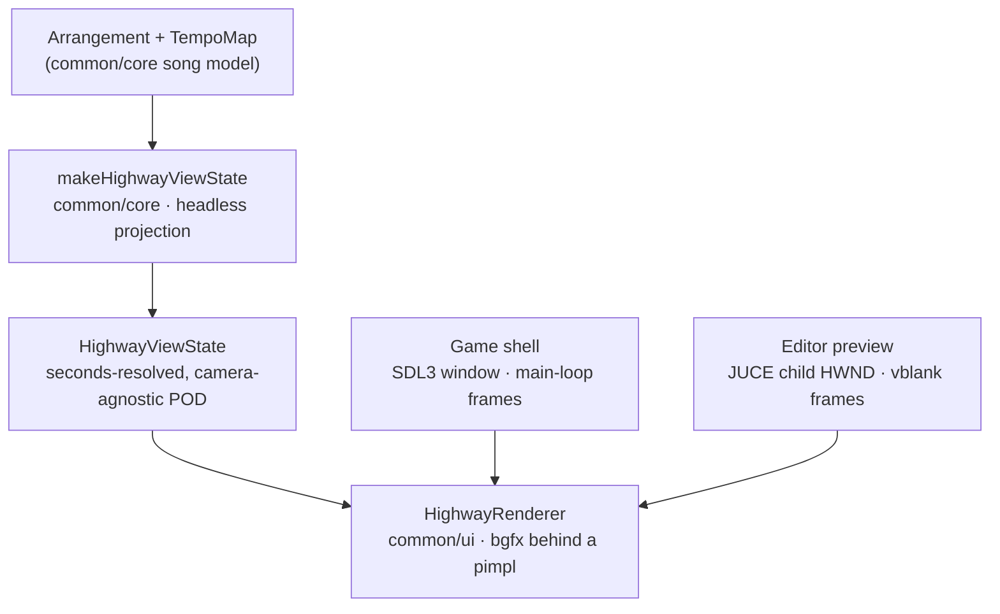

\page guide_3d_highway The 3D Note Highway

*Applies to: Repo-wide — one shared renderer, consumed by the game and by the editor's 3D
preview.*

The 3D note highway is the clearest example of deliberate code reuse in the repository: **the
game window and the editor's preview window draw with the same renderer, the same camera math,
and the same shaders.** Neither product has its own drawing code. This page explains the layers,
how the sharing actually works, and what to touch when extending the highway.

# The layers



Each layer has one job, and the boundaries are the reason the sharing works:

1. **Projection** (`rock-hero-common/core`, `highway/highway_projection.h`) — headless. It
   resolves every musical position through the tempo map into absolute seconds, once per chart
   load:

   ```cpp
   HighwayViewState makeHighwayViewState(const Arrangement& arrangement,
                                         const TempoMap& tempo_map,
                                         HighwayDisplayOptions options);
   ```

   The result is immutable and shared (`std::shared_ptr<const HighwayViewState>`); the camera
   and every drawer are pure functions of this state plus per-frame time. Because the projection
   and the camera math (`highway_camera.h`, `makeHighwayCameraTarget`, `makeHighwayWorldToClip`)
   live in `common/core`, they are tested headlessly — see `test_highway_projection.cpp` and
   `test_highway_camera.cpp` in `rock-hero-common/core/tests/`, no GPU required.

2. **Renderer** (`rock-hero-common/ui`, `highway/highway_renderer.h`) — owns all GPU work, and
   keeps bgfx out of its public header exactly the way `common/audio` keeps Tracktion out of
   `engine.h`. The header holds only `struct Impl; std::unique_ptr<Impl> m_impl;`; inputs cross
   the boundary as plain data:

   ```cpp
   struct HighwayShaderPair
   {
       std::vector<std::byte> vertex;
       std::vector<std::byte> fragment;
   };

   static std::expected<HighwayRenderer, HighwayRendererError>
       create(const HighwayShaderSet& shaders, const HighwayTextureSet& textures);
   void setViewState(common::core::HighwayViewState state);
   void draw(double now_seconds, double dt_seconds, std::uint32_t width, std::uint32_t height);
   ```

   The renderer never touches the filesystem — shaders and textures arrive as bytes, so each
   consumer decides where they load from. GPU handles are held in a move-only RAII wrapper
   (`bgfx_handle.h`, `UniqueBgfxHandle`) that must be destroyed before `bgfx::shutdown()`.

3. **Two shells** feed it frames. That is the entire product-specific surface.

# The game path

`rock-hero-game/ui` composes the stack in `RockHeroGame::onInit`
(`src/surface/rock_hero_game.cpp`): create the SDL3 `GameWindow`, hand its Win32 HWND to
`RenderDevice::create`, load shader bytes from the resource pack
(`highway_shader_loader.cpp`, `loadHighwayShaderSet`), then construct the shared renderer. The
frame loop is `SDL3Application::run()` — input, drained JUCE messages, one frame — and the draw
call is one line in `Game::render`:

```cpp
m_renderer.draw(m_frame_sample.song_time.seconds,
                static_cast<double>(m_frame_sample.frame_delta.count()) / 1.0e9,
                device.width(), device.height());
```

Song time comes from the playback-clock port's published snapshots — the frame loop never derives
time from wall clocks or frame counts (see "Time Must Be a Dependency" in
\ref design_architectural_principles).

# The editor preview path

The editor cannot give bgfx an SDL window, so `PreviewSurface`
(`rock-hero-editor/ui/src/preview/preview_surface.cpp`) creates a **native child HWND inside the
JUCE window's peer** and initializes the render device against that child. Frames are driven by a
`juce::VBlankAttachment` on the message thread instead of a main loop.

The lifecycle is the part worth understanding before touching it: **bgfx cannot be re-initialized
in the same process after shutdown**, so the device is created once on first open and deliberately
survives window hides. Closing the preview only suspends the vblank ticks (`suspend()`); real
teardown happens once, at destruction, in strict order — vblank, renderer (GPU handles), device
(`bgfx::shutdown`), child window.

State reaches the preview the same way the game gets it: editor core runs the *same*
`makeHighwayViewState` projection (memoized per displayed arrangement in `editor_controller.cpp`)
and `EditorView` pushes the resulting shared pointer into the preview window.

# The sharing mechanics, precisely

| Piece | Owner | Both consumers get it by |
|---|---|---|
| Projection + camera math | `rock_hero::common::core` | public dep of `common::ui` |
| Renderer, atlases, render device | `rock_hero::common::ui` | linking that target |
| String colors (Charter rules) | `common/ui` `string_color_palette.h` | renderer + 2D tab lane |
| Shader sources (five programs) | `rock-hero-common/ui/shaders/` | one CMake compile function |
| Shader staging | `rock_hero_stage_highway_shaders` | both call it to deploy |
| Shader *loading* | per product (game/editor loaders) | same byte-vector seam |

What differs per consumer is exactly what should differ: the window (SDL top-level vs JUCE child
HWND), the frame driver (main loop vs vblank ticks), device lifetime policy (process-long vs
survives-hides), and display options (the editor forces `invert_string_order` and a minimum
string count to match its 2D tab lane).

# Extending the highway — silent steps

Adding a new *visual element* (a new marker, lane decoration, feedback effect):

1. If it derives from chart/transport data, extend `HighwayViewState` and compute it in
   `makeHighwayViewState` — never derive musical data per-frame in the renderer.
2. Add the drawer in `highway_renderer.cpp`, consuming only the state plus per-frame time.
3. Extend the headless projection/camera tests; the renderer itself has GPU-free coverage via the
   Noop-backend tests (`test_render_device.cpp`).
4. Both products pick the change up with no further wiring — that is the payoff of the seam.

Adding a new *shader program* is wider, and every step is silent:

1. The `.sc` sources in `rock-hero-common/ui/shaders/`.
2. The program list inside `rock_hero_stage_highway_shaders` (`cmake/RockHeroRenderStack.cmake`).
3. A new `HighwayShaderPair` member in `HighwayShaderSet` (`highway_renderer.h`).
4. **Both** loaders: the game's `loadHighwayShaderSet` and the editor's
   `loadPreviewHighwayShaders` — forgetting one product compiles fine and fails at runtime in
   that product only.
5. Program linking + use in the renderer implementation.
