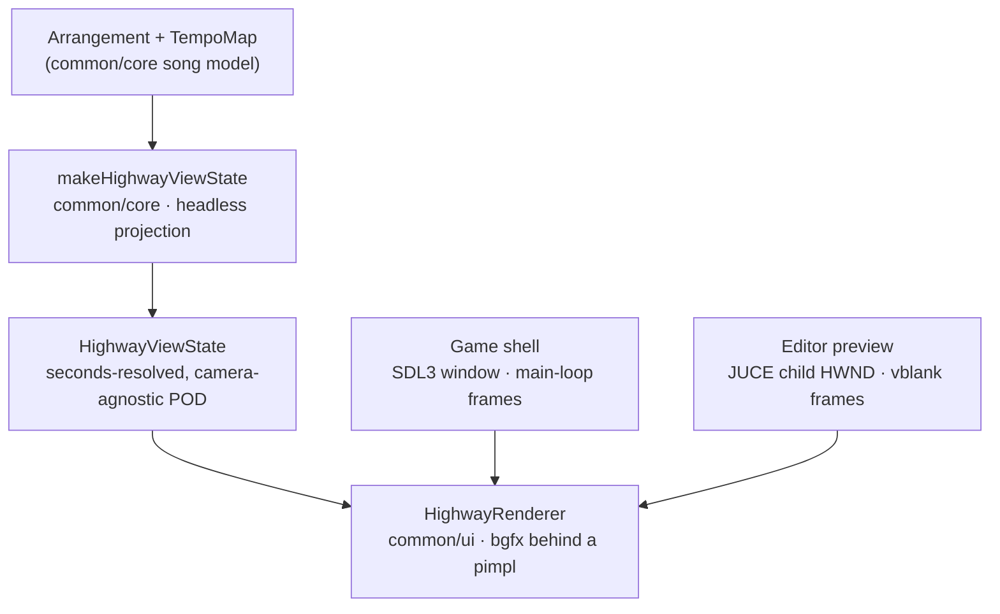

\page guide_3d_highway The 3D Note Highway

*Applies to: Repo-wide — one shared renderer, consumed by the game and by the editor's 3D
preview.*

The 3D note highway is the clearest example of deliberate code reuse in the repository: **the
game window and the editor's preview window draw with the same renderer, the same camera math,
and the same shaders.** Neither product has its own drawing code. This page explains the layers,
how the sharing actually works, and what to touch when extending the highway.

# The layers


```mermaid
flowchart TB
    chart["`Arrangement + TempoMap
    (common/core song model)`"]
    proj["`makeHighwayViewState
    common/core · headless projection`"]
    state["`HighwayViewState
    seconds-resolved, camera-agnostic POD`"]
    renderer["`HighwayRenderer
    common/ui · bgfx behind a pimpl`"]
    game["`Game shell
    SDL3 window · main-loop frames`"]
    preview["`Editor preview
    JUCE child HWND · vblank frames`"]
    chart --> proj --> state --> renderer
    game --> renderer
    preview --> renderer
```

Each layer has one job, and the boundaries are the reason the sharing works:

1. **Projection** (`rock-hero-common/core`, `highway/highway_projection.h`) — headless. It
   resolves every musical position through the tempo map into absolute seconds, once per chart
   load:

   ```cpp
   HighwayViewState makeHighwayViewState(const Arrangement& arrangement,
                                         const TempoMap& tempo_map,
                                         const std::vector<SongSection>& sections,
                                         HighwayDisplayOptions options);
   ```

   The result is immutable and shared (`std::shared_ptr<const HighwayViewState>`); the camera
   and every drawer are pure functions of this state plus per-frame time. Because the projection
   and the camera math (`highway_camera.h`, `makeHighwayCameraTarget`, `makeHighwayWorldToClip`)
   live in `common/core`, they are tested headlessly — see `test_highway_projection.cpp` and
   `test_highway_camera.cpp` in `rock-hero-common/core/tests/`, no GPU required.

2. **Renderer** (`rock-hero-common/ui`, `highway/highway_renderer.h`) — owns all GPU work, and
   keeps bgfx out of its public header exactly the way `common/audio` keeps Tracktion out of
   `engine.h`. The header holds only `struct Impl; std::unique_ptr<Impl> m_impl;`; inputs cross
   the boundary as plain data:

   ```cpp
   struct HighwayShaderPair
   {
       std::vector<std::byte> vertex;
       std::vector<std::byte> fragment;
   };

   // Both sets are arrays indexed by the shared name table's enumerators, so a program or asset
   // is declared once in common/core and neither product's loader enumerates them by hand.
   using HighwayShaderSet = std::array<HighwayShaderPair, g_highway_shader_programs.size()>;
   using HighwayTextureSet = std::array<std::vector<std::byte>, g_highway_textures.size()>;

   static std::expected<HighwayRenderer, HighwayRendererError>
       create(const HighwayShaderSet& shaders, const HighwayTextureSet& textures);
   void setViewState(common::core::HighwayViewState state);
   void draw(double now_seconds, double dt_seconds, std::uint32_t width, std::uint32_t height);
   ```

   The renderer never touches the filesystem — shaders and textures arrive as bytes, so each
   consumer decides where they load from. What each program and asset *is*, and the file name it
   deploys as, lives in `common/core` (`highway/highway_resources.h`) rather than beside the
   renderer, because the game resolves resource paths in `game/core`, which is headless and must
   not depend on `common/ui`. GPU handles are held in a move-only RAII wrapper
   (`bgfx_handle.h`, `UniqueBgfxHandle`) that must be destroyed before `bgfx::shutdown()`.

   Nothing inside the draw pass is reachable from a test, so a decision the pass makes more than
   once belongs in a small pure unit beside it instead. `highway_head_marks.h` is the pattern:
   which atlas cell a head's connection mark uses (`highwayLegatoCell`), whether the head takes
   the darker technique base (`highwayTechHead`), and whether the board calls the note a harmonic
   at all (`highwayHarmonicMark`, read by the head's cell AND by the floor's harmonic light, so a
   mark and a light cannot disagree), all covered by
   `test_highway_head_marks.cpp`. Two more sit beside it, and between them they hold every rule a
   floor mark and the tail above it have to agree on:

   - `highway_floor_geometry.h` — `highwayVisibleSpan` is the single clamp a drawn span obeys (from
     the later of the onset and the hit line to the earlier of its own end and the horizon, empty
     when those cross), and `highwayFloorFootprint` is where a mark under one note lies on the fret
     axis and how wide (the note's anchor, or the hand window inset by the open-tail margin).
   - `highway_slide_path.h` — `highwayNoteFretboardX` and `highwaySlideStateAt`, the fret axis and
     the glide, below.

   Reach for that shape whenever a draw-path branch is a *rule* rather than geometry.

3. **Two shells** feed it frames. That is the entire product-specific surface.

# The game path

`rock-hero-game/ui` composes the stack in `RockHeroGame::onInit`
(`src/surface/rock_hero_game.cpp`): create the SDL3 `GameWindow`, hand its Win32 HWND to
`RenderDevice::create`, load shader bytes from the resource pack
(`highway_shader_loader.cpp`, `loadHighwayShaderSet`), then construct the shared renderer. The
frame loop is `SDL3Application::run()` — input, drained JUCE messages, one frame — and the draw
call is one line in `Game::render`:

```cpp
m_renderer.draw(m_frame_sample.song_time.seconds,
                static_cast<double>(m_frame_sample.frame_delta.count()) / 1.0e9,
                device.width(), device.height());
```

Song time comes from the playback-clock port's published snapshots — the frame loop never derives
time from wall clocks or frame counts (see "Time Must Be a Dependency" in
\ref design_architectural_principles).

# The editor preview path

The editor cannot give bgfx an SDL window, so `PreviewSurface`
(`rock-hero-editor/ui/src/preview/preview_surface.cpp`) creates a **native child HWND inside the
JUCE window's peer** and initializes the render device against that child. Frames are driven by a
`juce::VBlankAttachment` on the message thread instead of a main loop.

The lifecycle is the part worth understanding before touching it: **bgfx cannot be re-initialized
in the same process after shutdown**, so the device is created once on first open and deliberately
survives window hides. Closing the preview only suspends the vblank ticks (`suspend()`); real
teardown happens once, at destruction, in strict order — vblank, renderer (GPU handles), device
(`bgfx::shutdown`), child window. The corollary bites the failure path: a renderer bring-up
failure (a stale or partial shader deploy) must **not** tear the device down, or the next open
re-enters bring-up and hits the `renderFrame`-before-`init` assert bgfx cannot survive. So
`bringUpRenderer()` keeps the device and child window alive on failure — the preview shows the
black fallback — and retries only the renderer on a later open, which never re-initializes bgfx.

Per-frame song time comes from `PreviewTimeModel`
(`rock-hero-editor/ui/src/preview/preview_time_model.{h,cpp}`), a small headless, injected-time
policy `PreviewSurface` owns: plan-12 extrapolation while playing, an exponential glide toward the
marker target (armed caret, else transport position) while paused, with a snap on first frame and
on resume after a hidden gap. It is extracted from the vblank callback precisely so that timing
policy is unit-tested (`test_preview_time_model.cpp`) rather than welded to the GPU frame path;
edit preview timing there, not in `renderFrame`.

State reaches the preview the same way the game gets it: editor core runs the *same*
`makeHighwayViewState` projection (memoized per displayed arrangement in `editor_controller.cpp`)
and `EditorView` pushes the resulting shared pointer into the preview window.

# The sharing mechanics, precisely

| Piece | Owner | Both consumers get it by |
|---|---|---|
| Projection + camera math | `rock_hero::common::core` | public dep of `common::ui` |
| Renderer, atlases, render device | `rock_hero::common::ui` | linking that target |
| String colors (Charter rules) | `common/ui` `string_color_palette.h` | renderer + 2D tab lane |
| Shader sources (seven programs) | `rock-hero-common/ui/shaders/` | one CMake compile function |
| Shader staging | `rock_hero_stage_highway_shaders` | both call it to deploy |
| Resource deploy + install | `rock_hero_deploy_product_resources` | both call it per executable |
| Program + texture name table | `common/core` `highway_resources.h` | both loaders walk it |
| Shader *loading* | per product (game/editor loaders) | same byte-vector seam |

What differs per consumer is exactly what should differ: the window (SDL top-level vs JUCE child
HWND), the frame driver (main loop vs vblank ticks), device lifetime policy (process-long vs
survives-hides), and display options (the editor forces `invert_string_order` and a minimum
string count to match its 2D tab lane).

# The fretboard axis: one function, and a deliberate stop/node split

Where a STOPPED note sits on the board's fret axis is decided by exactly one function,
`highwayNoteFretboardX(note, fret_at_point, metrics, mirrored)` in `highway_slide_path.h`, and
every point of a stopped gesture reads it — the head, the tail band's base, each glide station,
and the actual-ring floor mark. (A fret-0 note takes the open-string bar treatment across the hand
window instead and never asks it.) The stop is a parameter because one gesture sounds from more
than one of them: the onset from the note's own fret, a slide from each fret it travels to.

Where the gesture has TRAVELLED to at an instant is the companion in the same header,
`highwaySlideStateAt(note, base_x, metrics, mirrored, seconds)`: the eased offset from that anchor
(pitched and unpitched glides ease differently) plus the unpitched release's alpha dim, holding
the last target past the last STOP. Stop and not keyframe: the gesture is read as one uniform
sequence — the note's position keyframes, then its falls-away terminal — through
`glideStopCount` / `glideStopAt` in `chart_view_state.h`, so the terminal is a segment here
without being one more entry in `NoteViewState::slides`. Both were inline in `draw()` until the
floor light needed
them — the glide as a lambda declared after every floor pass, which is precisely what made a floor
mark unable to follow a slide — and out here they carry `test_highway_slide_path.cpp`.
`highwayGlideSliceCount` rides along as the one density policy every glide-following mark
subdivides an eased segment by, so a scrape cannot facet under one mark while staying smooth under
another.

A harmonic's node *rides* its stop — fret spacing is logarithmic, so the node's offset above the
stop is constant in fret units and a glide that moves the stop moves the node by the same amount —
which is why passing `note.fret` gives the onset's anchor with a zero shift. This is the same rule
2D labels heads by (`tabNoteHeadText`), with one deliberate 3D-only addition: the board clamp
(`highwayDrawnSoundingPosition`) holds a node at the drawn board's edge, which the 2D label does
not apply — the decided asymmetry roadmap 57 tracks.
So the two surfaces cannot disagree about what a glide arrives at, only about where a
past-the-board node is shown.

The split worth stating plainly: **the note sounds from its node while the board's own furniture
stays on the stop.** A pinch is the exception in the other direction: its node belongs to the
picking hand, so the fretting hand stays on the stop and the ordinary fret slot is returned (that
node still awaits its own right-hand cue, 25-Q5).

The fret-span line under a note used to be furniture in exactly that sense — it took `fretFor`,
the slot *containing* the node. **It no longer does for a harmonic** (user sighting 2026-08-30):
the line now rides `harmonicMarkFootprint`, the same centre and width the harmonic node light
takes, so the two marks under one note cannot state two different places. The line's ends dissolve
there over the open-string bar's own end-fade (`openBarFadeLength`, through
`pushTaperedFloorQuad`), because a node-centred line no longer stops on the fret wires that gave a
slot line its flat ends. Every other note keeps the wire-to-wire slot line, ends included: there
the ends *are* the wires.

The capo is drawn too: the face from the nut to the capo's fret line dims (those frets do not exist
to play, and an absolute-fret chart is unreadable without seeing where its floor sits) and the clamp
draws as a rimmed steel bar hugging the nut side of its line. Crude first treatment, flat quads and
no art (roadmap 25-Q6). No displayed fret *number* is offset by the capo, on either surface.

Head marks arrive as atlas overlay cells seated on the head quad, not as silhouettes: a harmonic
cell, a pinch cell, and a split-plectrum cell for a scrape (which also suppresses the full-mute X
beneath it, whose core showed through the fracture and read as a second mark). 2D expresses the same
distinctions as actual head *shapes* — see the head-shape rule in \ref guide_2d_views. Per-surface
idiom for one fact is fine; the two must never carry *different* facts. One known gap against that
law: the open-string bar carries no harmonic or pinch cell, while 2D gives a fret-0 harmonic its
diamond and node — tracked with the note-view unification watch item rather than papered over.

The **connection mark** obeys the same division. No direction is stored in the chart, so the cell a
hammer-on or pull-off gets comes from the note's RESOLVED `LegatoMotion` (`NoteViewState::legato`,
from the shared `chartResolutions` pass), the identical value the 2D triangle points itself by — one
authority, two idioms, and a claim the chart cannot justify draws like the plain pick it sounds like
on both surfaces.

The **span-implied hold** is the board's alone, which is worth knowing before touching either
surface. `ChartViewState::display_hold_ends` is resolved from the `chartHolds` authority and rides
the projection both surfaces read, but only the highway spends it: for a strum a hand-shape span
holds it draws no tail and instead **pins the head at the hit line** until the hold ends. The 2D
lane draws every tail to the note's own presented end and nothing further, so those chugs wear bare
heads there — the span's own rails already state how long the posture is fretted, and a ribbon
repeating that read as sustain (ruled 2026-08-22,
`docs/plans/in-progress/note-sustain-model.md` ruling 3). Per-surface idiom for one fact again: one
hold, a pinned head here and a chord box there. The hold runs to the SPAN's end and the note's own
ring does not cut it short: a ring shorter than the span was cut by the player's own re-strike, and
re-striking a string does not let the shape go. That is what keeps a **repeat-box run** readable
— the run's first strum shows its heads, every box after it draws none, and the pinned heads go
on standing at the fretboard underneath the boxes for the whole run, exactly as a plain chord
box's duration keeps them. The renderer clamps the pin with
`HighwayChordGroupViewState::hold_cap_seconds`, the next note-showing strum's onset, because a
re-shown chord takes over the pinned display — and that clamp is the ONLY hand-off, which is why it
is worded around a strum that shows its notes rather than around any later onset: a successor that
draws no head of its own has nothing to take over with. That clamp is board-only presentation with
no 2D counterpart to diverge from.

**Which box a strum draws is the projection's answer, never the renderer's**
(`HighwayChordGroupViewState::box_treatment`, one of None / Full / Repeat). **A BOX MARKS
SIMULTANEITY** (user ruling 2026-08-29): any two-or-more-string strike wears one, inside a span and
outside one alike, and it is THE STANDARD CHORD BOX in every case — a partial restrike inside an
arpeggio span included (Q2, ruled 2026-08-30). A box scoped to just the strings that restrike was
considered and rejected: it "would probably look ugly", and it would be restating context the figure
already carries, since the span's own borders and the brackets standing on the fretboard are what
say this is an arpeggio. A single note wears none, and that is the only `None` left. Whether the box
is FULL or the headless REPEAT is one
comparison: **the onset immediately before it, within the same span, with no onset of any kind
between, striking the same strings at the same frets.** The PROFILE is free (ruled the same day), so
a plain chord's first dead chug is an X'd REPEAT box wearing its own mark rather than a re-head, and
a profile the box cannot draw is caught by the display-capability gate instead — the one rule here
that is about drawing rather than about the music. Every re-head is that one comparison rather than
a case of its own: silence re-heads because a rest ends the statement and a span boundary breaks the
run (a ring that does not run to the next chord IS a rest, and a rest is the hand free to lift and
mute), a fresh grip re-heads because it is a fresh span, an interleaved onset of any kind re-heads,
and a partial strike after a full chord re-heads because it is not the same notes.
`makeHighwayChordGroups` derives all of it once per chart revision, because the answer depends on
the whole song's hand-shape spans and not on whatever window a frame happens to show. It used to
walk the note stream BACKWARD for a run to anchor a chain on, skipping past dead runs and single
notes to reach one however far away; that walk was the display re-deriving where a statement begins
and ending up disagreeing with the derivation that already knew, and it is gone.

**Every question the treatment answers is asked of the FRETTING HAND's members alone** (the
right-hand exclusion sweep, 2026-08-30): the two-or-more count that makes a group a strum, the frets
the repeat identity compares, the mute and emphasis unanimities, and the display-capability gate's
scans for tails and for marks. A silently-held stop sounds nothing and a right-hand onset is the
other hand, so neither is part of the strike a box speaks for, and reading them anyway produced two
wrong figures. A tap over two identical chugs put its own fret into the identity, which made the two
onsets DIFFERENT and re-headed a run that had not changed; and a group of nothing but taps compared
identical to its neighbour and drew a headless repeat box for a strum nobody played. The one retreat
that survives the sweep is not a special case but a consequence of comparing string sets exactly: a
tap that REPLACES a chord member shrinks the fretting set, so that onset really is a different onset
and wears its own full box.

**Every consumer of "is there a box here" reads the published answer, and there are TWO producers
of it.** `box_treatment` is the strum's own, and `HighwayChordGroupViewState::arpeggio_mark` is the
other: true where an arpeggio span's opening mark draws at this onset, published by
`makeHighwayChordGroups` where the covering span is already in hand. The plain box, the arpeggio
box's emphasis inheritance and the strike glow all defer to a box and would light both marks, or
neither, wherever a second reading disagreed — and the glow is why the second producer had to be
published at all. It lights a boxed cluster's window EDGES instead of its per-fret lines, and while
it read `box_treatment` alone a lone note under a bracket lit its fret lines straight through the
mark already standing over them. The question is answered in the projection rather than off whatever
boxes a frame happened to build, because a renderer's box list is clamped to the visible board while
the glow reads clusters that have already crossed the hit line — exactly the onsets such a list is
silent about.

**An arpeggio span's mark draws at `ShapeViewState::bracket_seconds`, not at its start.** The
derivation publishes that anchor per span (`ChartShape::bracket_position`) rather than leaving each
surface to re-scan for it: a span an EVENT states carries its own start, since that is where the
statement was made, and a rule 11b landing successor carries its first interior sounding instead,
because nothing is struck at a landing and the ink follows the sound. The projection consults it
only where a bracket actually draws — an arpeggio-class span — so a box-class span publishes no
`bracket_seconds` at all, which is now the ordinary disposition of a successor rather than a corner
case: a landing is not a sounding, so a successor classifies by the ordinary triggers found inside
it, and a chord sliding into chords is box class at both ends. One that never sounds interiorly
draws no furniture whatever — no bracket, and no box either, since nothing strikes it. Both the box
pass and the bracket glyphs read the published instant, and so does the 2D lane.

# The three floor lights, and the one thing they share

Three passes light the board's floor, all at `g_floor_light_y` (the floor itself is always y = 0 —
content is raised off it), all through the **same** program and the same per-fragment soft x edges
(`fs_window_light`, `g_window_light_falloff`), all alpha-blended rather than additive. That last
point matters when two of them cover one place: they composite in submission order, so two lights
at one position cannot sum toward white the way the additive accent batch's halos do.

- **`drawHandWindowLight`** — the fretting hand's backlight, the window sliding over the board.
  Per-slice brightness lives in one field, `WindowLightSlice::dim`, and TWO things dim it, both
  resolved by `min`: the motion dim across a placement's morph, and the **silence fade**.
- **`drawTappingHandLight`** — one patch per picking-hand onset over the fret SLOTS it presses,
  leaning toward the FHP orange so the two hands read apart.
- **`drawHarmonicNodeLight`** — a light under every note whose harmonic node lies on the neck,
  marking the touch that makes the figure a harmonic. Deliberately NOT white: white is the picking
  hand's by signed convention, and this is the other hand's act.

The **silence fade** is the rule that no left-hand information for a QUARTER NOTE or more puts the
backlight out (re-ruled down from one measure on 2026-08-30, to be sighted at the far more
aggressive length: spaced staccato figures now fade and return constantly, which is the point of
the sighting). What counts is closed: every note whose onset the fretting hand owns, for as long as
it rings — fretted, open-string, dead, LeftTap, silently held alike — plus every hand-posture span
in force. A pick scrape is excluded outright (the light may fade through one); whether a picking-hand
tap counts is the sighting switch `g_backlight_taps_keep_light`. Fret-hand *placements* are not
information: a placement persists through silence, so counting one would defeat the rule.

The rests are derived in the **projection** (`HighwayViewState::backlight_rests`), not the renderer,
because both quantities a rest carries are musical: the quarter note at the local meter that sets
the threshold, and `marginBefore` — the ONE arrival lead the hand's own morph and the picking hand's
light rise already share — which the fade takes at both ends, so the light returns leading its next
statement exactly the way the window leads a landing. The per-sample query
(`highwayBacklightBrightness`) borrows the strike glow's envelope (`highwayHitGlowIntensity`) as its
curve, so both hands' lights dissolve with one shape. A rest with no return carries an infinite end
and needs no case of its own.

The harmonic light differs from the tapping light in exactly one thing, and the difference is the
fretboard axis again: the tapping light lights a fret SLOT, because that is where a tapping finger
presses, while the harmonic light takes the NOTE's own footprint centred on the drawn node and
carried by `highwaySlideStateAt`. A slot would put its edge under a between-fret node. That
footprint is `harmonicMarkFootprint`, and it is shared rather than private: the fret-span line
under the light reads the same one, so the line lands on the light. Which notes are harmonics is
`highwayHarmonicMark` — the same predicate the head's harmonic cell reads, so a lit floor and a
marked head cannot disagree. A pinch is absent by construction (its node is over the
body, so the neck has nowhere to light it) and a scrape by exclusion (its node is an in-memory
latent, not a touch).

Both lights' soft ends take `g_floor_light_release_seconds`, named for the plane rather than for a
hand because two lights now share it. The harmonic light takes it at BOTH ends: a fretting finger is
already standing on its node and needs no margin-led approach the way a travelling tap does.

Neither light adds a FACT the 2D lane would have to answer, which is why neither needed a tab-side
change. The harmonic light restates on the floor what the 2D lane already says with the diamond head
and the node number — per-surface idiom for one fact, the ordinary case. The silence fade is about
the hand WINDOW, which is board-only furniture: 2D draws fret-hand placements as static arrival
markers, not as a lit region, so there is nothing there to go out.

# Two visual paths: chart visuals and screen-space overlays

Before extending anything, pick the right path — they do not share a checklist:

- **Chart visuals** (notes, lanes, markers — anything in world space derived from chart or
  transport data) go through the projection → `HighwayViewState` → renderer-drawer path below.
- **Screen-space overlays** (HUD, menus, the diagnostics frame graph) never touch view state or
  the projection: they are pixel-space `HighwayOverlayRect` lists fed to
  `HighwayRenderer::drawOverlayRects` (`highway_renderer.h`), with text via the device's debug
  text. `DiagnosticsOverlay` (`game/ui/src/overlay/`) is the HUD exemplar — record data during
  the frame, `buildRects()`, draw. The game's menu bar renders the same way. Extending
  `HighwayViewState` for a HUD element is the wrong path.
A **world-space diagnostic** — a mark lying on the board that a viewer switches on to look at
something, rather than part of what the chart says — was built once as a third path and removed on
2026-08-23 (`docs/plans/in-progress/note-sustain-model.md`, stage D): a per-note floor mark for the
ring a short note really sounds for, which the sighting found adds clutter and not information. Two
things it established are worth keeping if the shape is ever wanted again. The overlay path cannot
express one at all — `HighwayOverlayRect` is axis-aligned pixels, and a mark on a perspective floor
is a trapezoid that moves every frame — so it has to draw in the ordinary drawer path. And its
switch must NOT be a `HighwayDisplayOptions` field: those ride the memoized `HighwayViewState`, so a
toggle pressed to look at the board would re-project the chart it is looking at. It belongs on a
draw-time setter of the renderer's own, with the game kept out by composition (an editor-only
caller) rather than by a build define — compiling diagnostics out of shipped builds was ruled
against long ago (plan 20 open question 5, answer A: release-build timing bugs have to stay
observable).

# Extending the highway — silent steps

Adding a new *visual element* (a new marker, lane decoration, feedback effect):

1. If it derives from chart/transport data, extend `HighwayViewState` and compute it in
   `makeHighwayViewState` — never derive musical data per-frame in the renderer.
2. Add the drawer in `highway_renderer.cpp`, consuming only the state plus per-frame time. Board
   furniture — anything that builds one batch and submits it — goes in as its own private
   `drawXxx(const FrameContext&)` member (no parameter at all when nothing frame-scope is read),
   called from `draw()` at the point in painter order where it must paint: the board view is
   sequential and writes no depth, so submission order *is* the layering. Take only per-FRAME
   facts from `FrameContext`; per-state ones — the metrics, the view state, the scroll speed, the
   face extent, the scratch buffers — the pass reads from the renderer, because it is an `Impl`
   member like any other. Set every uniform and texture bind the pass draws with inside it —
   bgfx state is ambient until the next submit, so a pass that leans on a neighbour having set
   one breaks the moment the neighbour moves. (Note content is different: it interleaves through
   shared batches and a deferred flush, and still schedules inside `draw()` itself.)
3. Extend the headless projection/camera tests — they are where a drawer's *decisions* are pinned.
   The renderer itself has only a GPU-free crash net: `test_highway_renderer_smoke.cpp` creates it
   against bgfx's Noop backend and encodes a few hundred frames across real view states, so a new
   pass that reads past a vector, submits with a stale handle, or trips one of bgfx's own asserts
   fails there. It cannot see draw counts, batch counts, paint order, or pixels — Noop reports no
   statistics at all — so it never substitutes for a headless test of what the pass decided, nor
   for looking at the board.
4. Both products pick the change up with no further wiring — that is the payoff of the seam.
5. **Answer the 2D lane in the same change.** The two surfaces must not diverge: never add highway
   notation the 2D tab cannot show, or 2D notation the highway cannot. If the element states a
   *fact* about a note, the tab needs its own idiom for that fact — the idioms may differ (a 3D
   atlas overlay against a 2D head silhouette; a 3D capo bar against a 2D capo chip) but the set of
   facts stated may not. Where the answer is genuinely per-surface — 2D has no fretboard axis, so a
   node has nowhere to sit there and becomes a *number* instead — say so where the element is
   documented, so a later reader can tell a decided asymmetry from a forgotten one.

If the element is *textured*, the asset lives in one table and the fan-out is short:

1. Drop the PNG in `rock-hero-common/ui/resources/textures` and add a `HighwayTexture` enumerator
   plus its file name to `highwayTextureFileName` — both in
   `common/core/.../highway/highway_resources.h`. That is the whole asset declaration: both
   products' loaders walk `g_highway_textures`, and `HighwayTextureSet` is an array indexed by
   `indexOf(HighwayTexture)`, so neither loader needs an edit.
2. Use the bytes in the renderer (`textures.at(indexOf(HighwayTexture::…))`). Every texture is
   REQUIRED content: a missing or invalid one fails `HighwayRenderer::create` with a typed
   `TextureAssetInvalid` error.
3. Nothing in CMake. Both products deploy the whole shared texture tree through
   `rock_hero_deploy_product_resources` — see the deploy contract in \ref guide_game.

Adding a new *shader program* is two declarations plus its use:

1. The `.sc` sources in `rock-hero-common/ui/shaders/` (the `vs_`/`fs_` naming and the shared
   `varying.def.sc` are load-bearing: `rock_hero_stage_highway_shaders` derives the program list by
   globbing `vs_*.sc`, so a source drop is the CMake side of the change — there is no list to edit).
2. A `HighwayShaderProgram` enumerator plus its base name in `highwayShaderProgramName`
   (`common/core/.../highway/highway_resources.h`), and a row in `g_highway_shader_programs`. Both
   loaders — the game's `loadHighwayShaderSet` and the editor's `loadPreviewHighwayShaders` — walk
   that table, so they need no edit and cannot disagree.
3. Program use in the renderer implementation: `HighwayRenderer::create` links every program in the
   table, so add the named `Impl` handle it lands in and draw with it.

The one thing still stated twice is the *base name*: it names the `.sc` sources on disk and the
compiled `vs_`/`fs_` binaries the enumerator's name resolves to. A mismatch fails loudly at load —
the game path with a typed error naming the missing file; the editor preview's loader reports
through its own result type — which is the reason the names are allowed to live in two languages.
