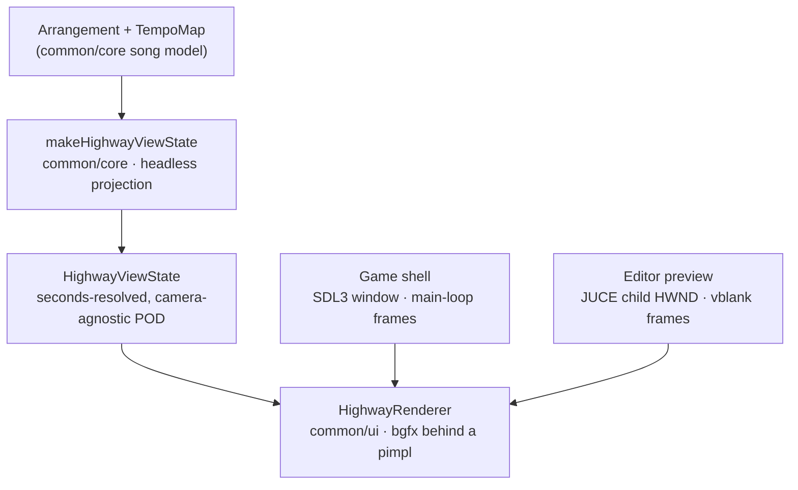

\page guide_3d_highway The 3D Note Highway

*Applies to: Repo-wide — one shared renderer, consumed by the game and by the editor's 3D
preview.*

The 3D note highway is the clearest example of deliberate code reuse in the repository: **the
game window and the editor's preview window draw with the same renderer, the same camera math,
and the same shaders.** Neither product has its own drawing code. This page explains the layers,
how the sharing actually works, and what to touch when extending the highway.

# The layers


```mermaid
flowchart TB
    chart["`Arrangement + TempoMap
    (common/core song model)`"]
    proj["`makeHighwayViewState
    common/core · headless projection`"]
    state["`HighwayViewState
    seconds-resolved, camera-agnostic POD`"]
    renderer["`HighwayRenderer
    common/ui · bgfx behind a pimpl`"]
    game["`Game shell
    SDL3 window · main-loop frames`"]
    preview["`Editor preview
    JUCE child HWND · vblank frames`"]
    chart --> proj --> state --> renderer
    game --> renderer
    preview --> renderer
```

Each layer has one job, and the boundaries are the reason the sharing works:

1. **Projection** (`rock-hero-common/core`, `highway/highway_projection.h`) — headless. It
   resolves every musical position through the tempo map into absolute seconds, once per chart
   load:

   ```cpp
   HighwayViewState makeHighwayViewState(const Arrangement& arrangement,
                                         const TempoMap& tempo_map,
                                         const std::vector<SongSection>& sections,
                                         HighwayDisplayOptions options);
   ```

   The result is immutable and shared (`std::shared_ptr<const HighwayViewState>`); the camera
   and every drawer are pure functions of this state plus per-frame time. Because the projection
   and the camera math (`highway_camera.h`, `makeHighwayCameraTarget`, `makeHighwayWorldToClip`)
   live in `common/core`, they are tested headlessly — see `test_highway_projection.cpp` and
   `test_highway_camera.cpp` in `rock-hero-common/core/tests/`, no GPU required.

2. **Renderer** (`rock-hero-common/ui`, `highway/highway_renderer.h`) — owns all GPU work, and
   keeps bgfx out of its public header exactly the way `common/audio` keeps Tracktion out of
   `engine.h`. The header holds only `struct Impl; std::unique_ptr<Impl> m_impl;`; inputs cross
   the boundary as plain data:

   ```cpp
   struct HighwayShaderPair
   {
       std::vector<std::byte> vertex;
       std::vector<std::byte> fragment;
   };

   // Both sets are arrays indexed by the shared name table's enumerators, so a program or asset
   // is declared once in common/core and neither product's loader enumerates them by hand.
   using HighwayShaderSet = std::array<HighwayShaderPair, g_highway_shader_programs.size()>;
   using HighwayTextureSet = std::array<std::vector<std::byte>, g_highway_textures.size()>;

   static std::expected<HighwayRenderer, HighwayRendererError>
       create(const HighwayShaderSet& shaders, const HighwayTextureSet& textures);
   void setViewState(common::core::HighwayViewState state);
   void draw(double now_seconds, double dt_seconds, std::uint32_t width, std::uint32_t height);
   ```

   The renderer never touches the filesystem — shaders and textures arrive as bytes, so each
   consumer decides where they load from. What each program and asset *is*, and the file name it
   deploys as, lives in `common/core` (`highway/highway_resources.h`) rather than beside the
   renderer, because the game resolves resource paths in `game/core`, which is headless and must
   not depend on `common/ui`. GPU handles are held in a move-only RAII wrapper
   (`bgfx_handle.h`, `UniqueBgfxHandle`) that must be destroyed before `bgfx::shutdown()`.

   Nothing inside the draw pass is reachable from a test, so a decision the pass makes more than
   once belongs in a small pure unit beside it instead. `highway_head_marks.h` is the pattern:
   which atlas cell a head's connection mark uses (`highwayLegatoCell`) and whether the head takes
   the darker technique base (`highwayTechHead`), both `constexpr`, both covered by
   `test_highway_head_marks.cpp`. Reach for that shape whenever a draw-path branch is a *rule*
   rather than geometry.

3. **Two shells** feed it frames. That is the entire product-specific surface.

# The game path

`rock-hero-game/ui` composes the stack in `RockHeroGame::onInit`
(`src/surface/rock_hero_game.cpp`): create the SDL3 `GameWindow`, hand its Win32 HWND to
`RenderDevice::create`, load shader bytes from the resource pack
(`highway_shader_loader.cpp`, `loadHighwayShaderSet`), then construct the shared renderer. The
frame loop is `SDL3Application::run()` — input, drained JUCE messages, one frame — and the draw
call is one line in `Game::render`:

```cpp
m_renderer.draw(m_frame_sample.song_time.seconds,
                static_cast<double>(m_frame_sample.frame_delta.count()) / 1.0e9,
                device.width(), device.height());
```

Song time comes from the playback-clock port's published snapshots — the frame loop never derives
time from wall clocks or frame counts (see "Time Must Be a Dependency" in
\ref design_architectural_principles).

# The editor preview path

The editor cannot give bgfx an SDL window, so `PreviewSurface`
(`rock-hero-editor/ui/src/preview/preview_surface.cpp`) creates a **native child HWND inside the
JUCE window's peer** and initializes the render device against that child. Frames are driven by a
`juce::VBlankAttachment` on the message thread instead of a main loop.

The lifecycle is the part worth understanding before touching it: **bgfx cannot be re-initialized
in the same process after shutdown**, so the device is created once on first open and deliberately
survives window hides. Closing the preview only suspends the vblank ticks (`suspend()`); real
teardown happens once, at destruction, in strict order — vblank, renderer (GPU handles), device
(`bgfx::shutdown`), child window. The corollary bites the failure path: a renderer bring-up
failure (a stale or partial shader deploy) must **not** tear the device down, or the next open
re-enters bring-up and hits the `renderFrame`-before-`init` assert bgfx cannot survive. So
`bringUpRenderer()` keeps the device and child window alive on failure — the preview shows the
black fallback — and retries only the renderer on a later open, which never re-initializes bgfx.

Per-frame song time comes from `PreviewTimeModel`
(`rock-hero-editor/ui/src/preview/preview_time_model.{h,cpp}`), a small headless, injected-time
policy `PreviewSurface` owns: plan-12 extrapolation while playing, an exponential glide toward the
marker target (armed caret, else transport position) while paused, with a snap on first frame and
on resume after a hidden gap. It is extracted from the vblank callback precisely so that timing
policy is unit-tested (`test_preview_time_model.cpp`) rather than welded to the GPU frame path;
edit preview timing there, not in `renderFrame`.

State reaches the preview the same way the game gets it: editor core runs the *same*
`makeHighwayViewState` projection (memoized per displayed arrangement in `editor_controller.cpp`)
and `EditorView` pushes the resulting shared pointer into the preview window.

# The sharing mechanics, precisely

| Piece | Owner | Both consumers get it by |
|---|---|---|
| Projection + camera math | `rock_hero::common::core` | public dep of `common::ui` |
| Renderer, atlases, render device | `rock_hero::common::ui` | linking that target |
| String colors (Charter rules) | `common/ui` `string_color_palette.h` | renderer + 2D tab lane |
| Shader sources (seven programs) | `rock-hero-common/ui/shaders/` | one CMake compile function |
| Shader staging | `rock_hero_stage_highway_shaders` | both call it to deploy |
| Resource deploy + install | `rock_hero_deploy_product_resources` | both call it per executable |
| Program + texture name table | `common/core` `highway_resources.h` | both loaders walk it |
| Shader *loading* | per product (game/editor loaders) | same byte-vector seam |

What differs per consumer is exactly what should differ: the window (SDL top-level vs JUCE child
HWND), the frame driver (main loop vs vblank ticks), device lifetime policy (process-long vs
survives-hides), and display options (the editor forces `invert_string_order` and a minimum
string count to match its 2D tab lane).

# The fretboard axis: one function, and a deliberate stop/node split

Where a STOPPED note sits on the board's fret axis is decided by exactly one function in the
renderer, `noteFretboardX(note, fret_at_point, metrics, mirrored)`, and every point of a stopped
gesture reads it — the head, the tail band's base, and each glide station. (A fret-0 note takes
the open-string bar treatment across the hand window instead and never asks it.) The stop is a
parameter because one gesture sounds from more than one of them: the onset from the note's own
fret, a slide from each fret it travels to. A harmonic's node *rides* its stop — fret spacing is
logarithmic, so the node's offset above the stop is constant in fret units and a glide that moves
the stop moves the node by the same amount — which is why passing `note.fret` gives the onset's
anchor with a zero shift. This is the same rule 2D labels heads by (`tabNoteHeadText`), with one
deliberate 3D-only addition: the board clamp (`highwayDrawnSoundingPosition`) holds a node at the
drawn board's edge, which the 2D label does not apply — the decided asymmetry roadmap 57 tracks.
So the two surfaces cannot disagree about what a glide arrives at, only about where a
past-the-board node is shown.

The split worth stating plainly: **the note sounds from its node while the board's own furniture
stays on the stop.** On an artificial harmonic the hand presses at `fret` while the sound comes from
a node a dozen-or-so frets up, and both facts are drawn — the head moves onto the node, the
fret-span line marks the pressed slot. A pinch is the exception in the other direction: its node
belongs to the picking hand, so the fretting hand stays on the stop and the ordinary fret slot is
returned (that node still awaits its own right-hand cue, 25-Q5).

The capo is drawn too: the face from the nut to the capo's fret line dims (those frets do not exist
to play, and an absolute-fret chart is unreadable without seeing where its floor sits) and the clamp
draws as a rimmed steel bar hugging the nut side of its line. Crude first treatment, flat quads and
no art (roadmap 25-Q6). No displayed fret *number* is offset by the capo, on either surface.

Head marks arrive as atlas overlay cells seated on the head quad, not as silhouettes: a harmonic
cell, a pinch cell, and a split-plectrum cell for a scrape (which also suppresses the full-mute X
beneath it, whose core showed through the fracture and read as a second mark). 2D expresses the same
distinctions as actual head *shapes* — see the head-shape rule in \ref guide_2d_views. Per-surface
idiom for one fact is fine; the two must never carry *different* facts. One known gap against that
law: the open-string bar carries no harmonic or pinch cell, while 2D gives a fret-0 harmonic its
diamond and node — tracked with the note-view unification watch item rather than papered over.

The **connection mark** obeys the same division. No direction is stored in the chart, so the cell a
hammer-on or pull-off gets comes from the note's RESOLVED `LegatoMotion` (`HighwayNoteView::legato`,
from the shared `chartResolutions` pass), the identical value the 2D triangle points itself by — one
authority, two idioms, and a claim the chart cannot justify draws like the plain pick it sounds like
on both surfaces.

The **span-implied hold** is the one place the idioms still differ in substance,
so it is worth knowing before touching either. Both view states carry `display_hold_ends` resolved
from the same `chartEffectiveSustains` authority (that unification is what closed the recorded W9-A
divergence), and that authority bounds the hold at the next onset on the note's own string — the same
bound 40-Q2-B imposes on a stored sustain, so neither surface can draw a hold through a later head.
Each then spends the bounded value differently: 2D draws a tail ribbon to that end, while the board
draws no tail for a sustainless strum and instead **pins the head at the hit line** until the hold
ends. The board additionally clamps that pin with `HighwayChordGroupView::hold_cap_seconds` — the
next note-showing strum's onset, because a re-shown chord takes over the pinned display — and 2D has
no such cap, so a strum taken over before its string is restruck ends the drawn hold earlier in 3D
than in 2D. Recorded as a watch item, not a decided asymmetry.

# Two visual paths: chart visuals vs screen-space overlays

Before extending anything, pick the right path — they do not share a checklist:

- **Chart visuals** (notes, lanes, markers — anything in world space derived from chart or
  transport data) go through the projection → `HighwayViewState` → renderer-drawer path below.
- **Screen-space overlays** (HUD, menus, the diagnostics frame graph) never touch view state or
  the projection: they are pixel-space `HighwayOverlayRect` lists fed to
  `HighwayRenderer::drawOverlayRects` (`highway_renderer.h`), with text via the device's debug
  text. `DiagnosticsOverlay` (`game/ui/src/overlay/`) is the HUD exemplar — record data during
  the frame, `buildRects()`, draw. The game's menu bar renders the same way. Extending
  `HighwayViewState` for a HUD element is the wrong path.

# Extending the highway — silent steps

Adding a new *visual element* (a new marker, lane decoration, feedback effect):

1. If it derives from chart/transport data, extend `HighwayViewState` and compute it in
   `makeHighwayViewState` — never derive musical data per-frame in the renderer.
2. Add the drawer in `highway_renderer.cpp`, consuming only the state plus per-frame time.
3. Extend the headless projection/camera tests; the renderer itself has GPU-free coverage via the
   Noop-backend tests (`test_render_device.cpp`).
4. Both products pick the change up with no further wiring — that is the payoff of the seam.
5. **Answer the 2D lane in the same change.** The two surfaces must not diverge: never add highway
   notation the 2D tab cannot show, or 2D notation the highway cannot. If the element states a
   *fact* about a note, the tab needs its own idiom for that fact — the idioms may differ (a 3D
   atlas overlay against a 2D head silhouette; a 3D capo bar against a 2D capo chip) but the set of
   facts stated may not. Where the answer is genuinely per-surface — 2D has no fretboard axis, so a
   node has nowhere to sit there and becomes a *number* instead — say so where the element is
   documented, so a later reader can tell a decided asymmetry from a forgotten one.

If the element is *textured*, the asset lives in one table and the fan-out is short:

1. Drop the PNG in `rock-hero-common/ui/resources/textures` and add a `HighwayTexture` enumerator
   plus its file name to `highwayTextureFileName` — both in
   `common/core/.../highway/highway_resources.h`. That is the whole asset declaration: both
   products' loaders walk `g_highway_textures`, and `HighwayTextureSet` is an array indexed by
   `indexOf(HighwayTexture)`, so neither loader needs an edit.
2. Use the bytes in the renderer (`textures.at(indexOf(HighwayTexture::…))`). Every texture is
   REQUIRED content: a missing or invalid one fails `HighwayRenderer::create` with a typed
   `TextureAssetInvalid` error.
3. Nothing in CMake. Both products deploy the whole shared texture tree through
   `rock_hero_deploy_product_resources` — see the deploy contract in \ref guide_game.

Adding a new *shader program* is two declarations plus its use:

1. The `.sc` sources in `rock-hero-common/ui/shaders/` (the `vs_`/`fs_` naming and the shared
   `varying.def.sc` are load-bearing: `rock_hero_stage_highway_shaders` derives the program list by
   globbing `vs_*.sc`, so a source drop is the CMake side of the change — there is no list to edit).
2. A `HighwayShaderProgram` enumerator plus its base name in `highwayShaderProgramName`
   (`common/core/.../highway/highway_resources.h`), and a row in `g_highway_shader_programs`. Both
   loaders — the game's `loadHighwayShaderSet` and the editor's `loadPreviewHighwayShaders` — walk
   that table, so they need no edit and cannot disagree.
3. Program use in the renderer implementation: `HighwayRenderer::create` links every program in the
   table, so add the named `Impl` handle it lands in and draw with it.

The one thing still stated twice is the *base name*: it names the `.sc` sources on disk and the
compiled `vs_`/`fs_` binaries the enumerator's name resolves to. A mismatch fails loudly at load —
the game path with a typed error naming the missing file; the editor preview's loader reports
through its own result type — which is the reason the names are allowed to live in two languages.
