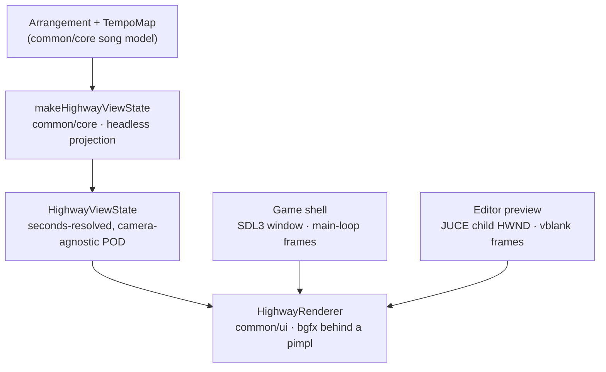

\page guide_3d_highway The 3D Note Highway

*Applies to: Repo-wide — one shared renderer, consumed by the game and by the editor's 3D
preview.*

The 3D note highway is the clearest example of deliberate code reuse in the repository: **the
game window and the editor's preview window draw with the same renderer, the same camera math,
and the same shaders.** Neither product has its own drawing code. This page explains the layers,
how the sharing actually works, and what to touch when extending the highway.

# The layers


```mermaid
flowchart TB
    chart["`Arrangement + TempoMap
    (common/core song model)`"]
    proj["`makeHighwayViewState
    common/core · headless projection`"]
    state["`HighwayViewState
    seconds-resolved, camera-agnostic POD`"]
    renderer["`HighwayRenderer
    common/ui · bgfx behind a pimpl`"]
    game["`Game shell
    SDL3 window · main-loop frames`"]
    preview["`Editor preview
    JUCE child HWND · vblank frames`"]
    chart --> proj --> state --> renderer
    game --> renderer
    preview --> renderer
```

Each layer has one job, and the boundaries are the reason the sharing works:

1. **Projection** (`rock-hero-common/core`, `highway/highway_projection.h`) — headless. It
   resolves every musical position through the tempo map into absolute seconds, once per chart
   load:

   ```cpp
   HighwayViewState makeHighwayViewState(const Arrangement& arrangement,
                                         const TempoMap& tempo_map,
                                         const std::vector<SongSection>& sections,
                                         HighwayDisplayOptions options);
   ```

   The result is immutable and shared (`std::shared_ptr<const HighwayViewState>`); the camera
   and every drawer are pure functions of this state plus per-frame time. Because the projection
   and the camera math (`highway_camera.h`, `makeHighwayCameraTarget`, `makeHighwayWorldToClip`)
   live in `common/core`, they are tested headlessly — see `test_highway_projection.cpp` and
   `test_highway_camera.cpp` in `rock-hero-common/core/tests/`, no GPU required.

2. **Renderer** (`rock-hero-common/ui`, `highway/highway_renderer.h`) — owns all GPU work, and
   keeps bgfx out of its public header exactly the way `common/audio` keeps Tracktion out of
   `engine.h`. The header holds only `struct Impl; std::unique_ptr<Impl> m_impl;`; inputs cross
   the boundary as plain data:

   ```cpp
   struct HighwayShaderPair
   {
       std::vector<std::byte> vertex;
       std::vector<std::byte> fragment;
   };

   // Both sets are arrays indexed by the shared name table's enumerators, so a program or asset
   // is declared once in common/core and neither product's loader enumerates them by hand.
   using HighwayShaderSet = std::array<HighwayShaderPair, g_highway_shader_programs.size()>;
   using HighwayTextureSet = std::array<std::vector<std::byte>, g_highway_textures.size()>;

   static std::expected<HighwayRenderer, HighwayRendererError>
       create(const HighwayShaderSet& shaders, const HighwayTextureSet& textures);
   void setViewState(common::core::HighwayViewState state);
   void draw(double now_seconds, double dt_seconds, std::uint32_t width, std::uint32_t height);
   ```

   The renderer never touches the filesystem — shaders and textures arrive as bytes, so each
   consumer decides where they load from. What each program and asset *is*, and the file name it
   deploys as, lives in `common/core` (`highway/highway_resources.h`) rather than beside the
   renderer, because the game resolves resource paths in `game/core`, which is headless and must
   not depend on `common/ui`. GPU handles are held in a move-only RAII wrapper
   (`bgfx_handle.h`, `UniqueBgfxHandle`) that must be destroyed before `bgfx::shutdown()`.

   Nothing inside the draw pass is reachable from a test, so a decision the pass makes more than
   once belongs in a small pure unit beside it instead. `highway_head_marks.h` is the pattern:
   which atlas cell a head's connection mark uses (`highwayLegatoCell`), whether the head takes
   the darker technique base (`highwayTechHead`), and whether the board can POINT at a harmonic's
   node (`highwayHarmonicMark`, read by the head's cell choice AND by the floor's fret-span line,
   so a head mark and a floor mark cannot disagree). Whether the note IS a harmonic at all is the
   shared `common::core::isHarmonic`, which the 2D diamond head reads too (RULED 2026-09-17), so a
   harmonic wears a harmonic cell on ONE rung and the mark predicate only says WHICH cell — the
   board's own, or the pinch's, whose node the thumb grazes over the body. All covered by
   `test_highway_head_marks.cpp`. Two more sit beside it, and between them they hold every rule a
   floor mark and the tail above it have to agree on:

   - `highway_floor_geometry.h` — `highwayVisibleSpan` is the single clamp a drawn span obeys (from
     the later of the onset and the hit line to the earlier of its own end and the horizon, empty
     when those cross), and `highwayFloorFootprint` is where a mark under one note lies on the fret
     axis and how wide (the note's anchor, or the hand window inset by the open-tail margin).
     Nothing pops in at that horizon: every highway program fades its fragments in across the
     last `HighwayMetrics::far_fade_length_z` world units before it (`highwayFarFade` in
     `shaders/highway_fade.sh`, armed by `setFadeUniform` on every submit), so a drawn span ends
     at the clamp and the fade dissolves it there.
   - `highway_slide_path.h` — `highwayNoteFretboardX` and `highwaySlideStateAt`, the fret axis and
     the glide, below.

   Reach for that shape whenever a draw-path branch is a *rule* rather than geometry.

3. **Two shells** feed it frames. That is the entire product-specific surface.

# The game path

`rock-hero-game/ui` composes the stack in `RockHeroGame::onInit`
(`src/surface/rock_hero_game.cpp`): create the SDL3 `GameWindow`, hand its Win32 HWND to
`RenderDevice::create`, load shader bytes from the resource pack
(`highway_shader_loader.cpp`, `loadHighwayShaderSet`), then construct the shared renderer. The
frame loop is `SDL3Application::run()` — input, drained JUCE messages, one frame — and the draw
call is one line in `Game::render`:

```cpp
m_renderer.draw(m_frame_sample.song_time.seconds,
                static_cast<double>(m_frame_sample.frame_delta.count()) / 1.0e9,
                device.width(), device.height());
```

Song time comes from the playback-clock port's published snapshots — the frame loop never derives
time from wall clocks or frame counts (see "Time Must Be a Dependency" in
\ref design_architectural_principles).

# The editor preview path

The editor cannot give bgfx an SDL window, so `PreviewSurface`
(`rock-hero-editor/ui/src/preview/preview_surface.cpp`) creates a **native child HWND inside the
JUCE window's peer** and initializes the render device against that child. Frames are driven by a
`juce::VBlankAttachment` on the message thread instead of a main loop.

The lifecycle is the part worth understanding before touching it: **bgfx cannot be re-initialized
in the same process after shutdown**, so the device is created once on first open and deliberately
survives window hides. Closing the preview only suspends the vblank ticks (`suspend()`); real
teardown happens once, at destruction, in strict order — vblank, renderer (GPU handles), device
(`bgfx::shutdown`), child window. The corollary bites the failure path: a renderer bring-up
failure (a stale or partial shader deploy) must **not** tear the device down, or the next open
re-enters bring-up and hits the `renderFrame`-before-`init` assert bgfx cannot survive. So
`bringUpRenderer()` keeps the device and child window alive on failure — the preview shows the
black fallback — and retries only the renderer on a later open, which never re-initializes bgfx.

Per-frame song time comes from `PreviewTimeModel`
(`rock-hero-editor/ui/src/preview/preview_time_model.{h,cpp}`), a small headless, injected-time
policy `PreviewSurface` owns: plan-12 extrapolation while playing, an exponential glide toward the
marker target (armed caret, else transport position) while paused, with a snap on first frame and
on resume after a hidden gap. It is extracted from the vblank callback precisely so that timing
policy is unit-tested (`test_preview_time_model.cpp`) rather than welded to the GPU frame path;
edit preview timing there, not in `renderFrame`.

State reaches the preview the same way the game gets it: editor core runs the *same*
`makeHighwayViewState` projection (memoized per displayed arrangement in `editor_controller.cpp`)
and `EditorView` pushes the resulting shared pointer into the preview window.

# The sharing mechanics, precisely

| Piece | Owner | Both consumers get it by |
|---|---|---|
| Projection + camera math | `rock_hero::common::core` | public dep of `common::ui` |
| Renderer, atlases, render device | `rock_hero::common::ui` | linking that target |
| String colors (Charter rules) | `common/ui` `string_color_palette.h` | renderer + 2D tab lane |
| Shader sources (vs/fs pairs) | `rock-hero-common/ui/shaders/` | one CMake compile function |
| Shader staging | `rock_hero_stage_highway_shaders` | both call it to deploy |
| Resource deploy + install | `rock_hero_deploy_product_resources` | both call it per executable |
| Program + texture name table | `common/core` `highway_resources.h` | both loaders walk it |
| Shader *loading* | per product (game/editor loaders) | same byte-vector seam |

What differs per consumer is exactly what should differ: the window (SDL top-level vs JUCE child
HWND), the frame driver (main loop vs vblank ticks), device lifetime policy (process-long vs
survives-hides), and display options (the editor forces `invert_string_order` and a minimum
string count to match its 2D tab lane).

# The fretboard axis: one function, and a deliberate stop/node split

Where a STOPPED note sits on the board's fret axis is decided by exactly one function,
`highwayNoteFretboardX(note, fret_at_point, metrics, mirrored)` in `highway_slide_path.h`, and
every point of a stopped gesture reads it — the head, the tail band's base, each glide station,
and the fret-span furniture under it. (A fret-0 note takes the open-string bar treatment across the
hand window instead and never asks it.) The stop is a parameter because one gesture sounds from
more than one of them: the onset from the note's own fret, a slide from each fret it travels to.

**BOTH HANDS MOVE BY ONE MORPH.** The fretting hand's window and the picking hand's light are two
tracks of one motion element, `HighwayHandArrival` (`HighwayViewState::fret_hand.track`, an
arrival per placement; `HighwayViewState::pick_hand.track`, an arrival per stop of the taps'
travel), resolved by the one function `highwayHandWindowAt` (`highway_window.h`). The renderer's
passes only decide where to sample it. Each arrival carries its ramp, the ease family the rail
draws with, and its SETTLE: the crop zone, from the rail's ink end to the arrival, over which the
approach leaves the leg's curve where the rail is cut and comes to rest at the arrival with a
continuous slope (`cubicHermite`, the one cubic the bend curve is also built from). The settle is a
fact about the rail, so the chart projection derives it once beside the ramp
(`FhpViewState::settle_seconds`) and the board copies it; the picking hand's track derives its own
from the same ink end (`makePickHandLight`, `highway_projection.cpp`). A left-hand slide-out into
the next head and a pick slide cut at its crop therefore look the same underneath: the light rides
the rail's own curve to the crop and settles over the last margin.

**A TAIL'S TIP FADE IS ONE RULE FOR BOTH SURFACES** (`tailFadeSeconds`, `chart_view_state.h`): the
last 35% of the ink, never less than a fixed stretch of time clamped to the tail — the last 35%
of a member cropped one margin before the next chord was a few frames of fade beside the open
strings ringing through it, and the two ends read as two rules. The 2D lane reads the same
function (2026-09-24), so a sustain ends the same way on the board and in the editor; a revealed
ring never fades.

**VIBRATO IS A DISPLACEMENT, NOT A PITCH** (`highwayVibratoDisplacementAt`, `highway_tail.h`): the
wobble is a plain sine in string-lane gaps (`g_highway_vibrato_depth_gaps`), added to wherever the
bend has put the note (`highwayDrawnNoteY`), and never fed through the bend's tension curve, whose
square root near the unbent pitch would flatten the crests and steepen the crossings. It phases and
tapers per vibrato SPAN — every consecutive vibrating leg (`VibratoSpanViewState`) — so a width
change mid-ring neither restarts the wave nor tapers it to the string line; the swing between the
two widths follows `vibratoWideWeightAt` (`chart_view_state.h`), the one width rule the 2D lane
reads too. The sounding head breathes at exactly half the tail's displacement.

**AN OPEN RING MOVES WITH THE HAND WINDOW; A HARMONIC'S DOES NOT.** An open string has no position
of its own, so its bar and its tail band span the hand window and follow it as it slides — the band
samples the window per station along its length wherever the window moves under the visible tail
(`highwayTrackSampleTimes`, the one sampling policy, under "The floor light" below — whose samples
past the tail's two ends are also the answer to whether it moves at all), and holds one extent
otherwise. The string is not being slid, only moved
visibly, and the curtain applies to that ribbon exactly as to any plain one (the reveal alpha
multiplies into every band sample). A straight, onset-anchored open ring is the rejected
alternative: it reads as the string detaching from the hand. A harmonic is the other case by
physics — its ring is position-dependent, drawn at its node's absolute fret position through
`highwayNoteFretboardX`, so it never borrows the window and never moves with it.

Where the gesture has TRAVELLED to at an instant is the companion in the same header,
`highwaySlideStateAt(note, base_x, metrics, mirrored, seconds)`: the eased offset from that anchor
(pitched and unpitched glides ease differently) plus the release dim — the slide-out's own leg on
a fretted note, a scrape's whole path as one continuous release — holding the last target past the
last STOP. Stop and not keyframe: the gesture is read as one uniform sequence — the note's position
keyframes, the slide-out last — through `glideStopAt` in `chart_view_state.h`, which folds the
slide-out flag into each stop's pitched-ness so no consumer restates that rule: only the terminal
takes the release curve, and a scrape's turnarounds are pitched legs that arrive tangentially
(re-ruled 2026-09-24, when they cornered). Bounded by `keyframeDrawn` where a consumer draws only
to the ink end. Both live out here rather than inline in `draw()`, which is what
lets them carry `test_highway_slide_path.cpp` and what lets a floor mark follow a slide at all: a
glide lambda declared after every floor pass is reachable by no floor pass. The one density policy
every mark following the hand's window is sliced by lives beside the window's own easing, inside
the one sampling policy (`highwayTrackSampleTimes`, `highway_window.h`).

A harmonic's node *rides* its stop — fret spacing is logarithmic, so the node's offset above the
stop is constant in fret units and a glide that moves the stop moves the node by the same amount —
which is why passing `note.fret` gives the onset's anchor with a zero shift. This is the same rule
2D labels heads by (`tabNoteHeadText`), with one deliberate 3D-only addition: the board clamp
(`highwayDrawnStop`) holds a node at the drawn board's edge, which the 2D label does
not apply — the decided asymmetry roadmap 57 tracks.
So the two surfaces cannot disagree about what a glide arrives at, only about where a
past-the-board node is shown.

The split worth stating plainly: **the note sounds from its node while the board's own furniture
stays on the stop.** A pinch is the exception in the other direction: its node belongs to the
picking hand, so the fretting hand stays on the stop and the ordinary fret slot is returned (that
node still awaits its own right-hand cue, 25-Q5).

The fret-span line under a note is furniture in exactly that sense, and every note but a harmonic
takes the wire-to-wire slot line. **A HARMONIC'S LINE RUNS FROM THE STOP TO THE NODE**: it rides
`harmonicMarkFootprint`, which spans from the fretting hand's fret slot (its midpoint, the same
place an ordinary note's slot line is centred on) to the drawn node, so both places the figure is
made at are stated — the press the head never prints, and the touch that makes it a harmonic. It
is node-centred exactly where the stop **is** the node, which is a natural harmonic: that hand
stands on the node its head already prints, its two ends coincide, and the run collapses to the
node-centred mark. A pressed-stop harmonic's stop is stated on this surface the same way the 2D
lane states it in the satellite beside the head. A plain tap's planted finger, by contrast, still
has no 3D cue at all — the remaining 2D/3D asymmetry.

Where every one of those lines ENDS is not a per-line question. **The taper is consistent
everywhere**: every horizontal line the board lays on its floor — the fret-span line under a note,
the one under a slide keyframe, and the beat and measure bars alike — dissolves at both x ends over
the open-string bar's own end-fade, which `pushTaperedFloorQuad` derives from the line's own span
rather than taking as an argument. A hard end reads as an edge belonging to nothing wherever it
falls, wires included, and a harmonic's stop-to-node line does not stop on the wires that would give
a slot line its flat ends in any case. There is no un-tapered floor line, and no way to ask for one.

**A song section boundary draws nothing on the floor.** Sections snap to measure downbeats (the
authoring verb enforces it), so a boundary *is* a bar the board already draws, and the board
draws it as any other downbeat; only the name above the board marks the section. A promoted bar
— the downbeat's attack line at full alpha in the section green with a trailing wing about three
times as long — shipped 2026-09-12 and was removed 2026-09-24 after sighting: the green wing read
as an awkward glow under the notes rather than as a boundary. How sections should read on the
board is an open backlog item; the earlier rejections still stand as inputs to it — a coplanar
`drawSectionBars` pass (a second rule for what a downbeat looks like), an arch over the board
(nothing vertical exists above the face except the label, and it would occlude approaching notes),
and a per-section floor tint (the floor is the reading surface, already carrying the hand-window
light and the strike glow). Which downbeat a section belongs to is still decided ONCE, in the
camera-zone walk that snaps a mid-measure start forward for the framing cut.

The section's **name** floats above the board at `faceTopY() + 1.5 * string_distance`, riding its
own z out among the notes but submitted with `alwaysDepth` so a nearer note cannot eat it. Every
program reads the one fade uniform (`u_fade_params`, `shaders/highway_fade.sh`), which carries two
bands: the far-edge fade-in every program applies, and the floor furniture's near fade — dim at the
hit line, opaque toward the horizon — which only the color-fade program applies, since heads, the
board face and the hand-window light must stay full at the line. The label takes the near band
baked into vertex colour from `fadeBandZ()`, as the scrolling floor numbers do, because the glyph
program also draws the numbers pinned at the hit line in the same batch. That bake is also what
stops a label holding full alpha after it has crossed the hit line: past the band's near edge the
scale is zero.

The capo is drawn too: the face from the nut to the capo's fret line dims (those frets do not exist
to play, and an absolute-fret chart is unreadable without seeing where its floor sits) and the clamp
draws as a rimmed steel bar hugging the nut side of its line. Crude first treatment, flat quads and
no art (roadmap 25-Q6). No displayed fret *number* is offset by the capo, on either surface.

Head marks arrive as atlas overlay cells seated on the head quad, not as silhouettes: a harmonic
cell, a pinch cell, and a split-plectrum cell for a scrape (which also suppresses the full-mute X
beneath it, whose core would show through the fracture and read as a second mark). 2D expresses the
same distinctions as actual head *shapes* — see the head-shape rule in \ref guide_2d_views.
Per-surface idiom for one fact is fine; the two must never carry *different* facts. One known gap
against that law: the open-string bar carries no harmonic or pinch cell, while 2D gives a fret-0
harmonic its diamond and node — tracked with the note-view unification watch item rather than
papered over.

The **connection mark** obeys the same division. No direction is stored in the chart, so the cell a
hammer-on or pull-off gets comes from the note's RESOLVED `LegatoMotion` (`NoteViewState::legato`,
from the shared `chartResolutions` pass), the identical value the 2D triangle points itself by — one
authority, two idioms, and a claim the chart cannot justify draws like the plain pick it sounds like
on both surfaces.

The **span-implied hold** is the board's alone, which is worth knowing before touching either
surface. `ChartViewState::display_hold_ends` is resolved from the `chartHolds` authority and rides
the projection both surfaces read, but only the highway spends it: for a strum a hand-shape span
holds it draws no tail and instead **pins the head at the hit line** until the hold ends. The 2D
lane draws every tail to the note's own ink end and nothing further, so those chugs wear bare
heads there — the span's own rails already state how long the posture is fretted, and a ribbon
repeating that reads as sustain (`docs/plans/in-progress/note-sustain-model.md` ruling 3).
Per-surface idiom for one fact again: one hold, a pinned head here and a chord box there.

The board draws no destination chip at the crop — the rail and the bend curve run their true path
to the ink end and the hand window completes at the true instant, which is the whole of what the
board says about a keyframe past the ink; the chip is the 2D lane's, where a reader scans for a
number. The TAIL's LENGTH is not per-surface in any way: every surface draws the stored note to one
ink end (`NoteViewState::ink_end_seconds`, beside the stored `ring_end_seconds`; keyframes keep
their stored instants) with one verdict beside it (`NoteViewState::rested` and its
`reveal_from_seconds` landmark), and no surface may compute a different length. The 3D board keeps
its tip fade over the drawn extent. What IS per-surface is where a resting ribbon RESTS: the 2D
lane draws it always, while the board draws the part past
the note's landmark only inside the CURTAIN — a fixed window rising from the hit line, one lead deep
(the tunable `g_tail_reveal_lead_whole_note`, resolved at the note's own meter and tempo), whose
fade an in-flight note carries as an IDENTICAL local copy anchored at its RESTING LANDMARK: the head
for a plain tail, the last statement's offset (held to the ink end) where a technique plays out,
and the ribbon's own ink end for a handed-over member, whose statement finishes at the takeover
so the curtain owns none of it and the board publishes no window at all (`hasRestingRemainder`). The local copy
enters at the far edge under the far-edge fade every program applies and is otherwise identical to
the fixed window, so the hand-off at the line is an identity.
**THE CURTAIN IS UNIVERSAL**: it owns everything past the last always-visible landmark, on every
fretting-hand tail whether or not a span stands over it, and the stated portion of a technique
rides at full ink outside it. It is the one distance-scoped draw decision the execution form
re-admits, and it modulates alpha only, never length — the verdict is published once for both
surfaces, so neither decides tail suppression at its own draw site.

**THE HOLD IS THE TENURE**: every live fretting-hand member covered by a span, whose tail rests or
was never earned, is held to the span's reach — resting and rule-2-emptied members alike, because
under grip tenure coverage past a member's ring IS the renewal record: a re-strike replaces the
sound, never the finger, so the note's own ring never cuts the hold short. (Keying on the ring
instead releases the pins at every slow restrike while the faster chugs hold — a hold that works
only sometimes.) A member whose tail STANDS — still stating at its own end — states its own hold,
and so does one no span covers: every plain note outside any furniture rests, and it is held to its
ink end rather than for its stored ring. Dead members and the other hand's onsets are never
held at all. A HANDED-OVER member is the one exception the tenure carves out
(`ChartConnections::hands_over`; pinned heads reflect the current SOUNDING state): a pull-off or
hammer-on source's head pins only until its takeover — the next strike on its string, which sounds
the destination there — never the grip's reach, because that head no longer sounds once the
destination lands. That is what keeps a **repeat-box run** readable — the run's first strum shows
its heads, every box after it draws none, and the pinned heads go on standing at the fretboard
underneath the boxes for the whole run, exactly as a plain chord box's duration keeps them. The
renderer clamps the pin with `HighwayChordGroupViewState::hold_cap_seconds`, the next note-showing
strum's onset, because a re-shown chord takes over the pinned display — and that clamp is the ONLY
hand-off, which is why it is worded around a strum that shows its notes rather than around any later
onset: a successor that draws no head of its own has nothing to take over with. That clamp is
board-only presentation with no 2D counterpart to diverge from.

**Which box a strum draws is the projection's answer, never the renderer's**
(`HighwayChordGroupViewState::box_treatment`, one of None / Full / Repeat). **A BOX MARKS
SIMULTANEITY**: any two-or-more-string strike wears one, inside a span and outside one alike, and it
is THE STANDARD CHORD BOX in every case — a partial restrike inside an arpeggio span included. A box
scoped to just the strings that restrike is the rejected alternative: it would probably look ugly,
and it would restate context the figure already carries, since the span's own borders and the
brackets standing on the fretboard are what say this is an arpeggio. A single note wears none, and
that is the only `None` left. Whether the box is FULL or the headless REPEAT is one comparison:
**the onset immediately before it, within the same span, with no onset of any kind between, striking
the same strings at the same SOUNDING PLACES** (`ChartStop`, where each head sounds — a node grip
and an open string are two places however the fret column reads, and a fretted 5 damped at node 17
is not a plain 5 — since the box stands in for the heads it suppresses, so two onsets compare
identical only when the heads they replace are). The PROFILE is free, so a plain chord's first dead
chug is an X'd REPEAT box wearing its own mark rather than a re-head, and a profile the box cannot
draw is caught by the display-capability gate instead — the one rule here that is about drawing
rather than about the music. Every re-head is that one comparison rather than a case of its own:
silence re-heads because a rest ends the statement and a span boundary breaks the run (a ring that
does not run to the next chord IS a rest, and a rest is the hand free to lift and mute), a fresh
grip re-heads because it is a fresh span, an interleaved onset of any kind re-heads, and a partial
strike after a full chord re-heads because it is not the same notes.

**The grip-tenure law leaves that rule alone and supplies its INPUTS.** A seamless successor — the
one a LANDED TRAVEL opens (rule 11b) — is a span BOUNDARY, so it breaks the run and the four
re-heads all stand: seamless is about the ink drawn at the boundary, never about the identity chain.
An ARRIVING new stop GROWS the one span in place rather than opening a fresh one, so it re-heads as
an INTERLEAVED onset rather than on "fresh span" grounds — the same answer through a different
clause. And the two two-or-more counts on this page are NOT the same test: rule 10's opening law
counts MEMBERS — stops struck, claimed, or ringing at a stated stop — over time, while the box's
count is the strings ONE onset strikes, at an instant. A lone pluck inside a span is a member of it
and wears no box at all.

`makeHighwayChordGroups` derives all of it once per chart revision, because the answer depends on
the whole song's hand-shape spans and not on whatever window a frame happens to show. One forward
cursor over the spans carries it, and the head of a run is simply the onset whose predecessor
differs — so the display never re-derives where a statement begins and can never disagree with the
derivation that already knows.

**Every question the treatment answers is asked of the FRETTING HAND's members alone**: the
two-or-more count that makes a group a strum, the sounding places the repeat identity compares, the
mute and emphasis unanimities, and the display-capability gate's scans for tails and for marks. A
right-hand onset is the other hand, so it is no part of
the strike a box speaks for, and reading one anyway produces two wrong figures. A tap over two
identical chugs puts its own fret into the identity, which makes the two onsets DIFFERENT and
re-heads a run that has not changed; and a group of nothing but taps compares identical to its
neighbour and draws a headless repeat box for a strum nobody played. What looks like a retreat from
that exclusion is not a special case but a consequence of comparing string sets exactly: a tap that
REPLACES a chord member shrinks the fretting set, so that onset really is a different onset and
wears its own full box.

**Every consumer of "is there a box here" reads the published answer, and there are TWO producers
of it.** `box_treatment` is the strum's own, and `HighwayChordGroupViewState::arpeggio_mark` is the
other: true where an arpeggio span's opening mark draws at this onset, published by
`makeHighwayChordGroups` where the covering span is already in hand. The plain box, the arpeggio
box's emphasis inheritance and the strike glow all defer to a box and would light both marks, or
neither, wherever a second reading disagreed — and the glow is why the second producer is published
at all. It lights a boxed cluster's window EDGES instead of its per-fret lines, and reading
`box_treatment` alone would light a lone note's fret lines straight through the bracket mark already
standing over them. The question is answered in the projection rather than off whatever
boxes a frame happened to build, because a renderer's box list is clamped to the visible board while
the glow reads clusters that have already crossed the hit line — exactly the onsets such a list is
silent about.

**An arpeggio span's mark draws at `ShapeViewState::bracket_seconds`, not at its start.** The
derivation publishes that anchor per span (`ChartShape::bracket_position`) rather than leaving each
surface to re-scan for it: a span an EVENT states carries its own FRONT, since that is the
statement's own extent and the rails run from it — for an ACCUMULATION that front is its earliest
uncovered member's onset, so the bracket stands from the figure's first note and the later members'
heads arrive under it — and a rule 11b landing-opened successor carries its first interior sounding
instead, because nothing is struck at a landing and the ink follows the sound. The projection
consults it only where a bracket actually draws — an arpeggio-class span — so a box-class span
publishes no `bracket_seconds` at all, which is now the ordinary disposition of a successor rather
than a corner case: a landing is not a sounding, so a successor classifies by the ordinary triggers
found inside it, and a chord sliding into chords is box class at both ends. One that never sounds
interiorly draws no furniture whatever — no bracket, and no box either, since nothing strikes it.
Both the box pass and the bracket glyphs read the published instant, and so does the 2D lane. A
posture member is a STOP (`ShapeStringViewState::stop`): a fret slot, the open string, or a harmonic
node the fretting finger touches. A node member wears the fretted bracket cell placed by the one
stop rule (`highwayStopX`) — on its own wire, as the node head and the floor number already are — so
the board says "node" by placement and needs no new art; only a true open string takes the
window-edge pair. The digit both surfaces print for any stop is `chartStopText`, the one label
authority.

**The arpeggio mark is a box frame, and it follows the chord box's own `with_top` convention**: a
two-member arpeggio mark draws no top bar and a three-or-more draws one, counted from the span's
POSTURE strings exactly as a strum's box counts the strings it strikes. One convention across both
marks rather than each carrying its own — which also leaves any two-member span wearing a lighter
frame than the wide figures. The accumulation minimum is three, so SOUND alone opens no two-member
arpeggio: the lighter frame is for the pair an ONSET states — a lone strike beside a claimed stop —
for the two survivors a landed travel opens, and, once the span marker ships, for an
authored two-note span.

# The floor light

ONE light, with two evidence producers. Each hand is the same pair of lists,
`HighwayHandLight { track, lit }` (`highway_view_state.h`): WHERE its window stands over time (the
track) and WHEN it is lit (disjoint, ascending `HighwayLitStretch`es, `highway_light.h`).
`HighwayViewState::fret_hand` and `::pick_hand` are two values of that one type, and the hands
differ ONLY in what their producers in `highway_projection.cpp` accept as evidence and in the
tolerance they merge it under:

- **`makeFretHandLight`** — every note whose onset is not a right-hand onset (fretted, open, dead,
  natural harmonic, legato, left tap), every right-hand onset whose held stop is pressed, and every
  span over its drawn extent. A bare tap proves nothing. Open strings are lit by ruling: an open
  note is drawn as a bar spanning the window, and a dark window under it would read as a floating
  bar. A span carries no rise of its own and never opens a light — it starts at a note's onset or
  tiles onto its predecessor. Merged under `g_hand_rest_seconds`.
- **`makePickHandLight`** — one item per tapped member of each right-hand onset group (the same
  grouping `makeHighwayTapOnsets` strikes with). Its track is the groups' paths concatenated, an
  earlier group's arrivals at or after the next onset dropped (the hand has moved on); each strike's
  first arrival is instant. Merged under `g_pick_light_rest_seconds`, which is zero: each strike is
  its own light, the dip between strikes mirroring the finger lifting, and only overlapping strikes
  merge.

Both producers hand their evidence to the one **`mergeLitEvidence`**, differing only in the
tolerance it is given — a parameter, never a branch. **`g_hand_rest_seconds`** is the ESTABLISHMENT
RULE: a hand's position stays established across a gap shorter than it. The fretting hand's light
merges under it (a sustainless chug riff would otherwise strobe at every margin trim), and a
repeated tap within it keeps its number unprinted (a `HighwayTapOnsetViewState` carries its strike's
hold end, `release_seconds`, for that test). Each stretch rises over its first note's arrival
margin, clamped so it never reaches back past the previous release, holds to its release (the drawn
end, or the last pitched keyframe before a drawn slide-out), and fades over
`g_light_decay_seconds` — ONE decay for every layer, because a release is a gesture.

**THE BRIGHTNESS RULE** is the one formula every layer draws, at any fret line and instant:
`max over lights of coverage(highwayLitWindowAt(track, stretch, t), line) ×
highwayLightLevel(stretch, t) × motionDim(track, highwayLitTrackTime(track, stretch, t))`, where the
motion dim is the sin-squared bell a window sweeping across lanes dims by, whichever hand moves it —
read off the leg `highwayHandLegAt` finds, the same lookup the window eases through.
`highwayLitWindowAt` (`highway_window.h`) is the READING RULE: a light never starts a new leg of its
track outside its own stretch, because a placement whose ramp lies in a dark gap must not move a
light nothing displays. Through its rise it already stands where its start stands; after its
release it only finishes the leg in progress at the release (a slide-out's settle), then holds. The
lights read `highwayLitWindowAt`; furniture that is not a light — pinned numbers, box panels, beat
wings, rails, tails — reads the raw window, `highwayHandWindowAt`.

The renderer names the two hands once, in `forEachHand` (the fretting hand first, then the picking
hand, each with its `HandLightStyle`), and visits one hand's lights in the drawn span through
`forEachLightOf`; `forEachLight` is the two composed.

- **`drawFloorLight`** — per light, the brightness laid over the window at a list of instants
  (`appendLightSampleTimes`: the lit interval's ends, the start, the release, and — only over the
  stretch where the light follows its track — that stretch's track samples,
  `highwayTrackSampleTimes`), through the per-fragment soft x edges (`fs_window_light`,
  `g_window_light_falloff`), with the spill lane drawn past each edge so the soft band fades fully.
  One batch per hand; the picking hand's lanes lean toward the FHP orange
  (`HandLightStyle::warm_mix`). Alpha-blended rather than additive, so two lights at one position
  composite in submission order instead of summing toward white.
- **`drawLaneBorderRibbons`** — the bright tier is the rule at now (`lineLightAt`); the mid tier is
  the rule along z at each sample's time, so a line is lit only while its light is.
- **`drawFretLines`** — the active tier is the rule at now.

**ONE SAMPLING POLICY.** Everything drawn along a hand's track — the floor light over the stretch
it follows, the rails, an open tail's band — samples the window through
`highwayTrackSampleTimes` (`highway_window.h`): the range's two ends, every arrival inside it, and
each overlapping leg's ramp sliced by the one density policy (four slices per fret of travel,
clamped to 6-64). A settled stretch adds nothing, so straight segments between samples follow the
eased window exactly where it moves; `highwaySortUniqueTimes` finishes every sample list, the
tail's own sampler included. For an open tail the list does double duty: anything in it past the
two ends — or a window that differs at the tail's two ends, which catches a tail shorter than one
slice inside a ramp — means the window moves under the tail, which is what switches the band to
per-station sampling.

Three marks beside the lights, all on the raw window:

- **Rails** (`drawHandShapeRails`) — the side highlights that run through a held chord's duration:
  a solid core between fade-out wings along both window edges, from the hold's start to its end,
  riding the hit line while it lasts. ONE pass draws every rail as `(track, from, to, colour)`, fed
  by both hands: the fretting hand's posture spans over `fret_hand.track` in the span's own colour
  (purple for an arpeggio, the lane-border teal otherwise — a span's colour says what kind of span
  it is), and every tapped chord (`tappedChord`) over `pick_hand.track` from its onset to its
  `release_seconds`, in the picking hand's white (`HandLightStyle::mark_color`). A strike carries
  its own hold end, so the picking hand needs no derived spans — a span object would restate the
  strike on a second representation the 2D lane never shows. Singles get no rails on either hand.
- **Box sides** — `highwayBoxSidesAt(track, onset, now)` (`highway_window.h`) is the hand's
  window at `max(onset, now)`: an approaching box stands at its onset's window, and one riding the
  hit line follows the live window, so a gliding chord carries its box. It is the one rule for both
  hands — a strummed box reads the fretting hand's track, a tapped box the picking hand's, whose
  window at a tapped chord's onset is its taps' own slots (and, for an open-string tap harmonic,
  its node).
- **Strike pops** — the brief additive flash at a strike or an arrival: a single note, a slide
  landing and a bend arrival pop their slot's two wires, a boxed strike (and a lone open, whose bar
  spans the window) its box's two sides. They are chart facts, `HighwayHandLight::pops`
  (`HighwayStrikePop`, `highway_light.h`), derived once per chart revision in
  `highway_projection.cpp`: every pop is in its NOTE's hand's list — a right-hand onset's strike,
  landings and bend arrivals are the picking hand's — and THE POP CLAMP is applied there, once, for
  every pop of both hands: a pop's release clamps (`highwayHitGlowRelease`) against the next pop of
  its hand landing on the same strips (the same fret's wires, or the box sides — every box pop of a
  hand lights its live window's sides), so a fast run keeps a discrete pop per strike; pops at one
  instant are one strike and never clamp each other. `drawStrikeGlow` only reads each hand's
  still-fading run, draws it in the hand's `mark_color` — amber for the fretting hand, white for
  the picking hand — max-resolving a wire two pops of one hand share, while the two hands' strips
  add; the box sides stand at the hand's live window.

The **FHP silence fade** — the backlight going out through a left-hand rest and returning ahead of
the next statement — is what the fretting hand's evidence and the establishment rule do: the light
goes out through any gap of `g_hand_rest_seconds` or more and rises back over the next note's
margin.

A **harmonic node light** (a floor glow under every note whose node lies on the neck) is
**TABLED**: removed rather than left switched off, with the revisit recorded in
`docs/tracking/backlog.md`. What stands without it is the FLOOR MARK that light shared
its position with: a harmonic's fret-span line runs from its stop to its node rather than
wire-to-wire across a fret slot, because the press and the touch lie in two places and a slot line
alone points the hand a wire away from the touch.
That footprint is `harmonicMarkFootprint`; which notes the board can point at is
`highwayHarmonicMark`, the same predicate that picks which harmonic cell the head wears, so a
marked head and a floor mark cannot disagree. A pinch is absent by construction (its node is over
the body, so the neck has nowhere to point, and its head takes the pinch cell instead) and a scrape
by exclusion (its node is an in-memory latent, not a touch — refused by `isHarmonic` itself).

Neither the node light's absence nor the floor light states a FACT the 2D lane would have to
answer, which is why neither needs a tab-side change: the stop-to-node line restates on the floor
what the 2D lane already says with the diamond head, the node number and the satellite's pressed
stop, and the hand WINDOW and its light are board-only furniture 2D has no lit region for.

# Two visual paths: chart visuals and screen-space overlays

Before extending anything, pick the right path — they do not share a checklist:

- **Chart visuals** (notes, lanes, markers — anything in world space derived from chart or
  transport data) go through the projection → `HighwayViewState` → renderer-drawer path below.
- **Screen-space overlays** (HUD, menus, the diagnostics frame graph) never touch view state or
  the projection: they are pixel-space `HighwayOverlayRect` lists fed to
  `HighwayRenderer::drawOverlayRects` (`highway_renderer.h`), with text via the device's debug
  text. `DiagnosticsOverlay` (`game/ui/src/overlay/`) is the HUD exemplar — record data during
  the frame, `buildRects()`, draw. The game's menu bar renders the same way. Extending
  `HighwayViewState` for a HUD element is the wrong path.
A **world-space diagnostic** — a mark lying on the board that a viewer switches on to look at
something, rather than part of what the chart says — is not a third path, and the board carries
none: the one candidate, a per-note floor mark for the ring a short note really sounds for, sighted
as clutter rather than information (`docs/plans/in-progress/note-sustain-model.md`, stage D). Two
constraints bind the shape if it is ever wanted. The overlay path cannot express one at all —
`HighwayOverlayRect` is axis-aligned pixels, and a mark on a perspective floor is a trapezoid that
moves every frame — so it has to draw in the ordinary drawer path. And its switch must NOT be a
`HighwayDisplayOptions` field: those ride the memoized `HighwayViewState`, so a toggle pressed to
look at the board would re-project the chart it is looking at. It belongs on a draw-time setter of
the renderer's own, with the game kept out by composition (an editor-only caller) rather than by a
build define — diagnostics are never compiled out of shipped builds (plan 20 open question 5, answer
A: release-build timing bugs have to stay observable).

# Extending the highway — silent steps

Adding a new *visual element* (a new marker, lane decoration, feedback effect):

1. If it derives from chart/transport data, extend `HighwayViewState` and compute it in
   `makeHighwayViewState` — never derive musical data per-frame in the renderer.
2. Add the drawer in `highway_renderer.cpp`, consuming only the state plus per-frame time. Board
   furniture — anything that builds one batch and submits it — goes in as its own private
   `drawXxx(const FrameContext&)` member (no parameter at all when nothing frame-scope is read),
   called from `draw()` at the point in painter order where it must paint: the board view is
   sequential and no furniture pass writes depth, so for furniture, submission order *is* the
   layering. Depth enters only between NOTES. The note pass runs a **depth prepass**: ahead of
   each onset group's colour, that group's effectively opaque subjects — fretted heads at their
   measured art silhouette, open-string bars over their opaque span — submit depth-only proxies,
   so a nearer note's lane-flat sustain ribbon is rejected per pixel wherever it runs *behind* a
   farther note's upright bar or head. Submission order could never say that: a group flushes as
   a unit. Colour batches test `LEQUAL` (markers, mute marks and chord members share their
   subject's z, so `LESS` would have each rejected by the thing it rides) and still write no
   depth, which is why the per-group flush remains — depth decides who is in front, painter order
   decides how the translucent survivors blend. Translucent subjects deliberately write no proxy;
   a see-through occluder is the worse artefact. A new furniture pass therefore states
   `alwaysDepth(...)` on its state word, the way the existing ones do. Take only per-FRAME
   facts from `FrameContext`; per-state ones — the metrics, the view state, the scroll speed, the
   face extent, the scratch buffers — the pass reads from the renderer, because it is an `Impl`
   member like any other. Set every uniform and texture bind the pass draws with inside it —
   bgfx state is ambient until the next submit, so a pass that leans on a neighbour having set
   one breaks the moment the neighbour moves. (Note content is different: it interleaves through
   shared batches and a deferred flush, and still schedules inside `draw()` itself.)
3. Extend the headless projection/camera tests — they are where a drawer's *decisions* are pinned.
   The renderer itself has only a GPU-free crash net: `test_highway_renderer_smoke.cpp` creates it
   against bgfx's Noop backend and encodes a few hundred frames across real view states, so a new
   pass that reads past a vector, submits with a stale handle, or trips one of bgfx's own asserts
   fails there. It cannot see draw counts, batch counts, paint order, or pixels — Noop reports no
   statistics at all — so it never substitutes for a headless test of what the pass decided, nor
   for looking at the board.
4. Both products pick the change up with no further wiring — that is the payoff of the seam.
5. **Answer the 2D lane in the same change.** The two surfaces must not diverge: never add highway
   notation the 2D tab cannot show, or 2D notation the highway cannot. If the element states a
   *fact* about a note, the tab needs its own idiom for that fact — the idioms may differ (a 3D
   atlas overlay against a 2D head silhouette; a 3D capo bar against a 2D capo chip) but the set of
   facts stated may not. Where the answer is genuinely per-surface — 2D has no fretboard axis, so a
   node has nowhere to sit there and becomes a *number* instead — say so where the element is
   documented, so a later reader can tell a decided asymmetry from a forgotten one.

If the element is *textured*, the asset lives in one table and the fan-out is short:

1. Drop the PNG in `rock-hero-common/ui/resources/textures` and add a `HighwayTexture` enumerator
   plus its file name to `highwayTextureFileName` — both in
   `common/core/.../highway/highway_resources.h`. That is the whole asset declaration: both
   products' loaders walk `g_highway_textures`, and `HighwayTextureSet` is an array indexed by
   `indexOf(HighwayTexture)`, so neither loader needs an edit.
2. Use the bytes in the renderer (`textures.at(indexOf(HighwayTexture::…))`). Every texture is
   REQUIRED content: a missing or invalid one fails `HighwayRenderer::create` with a typed
   `TextureAssetInvalid` error.
3. Nothing in CMake. Both products deploy the whole shared texture tree through
   `rock_hero_deploy_product_resources` — see the deploy contract in \ref guide_game.

Adding a new *shader program* is two declarations plus its use:

1. The `.sc` sources in `rock-hero-common/ui/shaders/` (the `vs_`/`fs_` naming and the shared
   `varying.def.sc` are load-bearing: `rock_hero_stage_highway_shaders` derives the program list by
   globbing `vs_*.sc`, so a source drop is the CMake side of the change — there is no list to edit).
   **Silent step:** the vertex shader must write `v_world_z` and the fragment shader must apply
   `highwayFarFade` from `highway_fade.sh`, or the program's content pops in at the far edge while
   everything else fades. Shared `.sh` includes beside the sources are tracked through shaderc's
   depfile, so editing one rebuilds every program that includes it.
2. A `HighwayShaderProgram` enumerator plus its base name in `highwayShaderProgramName`
   (`common/core/.../highway/highway_resources.h`), and a row in `g_highway_shader_programs`. Both
   loaders — the game's `loadHighwayShaderSet` and the editor's `loadPreviewHighwayShaders` — walk
   that table, so they need no edit and cannot disagree.
3. Program use in the renderer implementation: `HighwayRenderer::create` links every program in the
   table, so add the named `Impl` handle it lands in and draw with it.

The one thing still stated twice is the *base name*: it names the `.sc` sources on disk and the
compiled `vs_`/`fs_` binaries the enumerator's name resolves to. A mismatch fails loudly at load —
the game path with a typed error naming the missing file; the editor preview's loader reports
through its own result type — which is the reason the names are allowed to live in two languages.
