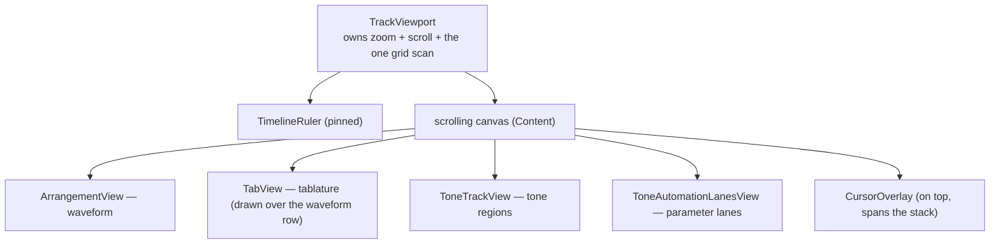

\page guide_2d_views The Editor's 2D Views

*Applies to: Editor-only (the string-color palette it draws with is shared repo-wide).*

The editor's center is a stack of horizontally-scrolling timeline rows — waveform, tablature,
tone track, automation lanes — under a pinned ruler, with a cursor overlay on top. This page
explains the machinery those rows share, then each row, then the checklist for adding a new row.

# One viewport rules them all

`TrackViewport` (`rock-hero-editor/ui/src/timeline/track_viewport.h`) is the single owner of
horizontal zoom (`m_pixels_per_second`) and scroll. It hosts the pinned `TimelineRuler`, the
scrolling canvas that parents every row, and the `CursorOverlay` spanning the whole stack. The
tab lane is laid out to exactly the waveform row's bounds — it draws *over* the waveform.



Three consequences keep the rows pixel-aligned:

- **One time window.** `visible_timeline` is part of the pushed `EditorViewState`; every row
  receives the same value, and all rows map time to pixels with the same linear function
  (`timelineXForPosition` in `editor/core/timeline/timeline_geometry.h`, or its local
  equivalent):

  ```cpp
  float xForSeconds(double seconds, common::core::TimeRange visible_timeline, int width)
  {
      const double duration = visible_timeline.duration().seconds;
      return static_cast<float>(
          (seconds - visible_timeline.start.seconds) / duration * static_cast<double>(width));
  }
  ```

- **One grid scan.** `TrackViewport::refreshTimelineGrid()` computes `visibleTempoGridLines(...)`
  (`editor/core/timeline/tempo_grid_geometry.h`) once per geometry change and pushes the *same*
  line list to the ruler and the canvas. Rows never rescan the tempo map themselves — that rule
  is what fixed the 1/128-grid performance problem, so keep it.

- **One snap function.** `musicalGridPositionForX(...)`
  (`rock-hero-editor/ui/src/timeline/timeline_cursor.h`) converts a pixel to an exact rational
  grid position for *every* gesture — cursor placement, tone-region boundaries, automation
  points. Ctrl bypasses to the 1/960-beat fine grid. New gestures must go through it, or their
  snapping will disagree with everyone else's.

The pinned ruler is a two-part header: the measure-number row on top, then a grid header region
that extends the canvas's dark backdrop and dotted tempo grid up to the ruler — through the same
shared painter, `timeline/tempo_grid_dots.h`, so the grid reads as one continuous surface — and
carries the **song-level** chip rows: sections, tempo markings, and time signatures, each chip's
left edge on its grid column, with the active value pinned to the left edge while the song
scrolls. Tab-owned content stays out of the ruler: the chord/arpeggio name chips draw in a strip
`TabView` reserves at the top of its own row (below).

# How rows get data: push for content, sample for live

Two channels exist, and choosing the right one matters:

- **Pushed content state.** The controller derives view-state structs and `EditorView::setState`
  fans them out — `m_tab_view.setState(m_state.tab, ...)`,
  `m_tone_track_view.setState(m_state.tone_track)`, and so on. Rows repaint when state changes;
  no timers poll for content. Large states are shared pointers compared by **pointer identity**
  (`TabView` rebuilds its index only when the pointer changes), so pushing an unchanged state
  is free.
- **Sampled live data.** Anything that moves at playback rate — the transport position, meter
  levels, live parameter values — is deliberately *not* in derived state. Views sample it
  through the const port references bundled in `EditorView::AudioPorts` at render cadence, using
  `juce::VBlankAttachment` (never `juce::Timer`). The cursor repaints only a narrow strip
  (`repaintCursorStrip`), not the whole canvas.

If you are adding something that changes when the *user edits*, push it; if it changes because
*audio is playing*, sample it.

# The rows

## Waveform — `ArrangementView`

The waveform is drawn by the audio engine, not by editor code: `ArrangementView`
(`ui/src/timeline/arrangement_view.cpp`) owns an `IThumbnail` created through the
`IThumbnailFactory` port, and its `paint` hands the clipped time range straight to the port:

```cpp
m_thumbnail->drawChannels(g, request.bounds, request.visible_range, vertical_zoom);
```

`IThumbnail` (`rock-hero-common/audio/.../song/i_thumbnail.h`) is the one port whose signature
deliberately names `juce::Graphics` — it forward-declares it so callers can draw without any
Tracktion header. The production adapter (`src/tracktion/tracktion_thumbnail.cpp`) wraps
`tracktion::SmartThumbnail` and translates the time range; proxy generation is asynchronous, and
the view renders progress text until it completes. Two details worth knowing: drawing shifts by
`state.audioStartOffsetSeconds()` so asset time aligns with timeline time, and `vertical_zoom`
comes from the asset's normalization gain (`pow(10.0, gain_db / 20.0)`).

## Tablature — `TabView`

`TabView` (`ui/src/tab/tab_view.cpp`) is purely presentational — it intercepts no mouse clicks;
gestures fall through to the cursor overlay. Its data is a seconds-resolved projection built once
per edit in editor core (`tab_projection.cpp`, `makeTabViewState(arrangement, tempo_map)`), so
painting never queries musical positions. Because sustains overlap, it keeps a prefix-max index
of note end times and binary-searches the visible note range each paint instead of scanning the
whole chart. The view reserves a `g_tab_chip_strip_height` strip at the top of its row for the
chord/arpeggio name chips (`TrackViewport` adds the strip to the row height and starts the
waveform below it), so the chips sit on the row's grid-dotted background directly above the top
span rail.

String colors come from the **shared palette** in
`rock-hero-common/ui/string_colors/string_color_palette.h` — a JUCE-free authority (colors are
`uint32_t`) that derives each string's seven surfaces (lane, borders, tail, accent...) from one
base color, Charter-style. The 2D tab lane, the 3D highway renderer, and therefore both products
all color strings through it. The glyph renderer itself currently lives entirely in this editor
view; promoting a shared tab *paint core* for the game's 2D view is planned work
(`docs/plans/roadmap/30-game-2d-tab-view.md`), not present reality.

## Tone track — `ToneTrackView`

Renders the gap-free tone regions as spans with name chips pinned to the visible left edge, and
carries the editing grammar for boundaries: click selects, edge-drag moves a shared boundary
(snapped; Ctrl fine grid), Alt enters the insert quasimode with a ghost boundary, Esc cancels.
Every gesture ends as **one intent** through its `Listener`
(`onToneRegionBoundaryMoveRequested`, `onToneChangeInsertRequested`, ...) — the view never
mutates the model. Its input is the `makeToneTrackViewState` projection; the active region
highlight advances by sampling `ITransport` at vblank cadence.

*Design in flux: the active-vs-selected semantics of tone regions are proposed to change
(`docs/plans/in-progress/tone-active-vs-selected.md`, awaiting sign-off) — treat the selection
behavior described here as current, not final.*

## Automation lanes — `ToneAutomationLanesView`

One lane per automated parameter plus a trailing "+" lane, from the `makeToneAutomationViewState`
projection. The gesture pattern to copy here: drags preview locally and commit **one full
point-list intent on release**; a state push arriving mid-gesture is deferred and applied when
the gesture ends, so the engine's frequent lane rebuilds cannot yank the point out from under the
user. Selection is identified by value (instance id, parameter id, exact grid position), not by
index, so it survives rebuild pushes. Unauthored lanes track the live parameter value by sampling
`IToneAutomation` per vblank.

A scope note on editing: the interaction *grammar* (Ctrl precision, Alt create-quasimode, Shift
extend, snap always on, Esc cancel, one undo entry per gesture —
`docs/plans/in-progress/editing-interaction-model.md`) is settled and binding, but it is
implemented only on the tone track and automation lanes today. The product's core editing
surfaces — note authoring, chart editing, tempo-anchor editing — are **not built yet**
(`docs/plans/roadmap/40-chart-editing.md` and siblings); this guide documents none of them, and
new editing surfaces adopt the grammar when they arrive.

# Adding a new timeline row — silent steps

All of these compile clean when forgotten:

1. **View-state + projection** in editor core (`*_view_state.h`, `make*ViewState(...)` in a
   feature folder), derived in `deriveViewState()` and added to `EditorViewState`.
2. **The component**, following \ref guide_add_view (Listener, `setState`, theme).
3. **Viewport wiring** in `TrackViewport`: construct/parent the row in its canvas, stack it in
   the layout, and plumb `setVisibleTimeline`, `setGridLines` (if it draws the grid),
   `setVisibleContentLeft` (if it pins chips), and height into the canvas layout.
4. **`EditorView::setState` fan-out** — the row exists but renders defaults forever without it.
5. **Snapping through `musicalGridPositionForX`** for any gesture, and one-intent-on-release
   commit semantics.
6. **Tests**: projection tests in editor-core (headless), wiring tests via the UI harness.
