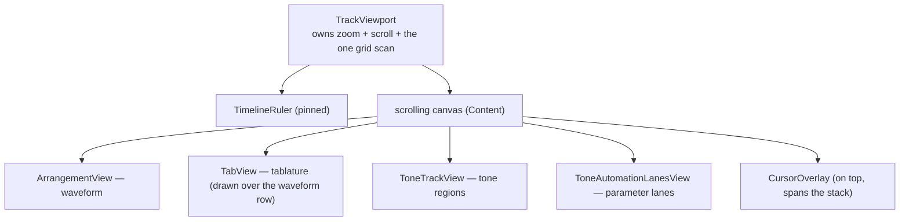

\page guide_2d_views The Editor's 2D Views

*Applies to: Editor-only (the string-color palette it draws with is shared repo-wide).*

The editor's center is a stack of horizontally-scrolling timeline rows — waveform, tablature,
tone track, automation lanes — under a pinned ruler, with a cursor overlay on top. This page
explains the machinery those rows share, then each row, then the checklist for adding a new row.

# One viewport rules them all

`TrackViewport` (`rock-hero-editor/ui/src/timeline/track_viewport.h`) is the single owner of
horizontal zoom (`m_pixels_per_second`) and scroll. It hosts the pinned `TimelineRuler`, the
scrolling canvas that parents every row, and the `CursorOverlay` spanning the whole stack. The
tab lane is laid out to exactly the waveform row's bounds — it draws *over* the waveform.


```mermaid
flowchart TB
    tv["`TrackViewport
    owns zoom + scroll + the one grid scan`"]
    ruler["TimelineRuler (pinned)"]
    canvas["scrolling canvas (Content)"]
    wave["ArrangementView — waveform"]
    tab["TabView — tablature (drawn over the waveform row)"]
    tone["ToneTrackView — tone regions"]
    lanes["ToneAutomationLanesView — parameter lanes"]
    cursor["CursorOverlay (on top, spans the stack)"]
    tv --> ruler
    tv --> canvas
    canvas --> wave
    canvas --> tab
    canvas --> tone
    canvas --> lanes
    canvas --> cursor
```

Three consequences keep the rows pixel-aligned:

- **One time window.** `visible_timeline` is part of the pushed `EditorViewState`; every row
  receives the same value, and all rows map time to pixels with the same linear function
  (`timelineXForPosition` in `editor/core/timeline/timeline_geometry.h`, or its local
  equivalent):

  ```cpp
  float xForSeconds(double seconds, common::core::TimeRange visible_timeline, int width)
  {
      const double duration = visible_timeline.duration().seconds;
      return static_cast<float>(
          (seconds - visible_timeline.start.seconds) / duration * static_cast<double>(width));
  }
  ```

- **One grid scan.** `TrackViewport::refreshTimelineGrid()` computes `visibleTempoGridLines(...)`
  (`editor/core/timeline/tempo_grid_geometry.h`) once per geometry change and pushes the *same*
  line list to the ruler and the canvas. Rows never rescan the tempo map themselves — that rule
  is what fixed the 1/128-grid performance problem, so keep it.

- **One snap function.** `musicalGridPositionForX(...)`
  (`rock-hero-editor/ui/src/timeline/timeline_cursor.h`) converts a pixel to an exact rational
  grid position for *every* gesture — cursor placement, tone-region boundaries, automation
  points. It takes the **placement quantum**, not the grid value: `placementQuantumNoteValue(...)`
  is the one authority, and `EditorView::setState` derives it once per push and hands the same
  value to every placing surface, so no view can snap by a rule the controller did not use. No
  modifier composes a second answer — grid snap (`Ctrl+G`) is the only thing that moves it. The
  keyboard's stepping has its own single primitives next to the grid math (`gridStepBeats` and
  `adjacentTempoGridPosition` in `editor/core/timeline/tempo_grid_geometry.h` — the one
  step rule behind both the caret step and the lane nudge, exact-rational so a step from a
  position between lines lands on the adjacent one). New gestures must go through these
  helpers, or their snapping will disagree with everyone else's.

The pinned ruler stacks the **song-level** chip rows on top — sections, tempo markings, and time
signatures on the editor chrome, with the active value pinned to the left edge while the song
scrolls — above the ruler body with its measure-number row and tick band; the color steps alone
divide chrome, body, and the content scrolling under it. Each chip drops a dotted leader line in
its own color down to the top of the body, marking its exact position (the body's own ticks take
over from there); leaders draw for every event, even where a chip was suppressed on a dense map,
and every chip paints above every leader. A 1px divider along the bottom edge
separates the ruler from the rows scrolling under it.

(The ruler's bottom band used to carry chord/arpeggio NAME chips. Nothing ever authored a chord
name — the postures both surfaces draw are derived from the notes and carry no name — so the band,
its chips, and `TrackViewport::setShapeLabels` were deleted rather than kept as a row that could
only ever be empty. When names are authored they arrive as a dictionary keyed by a posture, and
the band comes back with them.)

# How rows get data: push for content, sample for live

Two channels exist, and choosing the right one matters:

- **Pushed content state.** The controller derives view-state structs and `EditorView::setState`
  fans them out — `m_tab_view.setState(m_state.tab, ...)`,
  `m_tone_track_view.setState(m_state.tone_track)`, and so on. Rows repaint when state changes;
  no timers poll for content. Large states are shared pointers compared by **pointer identity**
  (`TabView` rebuilds its index only when the pointer changes), so pushing an unchanged state
  is free.
- **Sampled live data.** Anything that moves at playback rate — the transport position, meter
  levels, live parameter values — is deliberately *not* in derived state. Views sample it
  through the const port references bundled in `EditorView::AudioPorts` at render cadence, using
  `juce::VBlankAttachment` (never `juce::Timer`). The cursor repaints only a narrow strip
  (`repaintCursorStrip`), not the whole canvas.

If you are adding something that changes when the *user edits*, push it; if it changes because
*audio is playing*, sample it.

One narrow channel runs the other way, **upward**: when the viewport needs geometry a row owns —
the armed caret square's vertical mask, which the paused-column cursor must cut around — the row
*publishes* it fire-on-change (`TabView`/`ToneAutomationLanesView::setCaretMaskCallback` →
`TrackViewport::setTabCaretMask`/`setAutomationCaretMask`). The viewport never polls a sibling
row's geometry. The reason is the memo
below: sampled-channel derivations are gated by change keys, and a polled value that changes
without a notification freezes inside the memo.

Sampled-channel work is **idle-gated**: `TrackViewport::updateRulerCursor` runs at vblank
cadence but short-circuits on an unchanged `RulerCursorKey` (`track_viewport.h`), and the
content views' `setState`/`setVisibleTimeline` equality-gate so unchanged pushes repaint
nothing. The rule that keeps the memo honest: **every input of the derived value must be a
field of the key** — the pushed caret mask is one — because a missing field freezes the output,
and a frozen derivation shows up as a *lingering* (not one-frame) paint glitch.

# One selection, editor-wide

Exactly one selection exists across all surfaces:
`EditorSelection = std::variant<std::monostate, ChartSelection, ToneRegionSelection,
AutomationPointSelection, TimeSelection>` (`editor/core/src/controller/editor_selection.h`).
Making a selection anywhere replaces it everywhere — two live selections are unrepresentable —
and verbs (Delete, Alt+arrow moves) dispatch on whichever alternative is active.

Inside the chart alternative there is a second axis, the selection **unit**: a `ChartSelection`
holds `ChartSelectionKey` values, and that key is a **sum** —
`std::variant<ChartNoteKey, ChartWaypointKey>` (`chart_selection.h`). The first is named by a
`ChartSlotKey`, the `(position, string)` the note stream is keyed by — silently-held stops
included, since they are notes; the second is not, and that is why the key is a sum rather than a
kind tag beside a slot. A
note carries many waypoints, so a waypoint's identity is `(note slot, offset)` — the authored
beat-fraction offset and never an index, because removing an earlier waypoint shifts every later
index and moves no offset. Carrying that offset as a field only one kind uses would make "a note
key with an offset" spellable and owe every reader a rule about what it meant; as a sum neither
shape exists to be misread.

One sorted-unique sequence per alternative, one set of mutations written over whatever
(sequence, element) pair an alternative maps to — `ChartSelection::visitSequence` is that single
mapping, so a mutation never branches on kind and the waypoint sequence can hold a different
element type than the two slot-keyed ones. Every verb reads its own kind's operand as a plain
list (`notes()`, `waypoints()`) and a verb a kind has no meaning for simply reads an empty one,
which is what keeps the technique verbs free of waypoint guards.

Three consequences worth knowing before touching this:

- **A waypoint occupies no slot, so nothing arms a caret for it.** `chartCaretSlotFor` answers
  absent for a waypoint key, and selecting one demotes the marker to a cursor in place, exactly as
  every multi-select gesture does. The armed-caret invariant is "the selection is what sits under
  the caret", and a caret on the note while the selection holds the waypoint would break it.
  `chartSlotOccupied` (does the note stream hold anything at this slot) is therefore a narrower
  question than "what can be selected", and deliberately excludes waypoints: a slot holds at most
  one note, while a waypoint SHARES its note's slot.
- **Waypoints publish as drawn positions, not as chart identity.** `ChartEditViewState` carries
  `selected_waypoints` as `ChartWaypointRef{note_index, waypoint_index}` beside the note index
  list, resolved against the presented projection the lane hit-tested; a key the trim clipped out
  of the drawn tail resolves to nothing and simply wears no ring.
- **`selection.empty()` is not "this verb has no operand" any more, and the difference bites.**
  Widening the key split one question into two: a verb whose operand is the slot-keyed notes
  (`moveChartSelection` — Alt+arrows) can see a non-empty selection with `notes()` empty — a
  waypoint-only selection — and reading a `front()` off it is out of bounds rather than merely
  inert. Every such verb guards on the operand it actually reads, never on `empty()`. Verbs whose
  planner takes the keys as a list need no change: an empty key list already means NoChange. The
  typed DIGIT is the same question one level up: it routes by whether the selection holds notes to
  retype, not by `empty()` — routing it by emptiness armed a pending entry whose target was an
  empty key set, and because an invalid entry is the one kind that outlives its window by design,
  a digit typed over a waypoint left a red box no timer would clear.

**Adding a selection kind is the highest silent-fan-out change in the editor.** Because dispatch
is `std::visit`/`holds_alternative`, a new alternative compiles clean nearly everywhere it is
forgotten. The touchpoints:

1. The variant + the new struct in `editor_selection.h`, identified by *value* (ids, exact grid
   position), never by display index, so it survives rebuild pushes.
2. Assignment through `setSelection` (the one non-chart seam — it carries the fret-entry
   invalidation invariant) and the accessors/clears around it in `editor_controller_impl.h`.
3. The verb dispatches: `onSelectionDeleteRequested` and `onSelectionMoveRequested` — a missing
   arm means Delete/moves silently no-op on the new kind.
4. An Esc-ladder rung (\ref guide_keyboard).
5. The `selection_present` derivation in `deriveViewState()` — the view's Delete/Esc guards
   read this one flag.
6. **The lifecycle rules** — the subtlest step. Each kind declares what clears it: on play, on
   seek, on cursor move, on project load/close/arrangement switch (the per-kind split is
   documented at the top of `editor_selection.h` and in `clearCursorCoupledSelection`). A kind
   that forgets to pick dies stale on screen.
7. The view-side highlight render, and tests covering the dispatches plus the lifecycle clears.

The `TimeSelection` alternative (Shift+arrows, 2026-07-20) is the newest worked example: a
grid-locked anchor/focus span, mutually exclusive with object selection by construction, whose
creation demotes the marker to passive through the seek-preserving dissolve
(`dissolveChartCaretInPlace`) — building a range and pressing Space plays from the range.

# The rows

## Waveform — `ArrangementView`

The waveform is drawn by the audio engine, not by editor code: `ArrangementView`
(`ui/src/timeline/arrangement_view.cpp`) owns an `IThumbnail` created through the
`IThumbnailFactory` port, and its `paint` hands the clipped time range straight to the port:

```cpp
m_thumbnail->drawChannels(g, request.bounds, request.visible_range, vertical_zoom);
```

`IThumbnail` (`rock-hero-common/audio/.../song/i_thumbnail.h`) is the one port whose signature
deliberately names `juce::Graphics` — it forward-declares it so callers can draw without any
Tracktion header. The production adapter (`src/tracktion/tracktion_thumbnail.cpp`) wraps
`tracktion::SmartThumbnail` and translates the time range; proxy generation is asynchronous, and
the view renders progress text until it completes. Two details worth knowing: drawing shifts by
`state.audioStartOffsetSeconds()` so asset time aligns with timeline time, and `vertical_zoom`
comes from the asset's normalization gain (`pow(10.0, gain_db / 20.0)`).

## Tablature — `TabView`

`TabView` (`ui/src/tab/tab_view.cpp`) **owns its pointer events while a chart is displayed**: it
claims the whole lane band through `wantsPointerAt` / `hitTest` and forwards Down, Drag, Up, Move
and Exit to the controller as `ChartPointerEvent` intents, plus a right-press context menu; the
controller decides what a press means (select, caret arming, marquee, or a plain seek while
playing). With no chart the lane is pointer-transparent. The yielding component is the *cursor
overlay*, whose `hitTest` returns false wherever a pass-through predicate — installed in
`editor_view.cpp`, asking `TabView::wantsPointerAt` first — declines the point. Its data is a
seconds-resolved projection built once
per edit in **common/core** (`chart/chart_projection.cpp`,
`common::core::makeChartViewState(arrangement, tempo_map)` — the ONE chart scene both surfaces
draw since W9-B's fold on 2026-08-21; promoted from editor/core by plan 30
Phase 1 so the game's 2D tab view shares the same scene model), so painting never queries musical
positions. Because sustains overlap, it keeps a prefix-max index
of note end times and binary-searches the visible note range each paint instead of scanning the
whole chart. It draws each hand-shape span's rail and, for an arpeggio, its brackets; a span's
NAME has no drawn form on either surface, because nothing authors one (see above).

String colors come from the **shared palette** in
`rock-hero-common/ui/string_colors/string_color_palette.h` — a JUCE-free authority (colors are
`uint32_t`) that derives each string's seven surfaces (lane, borders, tail, accent...) from one
base color, Charter-style. The 2D tab lane, the 3D highway renderer, and therefore both products
all color strings through it. The glyph renderer itself is the **shared notation paint core**
in `rock-hero-common/ui` `tab/` (plan 30 Phase 2): `tab_lane_layout.h` holds the framework-free
`TabLaneGeometry` and lane math, `tab_layout_manifest.h` answers "where is this note's head/tail
in pixels" for hit testing (and the same for a linked waypoint's head, and for a silently-held
stop's **posture bracket** — such a note draws no head, so what the editor rings and hit-tests is
the arpeggio bracket the paint core already draws at its span's start, and the bracket's size lives
on `TabLaneGeometry` for exactly that reason: the painter and the hit test read one authority. A
hold that joined no posture draws no bracket, and the layout answers with no box at all, so
nothing undrawn is clickable without a second rule saying so), and `tab_paint_core.h` — the one
designated juce_graphics-bearing
common/ui header — exposes `paintTabLane`, which `TabView::paint` calls after deriving metrics.
The editor keeps thin delegate functions (`tabStringColor`, `tabLaneCenterY`, ...) on its own
surface so editor widgets and tests are unaffected; the paint core's pixel output is pinned by
exact-color tests in `rock_hero_common_ui_tests`. Those delegates carry no documentation of their
own rules — `tab_view.h` points at the shared declarations instead, because a delegate that restates
the rule it forwards gives the reader two descriptions to reconcile and no compiler to catch the
drift.

Six notation rules inside the paint core are worth knowing before touching a head, because each
is deliberately single-sourced:

- **The head silhouette names the note's kind**, never which hand produced it (a present mark's
  *darkness* says that). `headShapeFor(note)` maps to `HeadShape::{Round, Diamond, Plectrum}` — a
  diamond for anything carrying a harmonic node, a plectrum for a scrape, a circle otherwise. The
  enum is file-local on purpose, so host chrome that must trace a head it did not draw calls the
  exported `strokeTabNoteHeadOutline` instead: re-deriving the rule in the editor left every pick
  slide wearing a circular selection ring around a plectrum head.
- **`tabNoteHeadText(note, fret_at_head)` decides the number a head carries**, and it takes *the
  stop being labeled* rather than reading the note's own fret. Any harmonic whose node is on the
  neck names its node — the predicate is `nodeIsOnNeck`, which excludes only a pinch — because the
  node sets the pitch (a trailing `.0` is dropped so 12 / 7 / 5 stay as narrow as an ordinary
  fret, and the pinch keeps its fret because its node sits off the neck).
  Passing the stop is what lets one rule label *every* head of a gesture: the onset passes
  `note.fret`, a linked slide junction passes the fret the glide has reached, so a harmonic labels
  nodes at all of them instead of a node at the onset and a raw fret at the junctions.
- **The capo is drawn**, as a "Capo N" chip pinned in the lane's top-left corner in the fret-hand
  chips' boxed style — pinned to the bounds rather than the timeline, because a capo has no time.
  The chart stores absolute frets with 0 meaning the capo'd open string, so nothing else in the
  drawn content says where the string floor sits. Crude first treatment (roadmap 25-Q6).
- **The beside-head legato triangle comes from the note's RESOLVED motion**, never from a stored
  direction: `NoteViewState::legato` is a `LegatoMotion` the projection got from `chartResolutions`,
  and the painter simply points the triangle down for `Hammer` and up for `Pull`. `Unjustified`
  draws nothing, so a claim the chart cannot justify is pixel-identical to a plain pick —
  deliberately, per `docs/plans/in-progress/legato-authoring-model.md`. Nothing in the paint core
  knows the rules that produced the value.
- **A stored `LeftTap` is the one exception: it wears its own charting mark** — the tap letter on
  the LIGHT plate (ruled 2026-08-12). The lettered-plate family's hand signature is its FILL
  POLARITY (55-Q1's basis: dark ink marks the picking hand, light the fretting hand), so the
  right-hand tap's dark T and the left-hand tap's light T share a letter without colliding; one
  shared mid-grey rim (`g_plate_rim`, perceptually equidistant from both fills) keeps the two
  polarities at equal visual weight. This is a CHARTING mark — it states how editor verbs treat
  the note, not how it is performed — which is the ruled reason it exists in the editor's 2D lane
  only: the 3D surfaces keep the merged hammer-motion reading, and the game's future 2D tab view
  must suppress it (recorded in roadmap plan 30).
- **A tail's end is the note's own presented end (`NoteViewState::end_seconds`), everywhere.** The
  lane draws to it, `tabNoteLayout` builds the hit rectangle from it, the visible-range prefix
  maximum indexes it, and both paint passes cull on it — one stop, read off the note, so a drawn
  ribbon is always clickable and always in range. There is no second end to keep in step, which is
  the point: a span-extended ribbon once shipped drawn-but-unclickable because the four places did
  not agree.
  The span-implied hold (`ChartViewState::display_hold_ends`) still rides the same projection, but
  it is the **3D board's** — how long a pinned head lasts — and this lane must not spend it
  (ruled 2026-08-22, `docs/plans/in-progress/note-sustain-model.md` ruling 3). A chugged member of
  a strum a hand-shape span holds therefore draws a bare head here and no ribbon: the chord box over
  the strum already says how long the shape stays fretted, and repeating that in the one mark that
  means "this string is still ringing" read as sustain. The board has no chord box, so pinning its
  heads is how it states the same fact. One chart, one hold, two idioms.

One performance rule sits beside the viewport-bounded note range: the two **wavy tail overlays**
(the tremolo band and the vibrato sine) generate only the stretch of a tail the clip can show, via
`visibleTailRun`. Both are functions of the distance from their own **start** — the onset for the
tremolo band, the region's own start for each vibrato sine — so a clipped run lands the identical
shape (phase never depends on where generation began), and each generator snaps its run outward
onto its own vertex spacing, so the rasterized result is *identical* rather than merely similar. At
full zoom a held tremolo chord would otherwise cost tens of thousands of off-screen vertices every
frame. A test pins that a tail looks the same however the repaint is clipped.

The sine is drawn **once per stated vibrato region**, not once per note: the vibrato channel holds
from each statement until the next, so `NoteViewState::vibrato` is a list of
`{start_seconds, end_seconds}` regions the projection derives from the note's waypoints rather
than a flag (`docs/plans/todo/unified-waypoint-model.md`). A shake that begins where a glide
arrives — the corpus's commonest vibrato figure — therefore inks only from that arrival, and a
note that simply shakes end to end yields one region covering the whole presented tail, which is
the picture the lane drew when the channel was a single boolean. The 3D board reads the same
regions, so the two surfaces cannot say different things about where a shake starts.

**The actual-ring pick** is how the length you cannot see becomes visible while you author it. The
lane draws presented tails, so the ring a note actually sounds for — what `Alt`+wheel edits — is
invisible wherever presentation trimmed or dropped it. One rule decides, per note, which form that
note is drawn in, and it has two inputs: a note draws its **actual** ring when the whole-lane
`Alt` reveal is held **or** when that note is **selected**, and its presented tail otherwise.

The two inputs answer two different questions, which is why both exist:

- **The selection is the note under scrutiny.** You selected it to do something to it, so its real
  length is what you need to see — and every chart verb already settles on a selection change, so
  deselecting *is* the moment presentation clips the tail back to the picture.
- **`Alt` is the lookahead, and the selection cannot serve it.** With a selection standing, typing
  a digit RETYPES those notes instead of inserting one, so a charter placing notes holds no
  selection at all — and placing the next note is exactly when the real tails around it matter.
  Holding `Alt` shows every ring in the passage, including the notes nothing is selected on.
  `Alt` is also already the authoring gate — it is what the sustain wheel gesture rides — so you
  see the ring while you are the one changing it.

**The mark is the notation itself** (ruled 2026-08-23, after sighting it against the alternative).
A note drawing its actual ring is drawn in the chart's ACTUAL form: its tail is the real ring, with
its techniques and its payload riding it. Nothing is annotated, because the notation *is* the
answer. The candidate it beat — a hairline outline at tail height over the presented picture — is
deleted, with its `F6` style toggle and the `ActualRingRevealStyle` enum that carried the choice.

Two glyph consequences follow from drawing a form no presentation rule touched, and both are
accepted: a **dead note grows a tail** (rule 4 is a presentation rule, and the actual form has no
rules), which reads as how long the mute is held; and a shift-slide's arrival, which sits exactly at
the presented end, sits strictly inside the real ring, so it draws the **linked continuation head**
it never draws otherwise.

Five things about it are deliberate:

- **Every note the pick names, not only the disagreeing ones.** A note drawing its actual form
  whose ring and presented tail coincide simply looks unchanged — which is the statement "this is
  the whole ring". A mark that appeared only on disagreement would leave a reader unable to tell
  agreement from a pick that is simply not asking.
- **It needs a second PROJECTION, not a swapped end.** `EditorViewState::tab_actual` is the same
  chart through `makeChartViewState(..., ChartNoteForm::Actual)`, published beside `tab` under the
  same memo key. A view-side end swap was the obvious cheaper move and is wrong: the presented state
  has already CLIPPED the payload points its trims removed, so a bend curve or a trailing waypoint
  that left with the tail cannot be put back by lengthening it. The two forms differ in `notes` and
  in nothing else — holds, spans and their arrival kinds, fret-hand placements and their approach
  ramps, the string count and the capo are all derived from the presented stream in either form, so
  choosing per note moves no other mark on the lane, and the two forms align by index because
  presentation returns one note per note in the same order. It costs a second projection per chart
  revision, which a sustain gesture bumps per wheel notch; the reason it is not built lazily is
  that a lazy build would require the controller to know the reveal is on, which the design
  forbids.
- **The actual form is editor-only, and the producers say so.** **Scored = presented**
  (`docs/plans/in-progress/note-sustain-model.md` ruling 4) holds structurally rather than by
  discipline: `makeHighwayViewState` composes the projection with no form argument, so no board,
  game or scorer state can be anything but presented, and `ChartNoteForm::Actual` is unreachable
  from them. `chart_projection.h` is the one authoritative statement of that; this is a gloss.
- **A revealed ring is not hit-testable.** Hit testing, selection, marquee and `Alt`+click insert
  all resolve against the presented projection the controller published (`displayedTabProjection`),
  so a tail only the pick draws cannot be clicked, boxed, or landed on. `Alt`+wheel is unaffected
  because it acts on the selection, not on what is under the pointer. Inside `TabView` this needs
  no enforcement: every note paint reads comes from the one pick lambda, and the only projection
  reads outside paint are the string count and whether a chart exists, which are identical in both
  forms.
- **One conservative cull index, because a chord can be half revealed.** `TabView` keeps a single
  running maximum of the ACTUAL form's note ends and culls both forms against it. Presentation only
  ever trims, so every presented end falls at or before its own note's ring: the actual ends bound
  whatever is drawn, a ring outlasting its tail stays in range for as long as it is drawn, and the
  paint pass drops each note whose DRAWN end really precedes the window. A per-form table could not
  be used at all here — one member of a chord can draw actual while its neighbour draws presented.
  The cull runs inside `paintTabLane`, and the pick reaches it as a per-index accessor
  (`common::ui::TabDrawnNote`), so there is no second loop and no editor ink at all, which is the
  whole economy of making the ring be the notation.

The key itself never reaches the editor core. The reveal is on exactly while this process is the
foreground application AND `Alt` is physically down — `juce::Process::isForegroundProcess()` and
`juce::ComponentPeer::getCurrentModifiersRealtime().isAltDown()`, both process-wide OS queries —
and `EditorView::syncActualRingReveal` hands that conjunction to `TabView::setActualRingReveal`,
which repaints only on a change. It is read from one place, the editor view's per-frame vblank
attachment — the one that already samples the meters and the time readout, for the view's whole
life — and from nothing event-driven: JUCE delivers modifier callbacks by pointer position and
per-window focus, which is exactly the axis the rule must ignore (the editor window or the 3D
preview being active both count, and where the pointer sits never matters), so the per-frame
sampler is the only one that cannot be wrong about where the pointer is. \ref guide_keyboard has
the rule and the facts behind it.

## Tone track — `ToneTrackView`

Renders the gap-free tone regions as spans with name chips pinned to the visible left edge, and
carries the editing grammar for boundaries: click selects, edge-drag moves a shared boundary
(snapped to the placement quantum), Alt enters the insert quasimode with a ghost boundary, Esc
cancels.
Boundaries and the split ghost render on the tempo grid's own integer pixel columns
(`gridAlignedX`; the ghost is a 1px column fill), so a preview sits exactly on the line it will
commit to.
Every gesture ends as **one intent** through its `Listener`
(`onToneBoundaryMoveRequested`, `onToneChangeInsertRequested`, ...) — the view never
mutates the model. Its input is the `makeToneTrackViewState` projection; the active region
highlight advances by sampling `ITransport` at vblank cadence.

*Design in flux: the active-vs-selected semantics of tone regions are proposed to change
(`docs/plans/in-progress/tone-active-vs-selected.md`, awaiting sign-off) — treat the selection
behavior described here as current, not final.*

## Automation lanes — `ToneAutomationLanesView`

One lane per automated parameter plus a trailing "+" lane, from the `makeToneAutomationViewState`
projection. The pointer/edit pipeline is **controller-centric** (2026-07-19), mirroring the tab
lane: the view forwards raw pointer events through a `ToneAutomationPointerEvent` (the sibling of
the tab lane's `ChartPointerEvent`) and paints the `insert_ghost` / `drag_preview` the controller
publishes back; the controller owns every hit-test, snap, placement, and drag-gesture decision, so
that policy is testable without JUCE. The view keeps only presentation — lane-resize, menus,
readouts, the typed-value callout, the tracking vblank. Each edit still commits as **one full
point-list intent on release**. The point gesture no longer needs a defer-mid-push guard: the
controller freezes it at press, so a mid-drag lane rebuild republishes the preview instead of
yanking the point from under the user (the view still defers state pushes during the presentational
lane-resize drag). Selection is identified by value (instance id, parameter id, exact grid
position), not by index, so it survives rebuild pushes.

**A mark pinned over the lane never shadows a target beneath it.** `hitAt` resolves one zone for
both the hover cursor and the press, and it resolves them in that priority: point handles first
(so a point at value 0 stays grabbable under the resize band), then the anchor's grab, then the
resize band, then lane area — and the lane's **name chip last**, even though the chip is painted
on top and pinned across the lane start where points and the anchor live. The chip is the lane
menu's only home, so it stays hittable, but it claims only pixels where a press would otherwise do
nothing but arm the caret: with Alt held even bare lane area outruns it, because Alt is the insert
quasimode. Alt therefore has to reach the hit test itself (`hitAt(point, alt_down)`) rather than
being read later by the mouse handler — that is what keeps the cursor honest about what the click
will hit. The same honesty is why the anchor's grab is its own zone rather than lane area the
controller happens to re-resolve: Alt does not reach the anchor, so a hover there must show the
handle cursor and no insert ring, which a zone shared with lane area could not say.

**Every lane begins at its anchor.** The anchor is a derived, read-only mark at the lane's start
carrying the parameter's pre-automation value — what the tone state says the knob is — sampled from
`IToneAutomation` per vblank so it follows a knob turn. It is never stored in `song.json`; the audio
write seam prepends it to the backend curve (see \ref guide_tracktion_adapter) and the lane draws it
as a **hollow** point rather than a solid one, because it is not an authored point: the center is
filled with the band the canvas paints beneath the lanes so the curve stops there, and it cannot be
selected or deleted, and the drawn curve ramps (or steps) from it into the first authored point
instead of flattening backwards. A lane with no authored points is therefore just its anchor's flat
line. What the anchor answers is a **drag, which authors a real point at the lane start** — wanting
a different start value is authored data, not a change to what the tone state says. The new point
lands on the curve, which at the lane start *is* the anchor's own value, and the drag pulls it from
there. Like a point handle, the press stays a click until the pointer crosses the framework's
click→drag threshold: a bare click on the anchor authors **nothing** (a point that only restates
the tone state's own value is still an edit the user did not ask for) and falls through to what a
plain lane-area click does at that pixel — seek and arm the caret. This is the one place the "Alt
authors" rule does not reach, because the anchor is a handle rather than empty lane area; Alt on
empty area still authors on the click itself, which is exactly the law the anchor's rule must not
disturb. It runs the same creation plan every other placement does, so its
occupied-slot and region-window refusals are shared. An authored point already sitting on the lane
start states the lane's value there, and no anchor mark is drawn for it. Evaluating that curve —
the drawn line, the on-curve landing value for a new point, the insert ghost's y, the caret square —
is one function, `toneAutomationCurveValueAtSeconds` in editor core, and it reports the *drawn*
value: the discrete snap belongs to creation, not to reading the curve, so the caret square can
never sit at a different height from the mark it is standing on.

**The anchor moves, so the backend curve is re-derived.** The audio seam bakes the anchor into the
Tracktion curve when it writes, while the lane re-reads it live every frame — two captures of one
mutable fact, which would drift apart the moment a knob turned. `rebuildDerivedToneCurves` closes
that: it re-derives every curve in the arrangement after a rig load, a tempo-map edit, and every
**settled plugin edit** — a knob gesture or an undone/redone plugin chunk, the only baseline moves
the editor can see honestly. (The gate that reports those edits rejects plugin-initiated value
changes, which is what keeps a plugin echoing an automated value back at us from being baked in as
a lane's start.) What is left is a knob still mid-gesture: the drawn anchor tracks it live and the
curve catches up when the gesture settles.

A scope note on editing: the interaction *grammar* (Ctrl precision, Alt create-quasimode, Shift
extend, snap always on, Esc cancel, one undo entry per gesture —
`docs/plans/in-progress/editing-interaction-model.md`) is settled and binding. It is implemented
on the tone track, the automation lanes, and — increasingly — the tab lane's chart editing (the
caret/marker model, note selection, typing-inserts, and Alt+click note create;
`docs/plans/roadmap/40-chart-editing.md` and
`docs/plans/in-progress/chart-span-and-selection-model.md`). Tempo-anchor editing is **not built
yet**. This guide gives the chart surfaces no detailed tour of their own; new editing surfaces
adopt the grammar as they arrive.

# Adding a new timeline row — silent steps

All of these compile clean when forgotten:

1. **View-state + projection** in editor core (`*_view_state.h`, `make*ViewState(...)` in a
   feature folder), derived in `deriveViewState()` and added to `EditorViewState`.
2. **The component**, following \ref guide_add_view (Listener, `setState`, theme).
3. **Viewport wiring** in `TrackViewport`: construct/parent the row in its canvas, stack it in
   the layout, and plumb `setVisibleTimeline`, `setGridLines` (if it draws the grid),
   `setVisibleContentLeft` (if it pins chips), and height into the canvas layout. If the row
   can host an armed caret, publish its caret mask through the upward channel (see above) —
   the viewport must never poll it.
4. **`EditorView::setState` fan-out** — the row exists but renders defaults forever without it.
5. **Snapping through `musicalGridPositionForX`** for any gesture, and one-intent-on-release
   commit semantics.
6. **Tests**: projection tests in editor-core (headless), wiring tests via the UI harness.
