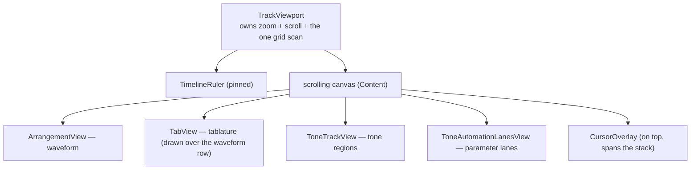

\page guide_2d_views The Editor's 2D Views

*Applies to: Editor-only (the string-color palette it draws with is shared repo-wide).*

The editor's center is a stack of horizontally-scrolling timeline rows — waveform, tablature,
tone track, automation lanes — under a pinned ruler, with a cursor overlay on top. This page
explains the machinery those rows share, then each row, then the checklist for adding a new row.

# One viewport rules them all

`TrackViewport` (`rock-hero-editor/ui/src/timeline/track_viewport.h`) is the single owner of
horizontal zoom (`m_pixels_per_second`) and scroll. It hosts the pinned `TimelineRuler`, the
scrolling canvas that parents every row, and the `CursorOverlay` spanning the whole stack. The
tab lane is laid out to exactly the waveform row's bounds — it draws *over* the waveform.


```mermaid
flowchart TB
    tv["`TrackViewport
    owns zoom + scroll + the one grid scan`"]
    ruler["TimelineRuler (pinned)"]
    canvas["scrolling canvas (Content)"]
    wave["ArrangementView — waveform"]
    tab["TabView — tablature (drawn over the waveform row)"]
    tone["ToneTrackView — tone regions"]
    lanes["ToneAutomationLanesView — parameter lanes"]
    cursor["CursorOverlay (on top, spans the stack)"]
    tv --> ruler
    tv --> canvas
    canvas --> wave
    canvas --> tab
    canvas --> tone
    canvas --> lanes
    canvas --> cursor
```

Three consequences keep the rows pixel-aligned:

- **One time window.** `visible_timeline` is part of the pushed `EditorViewState`; every row
  receives the same value, and all rows map time to pixels with the same linear function
  (`timelineXForPosition` in `editor/core/timeline/timeline_geometry.h`, or its local
  equivalent):

  ```cpp
  float xForSeconds(double seconds, common::core::TimeRange visible_timeline, int width)
  {
      const double duration = visible_timeline.duration().seconds;
      return static_cast<float>(
          (seconds - visible_timeline.start.seconds) / duration * static_cast<double>(width));
  }
  ```

- **One grid scan.** `TrackViewport::refreshTimelineGrid()` computes `visibleTempoGridLines(...)`
  (`editor/core/timeline/tempo_grid_geometry.h`) once per geometry change and pushes the *same*
  line list to the ruler and the canvas. Rows never rescan the tempo map themselves — that rule
  is what fixed the 1/128-grid performance problem, so keep it.

- **One snap function.** `musicalGridPositionForX(...)`
  (`rock-hero-editor/ui/src/timeline/timeline_cursor.h`) converts a pixel to an exact rational
  grid position for *every* gesture — cursor placement, tone-region boundaries, automation
  points. Ctrl bypasses to the 1/960-beat fine grid — and that fine tier is uniform across
  surfaces *and* input families (the off-grid unification): keyboard moves and the sustain
  extent verb compose the same `fine` flag the pointer path uses. The keyboard's stepping has
  its own single primitives next to the grid math (`gridStepBeats` and
  `adjacentTempoGridPosition` in `editor/core/timeline/tempo_grid_geometry.h` — the one
  grid-step rule behind both the caret step and the lane nudge, exact-rational so a coarse step
  from an off-grid position lands on the adjacent line). New gestures must go through these
  helpers, or their snapping will disagree with everyone else's.

The pinned ruler stacks the **song-level** chip rows on top — sections, tempo markings, and time
signatures on the editor chrome, with the active value pinned to the left edge while the song
scrolls — above the ruler body with its measure-number row and tick band; the color steps alone
divide chrome, body, and the content scrolling under it. Each chip drops a dotted leader line in
its own color down to the top of the body, marking its exact position (the body's own ticks take
over from there); leaders draw for every event, even where a chip was suppressed on a dense map,
and every chip paints above every leader. A 1px divider along the bottom edge
separates the ruler from the rows scrolling under it.

(The ruler's bottom band used to carry chord/arpeggio NAME chips. Nothing ever authored a chord
name — the postures both surfaces draw are derived from the notes and carry no name — so the band,
its chips, and `TrackViewport::setShapeLabels` were deleted rather than kept as a row that could
only ever be empty. When names are authored they arrive as a dictionary keyed by a posture, and
the band comes back with them.)

# How rows get data: push for content, sample for live

Two channels exist, and choosing the right one matters:

- **Pushed content state.** The controller derives view-state structs and `EditorView::setState`
  fans them out — `m_tab_view.setState(m_state.tab, ...)`,
  `m_tone_track_view.setState(m_state.tone_track)`, and so on. Rows repaint when state changes;
  no timers poll for content. Large states are shared pointers compared by **pointer identity**
  (`TabView` rebuilds its index only when the pointer changes), so pushing an unchanged state
  is free.
- **Sampled live data.** Anything that moves at playback rate — the transport position, meter
  levels, live parameter values — is deliberately *not* in derived state. Views sample it
  through the const port references bundled in `EditorView::AudioPorts` at render cadence, using
  `juce::VBlankAttachment` (never `juce::Timer`). The cursor repaints only a narrow strip
  (`repaintCursorStrip`), not the whole canvas.

If you are adding something that changes when the *user edits*, push it; if it changes because
*audio is playing*, sample it.

One narrow channel runs the other way, **upward**: when the viewport needs geometry a row owns —
the armed caret square's vertical mask, which the paused-column cursor must cut around — the row
*publishes* it fire-on-change (`TabView`/`ToneAutomationLanesView::setCaretMaskCallback` →
`TrackViewport::setTabCaretMask`/`setAutomationCaretMask`). The viewport never polls a sibling
row's geometry. The reason is the memo
below: sampled-channel derivations are gated by change keys, and a polled value that changes
without a notification freezes inside the memo.

Sampled-channel work is **idle-gated**: `TrackViewport::updateRulerCursor` runs at vblank
cadence but short-circuits on an unchanged `RulerCursorKey` (`track_viewport.h`), and the
content views' `setState`/`setVisibleTimeline` equality-gate so unchanged pushes repaint
nothing. The rule that keeps the memo honest: **every input of the derived value must be a
field of the key** — the pushed caret mask is one — because a missing field freezes the output,
and a frozen derivation shows up as a *lingering* (not one-frame) paint glitch.

# One selection, editor-wide

Exactly one selection exists across all surfaces:
`EditorSelection = std::variant<std::monostate, ChartSelection, ToneRegionSelection,
AutomationPointSelection, TimeSelection>` (`editor/core/src/controller/editor_selection.h`).
Making a selection anywhere replaces it everywhere — two live selections are unrepresentable —
and verbs (Delete, Alt+arrow moves) dispatch on whichever alternative is active.

**Adding a selection kind is the highest silent-fan-out change in the editor.** Because dispatch
is `std::visit`/`holds_alternative`, a new alternative compiles clean nearly everywhere it is
forgotten. The touchpoints:

1. The variant + the new struct in `editor_selection.h`, identified by *value* (ids, exact grid
   position), never by display index, so it survives rebuild pushes.
2. Assignment through `setSelection` (the one non-chart seam — it carries the fret-entry
   invalidation invariant) and the accessors/clears around it in `editor_controller_impl.h`.
3. The verb dispatches: `onSelectionDeleteRequested` and `onSelectionMoveRequested` — a missing
   arm means Delete/moves silently no-op on the new kind.
4. An Esc-ladder rung (\ref guide_keyboard).
5. The `selection_present` derivation in `deriveViewState()` — the view's Delete/Esc guards
   read this one flag.
6. **The lifecycle rules** — the subtlest step. Each kind declares what clears it: on play, on
   seek, on cursor move, on project load/close/arrangement switch (the per-kind split is
   documented at the top of `editor_selection.h` and in `clearCursorCoupledSelection`). A kind
   that forgets to pick dies stale on screen.
7. The view-side highlight render, and tests covering the dispatches plus the lifecycle clears.

The `TimeSelection` alternative (Shift+arrows, 2026-07-20) is the newest worked example: a
grid-locked anchor/focus span, mutually exclusive with object selection by construction, whose
creation demotes the marker to passive through the seek-preserving dissolve
(`dissolveChartCaretInPlace`) — building a range and pressing Space plays from the range.

# The rows

## Waveform — `ArrangementView`

The waveform is drawn by the audio engine, not by editor code: `ArrangementView`
(`ui/src/timeline/arrangement_view.cpp`) owns an `IThumbnail` created through the
`IThumbnailFactory` port, and its `paint` hands the clipped time range straight to the port:

```cpp
m_thumbnail->drawChannels(g, request.bounds, request.visible_range, vertical_zoom);
```

`IThumbnail` (`rock-hero-common/audio/.../song/i_thumbnail.h`) is the one port whose signature
deliberately names `juce::Graphics` — it forward-declares it so callers can draw without any
Tracktion header. The production adapter (`src/tracktion/tracktion_thumbnail.cpp`) wraps
`tracktion::SmartThumbnail` and translates the time range; proxy generation is asynchronous, and
the view renders progress text until it completes. Two details worth knowing: drawing shifts by
`state.audioStartOffsetSeconds()` so asset time aligns with timeline time, and `vertical_zoom`
comes from the asset's normalization gain (`pow(10.0, gain_db / 20.0)`).

## Tablature — `TabView`

`TabView` (`ui/src/tab/tab_view.cpp`) **owns its pointer events while a chart is displayed**: it
claims the whole lane band through `wantsPointerAt` / `hitTest` and forwards Down, Drag, Up, Move
and Exit to the controller as `ChartPointerEvent` intents, plus a right-press context menu; the
controller decides what a press means (select, caret arming, marquee, or a plain seek while
playing). With no chart the lane is pointer-transparent. The yielding component is the *cursor
overlay*, whose `hitTest` returns false wherever a pass-through predicate — installed in
`editor_view.cpp`, asking `TabView::wantsPointerAt` first — declines the point. Its data is a
seconds-resolved projection built once
per edit in **common/core** (`chart/chart_projection.cpp`,
`common::core::makeChartViewState(arrangement, tempo_map)` — the ONE chart scene both surfaces
draw since W9-B's fold on 2026-08-21; promoted from editor/core by plan 30
Phase 1 so the game's 2D tab view shares the same scene model), so painting never queries musical
positions. Because sustains overlap, it keeps a prefix-max index
of note end times and binary-searches the visible note range each paint instead of scanning the
whole chart. It draws each hand-shape span's rail and, for an arpeggio, its brackets; a span's
NAME has no drawn form on either surface, because nothing authors one (see above).

String colors come from the **shared palette** in
`rock-hero-common/ui/string_colors/string_color_palette.h` — a JUCE-free authority (colors are
`uint32_t`) that derives each string's seven surfaces (lane, borders, tail, accent...) from one
base color, Charter-style. The 2D tab lane, the 3D highway renderer, and therefore both products
all color strings through it. The glyph renderer itself is the **shared notation paint core**
in `rock-hero-common/ui` `tab/` (plan 30 Phase 2): `tab_lane_layout.h` holds the framework-free
`TabLaneGeometry` and lane math, `tab_layout_manifest.h` answers "where is this note's head/tail
in pixels" for hit testing, and `tab_paint_core.h` — the one designated juce_graphics-bearing
common/ui header — exposes `paintTabLane`, which `TabView::paint` calls after deriving metrics.
The editor keeps thin delegate functions (`tabStringColor`, `tabLaneCenterY`, ...) on its own
surface so editor widgets and tests are unaffected; the paint core's pixel output is pinned by
exact-color tests in `rock_hero_common_ui_tests`. Those delegates carry no documentation of their
own rules — `tab_view.h` points at the shared declarations instead, because a delegate that restates
the rule it forwards gives the reader two descriptions to reconcile and no compiler to catch the
drift.

Six notation rules inside the paint core are worth knowing before touching a head, because each
is deliberately single-sourced:

- **The head silhouette names the note's kind**, never which hand produced it (a present mark's
  *darkness* says that). `headShapeFor(note)` maps to `HeadShape::{Round, Diamond, Plectrum}` — a
  diamond for anything carrying a harmonic node, a plectrum for a scrape, a circle otherwise. The
  enum is file-local on purpose, so host chrome that must trace a head it did not draw calls the
  exported `strokeTabNoteHeadOutline` instead: re-deriving the rule in the editor left every pick
  slide wearing a circular selection ring around a plectrum head.
- **`tabNoteHeadText(note, fret_at_head)` decides the number a head carries**, and it takes *the
  stop being labeled* rather than reading the note's own fret. Any harmonic whose node is on the
  neck names its node — the predicate is `nodeIsOnNeck`, which excludes only a pinch — because the
  node sets the pitch (a trailing `.0` is dropped so 12 / 7 / 5 stay as narrow as an ordinary
  fret, and the pinch keeps its fret because its node sits off the neck).
  Passing the stop is what lets one rule label *every* head of a gesture: the onset passes
  `note.fret`, a linked slide junction passes the fret the glide has reached, so a harmonic labels
  nodes at all of them instead of a node at the onset and a raw fret at the junctions.
- **The capo is drawn**, as a "Capo N" chip pinned in the lane's top-left corner in the fret-hand
  chips' boxed style — pinned to the bounds rather than the timeline, because a capo has no time.
  The chart stores absolute frets with 0 meaning the capo'd open string, so nothing else in the
  drawn content says where the string floor sits. Crude first treatment (roadmap 25-Q6).
- **The beside-head legato triangle comes from the note's RESOLVED motion**, never from a stored
  direction: `NoteViewState::legato` is a `LegatoMotion` the projection got from `chartResolutions`,
  and the painter simply points the triangle down for `Hammer` and up for `Pull`. `Unjustified`
  draws nothing, so a claim the chart cannot justify is pixel-identical to a plain pick —
  deliberately, per `docs/plans/in-progress/legato-authoring-model.md`. Nothing in the paint core
  knows the rules that produced the value.
- **A stored `LeftTap` is the one exception: it wears its own charting mark** — the tap letter on
  the LIGHT plate (ruled 2026-08-12). The lettered-plate family's hand signature is its FILL
  POLARITY (55-Q1's basis: dark ink marks the picking hand, light the fretting hand), so the
  right-hand tap's dark T and the left-hand tap's light T share a letter without colliding; one
  shared mid-grey rim (`g_plate_rim`, perceptually equidistant from both fills) keeps the two
  polarities at equal visual weight. This is a CHARTING mark — it states how editor verbs treat
  the note, not how it is performed — which is the ruled reason it exists in the editor's 2D lane
  only: the 3D surfaces keep the merged hammer-motion reading, and the game's future 2D tab view
  must suppress it (recorded in roadmap plan 30).
- **A tail's end is the note's own presented end (`NoteViewState::end_seconds`), everywhere.** The
  lane draws to it, `tabNoteLayout` builds the hit rectangle from it, the visible-range prefix
  maximum indexes it, and both paint passes cull on it — one stop, read off the note, so a drawn
  ribbon is always clickable and always in range. There is no second end to keep in step, which is
  the point: a span-extended ribbon once shipped drawn-but-unclickable because the four places did
  not agree.
  The span-implied hold (`ChartViewState::display_hold_ends`) still rides the same projection, but
  it is the **3D board's** — how long a pinned head lasts — and this lane must not spend it
  (ruled 2026-08-22, `docs/plans/in-progress/note-sustain-model.md` ruling 3). A chugged member of
  a strum a hand-shape span holds therefore draws a bare head here and no ribbon: the chord box over
  the strum already says how long the shape stays fretted, and repeating that in the one mark that
  means "this string is still ringing" read as sustain. The board has no chord box, so pinning its
  heads is how it states the same fact. One chart, one hold, two idioms.

One performance rule sits beside the viewport-bounded note range: the two **wavy tail overlays**
(the tremolo band and the vibrato sine) generate only the stretch of a tail the clip can show, via
`visibleTailRun`. Both are functions of the distance from the onset alone, so a clipped run lands
the identical shape — phase never depends on where generation began — and each generator snaps its
run outward onto its own vertex spacing, so the rasterized result is *identical* rather than merely
similar. At full zoom a held tremolo chord would otherwise cost tens of thousands of off-screen
vertices every frame. A test pins that a tail looks the same however the repaint is clipped.

**The Alt reveal** is how the length you cannot see becomes visible while you author it. The lane
draws presented tails, so the ring a note actually sounds for — what `Alt`+wheel edits — is
invisible wherever presentation trimmed or dropped it. Hold `Alt` and every *visible* note shows
that ring; release and the lane snaps back. It is global while held, not selection-scoped: the
question it answers ("what is really ringing here") is about the passage, not about the selection.
`Alt` is the key because `Alt` is already the authoring gate — you see the ring while you are the
one changing it.

**Two styles, one temporary toggle** (`F6`, `ToggleActualRingRevealStyle`). The mark is under
sighting, so both candidates ship until one is chosen and the loser — with the command, the
`ActualRingRevealStyle` enum, and whichever machinery only it needs — is deleted:

- **Tails** (the default, the thing being sighted). The lane redraws in the chart's ACTUAL form:
  every note's tail is its real ring, with its techniques and its payload riding it. Nothing is
  annotated, because the notation itself is the answer. Two glyph consequences follow from drawing
  a form no presentation rule touched, and both are accepted: a **dead note grows a tail** (rule 4
  is a presentation rule, and the actual form has no rules), which reads as how long the mute is
  held; and a shift-slide's arrival, which sits exactly at the presented end, sits strictly inside
  the real ring, so it draws the **linked continuation head** it never draws otherwise.
- **Outline.** The notation stays the presented picture and each ring is annotated with a hairline
  rectangle at tail height, from the onset to the ring's end.

Seven things about it are deliberate:

- **Every visible note, not only the disagreeing ones.** A mark landing exactly on a drawn tail
  *is* the statement "this is the whole ring"; one that appeared only on disagreement would leave
  a reader unable to tell agreement from a reveal that is simply off.
- **The tail style needs a second PROJECTION, not a swapped end.** `EditorViewState::tab_actual`
  is the same chart through `makeChartViewState(..., ChartNoteForm::Actual)`, published beside
  `tab` under the same memo key. A view-side end swap was the obvious cheaper move and is wrong:
  the presented state has already CLIPPED the payload points its trims removed, so a bend curve or
  a trailing waypoint that left with the tail cannot be put back by lengthening it. The two forms
  differ in `notes` and in nothing else — holds, spans and their arrival kinds, fret-hand
  placements and their approach ramps, the string count and the capo are all derived from the
  presented stream in either form, so swapping forms moves no other mark on the lane. It costs a
  second projection per chart revision, which a sustain gesture bumps per wheel notch; that is
  accepted for the sighting, and the reason it is not built lazily is that a lazy build would
  require the controller to know the reveal is on, which the design forbids.
- **The data is editor-only, and the projection says so.** `actual_end_seconds` rides
  `ChartViewState` beside `display_hold_ends`, resolved from the SAVED note rather than the
  presented one; the outline style and the 3D ring marks read it. No game surface reads it and
  none may — **scored = presented** (`docs/plans/in-progress/note-sustain-model.md` ruling 4) —
  and that contract holds structurally for the whole actual form too, because `makeHighwayViewState`
  composes the projection with no form argument, so no board, game or scorer state can be anything
  but presented. `NoteViewState` deliberately does *not* gain the field: that struct is one form
  end to end, and a second undrawn end inside it would hand every reader two lengths to choose
  between. Treat the summary here as a gloss: the field's own Doxygen block (`chart_view_state.h`)
  is the one authoritative statement of who may read it, and the projection site points there
  rather than restating it.
- **The reveal is not hit-testable, in either style.** Hit testing, selection, marquee and
  `Alt`+click insert all resolve against the presented projection the controller published
  (`displayedTabProjection`), so a tail only the reveal draws cannot be clicked, boxed, or landed
  on. `Alt`+wheel is unaffected because it acts on the selection, not on what is under the
  pointer. Inside `TabView` this needs no enforcement: everything paint reads goes through
  `drawn()`, and the only projection reads outside paint are the string count and whether a chart
  exists, which are identical in both forms.
- **The 3D preview has its own sighting of the same datum, and it is a LATCH, not a held key.**
  `F1` there cycles a floor band under each note — off, filled, outlined — running the same
  actual ring (`HighwayDiagnosticsOptions`, \ref guide_3d_highway). The idiom deliberately
  differs from this lane's held `Alt`: the held reveal is the main window's state (the preview
  only reports the modifier changes JUCE hands it, see \ref guide_keyboard), and a rig you are
  looking at while navigating with the caret keys wants both hands free. Same fact, two
  surfaces, two idioms — the pattern the highway and the tab already use for the hold.
- **The outline is editor furniture, so it never enters the paint core.** In that style the mark
  is drawn in `TabView::paint` after `paintTabLane`, exactly like the selection ring, in
  `EditorTheme::lane_overlay` at half alpha — the ink the caret square and the insert ghost
  already share, because the reveal belongs to the same `Alt` family (what the next edit acts on)
  and because a mark in the *accent* on every visible note would read as a lane-wide selection.
  Its rectangle is the actual form's own `tabNoteLayout` tail span, so it traces exactly where
  that form's tail sits rather than restating the geometry. The tail style needs none of this: it
  IS the notation, drawn by the shared paint core with no editor ink at all.
- **Each form is culled by its own index.** `TabView` pairs every projection with the running
  maximum of that form's note ends (`LaneForm`), so the notation never keeps a note in range for a
  length it no longer draws and a ring outlasting its tail stays in range for as long as it is
  drawn. The tail style culls inside `paintTabLane` with the drawn form's table; the outline style
  culls in its own loop with the actual form's, through `tabVisibleSpan(metrics, clip)` — exported
  from `tab_paint_core.h` for precisely this, host chrome that must cull by the same widened clip
  the notation does.

The key itself never reaches the editor core. `EditorView::syncActualRingReveal` asks the OS
whether `Alt` is down and hands the answer to `TabView::setActualRingReveal`, which repaints only
on a change. No JUCE callback reliably reports a held modifier, so that one authority —
`juce::ComponentPeer::getCurrentModifiersRealtime()`, the realtime query rather than the cached
modifier state — is sampled by edge: `modifierKeysChanged` for the instant edge wherever JUCE
delivers it (the 3D preview forwards its own deliveries, whose parent chain would otherwise end in
that window); a dedicated mouse-listener member registered for all nested children and overriding
only `mouseMove` (never the view itself — a deep listener also receives every child's wheel, and
that once doubled every sustain step), for the ON edge a widget swallowed
(a `juce::Slider` under the pointer overrides `modifierKeysChanged` without forwarding, and only
the mouse move JUCE fabricates on every modifier change gets through); and a 30 Hz poll that runs
only while the reveal is on, for the OFF edge that cannot be missed — a release while the pointer
is over the 3D window, or anywhere else, shows within one tick. Keyboard focus leaving the editor
window is treated as a release outright (`focusOfChildComponentChanged`), not sampled: `Alt` is
still down mid-`Alt`+Tab. \ref guide_keyboard has the general shape.

## Tone track — `ToneTrackView`

Renders the gap-free tone regions as spans with name chips pinned to the visible left edge, and
carries the editing grammar for boundaries: click selects, edge-drag moves a shared boundary
(snapped; Ctrl fine grid), Alt enters the insert quasimode with a ghost boundary, Esc cancels.
Boundaries and the split ghost render on the tempo grid's own integer pixel columns
(`gridAlignedX`; the ghost is a 1px column fill), so a preview sits exactly on the line it will
commit to.
Every gesture ends as **one intent** through its `Listener`
(`onToneBoundaryMoveRequested`, `onToneChangeInsertRequested`, ...) — the view never
mutates the model. Its input is the `makeToneTrackViewState` projection; the active region
highlight advances by sampling `ITransport` at vblank cadence.

*Design in flux: the active-vs-selected semantics of tone regions are proposed to change
(`docs/plans/in-progress/tone-active-vs-selected.md`, awaiting sign-off) — treat the selection
behavior described here as current, not final.*

## Automation lanes — `ToneAutomationLanesView`

One lane per automated parameter plus a trailing "+" lane, from the `makeToneAutomationViewState`
projection. The pointer/edit pipeline is **controller-centric** (2026-07-19), mirroring the tab
lane: the view forwards raw pointer events through a `ToneAutomationPointerEvent` (the sibling of
the tab lane's `ChartPointerEvent`) and paints the `insert_ghost` / `drag_preview` the controller
publishes back; the controller owns every hit-test, snap, placement, and drag-gesture decision, so
that policy is testable without JUCE. The view keeps only presentation — lane-resize, menus,
readouts, the typed-value callout, the tracking vblank. Each edit still commits as **one full
point-list intent on release**. The point gesture no longer needs a defer-mid-push guard: the
controller freezes it at press, so a mid-drag lane rebuild republishes the preview instead of
yanking the point from under the user (the view still defers state pushes during the presentational
lane-resize drag). Selection is identified by value (instance id, parameter id, exact grid
position), not by index, so it survives rebuild pushes. Unauthored lanes track the live parameter
value by sampling `IToneAutomation` per vblank.

A scope note on editing: the interaction *grammar* (Ctrl precision, Alt create-quasimode, Shift
extend, snap always on, Esc cancel, one undo entry per gesture —
`docs/plans/in-progress/editing-interaction-model.md`) is settled and binding. It is implemented
on the tone track, the automation lanes, and — increasingly — the tab lane's chart editing (the
caret/marker model, note selection, typing-inserts, and Alt+click note create;
`docs/plans/roadmap/40-chart-editing.md` and
`docs/plans/in-progress/chart-span-and-selection-model.md`). Tempo-anchor editing is **not built
yet**. This guide gives the chart surfaces no detailed tour of their own; new editing surfaces
adopt the grammar as they arrive.

# Adding a new timeline row — silent steps

All of these compile clean when forgotten:

1. **View-state + projection** in editor core (`*_view_state.h`, `make*ViewState(...)` in a
   feature folder), derived in `deriveViewState()` and added to `EditorViewState`.
2. **The component**, following \ref guide_add_view (Listener, `setState`, theme).
3. **Viewport wiring** in `TrackViewport`: construct/parent the row in its canvas, stack it in
   the layout, and plumb `setVisibleTimeline`, `setGridLines` (if it draws the grid),
   `setVisibleContentLeft` (if it pins chips), and height into the canvas layout. If the row
   can host an armed caret, publish its caret mask through the upward channel (see above) —
   the viewport must never poll it.
4. **`EditorView::setState` fan-out** — the row exists but renders defaults forever without it.
5. **Snapping through `musicalGridPositionForX`** for any gesture, and one-intent-on-release
   commit semantics.
6. **Tests**: projection tests in editor-core (headless), wiring tests via the UI harness.
