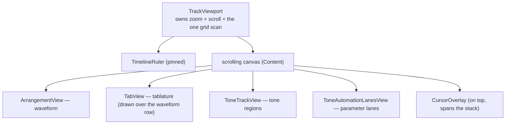

\page guide_2d_views The Editor's 2D Views

*Applies to: Editor-only (the string-color palette it draws with is shared repo-wide).*

The editor's center is a stack of horizontally-scrolling timeline rows — waveform, tablature,
tone track, automation lanes — under a pinned ruler, with a cursor overlay on top. This page
explains the machinery those rows share, then each row, then the checklist for adding a new row.

# One viewport rules them all

`TrackViewport` (`rock-hero-editor/ui/src/timeline/track_viewport.h`) is the single owner of
horizontal zoom (`m_pixels_per_second`) and scroll. It hosts the pinned `TimelineRuler`, the
scrolling canvas that parents every row, and the `CursorOverlay` spanning the whole stack. The
tab lane is laid out to exactly the waveform row's bounds — it draws *over* the waveform.


```mermaid
flowchart TB
    tv["`TrackViewport
    owns zoom + scroll + the one grid scan`"]
    ruler["TimelineRuler (pinned)"]
    canvas["scrolling canvas (Content)"]
    wave["ArrangementView — waveform"]
    tab["TabView — tablature (drawn over the waveform row)"]
    tone["ToneTrackView — tone regions"]
    lanes["ToneAutomationLanesView — parameter lanes"]
    cursor["CursorOverlay (on top, spans the stack)"]
    tv --> ruler
    tv --> canvas
    canvas --> wave
    canvas --> tab
    canvas --> tone
    canvas --> lanes
    canvas --> cursor
```

Three consequences keep the rows pixel-aligned:

- **One time window.** Every row maps time to pixels with the same linear function
  (`timelineXForPosition` in `editor/core/timeline/timeline_geometry.h`, or its local
  equivalent):

  ```cpp
  float xForSeconds(double seconds, common::core::TimeRange visible_timeline, int width)
  {
      const double duration = visible_timeline.duration().seconds;
      return static_cast<float>(
          (seconds - visible_timeline.start.seconds) / duration * static_cast<double>(width));
  }
  ```

  over the same range, which `TrackViewport` hands to every row it hosts
  (`TrackViewport::canvasTimeline`, pushed from the canvas layout). That range is the session's
  `visible_timeline` from the pushed `EditorViewState` **preceded by a gutter's worth of time**:
  the canvas starts a little before the timeline does, so the first beat's note head — heads are
  centered on their instant, so half of one hangs left of it — has canvas to draw its left half
  on at the leftmost scroll position instead of clipping. The gutter is the same window-pin
  fraction playback follow parks the moving cursor at, so scrolling fully left and a follow shift
  leave the working position at the same screen x. Rows do **not** read `visible_timeline` off
  the state themselves: the shell that sizes the canvas owns the range its width represents, and
  a row that took the session range instead would draw its notation a gutter out of place.

- **One grid scan.** `TrackViewport::refreshTimelineGrid()` computes `visibleTempoGridLines(...)`
  (`editor/core/timeline/tempo_grid_geometry.h`) once per geometry change and pushes the *same*
  line list to the ruler and the canvas. Rows never rescan the tempo map themselves — that rule
  is what fixed the 1/128-grid performance problem, so keep it.

- **One snap function.** `musicalGridPositionForX(...)`
  (`rock-hero-editor/ui/src/timeline/timeline_cursor.h`) converts a pixel to an exact rational
  grid position for *every* gesture — cursor placement, tone-region boundaries, automation
  points. It takes the **placement quantum**, not the grid value: `placementQuantumNoteValue(...)`
  is the one authority, and `EditorView::setState` derives it once per push and hands the same
  value to every placing surface, so no view can snap by a rule the controller did not use. No
  modifier composes a second answer — grid snap (`Ctrl+G`) is the only thing that moves it. The
  keyboard's stepping has its own single primitive next to the grid math
  (`adjacentTempoGridPosition` in `editor/core/timeline/tempo_grid_geometry.h` — the one step
  rule behind the caret step, the lane nudge and every verb that authors or moves a ring,
  exact-rational so a step from a position between lines lands on the adjacent one). New gestures
  must go through it, or their snapping will disagree with everyone else's.

The pinned ruler stacks the **song-level** chip rows on top — sections, tempo markings, and time
signatures on the editor chrome, with the active value pinned to the left edge while the song
scrolls — above the ruler body with its measure-number row and tick band; the color steps alone
divide chrome, body, and the content scrolling under it. Each chip drops a dotted leader line in
its own color down to the top of the body, marking its exact position (the body's own ticks take
over from there); leaders draw for every event, even where a chip was suppressed on a dense map,
and every chip paints above every leader. A 1px divider along the bottom edge
separates the ruler from the rows scrolling under it.

Every chip is an object the one editor-wide selection can hold, so every row raises intents through
`TimelineRuler::Listener` (the tone strip's shape, for the tone strip's reason — seven distinct
intents, two of them prompts the ruler must not own). A click on any chip reports a selection; the
**section** row, the one chip row that is also an editing surface, adds a double-click rename prompt
and the right-click section menu. The chip double-click is the pointer form of the rename; the
keyboard forms are `Enter` and `Ctrl+R` on a selected chip, plus the section's own chord `Ctrl+M`,
which reads the CURSOR and never the selection: a section standing on the downbeat of the measure
the cursor is in is renamed, otherwise one is inserted there (2026-09-14; `F2` is gone as of
2026-09-12). The tempo and
time-signature chips carry no verbs yet: they are selectable so the keyboard's vertical walk can
stand on them. The walk is not the only keyboard route onto a chip row: each kind's
`Ctrl+Shift`+letter jump (`Ctrl+Shift+M`, `Ctrl+Shift+B`, `Ctrl+Shift+/`, built 2026-09-15) lands
straight on that row through the walk's own landing, and is silent where the row holds nothing. A
chip click deliberately does **not** seek, unlike every other click on the ruler: a chip is an
object, and a seek would clear the very selection the click just made. **The exception is
a closed marker plane** (`marker_edits_enabled` false, i.e. while the transport plays): there is no
selection to make, so a chip column behaves like every other ruler column and seeks —
swallowing the press would turn the chips into dead zones on a surface whose whole job is placing
the cursor. The
double-click rename does not open there either, and every section-menu row is disabled. Each placed
`RulerChip` remembers the index of the marker it stands for in its row's source, so a click resolves
to a `GridPosition` or measure rather than inverting the ruler's own pixel mapping — the pinned
active chip included, whose anchor is off-screen.

All three rows place through one template, `placeChipRow`. The selected chip claims its room before
the greedy overlap pass, so on a dense map its neighbours are suppressed instead of it, and a
selected pinned chip never yields to the chip scrolling in — the keyboard must always be able to see
what it selected.

There is no chord/arpeggio NAME band, because nothing authors a chord name — the postures both
surfaces draw are derived from the notes and carry none — and a row that could only ever be empty
is worse than no row. When names are authored they arrive as a dictionary keyed by a posture, and
the band arrives with them.

# How rows get data: push for content, sample for live

Two channels exist, and choosing the right one matters:

- **Pushed content state.** The controller derives view-state structs and `EditorView::setState`
  fans them out — `m_tab_view.setState(m_state.tab, ...)`,
  `m_tone_track_view.setState(m_state.tone_track)`, and so on. Rows repaint when state changes;
  no timers poll for content. Large states are shared pointers compared by **pointer identity**
  (`TabView` rebuilds its index only when the pointer changes), so pushing an unchanged state
  is free.
- **Sampled live data.** Anything that moves at playback rate — the transport position, meter
  levels, live parameter values — is deliberately *not* in derived state. Views sample it
  through the const port references bundled in `EditorView::AudioPorts` at render cadence, using
  `juce::VBlankAttachment` (never `juce::Timer`). The cursor repaints only a narrow strip
  (`repaintCursorStrip`), not the whole canvas.

If you are adding something that changes when the *user edits*, push it; if it changes because
*audio is playing*, sample it.

One narrow channel runs the other way, **upward**: when the viewport needs geometry a row owns —
the armed caret square's vertical mask, which the paused-column cursor must cut around — the row
*publishes* it fire-on-change (`TabView`/`ToneAutomationLanesView::setCaretMaskCallback` →
`TrackViewport::setTabCaretMask`/`setAutomationCaretMask`). The viewport never polls a sibling
row's geometry. The reason is the memo
below: sampled-channel derivations are gated by change keys, and a polled value that changes
without a notification freezes inside the memo.

Sampled-channel work is **idle-gated**: `TrackViewport::updateRulerCursor` runs at vblank
cadence but short-circuits on an unchanged `RulerCursorKey` (`track_viewport.h`), and the
content views' `setState`/`setVisibleTimeline` equality-gate so unchanged pushes repaint
nothing. The rule that keeps the memo honest: **every input of the derived value must be a
field of the key** — the pushed caret mask is one — because a missing field freezes the output,
and a frozen derivation shows up as a *lingering* (not one-frame) paint glitch.

# One selection, editor-wide

Exactly one selection exists across all surfaces:
`EditorSelection = std::variant<std::monostate, ChartSelection, ToneRegionSelection,
SongSectionSelection, TempoAnchorSelection, TimeSignatureSelection, AutomationPointSelection,
AddAutomationLaneRowSelection, TimeSelection>`
(`editor/core/src/controller/editor_selection.h`).
Making a selection anywhere replaces it everywhere — two live selections are unrepresentable —
and verbs (`Enter`, `Ctrl+R`, Delete, Alt+arrow moves) dispatch on whichever alternative is active.
That dispatch is why the ruler's section chips needed almost no chords of their own: `Enter`
restates the selected section, `Ctrl+R` renames it (`RenameSelection`, `0x1405`, which also renames
a selected tone region's TONE and is silently inert on every kind with no name), `Delete` deletes it
and `Alt+←/→` moves it one MEASURE (a section starts on a downbeat and nowhere else, so a
measure is its step) — all by reaching a new alternative. The one chord a section owns is
`Ctrl+M`, which under the marker grammar signed 2026-09-12 and re-ruled 2026-09-14 reads the cursor
and never the selection: it restates the section standing at the cursor's measure downbeat, else
inserts one there. `F2` is retired. A selected tone region answers `Alt+←/→` on its START, the
tone
change it opens, one placement-quantum line per press. Either marker's landed move ends in
`followMovedMarker`, which brings the paused cursor to the new start so the edit is in view; a
pointer drag of a tone boundary leaves the cursor, since the edge is already under the mouse.

Inside the chart alternative there is a second axis, the selection **unit**: a `ChartSelection`
holds `ChartSelectionKey` values, and that key is a **sum** —
`std::variant<ChartNoteKey, ChartKeyframeKey>` (`chart_selection.h`). The first is named by a
`ChartSlotKey`, the `(position, string)` the note stream is keyed by; the second is not, and that
is why the key is a sum rather than a kind tag beside a slot. A
note carries many keyframes, so a keyframe's identity is `(note slot, offset)` — the authored
beat-fraction offset and never an index, because removing an earlier keyframe shifts every later
index and moves no offset. Carrying that offset as a field only one kind uses would make "a note
key with an offset" spellable and owe every reader a rule about what it meant; as a sum neither
shape exists to be misread.

One sorted-unique sequence per alternative, one set of mutations written over whatever
(sequence, element) pair an alternative maps to — `ChartSelection::visitSequence` is that single
mapping, so a mutation never branches on kind and the keyframe sequence can hold a different
element type than the two slot-keyed ones. Every verb reads its own kind's operand as a plain
list (`notes()`, `keyframes()`) and a verb a kind has no meaning for simply reads an empty one,
which is what keeps the technique verbs free of keyframe guards.

**Every note is TYPED, a click never creates, and every entry key has TWO PLANES — one sentence,
and every entry case below derives from it** (`ring-ends-and-authoring-planes.md`, *The keys*,
2026-09-23). A key first finds its OPERAND — the selection, else the armed caret's slot — and its
plane decides what it does there. The BARE key says "a note here": at the caret, a HEAD at the
typed fret on an EMPTY slot and at a ring's EXACT END alike — at the end it is simply the next
note, the ring already stopping there, which is what makes sequential entry safe, whatever that
end states — the head under the caret RETYPED, and STRICTLY INSIDE a ring the head that CUTS it
(`planCutRing`: the ring is divided at the slot, the new head is struck at the typed fret with
strike defaults and takes the ring's remainder, the keyframes past the cut ride it, and a
statement standing exactly at the cut becomes the origin's end statement — an arrival where it
names the new head's own stop, a slide-out onto it where it does not). The `ALT` key says "a
point on the ring here": on the ring that covers or ends at the operand's instant, a POINT at the
typed fret strictly inside, the END STATEMENT at the end, and a statement already standing there
selected and retyped, never doubled; where no ring reaches the operand it does exactly what the
bare key does. `Insert` and `Alt+Insert` are the same two planes with the digit SUPPLIED — the
fret ALREADY IN FORCE at the caret (`chartFretInForceAt`: inside a ring the stop its path states
there, past a ring's end the last pitched stop of the string's latest note): a head, the cut, or —
where the digit would retype — the object SELECTED; a silent point, or the end statement at the
fret in force, which where a head at that stop abuts is the ARRIVAL the chart then proves, a shift
slide in one key (`EditorAction::InsertAtCaret`, `EditorAction::InsertRingPoint`). The ring plane's
reveal rides in `Alt` because a slot just before a head can look blank while lying inside a ring's
ending zone, past its ink end, and that plane states a point on exactly that stretch. The redirect
is a property of ONE slot: over a selection of more than one element the plane is ignored and the
key retypes everything selected. A pointer press, under every modifier, arms the caret and selects
what it HIT and creates nothing. A point that merely restates the fret the path is already running
on says nothing, so it is silent authoring state — no undo entry, gone when the note leaves focus,
never written. A fret-stating point inside an OPEN STRING's tail is refused by chart law
(`OpenStringSlide`) and paints the red pending box. The keymap side is \ref guide_keyboard.

**The SPLIT (`Shift+L`) and the CUT (a bare digit or `Insert` inside a ring) divide a ring by ONE
walk**, `splitNoteIntoProducts` — the split at a selected point, the cut at the caret with a
struck head in place of the severed one. Under the split the point becomes the new
head; the original note ends exactly on it; the new note opens in the state the hand holds — its
stated fret, with a bend in force as its onset bend and vibrato in force opening it vibrating; every
keyframe after it rides the new note, a slide-out included; a glide cut mid-leg leaves the first
note holding its stated fret while the new note travels on to the arrival; and the first note's
arrival stands AT the cut, on the new head itself, which the chart then PROVES is an arrival rather
than a slide-out — it names the very stop the new head is struck at, at the same instant
(`arrivesIntoNextHead`). Presentation moves nothing: the ink stops one margin before that head and
the arrival keeps its stored instant, so there is no retreat to compute and no crowded-leg case to
repair: a grid-step ring splits with nothing said about it. A silent arrival is KEPT, unlike a
silent slide-out — it wears a linked head at its stored instant, drawn under the reveal, so it is
ordinary authoring state. The walk has two callers and one rule. A SCRAPE is refused by both:
one picking-hand gesture has no junction. **The same chord JOINS a selected
HEAD back onto its predecessor's path**, written as this walk's exact inverse — the arrival is
already standing at the junction and the merge takes it over — so split and join round-trip byte
for byte. The single-press rule now forbids TRUNCATION only — a cut divides and deletes nothing —
and NOTHING SINGLE-PRESS TRUNCATES A RING OR CLIPS A KEYFRAME. The ring clamp still
exists — for load, for import, and for every editing verb whose result lands a head inside a
ring, which the plan gate normalizes exactly as a loaded chart is (`finalizePlan`). That
truncation SHORTENS the ring and rides its end's own statement back to the new end — onto the
landing itself, which is where the chart then says the slide-out or the bend completes; it never
DELETES a statement. The clip reports an authored statement lost — a keyframe past the landing
erased, a stated value the ridden end statement overwrote, vibrato a point on the landing stated
and shed (`clipPayloadsToSustain`, `TailTruncation`) — and the gate refuses the whole plan on
that report, for every verb and in both directions: the statement belongs to a note the charter
may never have touched, and the clip would leave no record of it. A keyframe standing exactly ON
the landing survives the clip and stands there, so that landing is allowed.

Four consequences worth knowing before touching this:

- **A keyframe sits on a slot of its own, so the caret stands on it exactly as on a note.** Its
  slot is the instant its offset reaches along the ring, on its note's string, and the chart's laws
  make that slot exclusive of any onset (a keyframe lies strictly inside its ring; a ring
  reaches but never passes the next onset of its string). `chartCaretSlotFor` maps either kind to
  its slot, and `chartObjectAt` is its inverse — the ONE occupancy question, answering the note at
  a slot or else the keyframe STRICTLY INSIDE the ring covering it. Caret arming re-derives the
  selection through it, so the
  armed-caret invariant ("the selection is what sits under the caret") reads the same for both
  kinds: the arrows stop on keyframes as they stop on notes, a click on a junction arms there, and a
  lone keyframe's nudge carries the caret with it. That inverse is also the whole of what an entry
  gesture has to ask: arming the caret SELECTS whatever `chartObjectAt` answers, so a digit typed
  where a head or a point already stands is a retype of the selection rather than a placement, and
  no entry verb needs a rule of its own for an occupied slot. A ring's END STATEMENT is the one
  object no slot holds — it belongs to the ring that ends there rather than to the slot the next
  head starts on — so the walk and the pointer carry its KEY into the landing instead
  (`armChartCaret`'s `object`), which is what keeps a bare digit at that slot always the next
  note. Every note sounds, so those two
  exclusions leave no slot where a note and a keyframe both stand: the question has one answer
  everywhere and nothing to arbitrate.
- **Keyframes publish as drawn positions, not as chart identity.** `ChartEditViewState` carries
  `selected_keyframes` as `ChartKeyframeRef{note_index, keyframe_index}` beside the note index
  list, resolved against the projection the lane hit-tested; presentation drops no keyframe, so
  only a key an edit removed resolves to nothing and simply wears no ring.
- **THE SELECTED OBJECT DRAWS LAST**, and that is host chrome rather than a z-order in the paint
  core. The lane paints its notes in chart order, so an ARRIVAL standing at the very instant the
  head it glides into is struck at is covered by that head: the accent ring would trace a mark the
  charter cannot read. `TabView` therefore redraws the mark it is about to ring — the linked head,
  through the core's own drawer (`paintTabKeyframeHead`), so the redrawn mark cannot differ from the
  drawn one by a pixel. A chip needs nothing, chips already drawing above every head, and a selected
  HEAD keeps drawing over the arrival, as the instant's owner should.
- **The ring plane at the exact END of a tail authors the end's statement.** The slide-out is the
  keyframe at the ring's end (`slideOutKeyframe`, `chart.h`), so the caret standing on the end slot
  and `Alt`+digit or `Alt+Insert` pressed there plant it exactly as they plant a point anywhere
  else on the ring — one gesture, one object kind — the digit typing its fret, `Insert` supplying
  the fret already in force. `Alt` is the reveal as well: a slot just before a head can look blank
  while lying inside a ring's ending zone, and this plane states a point on exactly that stretch.
  The end slot is where the two planes show plainest: a BARE digit there is simply the NEXT NOTE,
  the ring already stopping at that instant with nothing to divide and nothing to shorten —
  exactly what keeps sequential entry safe — whatever the end states, while the ring plane names
  the end. Sequential entry meets the covered case only past the grid: the slot after a grid-step
  ring IS that ring's end, while a ring deliberately lengthened past its grid step makes the
  following slot a covered one, where a bare digit CUTS the ring instead. Where a statement
  ALREADY stands on that end, the ring plane SELECTS it — retyped by the digit, left selected by
  `Insert` — never doubled; and the one selected head the caret is armed on is the one selection
  the ring plane reaches past, naming the ring that ends at it.
  Its slide-out chip is a selection citizen
  like any keyframe: click it, or step onto it from either side — the walk stops on the end
  statement before the head sharing its instant, and the arrows honour that order at every slot, so
  `→` onto the shared slot lands on the statement and a second press takes the head, while `←` from
  the head names the statement without moving and a second press leaves. `Shift+Tab` reaches it the
  same way. It wears
  the accent ring traced on the chip's box (`tabSlideStopLayout` lays the chip out, mirroring
  `drawSlideLines`), a digit retypes it, Delete clears it. One that falls toward the fret already in
  force says nothing (`keyframeSaysNothingNew`) and is treated like every other silent point: it
  DRAWS ITS CHIP — the painter skips the diagonal for a leg that travels nowhere, never the mark —
  so it can be selected, retyped and deleted, and it goes with the rest when its note leaves focus
  (`dissolveSilentKeyframes`). A point never moves because the ring did: growing the
  ring past a slide-out leaves it as a pitched stop with the tail running on, shrinking a ring
  exactly onto its last stated fret makes that fret the slide-out — but only where the landing costs
  the point nothing and states something, which is the previous sentence's other half:
  `ringEndMayLandOnLastKeyframe` (`chart.h`) grants the landing only on a keyframe stating a fret,
  nothing else, and a fret the path does not already hold there, so a point carrying vibrato or a
  bend, and one repeating the fret in force, each hold the ring at the nearest grid line ABOVE them
  instead — a shrink neither deletes a statement nor authors a slide-out nothing draws. And a slide-out's
  ring shrinks no
  further. The chip is the slide-out's own handle — `Alt+←/→` on it drags the ring's end with it, and
  the way past the floor above is moving the point itself LEFT. Only the chip's own step moves the
  end: every other point stays STRICTLY inside its ring, so a step that would reach the end is
  refused exactly as one onto the onset is, and a move never turns a point into a slide-out (user
  ruling, 2026-09-21 — kind is not the move verb's to change). A STATEMENT AT A RING'S END MAY SIT
  EXACTLY ON THE NEXT HEAD OF ITS OWN STRING (user ruling, 2026-09-21): the chart holds the truth,
  and nothing stored spaces it — a note moved onto a slide-out truncates that ring to the landing and
  the slide-out rides onto it. A truncation may SHORTEN a ring and never lose a statement: the plan
  gate refuses any that would (above). No entry gesture truncates: a digit on a
  covered slot states a POINT and never a head, and `Shift+L`'s disconnect makes an existing point
  the new head, carrying every later one onto the new note. Stepping a point (`Alt+←/→` on a chip)
  gives the SAME answer as growing a ring into that head (user ruling, 2026-09-21): the SLIDE-OUT — the
  one point that carries the ring's end — steps onto the head and PARKS there, a step past it landing
  on the head rather than refusing, exactly as `planAdjustSustain` clamps
  (`chartSteppedKeyframeOffset` and the duration verb both ask `ringEndWithinBound`). Every other
  point is bounded by its own ring's END instead, and a step that would reach it is refused, so a
  move never turns a point into the slide-out. Presentation moves no keyframe: the ink stops one
  minimum sustain distance before the onset that binds the tail (presentation rule 1), and a
  statement standing past that crop — an end statement on the next head included — is in the
  ring's ENDING ZONE, drawn at its stored instant only under the reveal. A drawn chip is keyed by
  the offset the chart states (`KeyframeViewState::offset`), so click, caret and the accent ring
  keep reaching the statement itself. EVERY keyframe is published and reachable
  (`NoteViewState::keyframes`), whatever it states, and wears the mark of what it states
  (`KeyframeMark`, decided once by the projection): a position wears its stop's linked head or
  chip, a vibrato change — with or without a bend beside it — a linked head printing the fret in
  force, and anything else — a bend alone, or a point stating nothing — the curve's dot where the
  drawn curve runs at its instant (`bendCurveYAt`), a bend being all such a point can go on to
  state.
  `tabKeyframeLayout` lays every one out for the paint, the click and the accent ring alike (a
  disc around a dot). That head prints where the hand really is because no vibrato change may
  stand mid-slide (`shedMidTravelVibrato`); a bend may, and its dot rides the curve, not the
  slide line. The stops alone (`NoteViewState::slides`) are the gesture's geometry, which every
  glide consumer walks.
- **The PENDING ENTRY is the lane's only entry preview** — there is no insert ghost. A DIGIT typed
  at an armed caret — a head on an empty slot or at a ring's exact end, a point on the path where a
  ring covers it — wears the pending box at the slot, red where the gate refuses the fret, and a
  valid value's plan is projected into the published chart at once, so what it creates and its
  effect on the tail draw as ordinary marks under the box while the stored chart and history stay
  unchanged. Discarding the entry drops the projection; settling stores exactly what was drawn, and
  the box's disappearance is the settle. A note retype's box rides what it retypes instead — every
  affected head or satellite — and is not projected. A selected fret-hand position's fret IS
  projected, like a creation (a fret change keeps every placement's index), and its box fills the
  placement's own chip (`ChartPendingFretHandPosition`, `paintTabPendingEntryPlate` over
  `tabFhpChipBounds`), carrying the chip's committed text and derived window, or the typed text when
  refused. Nothing else needs previewing, because nothing else authors: the pointer creates under
  no modifier, and what `Alt` shows while it is held is the ring REVEAL — every visible note drawn
  on to its stored ring end — not a preview of a placement.
- **The harmonic node picker is a POPUP, and the lane draws nothing for it.** `H` reaches the
  controller as its own action, and where the selection offers more than ONE CHANGE the CONTROLLER
  asks the view for the choice — after its settle prologue — through the port method
  `IEditorView::showChartHarmonicNodePicker`. Which rows CHANGE anything is the PLANNER's answer:
  the verb plans every node row and the clear over the live chart, and a `NoChange` plan is not a
  change — zero of them is an inert press, one applies at once, and several ask. Every node row its
  label names is shown (a ticked row included), and the **"No harmonic"** row LEADS them, ruled off
  by a separator, only where the clear itself changes something — so `H` on a CARRIER reopens the
  menu only where its label names OTHER nodes as well; a carrier whose label names a single node (7,
  12, 19, 24) has just the clear left to do and clears in the keystroke. The payload is
  `ChartHarmonicNodePicker{note, choices, preselected}`, `choices` a variant list of
  `ChartHarmonicNodeChoice{node, partial, current}` and `ChartHarmonicClearChoice` with the clear
  first when offered, and `preselected` an index into it. The view's answer is a `juce::PopupMenu`
  anchored at
  `TabView::noteHeadBounds(picker.note)` — the head of the member the rows were READ from, the
  object the choice is about, which need NOT be the earliest selected note, rather than the mouse a
  keyboard verb has no reason to be near. Rows read
  `<node> · <ordinal> partial`: the value through the ONE label authority `harmonicNodeText`, so a
  row and the head it will produce print the same number, and the ordinal beside it because our
  frets are absolute where published tab is capo-relative. The rows are NUMBERED from 1 in the order
  given, which is what lets any row open SELECTED at all: JUCE matches `withInitiallySelectedItem`
  against item IDs, so an unnumbered row could never be preselected. **The node the ANCHOR member —
  the note the rows were read from, whose head the menu sits on — is touching wears a TICK, and the
  PRESELECTED row is what the old toggle would have done** —
  "No harmonic" where every selected note carries a fret-hand harmonic, the lowest partial that
  changes something (the harmonic a charter
  means by the label) otherwise — so `Return` still takes the common case in two keystrokes, clearing
  a harmonic and setting the lowest partial on a plain note. `Esc` dismisses with the note
  untouched. Nothing is PREVIEWED because nothing is provisional: the chosen row commits at once, so
  the lane carries no pending-harmonic layer and the committed head is the only head there ever is.
  Ordinary menu items at platform size are also the only targetable form this choice has — the
  lane's own ~26 x 16 px node labels stay a display, never a target.
  - **The anchor is the head's PRE-GLIDE position, and that is visible.** A selected head off the
    viewport starts the window-follow glide that will centre it, while the popup is placed from
    where the head sits when the press lands, so it can open at a screen edge and stay there while
    the lane scrolls under it. With no head to anchor on the popup falls back to the lane.
- **The bend picker is the harmonic picker's sibling, asked about ANCHORS rather than a
  selection.** `B` (and its ring twin `Alt+B`) finds its operand like a digit — the selection, else
  the armed caret's slot — but a bend can create no note and split no ring, so on a covered slot the
  bare key reaches the RING (`chartModifierAnchors`, over the shared `chartOperandSlot`): the
  instant along it, where a point stands or the answer will plant one. The question
  (`ChooseChartBend`) commits nothing and HOLDS those anchors (`m_chart_bend_question`), because
  nothing may be selected at a planted point's instant yet; the answer (`SetChartBend`,
  `planSetBend`) writes them in one entry and hands them to `applyChartEditPlan` as the selection,
  so a planted point wears its ring. The payload is
  `ChartBendPicker{anchor, choices, preselected}` — the anchor an INSTANT on a string, laid out by
  `TabView::slotHeadBounds` — the rows every amount from rest to three whole steps in quarter
  steps, spelled by the lane's own chip authority (`tabBendAmountText`), the stated amount ticked,
  a "No bend point" row first where a named point states a bend. It opens on the stated amount,
  or on a whole step at rest, so `Return` never writes what already stands.
- **`selection.empty()` is not "this verb has no operand", and the difference bites.** The key
  being a sum splits one question into two: a verb can see a non-empty selection with `notes()`
  empty — a keyframe-only selection — and reading a `front()` off it is out of bounds rather than
  merely inert. Every verb guards on the operand it actually reads, never on `empty()`. Verbs whose
  planner takes the keys as a list need no such guard: an empty key list already means NoChange.
  Three chart verbs now read BOTH operands, and each reads its own kinds for its own reason: the
  arrow move (`moveChartSelection`) steps a note by its slot and a keyframe by its offset — same
  delta, different place — while the STRING step still reaches notes alone, so the meter reference
  it reads comes from whichever kind is present, and a held run of presses is one gesture and one
  undo entry over both kinds at once; the typed digit and the fret shift both retype
  through `planRetypeFrets`, which takes the two key lists and transposes off one anchor across
  them. The entry grammar changes nothing here: a digit RETYPES a non-empty selection, which is how
  the keys reach a ring's end statement once the walk or a click has selected it. What the digit
  must never do
  is route by `empty()`: that arms a pending entry whose target is an empty key set, and because an
  invalid entry is the one kind that outlives its window by design, a digit typed over a selection
  the entry cannot reach would leave a red box no timer clears.

**Adding a selection kind is the highest silent-fan-out change in the editor.** Because dispatch
is `std::visit`/`holds_alternative`, a new alternative compiles clean nearly everywhere it is
forgotten. The touchpoints:

1. The variant + the new struct in `editor_selection.h`, identified by *value* (ids, exact grid
   position), never by display index, so it survives rebuild pushes.
2. Assignment through `setSelection` (the one non-chart seam — it carries the fret-entry
   invalidation invariant, and re-derives the audible tone, which the selection is an input to)
   and the accessors/clears around it in `editor_controller_impl.h`. The chart alternative is
   emplaced through `chartSelectionMutable()` instead, whose emplace branch owes that same
   re-derivation; a new kind is evicted by it without ever naming itself.
3. The verb dispatches: `onSelectionDeleteRequested` and `onSelectionMoveRequested` — a missing
   arm means Delete/moves silently no-op on the new kind.
4. An Esc-ladder rung (\ref guide_keyboard).
5. The `selection_present` derivation in `deriveViewState()` — the view's Delete/Esc guards
   read this one flag.
6. **The lifecycle rules** — the subtlest step. Each kind declares what clears it: on play, on
   seek, on cursor move, on project load/close/arrangement switch (the per-kind split is
   documented at the top of `editor_selection.h` and in `clearCursorCoupledSelection`, which names
   the kinds that SURVIVE a cursor move — a chart selection and the time span — so a new kind
   follows the cursor unless it deliberately joins them). A kind that should survive a cursor move
   but forgets to join the survivors is cleared by every seek.
7. The view-side highlight render, and tests covering the dispatches plus the lifecycle clears.

The `TimeSelection` alternative (Shift+arrows) is a worked example of all seven: a grid-locked
anchor/focus span, mutually exclusive with object selection by construction, whose creation demotes
the marker to passive through the seek-preserving dissolve (`dissolveChartCaretInPlace`) — building
a range and pressing Space plays from the range.

`SongSectionSelection` is the smaller worked example, and it shows what each step costs when the
new kind reuses rules rather than inventing them. It is identified by the section's exact
`GridPosition`, which is its identity in the song (sections carry no id); step 3 is two branches
beside the tone region's in the same two dispatches; step 6 takes the tone region's lifecycle
verbatim by being cursor-coupled, which is affordable only because a chip click
**seeks nothing** — a chip is an object, not a position, so selecting one does not immediately
clear itself; step 4 needs nothing, since the Esc ladder's last rung already clears whatever the
variant holds; and step 7 is a 1px `EditorTheme::accent` outline on the chip, the same token the
tone strip's selected region outlines with.

# The rows

## Waveform — `ArrangementView`

The waveform is drawn by the audio engine, not by editor code: `ArrangementView`
(`ui/src/timeline/arrangement_view.cpp`) owns an `IThumbnail` created through the
`IThumbnailFactory` port, and its `paint` hands the clipped time range straight to the port:

```cpp
m_thumbnail->drawChannels(g, request.bounds, request.visible_range, vertical_zoom);
```

`IThumbnail` (`rock-hero-common/audio/.../song/i_thumbnail.h`) is the one port whose signature
deliberately names `juce::Graphics` — it forward-declares it so callers can draw without any
Tracktion header. The production adapter (`src/tracktion/tracktion_thumbnail.cpp`) wraps
`tracktion::SmartThumbnail` and translates the time range; proxy generation is asynchronous, and
the view renders progress text until it completes. Two details worth knowing: drawing shifts by
`state.audioStartOffsetSeconds()` so asset time aligns with timeline time, and `vertical_zoom`
comes from the asset's normalization gain (`pow(10.0, gain_db / 20.0)`).

## Tablature — `TabView`

`TabView` (`ui/src/tab/tab_view.cpp`) **owns its pointer events while a chart is displayed**: it
claims the whole lane band through `wantsPointerAt` / `hitTest` and forwards Down, Drag, Up, Move
and Exit to the controller as `ChartPointerEvent` intents, plus a right-press context menu; the
controller decides what a press means — select, caret arming, marquee, or a plain seek while
playing. It is never an entry gesture: a press CREATES NOTHING on this lane under any modifier
(2026-09-11), because every note is typed at the armed caret.
With no chart the lane is pointer-transparent. One column of the claimed band answers
nothing: the string legend's and the fret-hand chip pinned on it, which are inert chrome (see "The
pinned chrome is INERT" below). A press on a SCROLLING fret-hand chip is the one press the lane
resolves itself: the chip is the hand row's marker, measured in the lane's own fret font
(`tabFhpChipBounds`), so `TabView::fretHandChipAt` hit-tests it and the press goes to the chip sink
(`setFretHandChipCallback` → `onFretHandPositionSelected(index)`) instead of reaching the chart as a
press on the top string. The ruler resolves its own chips in its own view the same way, and on the
same condition: only while the marker plane is open (`setMarkerEditsEnabled`, fed from
`EditorViewState::marker_edits_enabled`). While it is closed there is no selection to make, so a
chip press is an ordinary press — the ruler seeks, and this lane hands it to the chart. The
selected placement's chip wears the accent outline, from
`ChartEditViewState::selected_fret_hand_position`. The yielding
component is the *cursor overlay*, whose `hitTest` returns false wherever a pass-through
predicate — installed in `editor_view.cpp`, asking `TabView::wantsPointerAt` first — declines the
point. Its data is a seconds-resolved projection
built once per edit in **common/core** (`chart/chart_projection.cpp`,
`common::core::makeChartViewState(arrangement, tempo_map)` — the ONE chart scene both surfaces draw,
which is why it lives in common rather than editor core: the game's 2D tab view shares the same
scene model), so painting never queries musical positions. Because sustains overlap, it keeps a
prefix-max index of note end times and binary-searches the visible note range each paint instead of
scanning the whole chart. It draws each hand-shape span's rail and, for an arpeggio, its brackets; a
span's NAME has no drawn form on either surface, because nothing authors one (see above).

String colors come from the **shared palette** in
`rock-hero-common/ui/.../string_colors/string_color_palette.h` — a JUCE-free authority (colors are
`uint32_t`) that derives each string's seven surfaces (lane, borders, tail, accent...) from one base
color, Charter-style. The 2D tab lane, the 3D highway renderer, and therefore both products all
color strings through it. The glyph renderer itself is the **shared notation paint core** in
`rock-hero-common/ui` `tab/`: `tab_lane_layout.h` holds the framework-free `TabLaneGeometry` and
lane math, `tab_layout_manifest.h` answers "where is this note's head in pixels" for hit testing,
and the same for a linked keyframe's head and for a **claimed stop's satellite** — the digit column
outboard of a bracket's closing bar, where a right-hand onset prints the stop the fretting hand
holds while its own head prints where the note sounds (the planted `held` beside a plain tap), where
a HARMONIC OVER A PRESSED STOP prints that pressed fret beside the node its own head prints —
the ARTIFICIAL one, sounded by a pick or by the fretting hand itself, exactly as much as the tapped
one — and where
a fretting-hand source prints the stop its pull-off PLANTS beneath the fret its head sounds. That
column's width lives on `TabLaneGeometry`, derived from the lane's text scale rather
than measured from the digits, which is exactly what lets the framework-free layout bound the mark
the painter draws and keeps the painter and the hit test on one authority. It is an independent
TARGET: clicking it selects the note and pre-arms the
held-stop entry, so the digits that follow state that stop — read-only on a harmonic over a pressed
stop, whose stated stop is the note's own fret and whose Held channel therefore has nothing to
author.

WHICH column a posture digit lands in is the projection's derivation, not the painter's: it is
published per posture string (`ShapeStringViewState::digit`), with each claim's own FACE beside it
(`NoteViewState::stop_mark` — a fronting tap's displaced digit, or a note's own reveal-only
satellite), so the painter draws where the hit test looks. **WHETHER one lands at all is asked AT
THE MARK'S OWN INSTANT and at no other — THE DIGIT WINDOW.** One head can stand on the string there,
and the three answers are one question about it: the bracket's centre where NOTHING heads the
string; the satellite column where a head there, WHICHEVER HAND MADE IT, sounds at ANOTHER place;
and nothing at all where a head there sounds at THIS one, which is the only thing suppression exists
to prevent. THE PLACE IS PART OF THE TEST on every arm, compared as a stop (`ChartStop`) and never
as a printed number — THE NODE GRIP: a tap at fret 12 under a node-12 grip takes the satellite
though both print "12", and a fretted-5 head printing its node "17" over a grip holding 5 puts the 5
in the SATELLITE, where the head it stands beside cannot paint over it. The hand is no part of the
SLOT test, because the centred digit sits exactly where a head at that instant sits and the note
pass paints after the brackets, so any head sounding elsewhere covers a centred digit; the satellite
is the only slot that survives. **The hand IS the answer to WHO prints a displaced digit — THE
PLANT'S FACE.** The bracket's number is the one statement that the left hand is on the string at
all, so under a RIGHT-hand head the bracket prints the CLAIMED stop itself — the planted `held`
under a plain tap, the pressed fret under a tapped harmonic sounded over one — standing whatever its
authorship. A FRETTING-hand head already states the hand's presence with its own number, so the stop
a pull-off plants beneath it is the refinement the pull-off already prints: the NOTE wears it as its
own reveal-only satellite (`NoteViewState::held`, `StopMarkFace::Revealed`), the bracket prints
nothing on that string, and the held channel refuses to retype it exactly as it refuses a derived
tap stop. A fretting-hand head whose own number is a NODE — an artificial harmonic, pressing a fret
its head does not print — HAS a face: it states that pressed fret on its own satellite, standing and
read-only (`harmonicOverPressedStop`, RULED 2026-09-18), so the bracket prints nothing on that
string either, the note's own ink having already said it. **The bracket states the PRESSED fret
under such a harmonic**, never a planted finger a pull-off derives beneath it (RULED 2026-09-18):
the node the head prints is measured from that stop, so the pressed fret is the grip the figure
needs, the span's own grip statement is that fret, and satellite and bracket therefore agree — which
is exactly why the digit falls away. The planted finger stays true in the derived table because it
is real; it is the FRET-HAND POSITION derivation that must reach it, not the bracket that prints it.
A head LATER in the span suppresses nothing: the opening bracket is the span's CHORD
FRAME, so it states the whole membership where the reader meets it and an accumulation's members
print their frets there, their own heads restating them as they arrive. That is why the window is
the mark's own instant rather than the span: asking over the whole SPAN empties that frame of
everything still to come, and an inclusive end lets the onset that CLOSED the span decide the digits
inside it.

`tab_paint_core.h` — the one
designated juce_graphics-bearing common/ui header — exposes `paintTabLane` and
`paintTabLaneFurniture`, which `TabView::paint` calls after deriving metrics. They are **two passes
because a host puts chrome between them**: `paintTabLane` draws the lane's CONTENT (the marks
standing for chart events at their own instants) and `paintTabLaneFurniture` the marks stating what
is IN FORCE across a stretch — the hand-shape rails, the capo chip, the fret-hand chips. A host with
nothing to interleave calls them back to back. The editor keeps thin delegate functions
(`tabStringColor`, `tabLaneCenterY`, ...) on its own surface so editor widgets and tests are
unaffected; the paint core's pixel output is pinned by exact-color tests in
`rock_hero_common_ui_tests`. Those delegates carry no documentation of their own rules —
`tab_view.h` points at the shared declarations instead, because a delegate that restates the rule it
forwards gives the reader two descriptions to reconcile and no compiler to catch the drift.

Eight notation rules inside the paint core are worth knowing before touching a head, because each
is deliberately single-sourced:

- **The head silhouette names the note's kind**, never which hand produced it (a present mark's
  *darkness* says that). `headShapeFor(note)` maps to `HeadShape::{Round, Diamond, Plectrum}` — a
  diamond for a harmonic, a plectrum for a scrape, a circle otherwise. The shape predicate is
  `common::core::isHarmonic`, the same claim the highway's harmonic cell reads (RULED 2026-09-17),
  and deliberately NOT the sounding rule the head *text* reads: a pinch is a harmonic whose node
  lies over the body, so it wears the diamond — with its bar in front — while still printing its
  fret NUMBER. In 2D the diamond is the only thing that says "harmonic"; reading the shape off
  where the note sounds left a pinch as a bar on an ordinary head. The
  enum is file-local on purpose, so host chrome that must trace a head it did not draw calls the
  exported `strokeTabNoteHeadOutline` instead: re-deriving the rule in the editor leaves every pick
  slide wearing a circular selection ring around a plectrum head.
- **`tabNoteHeadText(note, fret_at_head)` decides the number a head carries**, and it takes *the
  stop being labeled* rather than reading the note's own fret. The label predicate is
  `common::core::soundingStopAt` — WHERE the note sounds, the separate claim from the shape's —
  so any harmonic whose node is on the neck names its node, because the node sets the pitch (a
  trailing `.0` is dropped so 12 / 7 / 5 stay as narrow as an ordinary fret). The pinch keeps its
  fret NUMBER here while wearing the diamond above, because its node sits off the neck and 2D has
  no axis for it.
  Passing the stop is what lets one rule label *every* head of a gesture: the onset passes
  `note.fret`, a linked slide junction passes the fret the glide has reached, so a harmonic labels
  nodes at all of them instead of a node at the onset and a raw fret at the junctions.
- **EVERY STOP WEARS ITS MARK, whatever the leg into it did.** `drawSlideLines` skips the DIAGONAL
  for a leg whose fret equals the one before it — a hold is a tie, and the linked head at the
  junction renders the continuation — but never the stop's own mark: an interior same-fret point
  draws its linked head, and a slide-out toward the fret already in force draws its chip. That is what
  gives a statement saying nothing a face to select, retype and delete, so one focus-leave sweep can
  own every silent point (`dissolveSilentKeyframes`) with no rule of its own for the end.
- **AT A SHARED INSTANT THE INSTANT BELONGS TO THE HEAD**, and the band conditional is the whole of
  it: where a ring ENDS exactly on a head of its own string
  (`common::core::NoteViewState::ends_on_next_head`, resolved in the connections pass beside the
  arrival relation), every mark of the ring that ends there takes the side of the envelope opposite
  the head's own marks — the slide-out chip and an end bend chip below, the head's pre-bend chip above —
  so a rising slide-out chip and a pre-bend chip at one column cannot overlap, and nothing changes band
  as the reveal goes down. It is stated ONCE, in `endMarkYAtSharedInstant` (`tab_lane_layout.h`),
  which both the painter and the layout manifest read, so the chip's ink and the box the click is
  bounded in can never land on opposite sides; the band itself is `slideOutChipY` beside it, the one
  spelling of where a tail chip sits. The cost, accepted: a slide-out chip's side does not double as the
  last leg's direction at such an end — the diagonal already says that.
- **The capo is drawn**, as a "Capo N" chip pinned in the lane's top-left corner in the fret-hand
  chips' boxed style — pinned to the bounds rather than the timeline, because a capo has no time.
  The chart stores absolute frets with 0 meaning the capo'd open string, so nothing else in the
  drawn content says where the string floor sits. Crude first treatment (roadmap 25-Q6).
- **The beside-head legato triangle comes from the note's RESOLVED motion**, never from a stored
  direction: `NoteViewState::legato` is a `LegatoMotion` the projection got from `chartResolutions`,
  and the painter simply points the triangle down for `Hammer` and up for `Pull`. `Unjustified`
  draws nothing, so a claim the chart cannot justify is pixel-identical to a plain pick —
  deliberately, per `docs/plans/in-progress/legato-authoring-model.md`. Nothing in the paint core
  knows the rules that produced the value.
- **A stored `LeftTap` is the one exception: it wears its own charting mark** — the tap letter on
  the LIGHT plate. The lettered-plate family's hand signature is its FILL POLARITY (55-Q1's basis:
  dark ink marks the picking hand, light the fretting hand), so the right-hand tap's dark T and the
  left-hand tap's light T share a letter without colliding; one shared mid-grey rim (`g_plate_rim`,
  perceptually equidistant from both fills) keeps the two polarities at equal visual weight. This is
  a CHARTING mark — it states how editor verbs treat the note, not how it is performed — which is
  why it exists in the editor's 2D lane only: the 3D surfaces keep the merged hammer-motion reading,
  and the game's future 2D tab view must suppress it (recorded in roadmap plan 30).
- **A tail stops at the note's own ink end (`NoteViewState::ink_end_seconds`), everywhere, and a
  reveal draws it on to its ring end (`ring_end_seconds`).** Both are read off the note, never
  computed at a draw site; the visible-range prefix maximum indexes the ring end, the furthest any
  paint can reach, and each paint pass drops a note whose drawn end really precedes the window, so
  a drawn ribbon is always in range. Its START is always the note's own onset, and the lane crops
  at the ink end, dissolving over the last stretch exactly as the highway does (`tailFadeSeconds`,
  the one rule both surfaces read; `setTailInk` in `tab_paint_core.cpp` is the lane's one ink
  setter for every mark riding a tail) — except under a reveal, which draws the ring crisp to its
  true end. The leg the crop cuts — a slide sloping toward a keyframe
  past the ink end, a bend rising toward one — is drawn on its true path as far as the crop and
  wears a DESTINATION CHIP there, naming the fret or the amount it is heading for (a fret chip is
  placed by `tabSlideStopLayout`, the one statement of where a stop's mark stands; a bend chip
  rides the bend line as every bend chip does); a level leg wears none, a shift slide's ARRIVAL
  wears none either, since the next head one margin on already shows where the leg lands, and a
  note whose ink stops at its onset draws no tail marks at all. The chip is a mark, never a target
  (`chart_hit_testing.h`). **A TAIL THAT SHOWS NO TECHNIQUE INFORMATION RESTS, AND
  NOTHING IS EVER SHORTENED** — the tail law. The core presentation
  (`common::core::chartPresentation`) MARKS that tail rested without emptying it, so this lane simply draws it: the lane shows the execution form always,
  because the lane is the charter's exact-duration surface. The law is verdict-only and class-blind:
  it assigns no length, so every ribbon here is exactly the picture the chart would draw with no
  furniture at all — a bracket over a DRY arpeggio shows its real stepped rings. Both halves of that
  are load-bearing. A per-note "this tail is suppressed" flag that each surface tested at its own
  draw site is the one shape in which two surfaces can disagree about a tail; and clipping a covered
  ring at its next head makes one ribbon's length a function of a neighbour's position. The VERDICT
  rides the projection beside the end (`NoteViewState::rested`) for the HIGHWAY's sake: the board
  rests these ribbons at distance and draws each only inside its curtain — the fixed one-lead window
  at the hit line and, in flight, an identical local copy anchored at the note's resting landmark,
  fading in across the approach (the tunable `g_tail_reveal_lead_whole_note`) — a deliberate
  per-surface split, structure at reading distance there, full duration ink here. The ink end is
  the whole answer for what is drawn and judged, and the reveal shows the stored ring the span is
  carrying. The span-implied hold (`ChartViewState::display_hold_ends`) rides the same
  projection, but it is the **3D board's** — how long a pinned head lasts — and this lane must not
  spend it (`docs/plans/in-progress/note-sustain-model.md` ruling 3). A chugged member of a strum a
  hand-shape span holds therefore draws a bare head here and no ribbon: the chord box over the strum
  already says how long the shape stays fretted, and repeating that in the one mark that means "this
  string is still ringing" reads as sustain. The board has no chord box, so pinning its heads is how
  it states the same fact. One chart, one hold, two idioms.

**THE STRING LEGEND** names the lines: each string's own open-string pitch ("E2", "A2", "D3" —
`ChartViewState::open_strings`, which is the chart tuning's array verbatim, so a drop or altered
tuning prints what it named), inked in that string's own colour and sitting ON that string's line at
the fret digits' size, inside one panel pinned at the window's left edge. It answers "which line is
this string?" wherever the lane is scrolled to and not only where the lane happens to be empty.

**The panel is an EXCLUSION plus a TINT**, composed rather than covered. A scrim laid over
finished notation leaves a quieted stretch of chart nobody can decode under the letters, and hides
the *waveform* the canvas paints beneath the lane as well; so every layer is stated once
in `TabView::paint`:

1. **The tint** (`drawTabStringLegendTint`) goes down first, over whatever the canvas painted —
   the waveform, the grid dots — and under everything this lane draws. `g_legend_scrim_opacity` is
   the sighting knob, and it moves exactly one thing: how much of the canvas the column shows. At
   full strength the column reads as an opaque stretch of the row band.
2. **The lane's content is excluded** from the column — ONE
   `juce::Graphics::ScopedSaveState` + `excludeClipRegion` around both `paintTabLane` and this
   view's own editing overlays. Notation there is *absent*, not quieted, at every knob setting.
   The rule behind it — "a mark whose whole content is its position says nothing faintly" — is
   true of every mark drawn under the letters, not just the string lines, so the exclusion is the
   host's one statement and the paint core does not know the panel exists.
3. **The furniture draws OVER the panel** (`paintTabLaneFurniture`): a hand shape running under the
   column is still in force there, and a rail cut out of it would say the shape had ended.
4. **The governing fret-hand chip** stands on the panel — see below.
5. **The letters last**, over all of it.

**The canvas beneath does NOT stop at the column.** `TrackViewport::Content::paint` draws
`drawTempoGridDots` across the whole canvas, because the dots are canvas ink exactly like the
waveform beside them and canvas ink shows through the tint at whatever the knob says. That keeps
one exclusion class rather than two: the panel excludes the LANE's own notation, stated in the
lane, and nothing else has a rule about it.

**One width authority.** `tabStringLegendBounds` measures the widest note name the display could
ever state — every letter, in both accidental spellings, with an octave digit — so retuning a song
cannot move the panel and neither can scrolling into a chart spelled differently. That costs a few
pixels against measuring the tuning at hand and buys a panel that never moves under the reader. It
is 210 text layouts, so the size is cached (`TabView::refreshLegendColumn`, re-derived only when
the bounds, the projection or the lane count change) and never asked on the paint path. Every
reader of the column — the exclusion, the tint, the letters, the scroll repaint, the hit test and
the canvas's grid — reads that one rectangle.

The panel is **screen-pinned**, not canvas-pinned: `TabView::setVisibleContentLeft` takes the
viewport's left edge from `TrackViewport::updateRulerView`, the same push the tone rows already
take, so the letters live over the origin gutter at rest and stay at the window's left edge while
the follow scrolls the canvas under them. The scroll repaint is held to the column the chrome
leaves and the column it arrives in — the viewport blits the rest, and a per-frame full-row repaint
would re-rasterize the whole visible chart for one column of chrome.

**THE GOVERNING FRET-HAND POSITION PINS THERE TOO**, which is what makes the panel a *current-state
column* rather than a name column: which line is which string, and where the hand is. An FHP is a
region-scoped value exactly like a tempo or a time signature, so the placement governing the view's
left edge stands at that edge and **yields** as the next placement's own chip scrolls in — the pin
is dropped rather than the incoming chip suppressed, so the new value scrolls on to the edge and
takes over.

That yield law is the timeline ruler's, and it lives in one place for both: `sticky_label.h`
holds `pinYieldsToIncomingLabel` beside `stickyLabelLeft`, two DIFFERENT laws kept together so a
reader reaching for one can see the other is not it — `stickyLabelLeft` is geometric (a label rides
its anchor and sticks at the window's edge while any of that anchor is on screen), the pin law is
about succession. `g_pinned_label_gap` is the clearance both spend, so a ruler row and the tab lane
can never end up disagreeing about how close is too close. The ruler's four value rows call it
(`timeline_ruler.cpp`); `TabView::refreshPinnedFhp` is the other caller.

The chip itself is the **ordinary marker chip**, drawn through the one authority every scrolling
placement draws through (`drawTabFhpChip`, given the pin's column instead of its own) with its
geometry from `tabFhpChipBounds` — the pin needs the width *before* it draws, because the yield
boundary is that width plus the clearance. `refreshPinnedFhp` re-derives which placement governs
when the WINDOW moves, not per paint, and resolves it in columns rather than seconds so nothing has
to invert the lane's time-to-x mapping.

**Text sits on a line by its INK, not by its font's line box.** JUCE centres text by the font's
ascent-plus-descent box, and everything this lane prints — fret numbers, node labels, bend amounts,
string names — lives between the baseline and the cap line with no descender ink at all, so a
line-box-centred number asks for a baseline `(ascent - descent - ink height) / 2` too low. The
software renderer then rounds that to a WHOLE ROW (`juce_RenderingHelpers.h`, `drawGlyph`), so a
third of a pixel becomes a full one: uncorrected, at the 12.5 px fret font the digit lands with 2.98
px of ink above the string line against 4.50 below it. `TabLaneFont` is the one authority that fixes
it — a lane font paired with a correction measured once from a reference figure's real outline, with
`draw` the only way text reaches this lane, so no drawer can take the font without the rule. The
same measurement (`TabLaneFont::inkHeight`) is what the T/S/P plates and the attack marks' `tuck`
floor keep clear of.

**The pinned chrome is INERT**, which is the pointer half of the same rule. It stands permanently
over one column of notation, so a press there would select or drag on marks the reader cannot see.
The lane still CLAIMS the
column — `wantsPointerAt` is unchanged, so the cursor overlay keeps passing the press down and no
click-to-seek fires under the letters — and simply answers it with nothing: `wantsNotationAt`
(`wantsPointerAt` minus `pinnedChromeBounds`) is what the press and the hover ask, and a hover over
the column is forwarded as an `Exit`, exactly as when the pointer leaves the lane.
The question is asked of the panel UNITED with the pinned fret-hand chip, because a wide placement
spells out its range and its chip reaches past the panel's own edge; one rectangle answers both
"what does a scroll repaint" and "what does the pointer refuse". It is the tone row's chip rule read
from the other side: a mark drawn ON TOP of a target resolves the pointer that lands on it, and this
mark has no menu to open, so its answer is silence.

**HEADS ARE TARGETS; TAILS ARE TESTIMONY**, and that is the lane's whole hit model. What a press can
select is a mark drawn at the instant the thing it stands for happens: a note's head, a held stop's
satellite column, a linked keyframe's head. A
tail selects nothing at all, and the rule is UNIFORM — a plainly visible ribbon as much as one a
covering span's furniture HIDES — so a press over a ribbon resolves to no note and falls through to
what a press on bare lane area does: seek, and arm the caret at the slot under the pointer. Since
2026-09-11 there is no counter-example to state, because no press authors: the caret it arms is
what the DIGIT then reads, and the digit asks a different question — the SLOT and what rings
through it, never what mark was drawn there — which is how a caret armed mid-ribbon, selecting
nothing, still takes a point on the ring that covers it. The
reason is the armed-caret invariant itself, "the selection is what sits under the caret": a mid-tail
click would select a note whose onset is somewhere else entirely, and a selection standing at a spot
where the note does not HAPPEN is not under the caret in any sense the rest of the editor means. The
layout manifest therefore publishes no tail rectangle: it would be the one rectangle in that
manifest that does not bound what the lane draws — spanning the whole inked ring while a member
under a span's ink draws no ribbon at all — and having no target deletes that divergence instead of
maintaining a correction to a rectangle nothing is allowed to resolve against. The affordance this
costs is selecting a long sustain whose head has scrolled out of view by clicking the part of it you
can still see; the marquee and keyboard selection both still reach such a note, and the loss is
recorded as a sighting item in `docs/tracking/watch-items.md` rather than pre-emptively patched.

**WHERE A SATELLITE STANDS, and what a press on one addresses.** A satellite is the note's claimed
FACE, note-scoped, at the note's own slot — and whether it stands is a question about AUTHORSHIP
rather than about where in a span the note sits. A stop **the chart itself states** earns standing
ink wherever it lies, mid-span and span-less alike: such a statement is the charter's, and nothing
else in the picture prints it. That is the authored `held`, and a **harmonic over a pressed
stop** — the tapped one and the artificial one alike (`harmonicOverPressedStop`) — whose pressed
`fret` is the stop its own pitch is measured from, standing for the same reason and read-only, the
stop being the note's own fret rather than a field beside it. That pressed stop stands even where a
PULL-OFF plants another beneath it: the press is what the pitch is measured from, so it OUTRANKS the
plant, and the plant reaches the picture through the covering span's posture instead of through this
note's face. A stop a PULL-OFF **derives** is already printed by that notation, so
it does not stand; it is **revealed** on the note's own truth channel — visible exactly while the
note's real ring is (`core::chartNoteRevealed`: the lane reveal, the note selected, or the caret
inside its ring). Revealing a note shows the whole truth about it at once, so a satellite that
waits is reached by a press holding `Alt`, a press on a selected note, or a press with the caret
in the ring; the caret reaches it from the keyboard whatever is drawn, arming being itself a
reveal. And a **tap fronting a bracket** stands whatever its authorship, because there the bracket
owes the statement: the tap's head holds the string's centre,
so the posture's digit is displaced into the satellite column and IS that tap's face ([D2]).

**AND EVERY ONSET THE PICKING HAND STOPS THE STRING FOR HAS ONE, because every one of them has a
held stop** — THE DEFAULT HELD FACT, which a tapped harmonic never reaches: over a pressed stop its
claim is that fret, and over the OPEN string it states nothing at all, being a natural harmonic
whose node the picking hand touches — no satellite, exactly as a natural wears none
(RULED 2026-09-18). A tap that states
nothing — no authored field, no pull-off to derive one — is not a tap with
no fretting hand under it; the hand is holding whatever grip it is holding, so the release lands on
the **covering span's posture PRESSED fret for that string** (a harmonic node in the posture presses
nothing, so a tap under a node grip releases onto the open string), or on **0**, the open string,
where no span covers the tap or the posture names no fret there. It is LIVE-DERIVED off the
postures, so an edit that reflows the spans moves it. Its face follows the same authorship rule as a
derived one — **revealed**, because it is not the charter's ink — but it is the opposite of
read-only: nothing owns a default, so typing at that satellite AUTHORS a real held stop. That is the
one revealed satellite a digit lands in, and it is why the held channel reaches every right-hand
onset rather than only the ones carrying a stored field. A default wears the note's OWN satellite
column even where the bracket beside it prints the same number — the two are different statements
about one fret.

**Two facts, two inks, for a mid-span tap.** Its fret prints in the opening bracket as grip
MEMBERSHIP — the digit window, unchanged and independent — and its satellite beside its own head is
the note's own face, what a press addresses and a typed digit retypes. A derived satellite is
read-only: the derivation owns the stop, so the retype verbs refuse it in red rather than quietly
landing the digit on the sounding fret beside it. A HARMONIC OVER A PRESSED STOP — tapped or
artificial — wears a read-only satellite for a different reason: a harmonic carries no planted
finger of its own, so the Held channel refuses to state one on a note carrying a node, and the
pressed stop it shows is retyped through the head that owns it. The refusal keys on the **pull-off derivation's
presence** — asked of the WIDE table (`ChartResolutions::planted_stops`), where a right-hand entry
IS the derived claim and a fretting-hand entry is the PLANT the note wears itself, both refused
alike (THE PLANT'S FACE) — and never on the face or on the held field being there, which is what
keeps it off a default, whose satellite wears the same revealed face and accepts the digit.

**SAME-FRET SETTLE.** Typing the value the derived satellite ALREADY shows is not an authoring
attempt, so it is not refused either: it asks for the state the chart is already in, and settles as
the no-op it is — no red, no authored field, no undo entry, the pending entry just closing clean.
Only a DIFFERENT digit is the charter contradicting the notation, and that still refuses. In a
multi-note entry it is which members are refusal CAUSES that changes, never the scope of a refusal:
a disagreeing derived member still rejects the whole plan, an agreeing one simply drops out of it,
and the entry's default and authored satellites are written as ever.

**One reveal, one predicate.** A note is revealed while the lane reveal modifier is held
(`TabView::setRingReveal`), while it is SELECTED — the note itself or any keyframe of it — or
while the CARET stands inside its ring, and `core::chartNoteRevealed` is the one spelling of that,
read by the lane that paints and by the controller's hit test. Everything downstream reads that
one answer: how far the note draws, whether the paint core draws its satellite, and whether the
layout manifest bounds a click target for it. The projection stays selection-agnostic: it publishes the face and its terms
(`common::core::StopMarkFace`), and the editor layers apply the reveal. The CARET's own reach is
untouched by this, because it never went through the reveal: `chartSlotShowsHeldStop` asks the
projection whether the note has a face at all, so arrows step onto a satellite and a digit at it
is refused in red whether or not anything is drawn.

**And a predicate for the other subject: SPANS** (`core::chartSpanRevealed`). Rule 12a stops
a span's rails one minimum-sustain-distance margin before the head that closed it, so the drawn
extent is short of the musical close by design; while the reveal is held, while the selection
holds a note the span covers, or while the caret stands inside its tenure, that span's furniture
runs to the close instead — the note's three grounds, read for a span. The visual language is the
note reveal's exactly — the same ink, simply reaching further, snapping back when the ground goes
away — because a reveal shows the truth in the notation's own terms rather than annotating it. Both
reach the paint core as a bare per-index answer (`common::ui::TabRevealed`, asked per note by
`paintTabLane` and per span by `paintTabLaneFurniture`), since each projected event already
carries both of its ends. Spans are not selectable in their own right yet; that arrives with the
span-marker work.

**SATELLITES ARE NOTE-SCOPED, ALWAYS.** A satellite is its note's held FACE and nothing else: a
press on one addresses that note's held stop, whatever the selection is. There is deliberately no
dual scope — no reading in which an unselected satellite acts as the bracket's displaced digit and
writes through the whole span. **SELECTION HANDLES** ride on top of that: a selected note's
satellite is hit-tested as PART of that selection, so pressing it moves the caret onto that note's held stop and
leaves a wider selection standing — naming a stop inside a selection must not be the thing that
takes the selection away. A press on an unselected note's satellite is the ordinary press: the note
becomes the selection, with the caret on the stop that was clicked.

**SPAN-WIDE FRET EDITING IS DEFERRED**, and the reason is the keystroke it collides with: typing a
number over a bracket already means INSERT A NOTE at the caret, so a bracket-digit write-through
would have to steal it, and the only thing a dual-scope press could add is a rule for deciding which
of the two was meant. It is queued for the future TEMPLATE EDITOR, where a span's grip is edited as
a grip and nothing competes for the digits (`docs/plans/todo/span-marker-redesign.md`). Bracket
column digits are therefore not hit targets at all today; a digit belonging to a member that
accumulates in later is READ-ONLY notation, reachable through that member's own head.

One performance rule sits beside the viewport-bounded note range: the two **wavy tail overlays**
(the tremolo band and the vibrato sine) generate only the stretch of a tail the clip can show, via
`visibleTailRun`. Both are functions of the distance from their own **start** — the onset for the
tremolo band, the span's own start for each vibrato sine — so a clipped run lands the identical
shape (phase never depends on where generation began), and each generator snaps its run outward
onto its own vertex spacing, so the rasterized result is *identical* rather than merely similar. At
full zoom a held tremolo chord would otherwise cost tens of thousands of off-screen vertices every
frame. A test pins that a tail looks the same however the repaint is clipped.

The sine is drawn **once per stated vibrato span**, not once per note: the vibrato channel holds
from each statement until the next, so `NoteViewState::vibrato` is a list of `{start_seconds,
end_seconds, state, width_steps}` spans the projection derives from the note's keyframes rather
than a flag (`docs/plans/todo/unified-waypoint-model.md`). A span is every consecutive vibrating
leg; only a leg without vibrato ends one. Vibrato that begins where a glide arrives — the corpus's
commonest vibrato figure — therefore inks only from that arrival, and a note that simply vibrates
end to end yields one span covering the whole ring, clipped to whatever extent is drawn. The 3D
board reads the same spans, so the two surfaces cannot say different things about where vibrato
starts.

Each span carries the WIDTH it opens at and every later change of width, and the sine's swing comes
from those: the ordinary (narrow) tier draws at half the swing the tail's technique band allows and
the wide tier fills it, which is `g_wide_vibrato_swing_multiplier` read in both directions from one
constant. The lane cannot simply scale the wide tier UP the way the board does, because that band is
a hard clip here — a taller wave would truncate its crests and read as a square wave rather than as
a wider vibrato — so the ordinary tier is the one that leaves room. That ratio is tuned for this
surface and need not match the board's. A change of width is one wave changing its swing where the
chart writes it: the phase runs on, and the swing follows `vibratoWideWeightAt`
(`chart_view_state.h`), the width rule the board reads too, with half the lane's own wave as the
ease.

**The ring reveal** is how the length you cannot see becomes visible while you author it. The lane
stops every tail at its ink end, so the ring a note actually sounds for — what `Alt`+wheel edits —
is invisible past that crop, and wherever rules 2 and 3 emptied a tail. One rule decides how far
the lane draws (`core::chartNoteRevealed`): a note draws on to its **ring end** while the
whole-lane `Alt` reveal is held, while it is selected, or while the caret stands inside its ring,
and to its ink end otherwise.

Three grounds, and what each is for:

- **`Alt` is the lookahead, and nothing else can serve it.** With a selection standing, typing a
  digit RETYPES those notes instead of inserting one, so a charter placing notes holds no selection
  at all — and placing the next note is exactly when the real tails around it matter. Holding `Alt`
  shows every ring in the passage at once. `Alt` is also the RING PLANE of every entry key — `Alt`+digit and
  `Alt+Insert` act on the ring at the caret — and what the sustain wheel gesture rides, so you see
  the ring while you are the one changing it.
- **The SELECTION is the thing under scrutiny.** A selected note draws to its ring end, and a
  selected keyframe reveals its note, so a keyboard walk or a box that lands on a keyframe past
  the ink end always has a ring to show it, at its true instant. What makes the selection a
  legitimate ground is the invariant `chart_reveal.h` states: A REVEAL NEVER MOVES A TARGET. The
  one mark that changes place under it, the destination chip, is never a target, so nothing a
  click lands on moves because the click landed.
- **THE CARET'S PEEK answers "is something here?"** A click on a tail is not a selection (tails
  are not targets): it moves the caret to the slot under the pointer, and if that slot lies on the
  note's string inside its stored ring, ends included, the note reveals for as long as the caret
  stays there. Deterministic and keyed on the edit position alone — no timer, nothing latched,
  and the peek selects nothing — so the caret leaving is the whole of what hides it again, and the
  reveal-only held-stop satellite comes in with it, so the caret steps onto a satellite it can
  see.

**The mark is the notation itself.** A revealed note is the same stored note drawn further: its
tail runs to the real ring end, with its techniques and its payload riding it. Nothing is
annotated, because the notation *is* the answer — which is what an annotation over the cropped
picture, such as a hairline outline at tail height, could not be. There is one reveal form and no
style choice.

One glyph consequence follows from drawing past every presentation rule, and it is accepted: a
**dead note grows a tail** (rule 3 is a presentation rule, and the reveal draws the stored ring),
which reads as how long the mute is held. Every keyframe stands at its stored instant in both
states; one in the ring's ending zone simply appears under the reveal, so a shift-slide's arrival
on the next head draws its **linked continuation head** there (`linkedKeyframe`).

Six things about it are deliberate:

- **Every note the reveal names, not only the disagreeing ones.** A revealed note whose ring end
  and ink end coincide simply looks unchanged — which is the statement "this is the whole ring". A
  mark that appeared only on disagreement would leave a reader unable to tell agreement from a
  reveal that is simply not asking.
- **It needs no second projection.** The projection publishes both ends on every note
  (`NoteViewState::ring_end_seconds` and `ink_end_seconds`) and every keyframe at its stored
  instant, so revealing changes how far a paint reads, never what it is handed.
- **Drawn is judged, and only this lane reveals.** The board, the game and the future scorer draw
  and judge to the ink end; the lane's reveal is editor chrome over the same projection and changes
  nothing a scorer reads.
- **The reveal reaches what it draws, and no more.** Hit testing and the marquee take the same
  per-note answer the lane painted by (`chartHitTarget`, `chartTargetsInBox`, handed
  `common::ui::TabRevealed` from the controller's `chartRevealFor`): a keyframe standing past its
  note's ink end is reached only while its note is revealed, exactly as it is drawn, and a tail is
  never a target in either state. Every chip is keyed by the offset the chart states, and nothing
  moves under the reveal, so selecting a chip cannot move it. `Alt`+wheel is unaffected because it
  acts on the selection, not on what is under the pointer.
- **One cull index over the ring ends.** The projection carries a single running maximum of the
  notes' ring ends (`ChartViewState::ring_end_prefix_max`). The ink end never passes the ring end,
  so the ring ends bound whatever is drawn, and the paint pass drops each note whose DRAWN end
  really precedes the window; the reveal going down changes no index. The cull runs inside
  `paintTabLane`, and the reveal reaches it as a per-index answer (`common::ui::TabRevealed`) that
  also decides whether a reveal-only satellite is drawn, so there is no second loop and no editor
  ink at all. The host answers from its ONE reveal state, this core being told the answer rather
  than the reason.
- **A second running maximum, over the SPANS.** The two span passes — the bracket marks in
  `paintTabLane` and the shape rails in `paintTabLaneFurniture`, which are drawn either side of
  whatever chrome the host lays between them — face the same problem the notes do and it has the
  same answer: nothing orders spans by END, so a span that opened off-screen can still cover the
  window, and without an index those passes would start at the first span in the song and walk the
  whole prefix on every repaint. The projection builds it beside the notes' table
  (`ChartViewState::shape_close_prefix_max`); the index only ever tightens the range's start, never
  changes which spans draw, so each pass still tests its own span the way the note passes do. It is
  built over the spans' MUSICAL CLOSES for the notes' table's reason exactly — the reveal can run a
  rail out to the close, and a table on the drawn extents would cull away a rail still on screen —
  and the end is NAMED where the table is built (`std::views::transform`) rather than taken off the
  events, because a span carries two ends and letting a table pick by field spelling is how a cull
  comes to disagree with a paint. The 3D board builds its own over the drawn extents, since it
  reveals nothing.

The key itself never reaches the editor core. The reveal is on exactly while this process is the
foreground application AND `Alt` is physically down — `juce::Process::isForegroundProcess()` and
`juce::ComponentPeer::getCurrentModifiersRealtime().isAltDown()`, both process-wide OS queries —
and `EditorView::syncAltHeldState` hands that conjunction to `TabView::setRingReveal`,
which repaints only on a change. It is read from one place, the editor view's per-frame vblank
attachment — the one that already samples the meters and the time readout, for the view's whole
life — and from nothing event-driven: JUCE delivers modifier callbacks by pointer position and
per-window focus, which is exactly the axis the rule must ignore (the editor window or the 3D
preview being active both count, and where the pointer sits never matters), so the per-frame
sampler is the only one that cannot be wrong about where the pointer is. \ref guide_keyboard has
the rule and the facts behind it.

## Tone track — `ToneTrackView`  Renders the gap-free tone regions as spans with name chips pinned
to the visible left edge, and carries the editing grammar for boundaries: click selects, edge-drag
moves a shared boundary (snapped to the placement quantum), Alt enters the insert quasimode with a
ghost boundary, Esc cancels. All of it is **paused-only** (ruled 2026-09-14: marker selection and
every marker edit are unavailable while the transport plays). The core's availability table is the
authority and the row reads its published answer, `EditorViewState::marker_edits_enabled` — **one
published fact for all three marker-row surfaces** (this row, the ruler, the automation lanes),
pushed to each as its own setter beside the placement quantum, so no view derives marker enablement
itself and none reads the transport to decide it. The click still sends its select intent for the
core to refuse; what the row adds is only what an affordance would otherwise promise falsely —
neither preview gesture STARTS, the Alt ghost and the resize cursor stay away (dropped the moment
the flag closes, not on the next pointer move), the region menu's three rows are disabled, and the
double-click rename opens no prompt. The rename names a tone *document* rather than a marker, but
the tone row is its only surface, so it closes with the row.
Boundaries and the split ghost render on the tempo grid's own integer pixel columns
(`gridAlignedX`; the ghost is a 1px column fill), so a preview sits exactly on the line it will
commit to.
Every gesture ends as **one intent** through its `Listener`
(`onToneBoundaryMoveRequested`, `onToneChangeInsertRequested`, ...) — the view never
mutates the model. Its input is the `makeToneTrackViewState` projection; the active region
highlight advances from a **split** between cadence and decision — the row samples `ITransport`
only for its playing flag and reports each frame as one payload-less
`onPlaybackFrameAdvanced()`, and the controller decides there what that frame has to correct.

**The frame tick moves no sound (2026-09-18).** The rule it serves is unchanged — *while the
transport plays, the playhead's tone is what plays* — but the AUDIO already obeys it without any
help from the message thread: the Play handler bakes the tone track into branch-gain automation
(`IToneTimelinePlayer::prepareToneTimeline`) before starting the transport, and the audio thread
switches the gains block-accurately against that curve. A crossing frame still makes the *ordinary*
`ILiveRig::setAudibleTone` call, the same one a caret move makes, because everything else about a
tone has to follow the crossing too — the drawn `active` flag, the lanes, the signal-chain panel,
and the branch every chain verb writes. What it does not do is move a branch gain, and that is the
RIG's decision rather than the caller's: while a schedule is baked, `setAudibleTone` records which
tone is audible and leaves the gains to the curve. The schedule exists exactly while the transport
plays: every end of playback reaches `onTransportStateChanged`, which clears the curves — restoring
the recorded audible tone's gains as it releases them, since `setAudibleTone` short-circuits on an
unchanged reference and could not be relied on to do it afterwards — and hands them back to the
direct write, which is what lets the paused highlight below move the rig at all.

The frame asks one question — is the region the editor is *audibly* on still the one under the
playhead? — comparing the region under the transport (`toneRegionAtPosition`, the one seconds-space
containment rule) against `m_audible_region_id`, which `syncAudibleTone` records wherever it decides
the audible tone. Two things can part them while playing: **a boundary crossing, or an undo or redo
of a marker edit** — undo stays live mid-play (the tone designer edits mid-play and must stay
undoable), so that is the one way the MODEL can still move under a standing playhead, and
`completeUndoTransition` rebakes the schedule there for exactly that reason. Nothing else can: the
marker plane is paused-only, so no selection exists to outrank the keyboard position in
`activeToneRegionId` (play clears it and selecting is refused) and no forward edit can land — and no
caret is armed while playing, so the keyboard position IS the transport's. Comparing against the
AUDIBLE region rather than the last transport move is what covers the undo case — a transition that
changes which REGION holds the playhead is seen on the next frame. One that changes only which TONE
the same region names is not, and needs no frame: the rebake carries it into the audio and the
transition's own publish carries it into the display. The row therefore holds no containment rule of
its own to disagree with the drawn `active` flag.

While PAUSED the highlight follows where the KEYBOARD stands rather than the playhead (ruled
2026-09-18): `activeToneRegionId` resolves through `keyboardTimePosition()` — the armed caret's
instant, else the cursor's — so an arrow step, a jump or a pointer arm into the next region moves
the highlight, the rig, the lanes and the signal-chain panel together, while the playhead stays
put. Arming never seeks; the frame path above is untouched.

The active-vs-selected semantics of tone regions were signed 2026-07-08 and are implemented
(`docs/plans/completed/tone-active-vs-selected.md`); the selection behavior described here is
current.

## Automation lanes — `ToneAutomationLanesView`

One lane per automated parameter plus a trailing "+" lane, from the `makeToneAutomationViewState`
projection. The pointer/edit pipeline is **controller-centric**, mirroring the tab lane: the view
forwards raw pointer events through a `ToneAutomationPointerEvent` (the sibling of the tab lane's
`ChartPointerEvent`) and paints the `insert_ghost` / `drag_preview` the controller publishes back;
the controller owns every hit-test, snap, placement, and drag-gesture decision, so that policy is
testable without JUCE. The view keeps only presentation — lane-resize, menus, readouts, the
typed-value callout, the tracking vblank. Each edit commits as **one full point-list intent on
release**. The point gesture needs no defer-mid-push guard: the controller freezes it at press, so a
mid-drag lane rebuild republishes the preview instead of yanking the point from under the user (the
view still defers state pushes during the presentational lane-resize drag). Selection is identified
by value (instance id, parameter id, exact grid position), not by index, so it survives rebuild
pushes.  **A lane's POINTS are markers**, so the whole editing half is paused-only (ruled
2026-09-14). The controller refuses the gestures it owns — a point grab (its move, and the click's
select on release) and the shared placement drag behind the anchor press and the `Alt` insert — and
the view greys what it owns from the published `marker_edits_enabled`: the point menu's "Delete
Point", "Set Value..." and "Reset to Default", the lane menu's "Remove Lane" (which clears an
authored lane's points before closing it, so half of it is a marker edit), and the typed-value
callout, which the point double-click no longer opens. The plain lane-area click still SEEKS, as it
always did. Nothing here reads the transport: one published flag is the gate, so this row cannot
hold a second opinion about what the core would refuse.
**The typed-value callout follows its anchor.** The box is launched on the desktop, so it does not
ride the lane the way a child would; `CallOutFollower` (a `juce::ComponentMovementWatcher` over the
lanes view) re-aims it at the caret square's current screen position whenever the view moves or
resizes. It has to, because the window-follow rules can glide the canvas out from under an open box:
a digit that centres its selection would otherwise leave the value box pointing at empty lane.
**The chip column pins to the SELECTED TONE.** Every chip in this row — the lane names and the
trailing "+" alike — sits at the left of the tone the lanes belong to (`pinnedChipLeft`, off the
editable window, which IS the active region's span), scrolls with it, and sticks at the window's
left edge once that start has scrolled past: the tone regions' own label rule one row up, and the
ruler's pinned tempo and time-signature values before that. Clamping to the canvas's left edge alone
is not enough, because the canvas reaches left of time zero: a chip pinned to nothing but the window
floats out in pre-song space beside a tone that starts later.

Sticking is **bounded by the thing being labelled**: once the window's left edge passes the tone's
END the column leaves with it rather than staying glued to the window over the dimmed, non-editable
area beyond. All three halves of that rule — pin, stick, slide off — are one function,
`stickyLabelLeft` (`rock-hero-editor/ui/src/timeline/sticky_label.h`, which also holds the ruler's
and the tab lane's separate `pinYieldsToIncomingLabel` succession law), which the tone regions' own
labels call too — a hand-written copy of the rule that drops the right bound leaves both the paint
and the hit test with a chip column no press can act on. Absence travels through the geometry
helpers as an empty optional (`pinnedChipLeft`, `laneChipBounds`, `plusChipBounds`), so the drawing
and the hit test go dark together by construction.

**A mark pinned over the lane never shadows a target beneath it.** `hitAt` resolves one zone for
both the hover cursor and the press, and it resolves them in that priority: point handles first
(so a point at value 0 stays grabbable under the resize band), then the anchor's grab, then the
resize band, then lane area — and the lane's **name chip last**, even though the chip is painted
on top and pinned across the lane start where points and the anchor live. The chip is the lane
menu's only home, so it stays hittable, but it claims only pixels where a press would otherwise do
nothing but arm the caret: with Alt held even bare lane area outruns it, because Alt is the insert
quasimode. Alt therefore has to reach the hit test itself (`hitAt(point, alt_down)`) rather than
being read later by the mouse handler — that is what keeps the cursor honest about what the click
will hit. The same honesty is why the anchor's grab is its own zone rather than lane area the
controller happens to re-resolve: Alt does not reach the anchor, so a hover there must show the
handle cursor and no insert ring, which a zone shared with lane area could not say.

**Every lane begins at its anchor.** The anchor is a derived, read-only mark at the lane's start
carrying the parameter's pre-automation value — what the tone state says the knob is — sampled from
`IToneAutomation` per vblank so it follows a knob turn. It is never stored in `song.json`; the audio
write seam prepends it to the backend curve (see \ref guide_tracktion_adapter) and the lane draws it
as a **hollow** point rather than a solid one, because it is not an authored point: the center is
filled with the band the canvas paints beneath the lanes so the curve stops there, and it cannot be
selected or deleted, and the drawn curve ramps (or steps) from it into the first authored point
instead of flattening backwards. A lane with no authored points is therefore just its anchor's flat
line. What the anchor answers is a **drag, which authors a real point at the lane start** — wanting
a different start value is authored data, not a change to what the tone state says. The new point
lands on the curve, which at the lane start *is* the anchor's own value, and the drag pulls it from
there. Like a point handle, the press stays a click until the pointer crosses the framework's
click→drag threshold: a bare click on the anchor authors **nothing** (a point that only restates
the tone state's own value is still an edit the user did not ask for) and falls through to what a
plain lane-area click does at that pixel — seek and arm the caret. This is the one place the "Alt
authors" rule does not reach, because the anchor is a handle rather than empty lane area; Alt on
empty area still authors on the click itself, which is exactly the law the anchor's rule must not
disturb. It runs the same creation plan every other placement does, so its
occupied-slot and region-window refusals are shared. An authored point already sitting on the lane
start states the lane's value there, and no anchor mark is drawn for it. Evaluating that curve —
the drawn line, the on-curve landing value for a new point, the insert ghost's y, the caret square —
is one function, `toneAutomationCurveValueAtSeconds` in editor core, and it reports the *drawn*
value: the discrete snap belongs to creation, not to reading the curve, so the caret square can
never sit at a different height from the mark it is standing on.

**The anchor moves, so the backend curve is re-derived.** The audio seam bakes the anchor into the
Tracktion curve when it writes, while the lane re-reads it live every frame — two captures of one
mutable fact, which would drift apart the moment a knob turned. `rebuildDerivedToneCurves` closes
that: it re-derives every curve in the arrangement after a rig load, a tempo-map edit, and every
**settled plugin edit** — a knob gesture or an undone/redone plugin chunk, the only baseline moves
the editor can see honestly. (The gate that reports those edits rejects plugin-initiated value
changes, which is what keeps a plugin echoing an automated value back at us from being baked in as
a lane's start.) What is left is a knob still mid-gesture: the drawn anchor tracks it live and the
curve catches up when the gesture settles.

A scope note on editing: the interaction *grammar* (Ctrl precision, Alt create-quasimode, Shift
extend, snap always on, Esc cancel, one undo entry per gesture —
`docs/plans/in-progress/editing-interaction-model.md`) is settled and binding. It is implemented
on the tone track, the automation lanes, and — increasingly — the tab lane's chart editing (the
caret/marker model, note selection, and the entry gestures above;
`docs/plans/roadmap/40-chart-editing.md` and
`docs/plans/in-progress/chart-span-and-selection-model.md`). Tempo-anchor editing is **not built
yet**. This guide gives the chart surfaces no detailed tour of their own; new editing surfaces
adopt the grammar as they arrive.

# Adding a new timeline row — silent steps

All of these compile clean when forgotten:

1. **View-state + projection** in editor core (`*_view_state.h`, `make*ViewState(...)` in a
   feature folder), derived in `deriveViewState()` and added to `EditorViewState`.
2. **The component**, following \ref guide_add_view (Listener, `setState`, theme).
3. **Viewport wiring** in `TrackViewport`: construct/parent the row in its canvas, stack it in
   the layout, and plumb `setVisibleTimeline` (from `pushCanvasTimeline`, never from
   `EditorView::setState` — see "one time window" above), `setGridLines` (if it draws the grid),
   `setVisibleContentLeft` (if it pins anything to the window's left edge — chips, labels, the
   tab lane's string legend), and height into the canvas layout. If the row
   can host an armed caret, publish its caret mask through the upward channel (see above) —
   the viewport must never poll it.
4. **`EditorView::setState` fan-out** — the row exists but renders defaults forever without it.
5. **A `selected...Bounds()` accessor**, if the row can draw the selected object. The window-follow
   rule "a verb on a selection centres it if it was not fully on screen" asks the surface that drew
   the glyph for its bounds and puts them to `TrackViewport::isSelectionVisible`
   (`TimelineRuler::selectedChipBounds`, `ToneTrackView::selectedRegionLabelBounds`,
   `TabView::selectedNoteHeadBounds`, `ToneAutomationLanesView::selectedPointBounds`). Report
   `std::nullopt` for a glyph PINNED at the edge for an object standing elsewhere — a pinned name
   proves nothing about where its object is, so the object's own column must answer instead. Without
   the accessor the rule silently reads the selection as off screen and centres on every verb.
6. **Snapping through `musicalGridPositionForX`** for any gesture, and one-intent-on-release
   commit semantics.
7. **Tests**: projection tests in editor-core (headless), wiring tests via the UI harness.
