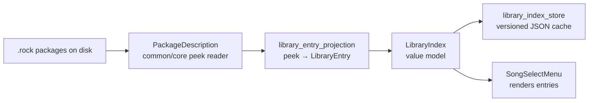

\page guide_game_library The Song Library and Scan Pipeline

*Applies to: Game.*

The library is how the game knows what songs exist without opening every package: a cached,
versioned index built from the fast peek reader, kept fresh by a plan/apply scan engine. It is
the game's largest headless subsystem (`rock-hero-game/core/src/library/`), and adding a field
to it fans out across five layers.

# The pipeline

- **The peek reader** (`package_description.cpp`, common/core) reads metadata — and the
  referenced chart's tuning — without opening the package. It is one of the format's two
  readers; \ref guide_package_format owns the keep-both-readers-in-sync trap.
- **The projection** (`library_entry_projection.cpp`) turns a `PackageDescription` into the
  `LibraryEntry` / `LibraryArrangementSummary` value model (`library_index.h`).
- **The store** (`library_index_store.cpp`) persists the index as versioned JSON;
  rebuild-on-doubt is the policy — bump the version when the entry shape changes and the cache
  regenerates rather than migrating (the project's no-legacy rule).

# Two scan entry points

Easy to confuse, deliberately different:

- **`scanLibrary`** (`library_scan.h`) — synchronous, used once at startup from `main.cpp`.
- **`LibraryScanEngine`** (`library_scan_engine.h`) — the step-driven, cancellable rescan:
  `begin` diffs, `step` processes one unit, checkpoints commit incrementally. Its planning half
  is `library_scan_plan.h` — a pure planner that diffs the cached index against the directory
  listing and returns a deterministic action list, performing no IO (the plan/apply split,
  \ref guide_patterns). Persistence follows a "record a signal, the shell performs the effect"
  split documented at the top of `library_scan_engine.h`.

Album art is a stubbed port (`i_album_art_generator.h`, with `NullAlbumArtGenerator` shipping
in production) awaiting roadmap plan 43 — the seam exists; nothing draws art yet.

# Adding a library field — silent steps

1. **Both format readers**: the peek reader *and* the full reader (\ref guide_package_format —
   this is exactly its standing trap), plus the writer and `file-formats.md`'s tables.
2. **The value model**: `LibraryEntry` / `LibraryArrangementSummary` (`library_index.h`).
3. **The projection** (`library_entry_projection.cpp`).
4. **The store version**: bump it in `library_index_store.cpp` — a stale cache silently hides
   the new field on every machine that scanned before your change; the bump forces the rescan.
5. **The consumer**: the menu render (or whatever displays it).
6. **Tests** at each headless layer (projection, store round-trip, scan plan).
