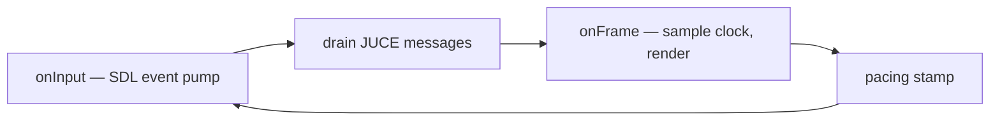

\page guide_game_shell The Game Shell and Frame Loop

*Applies to: Game.*

The shell is everything between `main()` and the first headless call: the SDL3 window, the
frame loop, the JUCE-coexistence message pump, and teardown. It is deliberately thin — policy
lives in `core` — but its wiring is the highest-traffic surface a game contributor touches, and
most of it is invariant-shaped rather than compiler-shaped.

# The loop: `SDL3Application`

`SDL3Application` (`rock-hero-game/ui/src/surface/sdl3_application.h`) is a template-method
base: a shell implements four hooks — `onInit`, `onInput`, `onFrame`, `onShutdown` — and
`run()` owns the ordering: poll input → drain pending JUCE messages → one frame → post-frame
pacing stamp. `FrameControl` lets a hook end the loop; `--smoke-frames` bounds it for CI smoke
runs. `RockHeroGame` (`rock_hero_game.cpp`) is the one implementation.

# The JUCE-coexistence pump

The game runs Tracktion/JUCE audio without a JUCE window, so the shell must pump JUCE's message
queue itself: `drainPendingJuceMessages` (`juce_message_pump.cpp`) forward-declares the
*unpublished* JUCE symbol `juce::detail::dispatchNextMessageOnSystemQueue` (with a macOS
`CFRunLoop` branch). Two consequences worth knowing:

- **This is a JUCE-upgrade seam.** The symbol is not public API; a JUCE bump can break it, and
  the fix belongs here, in one file.
- **`SDL_EVENT_QUIT` is the only quit signal.** The JUCE pump swallows `WM_QUIT` under this
  loop model, so quitting is decided by SDL events, never by the native message stream
  (`game_window.cpp` documents this).

# The event pump

`GameWindow::pollEvents` (`game_window.cpp`) translates SDL events into the plain
`GameWindowEvents` struct: key events filter auto-repeat and fan out into **both** the mapped
`GameKey` list (gameplay) and the raw keycode list (menu resolver) — the dual channel described
in \ref guide_keyboard — and resize events re-query the actual pixel size rather than trusting
the event payload. The struct is the entire input boundary; core code never sees SDL.

# Composition and teardown order

`app/main.cpp` composes the audio side (one `Engine`, `LiveInputMonitor`, `GameplaySession`,
workspace paths, the startup library scan) and injects non-owning references into the shell;
`RockHeroGame::onInit` composes only the render stack (window → render device → resources →
renderer). Teardown is the reverse, and both orders are load-bearing:

- Inside the shell, `RockHeroGame::Impl`'s **member declaration order is the documented
  reverse-teardown order**; `onShutdown` releases GPU objects before the device shuts bgfx
  down (the same once-only bgfx lifecycle rule as the editor preview — \ref guide_3d_highway).
- In `main.cpp`: run the loop → close the session → destroy the engine → JUCE shutdown guard.

When adding a shell-owned resource, place its member so destruction order stays correct — the
compiler will not tell you.

# Where things go

| You are adding... | It goes |
|---|---|
| Audio/session/library wiring | `app/main.cpp` |
| A render resource (shader, texture) | shell `onInit` + \ref guide_game "the deploy contract" |
| An input | the dual-channel pump — see \ref guide_game "Adding an input" |
| A menu screen | \ref guide_game "Adding a menu screen" |
| Per-frame behavior | `onFrame`, consuming `FrameClock` output — never a wall clock |
