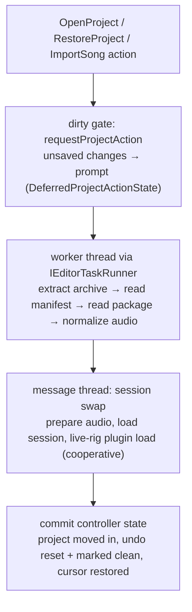

\page guide_project_lifecycle The Project Lifecycle

*Applies to: Editor-only (package IO delegates to common/core).*

"Project" is the editor's unit of work: opening, importing, saving, publishing, and closing songs.
Nearly every editor action is gated by this lifecycle, so its shapes — the workspace model, the
dirty gate, the worker-thread IO pattern — are worth knowing before touching anything
project-adjacent. The code lives in `rock-hero-editor/core/src/project/`.

# A project vs. a song package

A `.rock` **song package** is a flat ZIP: `song.json` plus the files it references. A `.rhp`
**project** is a ZIP wrapping that exact same native content under a `song/` subdirectory, plus a
tiny `project.json` manifest (its own format, its own `formatVersion` — never confuse it with the
song format; `project_io.cpp` owns it).

While a project is open, its contents live **extracted in a temp workspace directory** that the
`Project` object (`project.cpp`) uniquely owns — loaded audio paths point into the workspace,
edits happen on the extracted copy, and the `.rhp` on disk is touched only at save. Loading also
repairs backing-audio loudness-normalization metadata when stale (which counts as an unsaved
change — see dirty tracking below).

Save and publish share one serializer: both write the song through the identical
`writeRockSongPackageDirectory`, and the only difference is the archive root — save zips the
whole workspace (manifest + `song/`) into `.rhp`; publish zips only the song directory into
`.rock`. That is "save is publish" made literal: a `.rhp` is a published package wrapped with a
manifest. One caveat worth knowing: the archive write is in-place (truncate + rewrite), not
atomic temp-then-rename.

# The open flow

Two mechanisms carry the correctness load:

- **The deferred-action state machine** (`deferred_project_action_state.h`) parks the requested
  action inside each prompt phase (`AwaitingUnsavedChangesDecision`, `AwaitingSaveAsPath`,
  `SavingBeforeReplay`) — a prompt with no parked action, or two prompts at once, is
  unrepresentable. After a successful save, the parked action replays exactly once.
- **Busy tokens + ownership transfer.** The open runs under a busy token; a close/exit during the
  load supersedes it and the stale completion self-discards. For writes, the `Project` object is
  *moved out of the controller* into the task state for the worker's duration, so package IO can
  never race controller-side mutation — and moved back on completion, success or not.

# Import

`ISongImporter` is a one-method port: `importSong(source, workspace) -> expected<Song, ...>`.
Two implementations, dispatched by extension:

- `RockSongImporter` — extract a `.rock` into the workspace and read it.
- `GpSongImporter` — Guitar Pro 7/8: parse `Content/score.gpif` (`gp_score_parser`, which rejects
  repeats/jumps — the chart format is linear time), require embedded backing audio, transcode it
  to FLAC (the canonical package audio format), build the tempo map from the score's audio sync
  points, and materialize one arrangement per track (`gp_chart_builder`). The backing track's
  signed `FramePadding` (44.1kHz frames) becomes the asset's signed `start_offset`: positive
  delays the audio, negative means the recording's head precedes the score and playback skips
  it. Most real charts carry a negative value, so dropping it desyncs the song.

An import produces an **unsaved** project: no path, `save_requires_destination` set, so the first
save is forced to Save As — which is also the moment per-project view state starts persisting.

# Startup restore

`restoreLastOpenProject` re-opens the last project, with a crash tripwire: an
interrupted-restore sentinel is written *before* the load worker runs and cleared on success, so
a crash during restore is detected next launch and surfaces a Retry/Cancel prompt instead of a
crash loop. When there is nothing to restore, the editor stands up the Tone Designer — its
resting mode — rather than an empty shell.

Per-project view state (cursor, grid note value, zoom, selected arrangement) persists in
**per-user editor settings keyed by project path, outside the `.rhp`** — deliberately, so moving
the cursor never dirties the project.

*Design in flux: view-state storage is mid-migration
(`docs/plans/in-progress/app-local-project-view-state.md`) — the manifest already carries no
editor state, and the remaining store simplification is active work.*

# Dirty tracking and faulting

`hasUnsavedChanges` is the union of three distinct sources — forget any one and the unsaved
prompt lies:

1. **Tracked edits**: `EditorUndoHistory::hasUnsavedEdits()` relative to the clean marker.
2. **Untracked changes**: dirtiness no undo marker can reach — load-time normalization rewrites,
   a failed undo push, a faulted session.
3. **`save_requires_destination`**: an imported project with no path yet.

A **faulted session** (see \ref guide_undo) interacts with the lifecycle deliberately: Save is
blocked while faulted (the state is untrusted), the fault marks the session dirty, and only
reopening or closing the project clears it — recovery over silent corruption.

# Extending the lifecycle — silent steps

1. A new lifecycle-participating action must join the `ProjectAction` variant so the dirty gate
   defers it; a new write action joins `ProjectWriteAction` and gets a busy-operation mapping and
   an error prefix.
2. Anything the manifest gains must bump/gate `project.json` handling in `project_io.cpp` only —
   it is a separate format from `song.json` (see \ref guide_package_format).
3. New importers implement `ISongImporter`, put every produced file inside the given workspace
   (out-of-workspace references are rejected), and speak `SongImportError`.
4. Per-project *view* state goes to `EditorSettings` keyed by path — never into the package.
5. Tests live in `test_project.cpp` and the controller tests driving open/save/import through
   the harness with fake importers and task runners.
