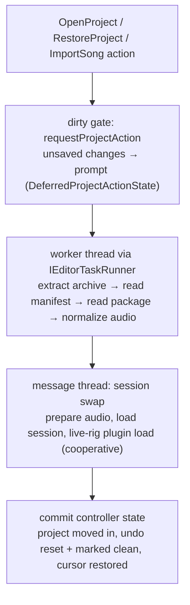

\page guide_project_lifecycle The Project Lifecycle

*Applies to: Editor-only (package IO delegates to common/core).*

"Project" is the editor's unit of work: opening, importing, saving, publishing, and closing songs.
Nearly every editor action is gated by this lifecycle, so its shapes — the workspace model, the
dirty gate, the worker-thread IO pattern — are worth knowing before touching anything
project-adjacent. The code lives in `rock-hero-editor/core/src/project/`.

# A project vs. a song package

A `.rock` **song package** is a flat ZIP: `song.json` plus the files it references. A `.rhp`
**project** is a ZIP wrapping that exact same native content under a `song/` subdirectory, plus a
tiny `project.json` manifest (its own format, its own `formatVersion` — never confuse it with the
song format; `project_io.cpp` owns it).

While a project is open, its contents live **extracted in a temp workspace directory** that the
`Project` object (`project.cpp`) uniquely owns — loaded audio paths point into the workspace,
edits happen on the extracted copy, and the `.rhp` on disk is touched only at save. Loading also
repairs backing-audio loudness-normalization metadata when stale (which counts as an unsaved
change — see dirty tracking below).

Save and publish share one serializer: both write the song through the identical
`writeRockSongPackageDirectory`, and the only difference is the archive root — save zips the
whole workspace (manifest + `song/`) into `.rhp`; publish zips only the song directory into
`.rock`. That is "save is publish" made literal: a `.rhp` is a published package wrapped with a
manifest. One caveat worth knowing: the archive write is in-place (truncate + rewrite), not
atomic temp-then-rename.

# The open flow

Two mechanisms carry the correctness load:

- **The deferred-action state machine** (`deferred_project_action_state.h`) parks the requested
  action inside each prompt phase (`AwaitingUnsavedChangesDecision`, `AwaitingSaveAsPath`,
  `SavingBeforeReplay`) — a prompt with no parked action, or two prompts at once, is
  unrepresentable. After a successful save, the parked action replays exactly once.
- **Busy tokens + ownership transfer.** The open runs under a busy token; a close/exit during the
  load supersedes it and the stale completion self-discards. For writes, the `Project` object is
  *moved out of the controller* into the task state for the worker's duration, so package IO can
  never race controller-side mutation — and moved back on completion, success or not.

# Import

`ISongImporter` is a one-method port: `importSong(source, workspace) -> expected<Song, ...>`.
Two implementations, dispatched by extension:

- `RockSongImporter` — extract a `.rock` into the workspace and read it.
- `GpSongImporter` — Guitar Pro 7/8: parse `Content/score.gpif` (`gp_score_parser`, which rejects
  repeats/jumps — the chart format is linear time), require embedded backing audio, transcode it
  to FLAC (the canonical package audio format), build the tempo map from the score's audio sync
  points, and materialize one arrangement per track (`gp_chart_builder`). The backing track's
  signed `FramePadding` (44.1kHz frames) becomes the asset's signed `start_offset`: positive
  delays the audio, negative means the recording's head precedes the score and playback skips
  it. Most real charts carry a negative value, so dropping it desyncs the song. The builder then
  normalizes sustains and generates fret-hand positions per the policy spec below.

An import produces an **unsaved** project: no path, `save_requires_destination` set, so the first
save is forced to Save As — which is also the moment per-project view state starts persisting.

## GP chart normalization policy

The plain-English specification of what the builder does to a Guitar Pro chart beyond literal
conversion. This section is deliberately written as numbered rules so a behavior tweak can be
made by editing a rule here and re-aligning the code
(`gp_chart_builder.cpp` — `normalizeImportedSustains`, `generateFretHandPositions`, both covered
by `test_gp_song_importer.cpp`). These rules apply to GP import only: `.rock` imports and
editor-authored charts are never rewritten.

**Sustain policy** (GP notates every note at its full duration; a chart only shows deliberate
sustains):

1. **Trim to the minimum sustain distance.** A note's tail is shortened so it ends at least the
   minimum-sustain-distance margin — 1/16 of a whole note, the same settled margin the editor's
   duration verb clamps to — before the next onset on *any* string. The margin bounds sustain
   *tails* only, never note onsets (renamed from "minimum note distance", 2026-07-23): a run of
   32nds imports every onset as notated, with tails trimmed toward zero and then dropped by the
   rule below, so dense passages render as plain heads. Notes struck together (chord members)
   never bind each other. One hold is exempt (user rule 2026-07-22): a tail ringing
   *strictly past* the next onset — merged from a tie or notated across voices — is a deliberate
   hold, exempt from this trim and the drop rule below; that ring is what the arpeggio arrival
   rule reads. A tail that merely *reaches* the next onset trims like any other, ties included.
   Repeated chords trim too: their held-to-the-restrike reading lives in the merged shape span
   (rule 11), which derives from the notated pre-trim durations and already runs through every
   restrike — the box continues while the tails keep the minimum gap.
2. **Never clip a technique payload.** Trimming stops at the note's last bend point or slide
   waypoint, so a slide always reaches its target note and a bend keeps its full curve, even
   when that leaves the tail closer than the margin (exact adjacency is legal).
3. **Drop short effect-free tails.** After trimming, a note that carries no sustain technique
   (bend, slide, vibrato, tremolo) and whose tail is now shorter than one beat loses the tail
   entirely. Order matters: a chugged riff of notated one-beat notes trims to 3/4 and then
   drops, yielding plain notes. Vibrato and tremolo protect a tail from *dropping* but not from
   *trimming* — in dense passages such a tail can shrink to nothing.
4. **"One beat" is one signature beat** — a quarter note in x/4, an eighth in x/8 — matching the
   chart model's own sustain unit.

**Fret-hand position generation** (GP has no hand-position concept, so the track is generated;
each rule is a candidate for replacement by the corpus-derived generator planned in
`docs/plans/todo/fhp-corpus-derived-generation.md`):

5. **The hand is a window.** A position covers frets `[fret, fret + width - 1]` with width four,
   widening only when a single onset spans more than four frets (wide chords); the next move
   snaps the width back.
6. **Open strings never constrain.** Fret-zero notes are playable from anywhere and neither
   place nor move the window.
7. **First placement anchors low.** The first fretted onset opens the window at its lowest
   fretted note.
8. **Later moves are minimal.** When an onset's fretted notes fall outside the window, the
   anchor moves the shortest distance that covers them — it never jumps further than needed, so
   runs walk the window up or down one misfit at a time.
9. **Pitched slides carry the hand; unpitched slides do not.** Every pitched slide waypoint
   (shift and legato alike) is a coverage event at the waypoint's own mid-sustain position: if
   the target fret falls outside the window, the hand moves there — minimally, per rule 8 —
   exactly when the glide lands, so the window travels with the slide. An unpitched slide-out
   releases pressure instead of repositioning, so its gesture never moves the window.

**Chord template and shape derivation** (`deriveChordShapes`; GP scores in practice carry no
handshape or diagram data, so the tab's chord boxes are derived):

10. **Two or more strings struck together form a chord.** The onset's posture — the fret held
    on each struck string, open strings included — becomes a reusable template, deduplicated
    across the chart. Derived templates are unnamed and carry no fingering (the name chip only
    renders for named shapes).
11. **Repeated strums of one articulation share one span.** Consecutive onsets whose strings
    are played *identically in every way except duration* — same frets, attack (hammer, pull,
    tap, slap, pop), muting, harmonics, vibrato, tremolo, accent, bends, and slides; the
    comparison is the whole note with position and duration neutralized, so techniques added
    later join it automatically — merge into a single shape span from the first strum through
    the last strum's *notated* duration (the duration before the sustain policy trims tails —
    the hand keeps holding while the chug rings). Any intervening non-chord onset or any
    articulation difference on any string ends the span — a muted or hammered chord is its own
    chord with its own box, even on the frets of the chord before it, while frets-identical
    chords share one deduplicated template (the hand posture is identical; techniques render on
    the notes). An isolated strum gets a span of its own notated duration.
12. **A fully-strummed span is a chord box; a ring-through span is an arpeggio.** A note still
    ringing through a chord's onset (tie-held from before, not re-struck) joins the derived
    posture on its string, and the projections' shared arrival rule renders any span with a
    posture string *still ringing at the span start without an onset there* as an arpeggio: a
    strum under held content is picking around it, not a full strum (user rule 2026-07-22 —
    both the chord under a held single note and the re-strum whose tied members keep ringing
    are arpeggios, so a tied passage with a hand move splits into two arpeggio shapes). A
    posture string that is merely silent at the start (a partial strum of the shape) keeps the
    chord box; no other arpeggio grouping is derived (broken-chord grouping waits for the
    corpus-informed pass).
12a. **A span ends where the onset that closes it begins.** Tie merging can stretch a strum's
    ring past the next event, but the shape's box never follows it: when a new posture (or a
    non-chord onset) closes a span, the closed span's end clamps to that onset, so consecutive
    shapes never overlap and the next event always reads as its own arrival.

**Slide semantics** (resolved before the sustain policy runs, so merged tails still pass
through the trim rules):

13. **A shift slide re-picks its landing.** The origin carries an ordinary pitched waypoint
    that glides to the landing's fret and ends the minimum-sustain-distance margin before the
    landing's onset — the sustain ends at the glide end, so slides respect the same margin as
    every other tail (user rule 2026-07-23, superseding the full-gap `slideEnd: "next"`
    terminal) — and the target note keeps its own onset and head. The projections render a
    glide-end waypoint (one at exactly the sustain end) without the linked continuation glyph;
    the re-picked landing's own head renders after it. Unpitched slide-outs are the separate
    `slideOut` payload, which owns its end offset and gestured fret — no landing note exists,
    so there is nothing to desync from.
14. **A legato slide is the same note continuing.** The landing is not re-picked, so it never
    becomes a note: it folds into the origin as a pitched waypoint at the junction — the
    sustain extends through the landing's notated end, the landing's sustain techniques
    (vibrato, tremolo, bends) fold in, and its own onward slide continues the chain until a
    shift slide, an unpitched slide-out, or the chain's end stops it. The tab renders the
    junction as Charter's linked continuation head, the same glyph `.rock` linked chains use.
    The importer never second-guesses the notated slide kind (a coercion of chord-landing
    legato slides to shift was tried and rejected 2026-07-22): a source charted with the wrong
    slide kind is fixed in Guitar Pro, not silently rewritten on import.
15. **A slide notated on a tied continuation belongs to the merged note — and leaves from the
    junction.** Tie merging folds the continuation's slide flags into the origin, so a held
    note that slides away at its end — a tie into a chord whose member then shift-slides down —
    keeps its glide instead of silently losing it with the merged onset. A hold waypoint at the
    continuation's own onset pins the pitch until then, so the glide starts where the sliding
    segment was notated (the tied 6 holds through the chord, *then* slides), not at the merged
    note's onset. The tab draws no slide line across a hold segment — the linked continuation
    head at the waypoint renders it as a note tied to itself, and the glide's diagonal leaves
    from there.

Every generated track logs a conversion note ("simple window walk; verify", "derived N chord
spans") so the guesses stay observable in the import log.

# Startup restore

`restoreLastOpenProject` re-opens the last project, with a crash tripwire: an
interrupted-restore sentinel is written *before* the load worker runs and cleared on success, so
a crash during restore is detected next launch and surfaces a Retry/Cancel prompt instead of a
crash loop. When there is nothing to restore, the editor stands up the Tone Designer — its
resting mode — rather than an empty shell.

Per-project view state (cursor, grid note value, zoom, selected arrangement) persists in
**per-user editor settings keyed by project path, outside the `.rhp`** — deliberately, so moving
the cursor never dirties the project.

*Design in flux: view-state storage is mid-migration
(`docs/plans/in-progress/app-local-project-view-state.md`) — the manifest already carries no
editor state, and the remaining store simplification is active work.*

# Dirty tracking and faulting

`hasUnsavedChanges` is the union of three distinct sources — forget any one and the unsaved
prompt lies:

1. **Tracked edits**: `EditorUndoHistory::hasUnsavedEdits()` relative to the clean marker.
2. **Untracked changes**: dirtiness no undo marker can reach — load-time normalization rewrites,
   a failed undo push, a faulted session.
3. **`save_requires_destination`**: an imported project with no path yet.

A **faulted session** (see \ref guide_undo) interacts with the lifecycle deliberately: Save is
blocked while faulted (the state is untrusted), the fault marks the session dirty, and only
reopening or closing the project clears it — recovery over silent corruption.

# Extending the lifecycle — silent steps

1. A new lifecycle-participating action must join the `ProjectAction` variant so the dirty gate
   defers it; a new write action joins `ProjectWriteAction` and gets a busy-operation mapping and
   an error prefix.
2. Anything the manifest gains must bump/gate `project.json` handling in `project_io.cpp` only —
   it is a separate format from `song.json` (see \ref guide_package_format).
3. New importers implement `ISongImporter`, put every produced file inside the given workspace
   (out-of-workspace references are rejected), and speak `SongImportError`.
4. Per-project *view* state goes to `EditorSettings` keyed by path — never into the package.
5. Tests live in `test_project.cpp` and the controller tests driving open/save/import through
   the harness with fake importers and task runners.
