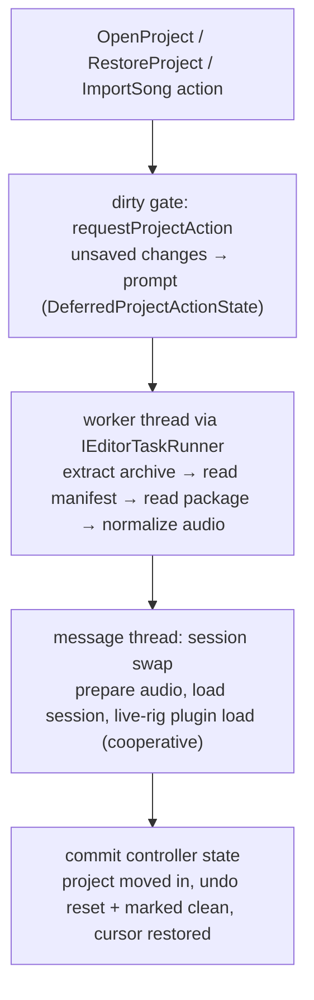

\page guide_project_lifecycle The Project Lifecycle

*Applies to: Editor-only (package IO delegates to common/core).*

"Project" is the editor's unit of work: opening, importing, saving, exporting, and closing songs.
Nearly every editor action is gated by this lifecycle, so its shapes — the workspace model, the
dirty gate, the worker-thread IO pattern — are worth knowing before touching anything
project-adjacent. The code lives in `rock-hero-editor/core/src/project/`.

# A project vs. a song package

A `.rock` **song package** is a flat ZIP: `song.json` plus the files it references. A `.rhp`
**project** is a ZIP wrapping that exact same native content under a `song/` subdirectory, plus a
tiny `project.json` manifest (its own format, its own `formatVersion` — never confuse it with the
song format; `project_io.cpp` owns it).

While a project is open, its contents live **extracted in a temp workspace directory** that the
`Project` object (`project.cpp`) uniquely owns — loaded audio paths point into the workspace,
edits happen on the extracted copy, and the `.rhp` on disk is touched only at save. Loading also
repairs backing-audio loudness-normalization metadata when stale (which counts as an unsaved
change — see dirty tracking below). Audio the analyzer cannot measure — digital silence, or a
level under libebur128's -70 LUFS gate — is normalize-and-report like everything else here, not a
refusal: `analyzeAudioForGainNormalization` answers with no record at all, the asset plays at its
raw level, and `unnormalizedAudioNoticeText` tells the charter once at open through the same
`IEditorView::showNotice` channel the chart-repair notice uses. That channel presents as a warning
box, not an info box — both of its notices report something the load settled without asking, which
the charter has to weigh before saving over the original.

Save and export share one serializer: both write the song through the identical
`writeRockSongPackageDirectory`, and the only difference is the archive root — save zips the
whole workspace (manifest + `song/`) into `.rhp`; export zips only the song directory into
`.rock`. That is "save is export" made literal: a `.rhp` is an exported song package wrapped with
a manifest. One caveat worth knowing: the archive write is in-place (truncate + rewrite), not
atomic temp-then-rename.

# The open flow

```mermaid
flowchart TB
    act["OpenProject / RestoreProject / ImportSong action"]
    gate["`dirty gate: requestProjectAction
    unsaved changes → prompt (DeferredProjectActionState)`"]
    work["`worker thread via IEditorTaskRunner
    extract archive → read manifest → read package → normalize audio`"]
    swap["`message thread: session swap
    prepare audio, load session, live-rig plugin load (cooperative)`"]
    commit["`commit controller state
    project moved in, undo reset + marked clean, cursor restored`"]
    act --> gate --> work --> swap --> commit
```

Two mechanisms carry the correctness load:

- **The deferred-action state machine** (`deferred_project_action_state.h`) parks the requested
  action inside each prompt phase (`AwaitingUnsavedChangesDecision`, `AwaitingSaveAsPath`,
  `SavingBeforeReplay`) — a prompt with no parked action, or two prompts at once, is
  unrepresentable. After a successful save, the parked action replays exactly once.
- **Busy tokens + ownership transfer.** The open runs under a busy token; a close/exit during the
  load supersedes it and the stale completion self-discards. For writes, the `Project` object is
  *moved out of the controller* into the task state for the worker's duration, so package IO can
  never race controller-side mutation — and moved back on completion, success or not.

# Import

`ISongImporter` is a one-method port: `importSong(source, workspace) -> expected<Song, ...>`.
Two implementations, dispatched by extension:

- `RockSongImporter` — extract a `.rock` into the workspace and read it.
- `GpSongImporter` — Guitar Pro 7/8: parse `Content/score.gpif` (`gp_score_parser`, which rejects
  repeats/jumps — the chart format is linear time), require embedded backing audio, transcode it
  to FLAC (the canonical package audio format), build the tempo map from the score's audio sync
  points, and materialize one arrangement per track (`gp_chart_builder`). A staff's
  `TuningFlat` property is the score's own statement that its tuning is spelled with flats, and
  the import honours it verbatim — a half-step-down score's strings read `Eb2` and not `D#2`,
  and nothing is inferred for a score that says nothing. Guitar Pro 7.0.0 wrote that flag on
  every staff, so `gp_score_parser` reads the score's `GPVersion` and ignores the flag at major
  version 7. The backing track's
  signed `FramePadding` (44.1kHz frames) becomes the asset's signed `start_offset`: positive
  delays the audio, negative means the recording's head precedes the score and playback skips
  it. Most real charts carry a negative value, so dropping it desyncs the song. The builder then
  plays each bar's stated `TripletFeel` — the swing Guitar Pro leaves off the page (rule 20c) —
  resolves the score's gestures, clamps each ring at its own string's next onset, and generates
  fret-hand positions per the policy spec below. Chord spans are NOT generated: they are derived
  from the finished notes wherever they are read (rules 10-12a).

An import produces an **unsaved** project: no path, `save_requires_destination` set, so the first
save is forced to Save As — which is also the moment per-project view state starts persisting.

## GP chart normalization policy

The plain-English specification of what the builder does to a Guitar Pro chart beyond literal
conversion. This section is deliberately written as numbered rules so a behavior tweak can be
made by editing a rule here and re-aligning the code
(`gp_chart_builder.cpp` — `generateFretHandPositions`, `resolveSlideIns` (rule 16's scoops), and
`resolveSlideOutExits` (rule 9's trail-off rides and rule 13's exit fret), closing with the one
chart normalizer `normalizeChart` (rule 26), all covered by `test_gp_song_importer.cpp`). Rules
1–25 apply to GP import only; rule 26 is the normalizer every load path runs — `.rock` imports
and saved projects go through exactly the same function, so a chart written under older rules is
repaired and reported rather than refused.

**Ring policy — what the chart STORES.** `ChartNote::sustain` is the actual duration the string
rings: Guitar Pro's notated duration, lengthened where the source says one sounding continues (tie
merges, legato-slide merges), where the source says to LET IT RING (below), or where a synthesized
gesture needs room to travel (rules 13 and 16), and shortened by two rules of the importer's own.
A before-beat grace **steals its lead** from the beat before it in its own voice — Guitar Pro plays
the ornament in the preceding note's time — so every note of that beat still ringing at the run's
first onset ends there instead (rule 17); a bend, whose points Guitar Pro writes as percentages of
the notated duration, is laid out over that duration and CLIPPED with the stolen part rather than
squeezed into what is left.
The steal is a shortening like any other, and a pass that lengthens the same ring afterwards simply
out-rings it — which is how the reference's `max(tie/slide end, let-ring end)` is written here, as
an ORDER of passes rather than as a comparison, and why rule 17 needs no exemption for the marks
that lengthen. And a **re-strike stops the ring**: the same-string clamp (40-Q2-B,
`normalizeSustainOverlaps`) ends every tail at the next onset on its own string. The clamp runs
after every pass that can lengthen a ring — the let-ring figure walk below is the last of them —
and before the two passes that ride the drawn picture — the chord spans (rules 10–12) and the
trail-off hand exits (rule 9); the fret-hand generator and slide-in resolution run ahead of it,
because the resolver's scoops are one of the passes that lengthen. Payload is trimmed to the ring
ONCE, straight after that clamp, because that is where the ring stops moving: the imported bend is
the only payload written past a ring, and trimming it earlier cut a let-ring note's curve against a
ring the let-ring pass was about to hand back.

**Let ring rings to its FIGURE's end.** Guitar Pro's `LetRing` mark is the mirror of staccato's
halving (rule 22): staccato shortens the imported ring, let ring lengthens it, and neither is ever
a stored field — the ring IS the record. A marked note's notated duration is inherently imprecise
— the mark is the transcriber saying "not this length", and no Guitar Pro charter can state the
real one — while Guitar Pro's own playback horizon is a default, not a statement. So the import
derives the end from the music's structure instead: **THE FIGURE LAW** (`letRingFigureEnds` in
`gp_chart_builder.cpp`). Three rules, held in one breath: *a marked tail rings to the first onset
its own voice states after its figure's last mark; a figure ends where its grip is contradicted or
where its audibility horizon runs out; written is the floor and the same-string clamp is physics.*

Each transcription VOICE accumulates a **grip** — the stop last stated on each string SINCE THE
FIGURE BEGAN, both halves of every comparison read through the one statement authority
(`statedStopAt`), so a slid finger carries its statement forward instead of manufacturing a
conflict and a tap speaks through its resolved claim. A first-time string GROWS the grip and a
same-stop statement CONFIRMS it, so a chug can never split anything and a repetition of a figure
can never be divided — with no retreat mechanism in the law, that invariant is structural rather
than satisfied. An onset stating a different stop on a gripped string is the **grip seam**: it
closes the figure and founds the next AT ITSELF. The only other seam is TIME — an onset lying
strictly past the audibility horizon of the figure's most recent member, which ends the phrase
outright where a grip seam continues it. The figure's whole job for the tails is grouping the
MARKS — which let-ring stack a mark belongs to, and therefore where that stack's marked run ends.
One correction to that grouping, **the fragment donation**: a figure closed while holding too few
notes to ever FOUND a span — fewer than three, no two co-struck, the span machine's own founding
law rather than a new constant — is a remnant mis-grouped with the next figure's opening notes, so
each of its notes that does not contradict the closing figure's grip joins that figure and the
rest stay. A donation never crosses a time seam. A real figure never donates, which is what keeps
a repetition undividable and a closing confirmation with its own stack.

Every marked member's ring is then one assignment, `max(written, min(same-string clamp,
figure_end))`, where the figure end is **the first onset the figure's own voice states after its
last marked note** — the mark is the transcriber asking material to ring on, and the ring runs
exactly as far as the asking does; material past the marked run never asked, so a marked drone
must not ring into the unmarked chords that follow in its own line. Where the voice states nothing
more, the first sounding onset anywhere in the track answers; where nothing follows at all, the
figure's latest written end. And the end is FLOORED at the figure's latest marked WRITTEN end: a
written length is authored truth, not an estimate, so where one member's tie-merged written end
outruns the anchor the whole stack rings to it — the anchor and the cap bound only what the law is
estimating, and without the floor the lengthen-only application keeps the long written ring while
stopping its stackmates short. The GRIP SEAM never appears in the tail arithmetic — it is always
at or past the first onset after the figure's marks, so the anchor subsumes it. And the end is
never more than one ORIGIN-BAR metric length past that last marked onset — Guitar Pro's audibility
truth, which bounds a marked drone under a MARKED same-voice texture that nothing ever
contradicts, and which is the same horizon the time seam reads. An OPEN member takes the longer of
its figure's end and its whole PHRASE's anchor, capped by that phrase's own last mark: an open
string goes on sounding with no finger to lift, and a natural harmonic deliberately does not share
the lift, its node being false the moment the chime starts. The grip is FIGURE-SCOPED MEMORY, not
sound: a sounding grip needs a staleness guard, and that pair fails sighted figures in opposite
directions — figure membership is the one fact that separates them, so the grip lives and dies
with the figure and no staleness rule exists. The walk reads onsets and statements only — never a
ring, never a span — so it is a pure function of the written stream: no fixpoint, one forward pass
per voice. The marked REGION is not a segmenter: segmentation reads every onset, marked or not,
and the marks decide only who extends.

The walk is **scoped to one voice, end to end**, because events must not cut rings in another
voice: a figure is a statement about one hand's line contradicting itself, so the grip, the
statements judged against it, and the tails it bounds all take the same voice slot. The
**same-string clamp stays cross-voice** on purpose, and the difference is physics against
grammar: a restrike is one finger on one string and the sound stops whichever line wrote it, while
a grip contradiction is only the transcription saying a hand has moved. The derivation keeps its
own separate grip concept (LAW A's sounding table, see the span rules below) and the two layers
deliberately DIFFER: the import's grip is figure-scoped grammar over a transcription with voices,
the derivation's is sounding evidence over a chart model with none — a change to either belongs to
its own law. The accepted cost is the registered drone watch item: a let-ring drone under a moving
melody in ITS OWN VOICE clips at the melody's first fret change, while a drone in a voice of its
own survives to the track's next onset.

Four notes never lengthen. Three are Guitar Pro's own pre-emptions, where playback returns before
it ever reads the mark: a **dead**, a **palm-muted** and a **staccato** note each keep the ring
their own mark gives them (only the pre-emption is taken from that block — the static durations it
returns are declined, because the notated duration is the timing information the chart reads). The
fourth is a note whose end is already stated by an unpitched slide-out — the release keyframe —
since that release IS the ring's end by definition. A note that ABSORBED a same-string merge — a tie continuation, a
legato-slide landing — is NOT among them: the merge states the note's true WRITTEN duration, and
the mark then extends the merged note like any other, Guitar Pro itself audibly ringing tied
let-ring notes past the written duration.

**SECTION MARKS APPEAR NOWHERE** in this law, and that is a ruling rather than an omission: a
section mark is organizational, not a hand fact, so it neither seams a figure nor bounds a tail.

The pass reports the rings it lengthened in the conversion log — counted AFTER the clamp, so a
ring physics took straight back is never announced as a change the reader cannot find — and
publishes the pair the census reads (`GpLetRingReport`): rings the figure end extended, and marks
left at exactly their written duration. The second is the mis-seam detector: under this law the
figure end is the only thing that ever lengthens a marked ring, so a mark that changed nothing is
either a texture the physics already bounds or a seam landing too early, and telling those apart
is the census's job. One ordering is RULED rather than merely deliberate: the fret-hand generator
runs BEFORE this pass and reads WRITTEN durations alone. Reading extended rings there is
structurally forbidden, because the planned direction of the hand coupling is FHP → rings (the
figure law consuming the FHP stream for its hand facts), and extended-ring-fed FHPs would close a
cycle. The pipeline is one arrow: written durations → FHPs → ring derivation, never the reverse.

Nothing else shortens a ring. A dead note keeps its notated duration like any other — E25 is a
presentation rule and nothing applies it to the stored note — because that duration is the timing
the legato adjacency test reads, and the picture it does not draw is derived. Readability otherwise
is the next section, and it is drawn, not stored.

**Tail policy — what a surface DRAWS** (GP notates every note at its full duration, and the chart
now *stores* that duration; a chart only *shows* deliberate sustains, so the shortening is a
read-side derivation rather than an import-time edit). Rules 1–4 below are the presentation rules,
implemented once in `presentedChartNotes` (`chart_presentation.h` in common/core, covered by
`test_chart_presentation.cpp`) and applied in the order written, with the dead note's silent tail
(E25) applied last as the fourth. They are not import policy at all
any more: every surface derives them from the stored stream, so the same chart drawn from a `.rock`
file and from a fresh import shows the same tails, and the model behind the split is
`docs/plans/in-progress/note-sustain-model.md`.

1. **Trim to the minimum sustain distance.** A note's drawn tail ends at least the
   minimum-sustain-distance margin — 1/16 of a whole note, the shared constant in
   `grid_arithmetic.h`; a 1/32 margin closes the gap too tightly to read on screen — before the next
   binding onset, which is the first later note at a different grid position on *any* string. The
   margin bounds sustain *tails* only, never note onsets: a run of 32nds imports every onset as
   notated, with tails trimmed toward zero and then dropped by the rule below, so dense passages
   render as plain heads. Notes sharing a position — chord members — never bind each other. The
   binding onset is the first later
   onset the ring does not *pass*: a ring running *strictly past* an onset — merged from a tie or
   notated across voices — keeps looking and binds on the first onset it reaches without passing,
   trimming there like any other tail, and a ring ending exactly *on* an onset passes nothing and
   binds there too. Passing is a deliberate hold and earns the group its tails under the drop rule
   below; what it does NOT do is switch the trim off, which would leave a ring-through dying on a
   later head with no gap at all. What the arpeggio class reads is the STORED ring, never this drawn
   one (rule 12), so a dead string presents no tail (E25) and still reads as carried under a strum:
   the finger is down either way. A ring that merely *reaches* the next binding onset trims like any
   other, ties included. Binding is decided on the SOUNDING position, because that is what the
   stored chart has, so a grace lead is a real onset here. Repeated chords trim too: their
   held-to-the-restrike reading lives in the merged shape span (rule 11), which is derived from the
   stored rings and already runs through every restrike — the box continues while the tails keep the
   minimum gap. The margin is a presentation rule and not an authoring clamp: the editor's duration
   verb stops at exact adjacency with the next onset on the note's own string (`sustainBoundOf`),
   not here.
2. **Clip a technique payload that says nothing new; never clip one that does.** Carrying a
   technique is not a blanket exemption from rule 1: the margin yields only when a payload point
   *changes* something inside the region the trim would remove, and then only as far as that change
   reaches. The clipping is the drawn note's, never the stored one's — the chart keeps every point
   Guitar Pro wrote. Writing `t_authored` for the stored ring, `t_trim` for the end rule 1 alone
   would give, and `t_info` for the last *changing* payload offset, the tail ends at
   `min(t_authored, max(t_trim, t_info))` — it extends to the change and **stops exactly there**,
   never running on to the notated end. A change landing precisely at the margin truncates the tail
   right there with its information intact. Payload points the trim passes are dropped with the
   tail; only non-changing ones can ever sit past `t_info`, so nothing informative is lost and the
   model's "payload within the sustain" invariant keeps holding. What counts as a change is asked
   per keyframe CHANNEL, against the value the channel opened with — the note's own bend, fret and
   vibrato state: a bend value differing from the one it replaces (the note usually starts unbent),
   and a fret differing from the previous stated fret — an **equal-fret keyframe is a HOLD, not a
   glide** (rule 15), so a trailing hold pins a pitch the tail already sounds and cannot hold the
   tail open. A slide still reaches its target note, because a shift glide's landing keyframe is by
   definition a fret change (exact adjacency stays legal). The vibrato channel counts too, and its
   two directions differ: a bend value and a fret are POINTS, complete at the instant they are
   reached, so the tail may stop exactly there, but a statement that leaves the string SHAKING — a
   start, or a step between the narrow and wide widths — is an interval STATE, and a tail ending on
   it would show the new shake for no time at all and read as the old one, so its information
   reaches one minimum gesture window PAST the statement, while a statement that ENDS the shake is a
   point again (the interval before it already showed everything). The techniques that are still
   whole-note — tremolo, emphasis, muting, harmonics — cannot change mid-sustain, so they never
   override the margin at all. The unpitched slide-out is not payload either: its end is gesture
   geometry derived from the notated duration, not a musical event, so it trims back with the tail
   and respects the margin. A crowding that would crush it — a non-positive target, or one at or
   under the last *surviving* keyframe — compresses it to the smallest legal end instead (strictly
   positive, strictly after the last keyframe) rather than keeping its full length; a keep-the-end
   fallback would run the gesture through the next sounding onset in a crowded passage.
3. **Drop short effect-free tails, per strum.** A strum that carries no sustain technique
   (bend, slide, vibrato, tremolo) on any string and no member *ringing* longer than the
   kept-sustain bound (`g_minimum_kept_sustain_seconds` in grid_arithmetic.h, which is the ONE place
   the bound's value is stated — it is headed for a user-tunable option, so nothing else repeats it.
   The bound is a DURATION: the rule reads each note's ring in seconds through the tempo map, so the
   same written note value earns a tail below a crossover tempo and drops it above, and the meter
   never enters. It is shared with the legato hold test, which relies on this rule to read a missing
   tail as a proven release) draws no tail on any member. The comparison reads the STORED ring,
   never the trimmed end: a note held past the bound keeps its drawn tail even though the margin can
   leave it shorter than the bound — a chugged riff of slow one-beat notes keeps its tails, while a
   run of notes ringing inside the bound still renders as plain heads. The decision
   belongs to the **strum**, not the single string: every string of a chord rings from one stroke,
   so a tail any member earned — a technique on it, a ring past the bound, or rule 1's deliberate
   hold — keeps every member's tail. Deciding per string draws a lone tail on a short double stop's
   bent note while its unbent partner, effect-free and inside the bound, loses its tail entirely and
   reads as unsounded. Grouping is the sounding position, the same identity rule 1's binding scan
   uses, so cross-voice simultaneities count as one stroke here too. Each member still keeps its
   *own* margin-trimmed end (rule 2 decides length per string; only the keep-or-drop verdict is
   shared), so the bent string's tail runs to its last bend change while its partner's stops at the
   margin. Vibrato and tremolo protect a tail from *dropping* but not from *trimming* — in dense
   passages such a tail can shrink to nothing, and where the margin leaves a partner no room at all
   it still shows no tail.
4. **"One beat" is one signature beat** — a quarter note in x/4, an eighth in x/8 — matching the
   chart model's own sustain unit.

**Fret-hand position generation** (GP has no hand-position concept, so the track is generated by a
corpus-derived algorithm — the metrics and the source-corpus study behind these rules are in
`docs/plans/todo/fhp-corpus-derived-generation.md`):

5. **The hand is a window.** A position covers frets `[fret, fret + width - 1]` with width four,
   widening only when a single onset spans more than four frets (wide chords); the next move
   snaps the width back. A slide *reshape* (rule 9) is the exception to the four-fret floor: it
   follows the exact sounding span and may be narrower than four.
6. **Open strings never constrain, and taps float above.** Fret-zero notes are playable from
   anywhere and neither place nor move the window. A *tapped* note is likewise not a coverage event:
   two-hand taps sit far above the fretting hand (a median seven frets in the corpus), so the window
   tracks the fretted / left-hand notes and any held chord shape while the tap floats above it. Only
   Guitar Pro's *Tapped* (two-hand) articulation becomes a chart tap; a *LeftHandTapped* note is the
   fretting hand striking the note from nowhere and imports as the `LeftTap` attack verbatim — so
   every tap rule in this policy refers to two-hand taps only, and left-hand taps anchor the window
   like any fretted note. A note carrying both marks imports as the left-hand tap: left-hand is the
   specialization, the generic tap mark adds nothing to it. The 3D-highway camera frames such a tap
   on its own — it scans the notes, not only the hand windows — so the tap stays on screen even
   though the window light stays low on the left hand. (A held chord under tapping renders as an
   arpeggio, rule 12.)
7. **The hand re-anchors at phrase boundaries.** At a section start, or after a rest of at least
   0.8 seconds, the window re-places fresh — biased low to the phrase's floor fret (its lowest
   fretted note) — even when the previous window still covered the upcoming notes. Most authored
   anchor moves happen at these musical boundaries, not at the first misfit, so a greedy
   first-misfit walk under-moves. An opening run of notes that anchor nothing (open strings, taps)
   must not pin the hand at the nut-reference window: the first placement's window comes from the
   first anchoring note but retimes back to the chart's first note, so the hand is already settled
   where the song needs it when play begins.
8. **Within a phrase, moves are minimal.** When an onset's fretted notes fall outside the current
   window mid-phrase, the anchor moves the shortest distance that covers them — it never jumps
   further than needed. Slides are the exception (rule 9).
9. **Pitched slides reshape or carry the hand; unpitched slides do neither.** A pitched slide
   keyframe (shift and legato alike) moves the window at its mid-sustain position, but *how*
   depends on whether another finger stays planted:
   - **Reshape — a finger stays planted.** When another fretted note is still ringing at the
     keyframe and is not itself sliding there, it is a planted finger that pins the window's edge
     on its side; the sliding note carries the opposite edge to its landing fret. The window
     becomes the exact sounding hull `[lowest, highest]` — no width floor and no drag — so it
     *shrinks* when an outer note slides inward (a `{2,5}` chord whose 2 slides to 3 under the
     held 5 gives `[3,5]`, not `[3,6]`), *grows* when an outer note slides outward (2 slides to 1
     gives `[1,5]`), and *holds* when the sliding note is interior and both edges are already
     pinned. This is the fret hand deforming as one finger moves while the rest stay down.
   - **Travel — nothing else is held.** A lone slide, or a whole chord gliding in lockstep by the
     same fret delta, has no planted finger, so the whole hand travels: the anchor drags by the
     keyframe's own fret delta — a five-to-nine glide moves the window up four frets — so the
     fretting finger keeps its slot even when the target would already fit. The dragged anchor
     clamps only as far as staying on the neck and covering the target requires. Simultaneous
     slides whose deltas disagree (a convergence or divergence) are not a rigid translation, so
     they cancel the drag and reshape in place instead.

   The window always rides an unpitched slide-out: an exit placement at the trail-off's compressed
   end carries the window with the gesture. That placement rides the trail-off's OWN segment and
   eases with the unpitched curve, so the window follows the drawn rail precisely instead of
   approximating it — a trail-off's curve is defined, so there is nothing to approximate. Arriving
   through the standard margin morph instead leaves the window stationary for most of the drawn
   glide and then sprinting to catch up. The morph's own reason — stopping the window creeping from
   the note's onset on long notes — is a property of the RAIL's own span, so if the creep reads
   wrong the fix belongs to the drawn geometry rather than to the window, which simply agrees with
   whatever is drawn. The hand's next move decides the rest. When its next placement departs in the
   trail-off's direction AND arrives by the very next onset, the gesture IS the departure: the exit
   fret rides the anchor travel (widened to the slide-in rule's two-fret minimum) and the window
   flows onward into the arrival. Otherwise the gesture is a release and return: the exit keeps the
   fixed four-fret gesture, the window dips with it, and a restore placement at the very next onset
   brings the window back for the note that follows — so notes after the gesture are never stranded
   in the dipped window. A trail-off with no room before the next onset stays planted.

**Posture and shape derivation** — not an import rule at all. GP scores in practice carry no
handshape or diagram data, and the chart stores none either: a span is a statement about the notes
under it, so `common::core::deriveChartShapes` (`chart/chart_shapes.h`) derives every span and
posture from the note stream wherever they are read, once per chart revision inside
`chartResolutions`. The one authored input rides in the stream itself: the `held` stop under a plain
tap or a scrape (rule 12b) — the single posture fact no function of a stream of STROKES can
distinguish. A tapped harmonic's pressed fret reaches the postures through the same claim query,
being a stop the note already states.
Rules 10 to 12b below are that derivation's maintained plain-English spec — this page is where they
are stated, and `chart_shapes.h` points here rather than restating them.

One consequence is worth naming: the derivation sees the SETTLED stream, where an import-time
derivation would run before `normalizeChart`. A strum whose notes carry something the rules refuse
— a slide on an open string, say — would otherwise derive its own span from data the chart never
contains; read at the settled stream it is what it is, and merges with its identically-played
neighbours.

10. **A SPAN IS GRIP TENURE — the statement "the hand holds this grip, from here to here" — and
    THREE things open one** (THE GRIP-TENURE LAW,
    `docs/plans/in-progress/span-derivation-ground-up.md`). Everything else in these rules is
    bookkeeping about that tenure. An ONSET STATING A GRIP opens one: two or more stops struck or
    claimed at one slot, the statement threshold of **2**. SOUND ALONE may ACCUMULATE one: three or
    more members' rings overlapping at stated stops, the minimum of **3**, because two-member
    accumulations read as noise beside the figures three members find. And a LANDED TRAVEL opens
    the one span no onset states
    — rule 11b, at **2** survivors. **NOTHING ELSE opens a span**: a string that merely rings on
    past a break is a tail, and ring-out opens nothing at all.
    The three-minimum gates founding by SOUND and nothing else — growing a standing span has no
    minimum, and a landing is not a case of the slot law but its own one-line rule, because a
    landing's members were already ESTABLISHED members of the span that just closed. Nothing
    ARRIVES at a landing, and staggered arrival is the only thing the higher minimum is there to
    gate. Both numbers are named once, beside each other, in `chart_shapes.cpp`; the escape from the
    higher one is an AUTHORED two-note span, owed by `docs/plans/todo/span-marker-redesign.md`.
    Overlap is asked at ONE INSTANT, which is what makes the accumulation form STRONG rather than
    pairwise: every member is sounding at the moment the newest one arrives, so no bracket ever
    claims a conjunction that never held. A member whose ring dies does not go on being one either:
    its QUITTING breaks the grip (rule 11a), which is what keeps a posture from outliving a finger.

    **AN OPEN STRING IS A MEMBER exactly as a fretted one is.** The bracket's claims are PER MEMBER
    and both kinds are true — a fretted member's digit asserts a held finger, which its own ring
    proves, while an open member's `0` asserts no finger at all, only the ring the chart already
    stores — so no member's claim can be false, and the opening test needs no fretted-only branch.

    A member is a sounding fretting-hand onset, a ring still sounding at a stated stop, or a stop
    the hand CLAIMS — the RESOLVED claim under a right-hand onset (rule 12b). **ONE COUNT over
    the three kinds**, because they
    are three ways of stating the one thing a shape is made of: where a finger is. Each threshold
    is named ONCE in the walk and appears nowhere else, so neither can fork. **CLAIMS stay outside
    the overlap test and inside the count:** a claim has no ring, so it can never be one of the
    rings — but two held fingers at one slot state a shape, one held finger beside one sounding
    note does too (a sounding-only threshold takes the held stop under a tap off every surface
    wherever the rest of the grip is a single sounding note, the fret the charter stated with
    it), and so does one held finger beside one string still RINGING THROUGH — gating the
    carried fold-in on a strike happening at the slot would make the same ring a member at a
    struck slot and invisible at a claim-bearing one. A LONE member of any kind opens
    nothing. **A ring no hand holds belongs only to the span it was struck in**: an open string or
    natural harmonic still ringing out of a span that has ENDED is
    texture — it folds into no later posture, founds no accumulation and survives into no landing
    — until it is restruck, which is a statement like any other. The scope differs at the two
    sites that ask, deliberately. At a LANDING seam every hand-free member is skipped outright:
    the span the boundary closes IS the span the ring was struck in, so it hands nothing to the
    successor and counts toward no survivor threshold. At a SLOT OPEN the witness is the coverage
    frontier — a hand-free ring struck at or after the last emitted span's end is fresh evidence
    and folds in like any other member — which is what lets an open-position arpeggio still found
    from its first open string. An OPEN string still SOUNDS under whatever founds over it, so the
    walk records it as TEXTURE (`OpenSpan::texture`; open strings alone — a harmonic's stale ring
    is a plain tail, its finger gone at the strike) and publishes it beside the grip as
    `ChartPosture::texture`,
    disjoint from `stops` — the bracket unions the two and prints the drone; every rule, and the
    census, reads the grip alone. Texture does CLASSIFY, on the published span only: a shape with
    texture under its open is an arpeggio (its members sound separately from the drone), so the
    bracket that prints the texture draws; the walk's own in-parts flag never sees it, which is
    what keeps a chug over a drone one span. The posture — the STOP held on each member string: a
    fret pressed, the open string, or a harmonic node touched (`ChartStop`; node 5 is not fret 5) —
    becomes a posture entry, deduplicated by stop vector across the chart. Postures carry no name
    and no
    fingering, because nothing authors either; when they are authored they become a dictionary keyed
    by a posture rather than fields on one. Tap-attack notes are excepted: taps belong to the
    tapping hand, not the fretting posture, so they never join a posture — even a multi-string
    tapped onset derives no chord, and a mixed onset is judged by its non-tap members alone (rule
    11). A span whose members are ALL claimed stops has nothing ringing to give it length, so
    it states its posture at an instant — an EVENT stated it, so that instant is exactly what the
    derivation publishes as the anchor the bracket printing it draws at (rule 11b) — and it
    PUBLISHES there, with zero sustain, rather than waiting on anything: a claim rides a right-hand
    onset that sounds the very stop it holds, so the statement is already answered where it is
    made. Rule 12b carries that law.

    **A span DATES from its FRONT: the earliest member STATEMENT not covered by a preceding span**
    (THE DATING RULE). A broken chord's bracket starts at its FIRST note, not at whichever arrival
    happened to reach the threshold, so the rails run from there and the later members' heads
    arrive under a mark already standing. **A member's own onset is not the date — the beginning
    of the STATEMENT that onset makes is**, and the two part company in both directions. A
    same-stop RESTRIKE whose
    predecessor's ring reaches it is one statement said twice, so it inherits the earlier
    beginning — transitively, since a chain of restrikes is still one statement — but no earlier
    than the coverage frontier at the restrike: a beginning an emitted span already fronted is
    spent up to that span's close, so a restrike of a stop the closed span held dates the next
    span from where the last one ended rather than dating nothing. A SLID finger's
    statement begins LATER than the note it rides, at the landing where the new stop is
    established (rule 11b), so a glide's bracket never fronts back over its own departure and
    transit. **A whole-grip stroke standing alone reads no statement column:** it is a span
    boundary (the absorption rule), and the box it founds dates from the stroke itself — never
    from a lone stab before it that held one of its stops with a ring dying exactly into the
    chord, which is what the restrike inheritance would otherwise make of it. **Carried rings
    never backdate:** a ring whose onset lies inside a span already
    emitted crossed in from ground someone else covered, so it dates nothing — but it is a member
    like any other and it BOUNDS the span: the coverage frontier is the dating floor and never an
    input to the reach. There is ONE kind of member, carried texture included, so nothing sounding
    under a span classifies without also bounding it. Landings are covered by construction, which
    is why a
    successor starts exactly where its predecessor ended (rule 11b), and the floor a member dates
    against is the later of that frontier and the end of the last FOREIGN sound on its own string —
    a displacement junction is the special case whose foreign end is the displacing strike, and a
    foreign ring that died into silence bounds just as hard at its own end.

    **THERE ARE NO FOUNDING MODES.** A founding mode would decide what an arriving new stop did —
    split a statement-founded span, be absorbed by an accumulation — and the grip-tenure law
    answers that once for everyone: a stop the grip lacks GROWS the span in place (rule 11). With
    nothing left to discriminate, how a span was born is not a fact anything reads, so the span
    publishes no such field.
11. **Repeated strums of one POSITION share one span.** Consecutive onsets that state the same
    stops are the SAME GRIP restated, so they CONTINUE the one span for as long as its tenure runs
    (rule 11a), which for a chug chain that rings strike into strike is the first strum through the
    last strum's stored *ring* (the hand keeps holding while the chug rings, whatever the tails
    draw).

    **A change in ARTICULATION does not split the span.** The span is a
    FRETTING-HAND statement: palm-mute is the picking hand, dead is pressure, accent and ghost are
    dynamics, and none of them move the grip — so a chord, the dead chugs played on it and the
    chord again are ONE hand fact and derive as ONE span, with articulation varying freely inside
    it as per-onset display data. The comparison is the STOP alone, never the whole note. What
    ends a span is a MEMBER QUITTING or a
    CONTRADICTION and nothing else (rule 11a) — a genuine stored gap on any member, or a statement
    naming a different stop on a string the grip states or the hand audibly holds — plus the one
    boundary a TRAVEL puts under those two: the fingers carry the grip through the glide and the
    break lands where the new grip establishes, which is the landing (rule 11b).

    **An ARRIVING new stop GROWS the span IN PLACE — growth IS accumulation.** The posture
    set gains a string and the figure stays ONE span, whatever opened it: a superset strum is growth
    plus a restatement, its digits print in the opening bracket, and the arriving member's own head
    restates its fret as it lands. No disjoint-grip guard is needed and none exists — absorption
    can only ever union grips whose sounds genuinely OVERLAP, because a dead ring fires the quit arm
    first. **A CLAIM is no exception either**: a claimed stop on a new string grows
    the span exactly as a struck stop does. What a claim can still do is CONTRADICT — a different
    fret on a string the grip already states is the finger moved, and that breaks the grip whichever
    hand states it.

    Stop-identical chords still share one deduplicated posture — the hand posture is what a span
    states, and techniques render on the notes; a node grip and a fret grip printing the same
    number are two postures, because they are two grips. Tap-attack notes are invisible to span
    derivation: they
    join no posture and never open or close a span, so a tap-only onset is fully transparent to
    the GROUPING — a chord ringing under taps on other strings keeps its span, which rule 12 then
    renders as a held arpeggio, while a short-ringing chord's span still ends at its own ring,
    before the taps. Transparent to the grouping is not transparent to the ring: a tap is a real
    onset on its own string, so the ring policy's clamp ends any ring there and that string no
    longer joins a later posture. A mixed onset (a fretting-hand note struck under simultaneous
    right-hand taps, the two-hand-tapping staple) counts only its non-tap members: one left-hand
    note is an ordinary single onset, two or more are a chord. An isolated strum gets a span of
    its own ring. **A lone RE-PICK needs no exception of its own**: a single-string onset at a
    stop the grip already holds, stated by sound or
    by a claimed stop at the same fret (rule 12b) and articulated however it likes, is a
    restatement of the SAME grip, so it continues the span exactly as a full restrike does. The
    hand has demonstrably not left the shape. The rule is ADJACENCY-SCOPED and needs no witness
    clause to be: a re-pick whose own string rang up to it lands inside a tenure that is still
    running, while one arriving after a genuine gap arrives at a grip the quit arm has already
    broken, so it opens fresh. From there the re-picked string's own ring is that string's newest
    bound — a re-pick that rings short lets the span die at its own gap exactly as any other
    member's gap does, and only one that rings on carries the span further. Where it does carry it
    further, the longer span widens rule 12's right-hand scan, so a tap that would fall after a
    shorter span falls inside this one and turns a box into an arpeggio. **A restatement CONTINUES
    a span and never opens one**, which is worth saying because the broken chord looks like a
    counter-example: what opens a span at a lone onset is rule 10's opening law over the rings that
    onset overlaps, and the quit arm then keeps detached plucks past the first gap each their own.
11a. **A span RUNS UNTIL ITS GRIP BREAKS, and only two things break it: a MEMBER QUITS, or a
    STATEMENT CONTRADICTS the grip** (the grip-tenure law). A member quits where its sound goes out
    with nothing renewing that string at
    that instant; continuous therefore means ringing through, or ending exactly at the next onset
    that SOUNDS that string — the strike-into-strike shape a stored chug
    chain has. The onsets that RENEW a string are every sounding one, whichever hand made it: a
    tap on a member string ends that member's tail underneath it with
    no hand lifting anywhere, so the sound was REPLACED and not silenced, and detachment is a
    statement about sound STOPPING — which is what makes the two-hand run over a held shape one
    statement through its own re-picks. **RENEWING a string and BOUNDING the span are different
    acts, and only the
    fretting hand does the second**: a sounding onset of either hand renews that string's evidence
    and keeps the tenure running across it, while how far the span REACHES is written only by a
    MEMBER's own strike. A right-hand onset
    says nothing about the fretting hand — which is why it joins no posture (rule 11) — so a reach
    it wrote would let a tapped sixteenth decide a chord's extent, hold a span open through a tap
    run, or stretch one past the last sound the fretting hand made. The walk keeps the two
    facts in separate columns for that reason: one number can only ever be right about one of them.
    The FIRST genuine stored gap on any sounding member breaks the grip at that ring's end,
    because a ring that simply stops with nothing sounding after it is the chart stating
    DETACHMENT of sound rather than mere silence — the reader's inference about the finger is their
    own. That is a member **QUITTING**; a ring ending exactly at its own same-string restrike is a
    **REPLACEMENT** and no quit at all, which is the strike-into-strike shape a stored chug chain
    has and is already what "continuous" means above, so it needs no clause of its own.

    **ONE AUTHORITY DECIDES A QUIT.** One fact with two authorities is a defect, so the adjacency
    above is spelled once and nowhere else — the reach says where a boundary COULD fall, and
    whether the tenure actually ENDED there is this law's
    own question, asked once. Which stop a slot SOUNDS carries the two-hand law with it: a
    right-hand onset holding a resolved stop STATES that stop as surely as a fretting finger does
    (the carrier law under rule 12b), while a tap holding
    nothing neither extends nor closes anything.

    **THE OTHER ARM IS CONTRADICTION, and it is GRADED** (the Law A semantics — EVIDENCE OUTRANKS
    ASSERTION). A statement naming a DIFFERENT stop on a string the grip states or
    the hand audibly holds breaks it, and which witnesses depends on what is behind each side. The
    hand's SOUNDING stop and the span's SOUNDED stops always witness — sound is evidence, and a
    same-stop restatement is the tie doctrine and never witnesses, even beside a claim that dated a
    move away. A differing CLAIM against a carried claim always witnesses too: assertion against
    assertion is the charter re-authoring the hand. But a differing STRIKE against a carried claim
    witnesses only where the grip is ESTABLISHED (the span has sounded members) and the string is
    silent; against a statement only claims have made so far, a strike is evidence arriving rather
    than a contradiction, so it joins that statement in place (LAW II).

    **RING-OUT OPENS NOTHING.**
    Where a member quits, the survivors simply ring out as tails, from their own heads — there is no
    second successor law beside rule 11b's landing, because carried rings crossing a boundary are
    not a statement that a hand took a grip there. The one onset-less open the law admits is the
    landed travel.

    **THE POSTURE TRUTH CRITERION, and this law is what enforces it**:
    **no span claims a stop the hand abandoned while it ran.** A span's posture is a PER-SPAN set
    that only ever GROWS — rule 11's growth adds a string and no rule takes one away — so the
    one way it could come to lie is by outliving a member, and the quit arm above is exactly what
    forbids that. The first member whose statement stops bounds the whole span, so every fret a
    bracket prints was held for every instant that bracket covers. A long accumulation bracket is
    therefore true BY CONSTRUCTION rather than by measurement, which is why no length ceiling is
    needed on one and why the long Travis-picked and washed figures are honest at any scale.

    **THE TAIL LAW, and it follows from the sentence above rather than adding to it** (the last
    pass inside `common::core::presentedChartNotes`). A span's extent IS
    the minimum of its members' reaches, so wherever furniture is drawn over that stretch it is
    what states how long the hand stays down — which is why the rule could not exist before the
    break law did.
    **THE LAW MAY HIDE A TAIL, NEVER SHORTEN ONE.** It is VERDICT-ONLY: it reads the STORED
    rings, judges, and MARKS where each tail rests, skipping any tail rules 1 through 4 already
    emptied. It assigns no length, invents no endpoint, reads no span CLASS, and introduces no
    threshold or constant of its own — so no ribbon's length ever depends on it, and authoring or
    deleting a span leaves every ribbon at its exact stored extent.

    **THE CURTAIN IS UNIVERSAL.** EVERY fretting-hand tail rests, from its own last always-visible
    LANDMARK, unless it is still STATING at its own end — over open board exactly as under a
    bracket. Coverage is no part of the verdict: there is no span to cover an onset and none to
    spill past, so `presentedChartNotes` takes no spans at all. A member's ring outliving its span
    rests like any other, the junction survivor included, and the reveal shows the remainder to its
    presented end. A restrike interior rests too — same-grip renewal carries a span past a replaced
    ring's death, so chug chains and re-picked steps die inside their own span.

    **SCOPE, on both sides of the judgment**: right-hand onsets stand
    outside it entirely — none is a member whose ribbon the law may take, and none is a
    statement that changes another string's verdict. A grip states where the fretting hand is, so a
    tap says nothing about whether that hand is still down — the one place this law moves ink UP,
    against any rule that would cut the fretting hand's ring back to the tap above it.

    **THE ATOM IS THE MEMBER.** Each member is judged on its own: a plain member rests, one still
    stating at its end draws, and there is no conjunction over a stroke. The landmark is simply
    where the ring stops stating anything of its own.

    **PRESENCE — nothing of its own**: a ring still STATING at its end (a bend held out, a shake
    that never stops, tremolo, a slide-out) and not handed over never rests. The curtain owns only
    what the ribbon has stopped saying anything with; it has no vocabulary for a statement in
    progress. There are no exceptions beyond
    that disjunction, because an exception is a place where exception number two attaches — the
    disjunction IS the whole law. A ring
    whose string a later strike takes over (`ChartConnections::hands_over`) is a TRANSFER of the
    sound with no vocabulary of its own either — but a transfer FINISHES, at the takeover, so it
    is the finished-statement split with an empty remainder: it rests from its ribbon's own end and
    keeps every pixel of that ribbon, its presence forced by the transfer rather than licensed by
    the technique clause. The takeover terminates whatever the ring was still stating, so the
    handover is asked FIRST and outranks the never-rests disjunction; read instead as a statement
    in progress, a co-struck source refuses the verdict and draws its whole ring in front of the
    curtain that owns it.

    The handover reads the SUCCESSOR's stored claim (`legatoClaimed` plus the resolver's own
    `predecessorHoldReaches`), never the resolved direction: an equal-fret tie resolves
    `Unjustified` and still hands the string over. **Duration cannot tell a transfer from a
    close** —
    a ring that dies at the same instant ends on the same beat — so no probe of the ring end can
    stand in for the claim: probing the raw end exempts every ring whose own death closes a span,
    and probing one margin back breaks the ring exiting a junction.

    **WHAT IT COSTS, and it is the law's headline visual change**: plain sustained chords,
    quarter-note chug chains, dry arpeggios, co-terminating let-ring figures and every lone plain
    note over open board go RIBBONLESS. The
    rails, the repeat boxes and the board's hold-pinning are what state the tenure where furniture
    exists, and Alt,
    the selection and the caret reveal the close (rule 12a). Nothing that states anything of its
    own is touched.

    **THE THREE CONJUNCTS THAT ARE NOT THERE are absent by ruling, not by omission.** TIME is the
    ONE span standing at the onset rather than a FIGURE — a maximal run of spans abutting exactly
    at their musical closes — so there is no figure id, no cross-span stretch walk and no seam
    query: a question asked of one span has no seam to arbitrate. STRING and END are PROOFS rather
    than rulings, each conditional on no non-bounding member class ever returning — growth in place
    makes every sounding string a posture member, so a covering span always names the string, and a
    member's un-renewed quit breaks the grip, so every sounded member bounds. CROSSING is absent
    because the closer's own tail is not special: rest ALL tails except the explicit exceptions
    above.

    What the span side keeps is `SpanCover::reaching`, a single O(spans) prefix pass over spans
    that never overlap, and the seam ownership it carries — an ONSET at a seam stands in the grip
    that ARRIVED. The comparison is only exact because `ChartShape::sustain` stores the MUSICAL
    CLOSE, rule 12a's trim living wholly at the projection: a close carrying the display trim would
    sit one margin early, and nothing measured against it would be musical.

    **The law ASSIGNS nothing, which is what keeps it from growing exemptions.** An ink-ownership
    rule — a member's tail simply not DRAWN where its covering span's ink owned the whole ring —
    makes DRAWN and SCORED disagree, because `end_seconds` goes on carrying the whole ring
    underneath. A clipping rule — a covered ring cut back to its next head, the staircase — makes
    one ribbon's length a function of a NEIGHBOUR's position, the only such length in the chart,
    and once a length depends on a neighbour every question about which neighbours count becomes a
    new ruling. The law above cannot have that argument. Several questions that would otherwise be
    rulings are consequences of it instead: the head-crossing key, the past-span-end exception, the
    founding-pair and entering-outsider readings, and the junction skip (LAW B, "equal figures may
    not draw differently in-span and out" — replaced by the law's own stronger promise, that a
    span's only power is to REMOVE a ribbon). No `covers_travel` field is needed either: the law
    never hides a ring that STATES something, so a travelling member needs no span-level exemption.

    The verdict is PUBLISHED rather than inferred (`ChartResolutions::rested_from` to
    `NoteViewState::rested`), because a resting ring is not one fact and its two consumers read the
    one verdict oppositely: the board MASKS the resting remainder inside the reveal window (where
    one exists — `hasRestingRemainder`, the reading the census shares), while `chartHolds` reads
    that same verdict as the reason to EXTEND a COVERED member's hold to the grip's tenure (floored
    at its own stored ring) — every covered resting member but the HANDED-OVER one, which
    `chartHolds`
    excludes by reading `hands_over` itself: its pin ends at the takeover, a sounding-state fact no
    tail verdict decides. The COVERED qualifier is what the universal curtain forces: once
    every plain note rests, a verdict-keyed floor would run a LONE note's pin out to its
    untrimmed stored ring, so the floor keys on SPAN COVERAGE and an uncovered resting note holds
    the tail it presents. There is still ONE end per note and both surfaces draw
    to it — the verdict never moves `end_seconds` — so drawn = scored stays intact. A
    LANDING-OPENED successor needs no clause: nothing reads `landing_opened` to reach a tail
    answer, and no ring is judged against a span at all.

    So a span's extent is the MINIMUM of its members' reaches, never the maximum of their rings, and
    minimum extent is this law's box case rather than a rule beside it. A member's own FRET CHANNEL
    bounds it the same way its ring does, at the LANDING it comes to rest on — see rule 11b, which
    is that bound and the span it opens. Two strings of one strum
    with unequal rings end their box together at the shorter. A run of strums that ring into each
    other is one span through the last one's ring. A run with a genuine gap between two strums is
    TWO statements, because a span never outlives its own sound waiting for an identical strum
    to rejoin it — a gap is a boundary, not a pause. **Claims are exempt**: a claim has no ring, so
    it states where a finger is and never how long anything sounds, so a span of claims alone
    states its posture at its own instant and runs no distance at all (rule 12b), until a MEMBER
    sounds inside it and lends its ring.
    A tapped harmonic is where that split shows: its ring IS real evidence
    about the stop it speaks from (the chime dies the moment the pressed fret lifts), and it still
    adds no length, because the evidence arrives as a claim. **EVERY SOUNDED MEMBER BOUNDS, carried or
    struck**: there is ONE
    kind of member, so a ring crossing in over covered ground states the grip AND lends its
    reach, and what keeps let-ring texture from fragmenting the passage it sits under is the
    import's own contradiction cut rather than a member class that classifies without bounding.
    The closing machinery is unchanged and runs after this: the close is the EARLIER of what the
    statement reached and the event that ended it, so it shortens the reach and never lengthens it.
    Rule 12a's margin is no part of that number.

    **THE EVIDENCE OUTLIVES SPANS, and it is ONE per-string table.** The walk owns one table — THE
    HAND — that no span's lifetime bounds, holding per string: the note whose statement the string
    carries, from which the CURRENT STOP is read (empty mid-travel, because a finger between stops
    is on none, which is how staggered slides refuse themselves); TWO reach columns, `covers` — the
    fretting hand's own reach, written only by a member strike and capped at a travel's landing, and
    the ONLY input to a span's reach and close — and `sounds`, renewed by any sounding onset of
    either hand and the ONLY input to renewal and continuity, so a tap chains a statement through
    without ever moving a close; `stated_since`, WHEN the current stop's statement began (the tie
    doctrine: a same-stop restrike whose predecessor's ring reaches it inherits); and
    `foreign_until`, the end of the string's last FOREIGN sound — the latest instant it audibly
    sounded a stop other than its current grip's, which is the whole state the dating clamp needs,
    a displacement being the special case whose foreign end is the displacing strike. Splitting
    the reach in two is what lets the table outlive spans at all, and it is why a ring can
    contradict a grip that no longer records it.

    **TWO QUERY WINDOWS over that one stop, named so they cannot collapse into each other.** The
    CONTRADICTION and DISPLACEMENT witnesses read end-INCLUSIVELY, because the same-string clamp
    puts a displaced ring's end exactly ON the displacing strike and a strict read would make the
    junction invisible. MEMBERSHIP, the fold-in and the opening count read STRICTLY, because a ring
    ending at a slot crosses no slot and the inclusive reading would birth zero-length spans.

    **THE INVARIANT: every span with a SOUNDING member is strictly positive.** Every member reaches
    strictly past its span's own start, so the only way this law can answer the start itself is a
    span nothing sounds in — a shape the hand alone stated, which states its posture at an instant
    and publishes there. That is a property of the arithmetic rather than a case: the close is the
    earlier of two instants that are both at or after the span's start.
11b. **A member's fret TRAVEL breaks the span AT THE LANDING, and the grip it lands in re-opens
    there — the ONE onset-less open the law admits** ([D2], rule 6 of the grip-tenure law). A
    note's fret channel states where
    its finger is along the ring, so it bounds that member the same way the ring does, and the
    bound is the **ARRIVAL** — the moment the channel comes to rest on the grip it was moving to. A
    chord slide keeps the fingers planted and the rings run continuously, so fingers travelling
    together with the grip held CARRY the statement: the span states the departing grip, COVERS the
    glide, and the break lands where the new grip ESTABLISHES. Rule 11a's minimum then makes the
    EARLIEST landing the end, exactly as the earliest stopped ring is. A travelling finger has let
    go of nothing, so it is no detachment and nothing about it shortens the statement.

    **That the span covers a glide is not published at all.** A `covers_travel` field would exist
    only to restore ink ownership across a glide — the span states the departing grip while the
    ribbons beneath it travel to another, so the mark stops saying what the ribbons say — and the
    tail law never hides a ring that STATES something, so a travelling member is protected by that
    law's own PRESENCE disjunct and needs no span-level exemption. "Should a travelling span be
    exempt too?" is therefore answered by construction rather than left unruled. What the
    derivation does pin is where a transit
    puts the BOUNDARIES: the spans that cover a glide are not always the spans that open a successor
    — a STAGGERED landing whose every other surviving member is itself still mid-glide, a landing
    with fewer than two rings past it, and a landing the close outruns each cover a glide and
    re-open nothing. The staggered case
    is narrow on purpose (edge (c), Q7): a landing beside a ring that is NOT
    travelling states a shape with it and re-opens like any other, because a finger mid-glide is
    the only reason the staggered slide has fewer than two members stating a stop.

    Where the first differing statement is the member's first fret-stating keyframe the hand
    departs at the ONSET, and that shortens nothing — the whole glide is the departing grip's span.
    Flooring the span at the strike instead leaves a zero-length span. Because the span covers the
    transit, **every slot inside a
    glide is inside a span**: a tap taken mid-glide flips the class through rule 12(d), and a claim
    made mid-glide falls inside a standing statement, where the rule 12b growth law reaches it.

    **What a travelling member may not do is be RESTATED, and that is judged PER MEMBER, never per
    slot.** A slot restates the shape while everything it sounds agrees
    with what the shape states and it contradicts nothing the shape still covers. So an OPEN member
    restruck mid-slide — an open channel never departs, so it still sounds a stop the shape states
    — is an interior subset sounding like any other: it rides the one span, flips the class through
    rule 12(c), and leaves the split at the landing. That is the figure the ruling was made on: a
    shape with fretted and open members slides while the open strings are picked again. What the
    span cannot absorb is a STATEMENT it does not make — a different fret on a string it states, or
    a string it never held — and that truncates the travelling span there, like any other
    replacement.

    **AND THE SPAN IS NOT THE ONLY WITNESS** (LAW A). A span records only
    its own members' rings, and a ring can OUTLIVE the span that covered it — a string can go on
    sounding with no span recording it at all. To such a span that string is silent ground, so a
    strike stating another stop on it would read as ordinary growth and print a posture over a
    finger that has demonstrably moved. That is why THE HAND table above is independent of every
    span's
    lifetime, and why its stop is read END-INCLUSIVE: the same-string clamp puts the old ring's end
    exactly ON the contradicting strike, so that junction instant is the only one at which the two
    coexist and an exclusive read can never see it. A stop still SOUNDING that this slot restates
    DIFFERENTLY is the same contradiction a member's own stop makes and always witnesses (rule 11a's
    graded arm — sound is evidence); an equal stop is the tie doctrine and never breaks anything; a
    span merely OPENING over such a ring is legal, since nothing is contradicted until the
    span states the string. Foreign rings never fold into a span's posture — they contradict, they
    do not join — and the break is the walk's ordinary close-and-open, so the opening minimum stays
    the one gate deciding what may emit. Its **twin at import** is the let-ring grip-contradiction
    cut above: same concept, same end-inclusive convention, deliberately in two layers — import
    cuts a ring it invented, per transcription voice; this ends a derived span over a chart model
    that has no voices.

    **The channel has ONE reader**, asked "what stop does this note state at this offset", and
    every question about a finger's whereabouts is that one question at a different moment: a
    strike asks it at the note's onset, a member's own reach wherever the shape's own start falls
    inside the ring, a landing at the arrival, and rule 12's ring-through fold-in at the slot the
    ring crosses (a fold-in that skips a hand-free ring struck before the last span ended — see
    the membership paragraph above).
    Between a departure and its landing the answer is NOTHING — a finger mid-glide is on no stop,
    so it joins no OTHER shape's posture on its way past (its own span covers it the whole time),
    and it is that silence, not a second stored bound, that keeps a mid-glide member from being
    restated. Naming the stop at the asking site instead is the same fact stated
    twice and free to disagree with the channel, which is how a carried finger comes to be printed
    at a fret it has already left: every let-ring chord after a chord slide would state the
    departed grip while the successor bracket beside it stated the landed one.

    **THE LANDING OPEN, and it is its OWN one-line law rather than a case of rule 10's slot law**:
    **where a travel
    lands with the grip held, at least one finger arrived and TWO or more members ringing STRICTLY
    past the landing, a span opens there.** Two, not the accumulation minimum, and the reason is
    structural rather than a carve-out: a landing's members were already ESTABLISHED members of the
    span that just closed, the three-minimum gates members ARRIVING staggered, and nothing arrives
    at a landing. "Held through the slide" is END-INCLUSIVE at the landing instant — a member whose
    ring dies exactly AT the landing belonged to the predecessor, which is the seam ownership, and
    the survivors ringing strictly past are what open the successor. Its members are those rings,
    carrying the stops the channel states at that instant — a member that stayed put keeps the
    shape's own, which is the one-finger slide by symmetry — it states that grip as the posture the
    derived dictionary names, printed as bracket digits wherever it classifies arpeggio and a mark
    actually draws, and runs by rule 11a over those rings, ending at its own first quit with
    survivors drawing their own whole tails. **A LANDING IS NOT A SOUNDING**, so striking nothing
    at a landing classifies the successor as nothing: it is judged by the
    ordinary rule 12 triggers found INSIDE it — an interior partial sounding, an inherited claim, a
    right-hand onset — and a full restrike inside fires none of them. There is therefore no
    "arpeggio by construction" clause for it in rule 12, and a chord sliding into chords is BOX
    class at both ends, joined by its members' sliding tails. It
    opens exactly where its predecessor closes — the two **TILE**, with no gap and no zero-length
    span between them — and the transit underneath draws as the
    members' sliding tails, which is the published chord-slide picture: two fret stacks joined by
    parallel lines. The boundary is the span's own reach and nothing else, which is also what makes
    the chain TERMINATE: every successor starts strictly later than its predecessor and holds
    strictly fewer members than the rings that reached its start. The walk takes it up
    when it reaches that instant, not only when something closes the span before it, so it is the
    statement STANDING over the beats after the landing.

    Its members are stated by RINGS it never struck, which rule 11 makes no special
    case at all: the STOP is the whole test for every member, struck, carried or claimed alike. A
    lone re-pick of a surviving member RIDES the successor as it rides every other span, and so
    does a FULL restatement of the surviving grip — that strike restates the successor's own stops,
    so it continues. A bracket span may strum: the restrike's own full box comes from
    the display law under rule 12, not from a span of its own. Its members bound it like any
    other's, whatever they were under the predecessor: their rings ARE this statement, so they bound
    it exactly as a strike's ring bounds the span it opens.

    **A successor draws NO opening mark, and the fact is published rather than inferred.**
    Nothing happens at
    a landing except the previous statement ending and the landed grip standing — a chord slide
    keeps the fingers planted — so the continued tails and the chord NAME changing there
    are the whole statement, and a bracket would claim a statement was made where none was. THE INK
    FOLLOWS THE SOUND — the mark anchors at the span's first INTERIOR sounding instead, stating
    the grip with the struck member's own digit among the carried ones, and a successor that
    never sounds interiorly anchors nowhere. Only the FRETTING hand's soundings can anchor it,
    because the mark states where those fingers are. The deferral keys on HOW THE SPAN OPENED, which
    is a derivational fact and therefore a field: `ChartShape::landing_opened`, which has exactly
    ONE cause — ring-out opens nothing — and is named for it. Every proxy for it drifts — a span
    the hand alone stated also
    sounds nothing at its start, and the walk's own record of "an event stated this" stops being
    empty the moment an interior re-pick states the successor.

    **The anchor ITSELF is published too, and it is one field with one write rule**
    (`ChartShape::bracket_position`). Every span an EVENT states — a strum, a
    claim — carries its own **FRONT** there, because that is
    the statement's own extent and the rails run from it; an ACCUMULATION is no exception and needs
    no clause, its front being the earliest uncovered member's onset (rule 10's dating rule), so
    the bracket starts where the figure began and the later members' heads arrive under it. A
    landing-opened successor carries its first interior sounding; one that never
    sounds interiorly carries nothing. The seed happens where a span opens and the fill at the first
    sounding, so the second only ever lands where the first did not, which is what makes those cases
    one law instead of a branch on `landing_opened`. The WALK publishes it because the walk is what
    knows which slots the statement covers: a projection re-scanning the note stream for "the first
    sounding at or after the span's start" would be asking that grouping question a second time,
    against an extent the closing trim had already shortened. The projection resolves the
    published position into `ShapeViewState::bracket_seconds` — where BOTH surfaces draw the mark,
    where the posture digits are decided, and what a claim's own face rides — and it consults the
    field ONLY for an ARPEGGIO-class span, a bracket being arpeggio furniture, so a box-class span
    publishes no `bracket_seconds` at all. After the ruling above that is the ordinary disposition
    of a landing-opened successor rather than a corner of one, and a successor that never sounds
    interiorly therefore draws no furniture whatever: no bracket, and no box either, since nothing
    strikes it.

    **The four ratified edges are CONSEQUENCES, not conditions**, because the landing law asks
    only what is ringing past the arrival. A pure chord slide whose members land
    at DIFFERENT instants opens nothing at the earliest of them, and needs no clause to be refused:
    a finger mid-glide states no stop, so fewer than two members are stating one, and the truth
    stays in the sliding tails (watch item, `docs/tracking/watch-items.md`) while rule 11a's
    minimum ends the span at the earliest landing. No scan for a common arrival exists — the span's
    own reach IS that arrival whenever a landing bounds it, so such a scan would be the extent
    stated a second time. Where a ring that is NOT travelling survives
    beside a landed one, the opening law's own answer is that they hold a shape and it opens;
    refusing that would be this walk's one rule stated twice.

    **Whether the new grip gets a moment of its OWN is a MUSICAL test, not a drawable-room one**
    (rule 6 of the grip-tenure law, which is where that question lives rather than in rule 12a). A
    landed span is EMITTED if an event ever stated it — a restrike, a growth — or if its TENURE
    STRICTLY EXCEEDS the notated-distinguishability quantum, read at the CLOSING onset's own
    measure. A never-stated landed span at or under the quantum states nothing either neighbour does
    not, so it is dropped and the chord name never flickers for a sliver: a glide straight into a
    restrike is exactly that case, because the chart's own encoding of "slides into that note" puts
    the arrival exactly ONE quantum before the replacing onset — which is why the comparison is
    STRICT rather than inclusive, the equality case BEING that population — and the strike's own box
    states the new chord instead. A held-but-never-restruck landed span IS emitted; a restrike was
    never required of it. The quantum is one notated constant deliberately shared with presentation
    and referenced as a NOTE VALUE, never a pixel, and rule 12a's display trim stays wholly at the
    projection. The same answer covers a landing the walk reaches
    only after some other statement has replaced the one that was travelling: the successor would
    open behind the close. That is why one span stands at a time with no walk state anywhere —
    nothing has to remember a grip it has not arrived at.

    Travels of UNEQUAL distance landing together — voice-leading slides — are included, because
    nothing here asks how far a finger moved. And a fret the channel LEAVES again is a point on the
    path, never a grip: "equal frets are a HOLD, different frets are travel" is the model's own
    reading of the channel, so a continuous multi-fret glide is one travel to its end while a glide
    with a held grip between its legs states each grip exactly once.
12. **A span is an ARPEGGIO when its members sound separately, and a BOX span while every sounding
    of it is the shape whole.** The law classifies the SPAN and nothing else. Which box an
    individual onset wears is the display law further down — a box marks simultaneity, and every
    strum wears the standard one — while this decides what furniture the SPAN itself carries:
    an arpeggio's brackets, or nothing of its own, a box-class span being stated entirely by the
    boxes its strums already draw. One law, and the projections' shared arrival rule asks it
    of a span in each place a sounding can be incomplete. Four triggers, all of them that one
    question:

    (a) **A posture string still ringing at the span start with no onset there.** A note still
    ringing through a chord's onset (tie-held from before, not re-struck) joins the derived posture
    on its string — **at the stop its own fret channel states there**, so
    a ring that has slid since its strike is stated at the grip it has reached and one caught
    mid-glide is stated nowhere at all, joining no posture (rule 11b) — and the strum is then
    picking around it rather than strumming the shape whole. Both the chord under a held single
    note and the re-strum whose tied members keep ringing are arpeggios, so a tied passage with a
    hand move splits into two arpeggio shapes. **The whole class law reads the STORED ring**: where
    the
    fingers are, and which of them the pick reached, is a fact about the HANDS, so a dead string's
    carry classifies exactly like any other — E25 stays a DISPLAY rule, about what a surface draws
    of a ring nobody hears. This trigger has no reading of its own any more: it IS (c) asked at the
    span's own start, one comparison on one stream, answered by the walk that made the posture. THE
    STRUM is what makes it a trigger — a sounding that reached only part of the shape — so a rule
    11b landing-opened successor, where nothing is struck at all and the rings simply carry on, is
    not this trigger either (see (c)). An ACCUMULATION needs no clause here and that is worth
    saying, because it looks like it should: its opening slot strikes fewer strings than the shape
    sounds BY DEFINITION, the rings it overlapped into being the rest, so this one count answers it
    at the opening and every accumulation is an arpeggio by construction rather than by a rule of
    its own.

    (b) **A CLAIMED member** (rule 12b) — the stop a right-hand onset claims. The bracket is the
    only mark with anywhere to print a fret nothing struck, so a span carrying one must arrive as an
    arpeggio or the stated fact is stored and never shown.

    (c) **Any SOUNDING of the span that is only PART of the shape** — a partial restrike, a lone
    re-pick of one member (rule 11), or the span's own start
    where a member is carried into it rather than struck, which is (a). A
    rule 11b landing-opened successor is NOT a fourth width of it: A LANDING IS NOT A SOUNDING —
    so it
    is no incomplete sounding either, being no sounding at all, with nothing for the comparison to
    be asked of and therefore nothing classified. A successor is classified by whatever (b), (c)
    and (d) find INSIDE it, exactly like any other span, and a full restrike of its grip trips none
    of them.
    The strings the shape SOUNDS are the denominator, which is well defined for one reason: within
    a span the posture is a PER-SPAN SET that only ever GROWS, so no rule ever lets a stop LEAVE
    while the span runs and **growing is not leaving**. Rule 11a's quit arm
    is what ends the span the moment a stop would have to leave, which is what makes the denominator
    well defined for a long accumulation exactly as it is for a strum.
    The three widths need no clause each because they are one fact, and every span a lone
    re-pick continues is therefore an arpeggio by definition. Why such a slot is INSIDE the span at
    all is rule 11a's answer rather than a condition here: the strings it does not strike are still
    ringing, which is what let the walk fold them in and merge, or ride the re-pick — a partial
    restrike with no ring behind it is interior to nothing, because rule 11 has no shape left for it
    to be part of. This one is recorded BY the span walk rather than re-read from the finished span,
    exactly as (b) is: answering it means knowing which slots the statement covers, and all a later
    reader can see is a WINDOW — on which the closing onset sits exactly, whenever an event closed
    the span, so no re-derivation can tell a slot the statement RODE from the slot that CLOSED it.

    (d) **A tapped note sounding anywhere within the span.** The fretting
    hand holds the shape while the right hand taps above it, so the notation shows the chord is
    sustained through the tapping; a pick slide reads the same way, both being right-hand onsets.
    The one trigger the projection still derives, because it asks about the span's EXTENT rather
    than about which slots the statement covers.

    A posture string is either SOUNDED by the span or CLAIMED by it, so "merely silent at the start"
    is not a case to decide: a string nothing sounds and nothing claims is in no posture at all. A
    carried one answers through (a)/(c) and a claimed one through (b) — the distinction rule 12b was
    once needed to draw here is structural now. **"Fewer than two sounds at a span's start" is not a
    trigger either**, but the precondition of (a) and (b): rule 10 needs two MEMBERS to open a span,
    so a thin start always means a carry or a claim. A figure picked one string at a time from its
    FIRST note **is** a span now, and rule 10's opening law is what derives it: the plucks' rings
    overlap into a shape, the span dates from the first of them, and the bracket runs the ring. The
    corpus-informed pass that clause was waiting for is that law.

    **A BOX MARKS SIMULTANEITY, and a REPEAT box marks the identical onset before it** (C2,
    `common::core::HighwayChordBoxTreatment`, the board's only box
    authority). Any two-or-more-string strike wears a box, inside a span and outside one alike, and
    it is THE STANDARD CHORD BOX every time — a partial restrike inside an arpeggio span included
    (Q2). A box scoped to just the strings that restrike was considered and
    rejected: it would look ugly, and it would restate context the figure already carries, the
    span's own borders and the brackets standing on the fretboard being what say this is an
    arpeggio. Simultaneity is also why a box cannot mean SOUNDED WHOLE with a partial sounding
    wearing none at all — the two readings cannot both hold. A
    single note wears no box, and that is the only None left. Whether that box is FULL or the
    headless REPEAT is one comparison: **the onset
    immediately before it, within the same span, with no onset of any kind between, striking the
    same strings at the same SOUNDING PLACES** (`ChartStop`, where each head sounds — a node grip
    and an open string are two places however the fret column reads, and a fretted 5 damped at node
    17 is not a plain 5 — because the box stands in for the heads it suppresses). Every question in
    that comparison — and every count and unanimity around it — is asked of the FRETTING HAND's
    members alone (see \ref guide_3d_highway for the two figures a mixed reading gets wrong).
    The PROFILE is free, so a plain chord's first dead chug is an
    X'd repeat box wearing its own mark rather than a re-head. Every re-head follows from that one
    rule: SILENCE re-heads, because a ring that does not run to the next chord is a REST and a rest
    is the hand free to lift and mute (rule 11a ended the statement there, and a span boundary
    breaks the run); a FRESH grip re-heads because it is a fresh span; an INTERLEAVED onset of any
    kind re-heads, which is where "repeats look odd in arpeggio spans" actually lives; and a partial
    strike after a full chord re-heads, because it is not the same notes. Nothing skips dead runs or
    single notes on the way to a matching run however far away: that would be a backward walk over
    the notes, answering differently from the span derivation beside it.

    What a repeat box may not do is drop information it cannot draw: it stands in for its heads,
    so it renders only the mute profiles it wears a mark for — plain, palm-muted, dead, or both —
    each composed with the emphasis it carries, and any other profile, or any presented tail, falls
    back to the full box that keeps its heads. Only the board draws boxes; the 2D lane says the same
    thing with the span's rails and its name.
12a. **A DRAWN span keeps the minimum sustain distance, like every other element — and only a
    drawn one.** What the derivation stores is THE MUSICAL CLOSE: the instant the statement ended,
    which is the closing EVENT's own onset where an event closed the span and the shape's own reach
    (rule 11a) where the statement simply ran out, whichever comes first.
    A margin inside that number would put a margin inside every seam two spans abut at, which the
    figure merging the tail law does cannot have. The trim is applied ONCE, where the view state is
    built (`makeChartViewState`), and it is the whole of rule 12a.

    The drawn extent keeps at least the minimum-sustain-distance margin (rule 1's shared constant)
    before the head that closed the span — the same rule sustains follow, so consecutive shapes keep
    the same visible gap as everything else instead of butting exactly. Three published facts feed
    it, and each answers a case
    the others cannot: the **closing head** (`ChartShape::closing_onset`), which is not the close —
    a span whose rings died a full margin early ends where they died and is not pulled back from a
    head it never reached, and a close at a slot of HELD FINGERS publishes no head at all, so the
    replaced shape ends exactly where its successor starts; the **last statement**
    (`ChartShape::stated_extent`), which floors the trim, because rails may not retreat behind the
    strum they are drawn over and at anything faster than a sixteenth the closing onset crowds
    inside the margin; and **protected adjacency**, where even that leaves nothing — a statement
    made at an instant is drawn however crowded, so it falls back to the musical close itself, the
    same protection a crowded sustain keeps.

    Because the margin is display and not truth, the view state publishes BOTH instants —
    `ShapeViewState::drawn_end_seconds`, which is what draws everywhere, and
    `ShapeViewState::close_seconds`, the close itself — and the editor's 2D lane REVEALS the second:
    while the lane's reveal modifier is held, or while the selection holds
    a note the span covers, that span's furniture runs on to the close in the ink it already had,
    and snaps back when the ground goes away. It is the note reveal's own bargain applied to the
    other subject, so the trim is a display convenience the reader can always see past rather than
    information the surface withholds. Where no margin was owed — a reach close, a held-finger
    close, protected adjacency — the two instants coincide and the reveal moves nothing, which is
    what keeps it from implying a trim that never happened. The 3D board draws no reveal and reads
    the drawn extent alone.

    **NO derivation question measures drawable room.** The one that could is EXISTENCE rather than
    extent: a rule 11b **landing-opened successor** is stated at no instant — nothing is struck at
    its start and nothing is claimed there, it is purely the continuation of rings its predecessor
    already covers — so whether the landed grip gets a moment of its own reads like a question
    about whether a reader could SEE one. It is asked musically instead, against the
    notated-distinguishability quantum at rule 11b, and this rule is display and nothing else.
12b. **A CLAIMED STOP states the one posture member a stroke cannot.** A finger resting on a
    fret makes no sound, extends no ring, and produces no onset, so a hand holding a six-string
    shape and picking four of it streams *identically* to a hand holding four and moving to the
    fifth later. Both are real playing, which is why the CHARTER states the second reading rather
    than the derivation guessing it: the derivation notates the
    literal notes, and the `held` field on an onset the PICKING hand stops the string for — a plain
    tap or a scrape — is how a charter states what the OTHER hand holds while that hand sounds the
    string. It rides the note
    stream rather
    than a slot-keyed array of its own, because a second array would make disjointness a rule where
    one stream owes slot uniqueness anyway.

    A claim lying inside a derived span joins that span's posture on its string, and the span then
    arrives as an **arpeggio** — the bracket is the only mark with a place to print a fret nothing
    struck. One that resolves to nothing — no span covers it, its position falls past the span's
    own end, or the shape already states that same stop on that string — states nothing anywhere,
    and the settle below clears it rather than saving a statement no surface draws.
    **A claim is not a strike** — it closes no span, ends no posture and bounds no neighbour's
    ring — but it IS a member, which is what rule 10 counts. What it can join is whatever statement is
    still in force at its slot (rule 11a), which is the same question every other branch asks and
    not "the derivation has not closed the span yet": a claim past the shape's own sound states the
    NEXT shape instead of joining a shape that stopped sounding. A claim lends no ring, so it can
    never bridge a gap either — landing exactly where a member's ring stopped joins nothing.

    **A stop CLAIMED inside a shape that the shape does not already STATE GROWS it.** Growth IS
    accumulation and a
    claim is no exception to it: a claim on a new string joins the standing grip IN PLACE,
    and the figure stays one span. What a claim can still do is CONTRADICT — a string the shape
    states ANOTHER stop on is the finger MOVED, and that breaks the grip however the old stop was
    written down. A claimed fret matching the span's continues it; a differing one splits it, so a
    tapped harmonic mid-span whose PRESSED stop matches the shape's leaves one shape and a differing
    one leaves two. One comparison decides it,
    because there is one question — what stop does the shape state on this string, by sound or by
    claim — and only a claim restating the shape's own stop takes no new stop at all. WHICH SIDE
    WITNESSES is graded (rule 11a): a differing CLAIM against a carried claim always witnesses,
    assertion against assertion, while a differing STRIKE against one witnesses only where the grip
    is ESTABLISHED and the string is silent.

    Where a contradiction does break the grip, whatever opens after it is opened by the SLOT's own
    statements like any other — an old span's claims do not ride across a break, and only a LANDING
    carries them (rule 11b: the fingers slid, they never lifted). What a claim states is
    that the finger IS down on that string inside this grip; WHERE in the span the charter typed it
    decides nothing about the mark, because the opening bracket is the span's chord frame and states
    the whole membership at the moment the reader meets it (the digit window below), so a claim that
    joins late still prints its digit there. A claim's FACE
    belongs to the span it joined, and the mark carrying it draws at that span's published anchor
    rather than at the slot the charter
    happened to type it in (rule 11b's `bracket_position`, which is why the two are not the same
    question). A statement only claims have made yet is still being ASSEMBLED, so a later finger
    landing on it JOINS the assembly rather than contradicting it (LAW II) — the grading above.

    **A claimed stop comes from one of TWO fields, and ONE query says which.** Where the picking
    hand STOPS the string — a plain tap or a pick slide — the fretting hand's planted finger rides
    that note as `held`; under a TAPPED HARMONIC the picking hand only touches the node, so the stop
    the fretting hand presses is the stop the string speaks from, the note's own `fret`, and that is
    its claim. `claimedStop` is the one place that asks, and `chartClaimedStops` resolves it for
    every consumer, where a pull-off's derived stop outranks what the note itself states. What a `held` stop may NOT do is lie inside
    its own note's TRAVEL: the
    planted finger is on the string, so the onset cannot start on it, end on
    it, or pass through it. One rule over both attacks that can carry a stop, because it reads the
    PATH rather than the attack: the range is the closed hull of the note's own fret and every
    keyframe fret, the release included — a pick slide always states such a path, a tap does wherever
    the charter wrote one, and an onset that states none has a hull of one point, which is the
    equal-fret refusal as the degenerate case. A refusal rather than a repair, because no
    lift can know the stop the charter meant.

    **A claimed stop that states nothing is REMOVED, not kept.**
    `sweepInertClaimedStops` is the legato settle's sibling: it judges only the stream it is handed,
    runs as the normalizer's last stage on every load and inside the editor's plan gate on every
    edit, and it is ONE PASS, no fixpoint. What it takes is a claim that reached NO span, so the
    claim was a member of nothing and no span's membership moves when it goes — there is no cascade
    for a loop to chase. What it takes is the STATEMENT and never more: a `held` stop rides an onset
    the charter wrote, so the field is cleared and the note stands.
    A stop the note's own PITCH is measured from is beyond the sweep by CONSTRUCTION rather than by
    an exemption: a tapped harmonic speaks from the fret it presses (`physicalStopFret`), the sweep
    clears `held` and nothing else, and it reaches only a note the picking hand stops the string
    for, which a note carrying a node is not — so no settle can retune a record, and there is no
    clause saying it must not. A `held` field left on such a note is the LATENT an attack or
    harmonic change leaves behind, which the saved form strips and the sweep never sees.

    **A claim that REACHES a span is never inert**, and the sweep needs
    no rule to say so. Reaching IS publishing: the derivation records the span each claim reached
    (`ChartShapes::claim_shapes`), and the sweep reads that same record, so "states nothing" and
    "does nothing" stay ONE question with one answer. What goes is the claim that reached nothing —
    chiefly the RESTATEMENT, a claim naming a stop its shape already states, which takes no new
    stop anywhere and so changes nothing when it is cleared.

    One consequence worth naming. An edit that strands a claim clears it
    in the SAME undo entry, so one Ctrl+Z restores the pair.

    **A CLAIM IS A MEMBER THAT DOES NOT SOUND ON ITS OWN, AND ITS CARRIER SOUNDS AT ITS SLOT**
    (LAW II). A claim rides a right-hand onset — a tap or a pick slide — on the claim's OWN string,
    and that onset is a note that SOUNDS there. So every claim is
    answered in the slot that founds it, and there is no test for a shape the hand alone states to
    pass: two claimed stops at one slot open a span — rule 10 counts members, not strikes — and that
    span publishes at its own instant, with no ring to measure and nothing to wait for.

    WHY THE CARRIER ANSWERS FOR THE STOP, and it answers differently on the two arms. A TAPPED
    HARMONIC's pitch IS its claim: the overtone divides the length the pressed fret sets, so the
    stop the claim states is the stop the note speaks from, and one record has stated it and played
    it. A PLAIN TAP sounds where its own finger LANDS, and the claim beneath it is the stop the
    string falls back to when that finger lifts — the pull-off a following note may state — which is
    evidence just as direct that the fretting hand is on the string at that instant; a scrape
    dragged across a planted finger is the same picture. Either way the single-string figure is
    self-contained: hold a fret, tap above it, and ONE record carries both hands.

    A SOUNDING ARRIVAL GROWS such a span rather than replacing it: a lone re-pick at a claimed stop
    attaches to the span, so its extent becomes the span's, and a CHORD carrying that stop grows the
    grip in place, so the held shape and the chord are ONE span (rule 11's same-grip restatement).
    The extent is then the ordinary member-ring rule with the arrival counted as a member ring,
    running from the span's own start to that arrival's ring end with no gap. A span that CLOSES
    with only claims in it runs no distance at all and publishes at its instant, which is the honest
    zero: nothing in it ever rang.

    **The bracket PRINTS a claimed stop**, wherever that bracket draws — which for every span an
    event states is its own FRONT and for a rule 11b landing-opened successor is the deferred anchor
    above. A span
    that draws no bracket prints nothing on that string. A typed
    digit STATES a stop, and a
    transpose SHIFTS one, both reaching a claim through the note that carries it exactly as they
    reach that note's own head. A retyped stop that
    contradicts the note re-picking its string splits the span through rule 11's re-pick exception,
    with no rule of its own. Because the settle above clears every claim that states nothing, there
    is no invisible-and-unreachable statement to find: what a chart claims, some bracket prints.

    **A claimed stop's face is the SATELLITE beside that bracket.** The note
    carrying it has a head of its own, and that head is already printing what the picking hand
    sounds, so the fretting hand's stop takes the digit column outboard of the bracket's closing bar
    — the two-slot rule the posture display was built with. It is an independent TARGET: clicking it
    selects the note like any other mark of it
    and pre-arms the held entry, so the digits that follow state that stop; and the caret visits it
    as a second stop inside one slot, in display order (head, then satellite, reversed leftward),
    where digits do the same and Delete clears the statement rather than the note.

    **WHERE A SATELLITE STANDS is a question about AUTHORSHIP**, not about where in a span the note
    sits (`StopMarkFace`, written once in `chart_projection.cpp`). A stop THE CHART ITSELF STATES
    stands wherever it lies — front, mid-span and span-less alike — because such a statement is the
    charter's and nothing else in the picture prints it: the authored `held`, and the pressed
    `fret` of a harmonic standing over it — the tapped one and the artificial one alike
    (`harmonicOverPressedStop`) — which is what that note's pitch is measured from, standing
    read-only there since the stop is the note's own fret. It stands even where a pull-off PLANTS
    another stop beneath it: the press outranks the plant, which reaches the picture through the
    covering span's posture instead. A DERIVED one does not: the pull-off
    notation already prints that fret, so it is REVEALED on the note's own truth channel, visible
    exactly while that note's real ring is. And a tap FRONTING a bracket stands whatever its
    authorship, because its own head occupies the string's centre there and the bracket's digit is
    displaced out of it, which makes the satellite that tap's face.

    **PRINT AND CLICK ARE ONE DECISION.** The note's face is published from the very
    record that decided the digit prints, so a drawn digit is clickable by construction and an
    undrawn one is reachable only through selection. Asking instead whether the span STARTED at this
    note is a proxy that answers nothing about what was drawn and misses a rule 11b deferred
    bracket whole.

    **The same-slot case the `held` field RESOLVES**: a held fret on the very string being tapped at
    the very same instant would otherwise need two records sharing one `(position, string)`, which
    slot uniqueness refuses, forcing the charter to state the stop a quantum early. The `held` field
    makes it one record at one slot, which is what lets
    the stop under a tap be a MEMBER of the shape at the tap's own instant — and, under LAW II's
    carrier rule above, a member ANSWERED at that instant, since the record states the stop and
    sounds at the same slot.

    **A DISPLACED posture digit is its owner's target**, so a drawn digit never clicks nowhere.
    Which column a posture string's fret prints in is a property of
    the (span, string) pair, and the projection publishes it (`ShapeStringViewState::digit`), with
    each claim's own FACE published beside it (`NoteViewState::stop_mark`), so the painter and the
    hit test read one answer. Drawn extent equals clickable extent in both directions: nothing past
    the drawn column is reachable.

    **THE DIGIT WINDOW is the bracket's own instant and nothing besides.**
    One head can stand on the string there, and the three answers are one question about it:
    centred in the bracket where NOTHING heads the string; displaced into the satellite column
    where a head there, WHICHEVER HAND MADE IT, sounds at ANOTHER place; and absent where a head
    there sounds at THIS one — a place stated twice beside itself is the only thing suppression
    exists to prevent. THE PLACE IS PART OF THE TEST on every arm, compared as a stop
    (`ChartStop`) and never as a printed number (THE NODE GRIP): a tap at
    fret 12 under a node-12 grip takes the satellite though both print "12", and a fretted-5 head
    printing its node "17" over a grip holding 5 puts the 5 in the SATELLITE, where the head it
    stands beside cannot paint over it. The hand is no part of the SLOT test, because a centred
    digit sits exactly where a head at that instant sits and the note pass paints after the
    brackets, so any head sounding elsewhere covers it; the satellite is the only slot that
    survives. **The hand IS the answer to WHO prints a displaced digit — THE PLANT'S FACE**: the
    bracket's number is the one statement that the left hand is on the string at all, so under a
    RIGHT-hand head the bracket prints the CLAIMED stop itself — the planted `held` under a plain
    tap, the pressed fret under a tapped harmonic sounded over one — standing whatever its
    authorship;
    a FRETTING-hand head already states the hand's presence with its own number, so the stop a
    pull-off plants beneath it is the note's own reveal-only satellite (`NoteViewState::held`,
    `StopMarkFace::Revealed`) and the bracket prints nothing on that string, while a fretting-hand
    head whose own number is a NODE — an artificial harmonic — HAS a face of its own: the fret it
    presses, on its own satellite, standing and read-only, so the bracket prints nothing there
    either. Under such a harmonic the SPAN states that same pressed fret as its grip and never a
    planted finger a pull-off derives beneath it (RULED 2026-09-18) — the node is measured from the
    pressed stop, so that is the grip the figure needs — which is why satellite and bracket agree
    and the digit falls away. That answer holds wherever the release falls, because the HOLD-UNDER
    test asks the same authority: a landing rides beneath a source only where it is the stop that
    source STATES, so a pull-off from such a harmonic is a new statement and the span closes at the
    release even when the chord around it goes on ringing. The plant stays true in the derived table
    and is the hand window's to reach, not the bracket's to print.
    A head LATER in the span suppresses nothing, because the opening bracket is the span's
    CHORD FRAME: it states the full membership at the moment the reader meets it, so an
    accumulation's members print their frets there and their own heads restate them as they arrive.
    Asking over the whole span would empty that frame of everything still to come, and an inclusive
    end would let the onset that CLOSED a span decide the digits inside it.

12c. **A held stop a PULL-OFF states is DERIVED, not stored — DERIVED HELD.**
    You cannot pull off onto a fret unless a finger was already waiting on it, so the
    connection the chart already records IS the statement that the hand was holding that stop under
    the tap. The derivation is exactly that connection: the note's same-string successor claims
    legato, the claim resolves to a PULL against this very onset (which carries strict adjacency
    with it — a released string hands nothing over), and the successor stops the string at a fret
    LOWER than the onset's own — every fret alike, the open string's 0 included; only a destination
    the chart never defines derives nothing. The derivation is scoped to the onset the PICKING hand
    stops the string for (`pickingHandStopsString`), which is exactly the population carrying a
    `held` field, so no other note takes a derived CLAIM — a tapped harmonic included, whose claim
    stays the pressed fret it states itself however low the pull-off lands (and nothing at all over
    the OPEN string, where it presses none), leaving the second finger
    behind that stop unsayable (the watch item in `docs/tracking/watch-items.md` carries it); the
    same pull-off plants its stop under a FRETTING-hand source too, and there it is a face and a
    refusal rather than a field — the note's own reveal-only satellite (THE PLANT'S FACE, 12b
    above) — except under a harmonic standing over a PRESSED stop, whose satellite the press itself
    holds, standing; there the plant reaches the picture through the posture of the span the release
    OPENS, never through the harmonic's own, which the release closes.

    A stored `held` is authoritative only where no such evidence exists. **ONE resolver in common
    core is the single reader authority** (`chartClaimedStops`): the span derivation, the
    projection and every verb read the RESOLVED stop and never `ChartNote::held`, which is what
    keeps a derived stop and an authored one the same kind of statement everywhere.

    Because the notation states it, the field beside it is the same fact written twice — an
    agreeing value is duplication and a contradicting one is a lie — so it is taken
    UNCONDITIONALLY. Authoring a pull-off off a right-hand onset CLEARS that onset's stored `held`
    in the SAME undo entry as the pull-off; authoring a DIFFERENT `held` on an onset that already
    has a pull-off successor is REFUSED rather than silently dropped, because a silent no-op would
    leave the pending entry saying the digit landed, while a digit AGREEING with the derived stop
    settles as the no-op it truly is (SAME-FRET SETTLE — asking for the
    value already shown states nothing new, so there is nothing to refuse and nothing to author);
    and `sweepDerivedHeldStops` (rule 26) clears any
    residue on load, so the writer never emits one. Nothing else moves: the stop stays exactly as
    stated, so the spans, the postures and every digit are identical before and after. That is what
    makes it a NORMALIZATION rather than an edit — it changes the record's spelling, not the
    chart's meaning.

**Slide semantics** (resolved before the ring policy's clamp, so a merged or grown ring is
clamped and then drawn like any other):

13. **A shift slide re-picks its landing.** The origin carries an ordinary pitched keyframe
    that glides to the landing's fret and ARRIVES the minimum-sustain-distance margin before the
    landing's onset; Guitar Pro states no arrival time, so that offset is synthesized. Where the
    margin leaves no room at all — the arrival would not fall strictly before the landing — the
    gesture degrades to an unpitched trail-off, as it does when the landing is an open string. The
    string itself rings on
    until the landing re-picks it — the clamp is what ends it there — and the drawn tail comes
    back to the arrival through rules 1 and 2. The target note keeps its own onset and head. The
    projections render a glide-end keyframe (one at exactly the sustain end) without the linked
    continuation glyph; the re-picked landing's own head renders after it. Unpitched slide-outs
    are the RELEASE keyframe — the keyframe at the ring's end stating the gestured fret; no
    landing note exists, so there is nothing to desync from — though the drawn gesture compresses
    back to the margin like any tail (rule 2), the release riding the trimmed end. The gestured fret defaults to four frets out in
    the flag's direction and rides the hand's next anchor travel instead when it agrees (rule 9's
    departure case).
14. **A legato slide is the same note continuing.** The landing is not re-picked, so it never
    becomes a note: it folds into the origin as a pitched keyframe at the junction — the
    sustain extends through the landing's notated end, the landing's sustain techniques
    (vibrato, tremolo, bends) fold in, and its own onward slide continues the chain until a
    shift slide, an unpitched slide-out, or the chain's end stops it. The tab renders the
    junction as Charter's linked continuation head, the same glyph `.rock` linked chains use.
    The importer never second-guesses the notated slide kind, chord landings included: a source
    charted with the wrong slide kind is fixed in Guitar Pro, not silently rewritten on import.
15. **A slide notated on a tied continuation belongs to the merged note — and leaves from the
    junction.** Tie merging folds the continuation's slide flags into the origin, so a held
    note that slides away at its end — a tie into a chord whose member then shift-slides down —
    keeps its glide instead of silently losing it with the merged onset. A hold keyframe at the
    continuation's own onset pins the pitch until then, so the glide starts where the sliding
    segment was notated (the tied 6 holds through the chord, *then* slides), not at the merged
    note's onset. The tab draws no slide line across a hold segment — the linked continuation
    head at the keyframe renders it as a note tied to itself, and the glide's diagonal leaves
    from there.
16. **A bare slide-in imports as an on-beat scoop — an ordinary slide in the note's own
    slot.** The ornament is the manner of the note's *attack*, not a moved head, and the notation's
    semantics are what say so:
    Guitar Pro's manual defines slide-in as attacking the note from an adjacent fret, its
    faithful open-source players pluck exactly on the notated tick and resolve to the target
    pitch a quarter of the duration in, and notation practice — MusicXML's scoop, the jazz
    plop — treats such approaches as zero-duration articulations of the note they attach
    to). The head keeps its notated position at a derived approach fret and an ordinary
    pitched keyframe rises to the notated fret over the scoop window: a quarter of the
    notated duration, capped at the minimum-sustain-distance margin, floored at the minimum
    slide window, and kept strictly before the note's slide chain and trail-off end (bend
    curves order only against the sustain, so the scoop leaves them untouched).
    The scoop is synthesis, so it may LENGTHEN a short note's ring to fit — the note sounds
    while it travels. Anticipation — approach before the beat, target landing on it — is what a
    before-beat grace with a slide notates, and that path already resolves through the ordinary
    chain; a bare slide-in never fabricates an early onset. The fret-hand positions supply the start
    fret: the window walk's delta arriving at the note, the flag's stated direction winning
    over a still hand or a contradicting delta (two frets out in the flag's direction), an
    agreeing one-fret delta widening to the same two-fret minimum.
    The hand stays planted while the approach sits inside the active window — a two-fret
    scoop is usually a finger gesture, not a hand move (the unpitched-slide precedent). An
    approach OUTSIDE the window drags the window with it for exactly the scoop's duration,
    because a window anchored on the notated fret leaves the approach uncovered:
    the onset's window derives backward from the active one so the head keeps its slot, and
    the natural window returns at the scoop's end, yielding to any real placement already
    there. An open-string landing or a start that would leave the neck (into fret 1 from
    below) stays a plain note with a conversion note. The transformed note is a slide before
    anything reads it, so a slide-in into a held landing keeps its hold like any notated slide,
    trimmed like every tail but never dropped as effect-free. A grace note
    sliding into its principal already carries its explicit start fret and resolves through the
    ordinary slide chain instead.

**Grace beats** (placed during event collection, before tie merging and every rule above):

17. **A grace beat takes no bar time and attaches to the next sounding beat in its voice.** A
    before-beat grace (GP's plain grace) sounds a thirty-second-note lead ahead of its
    principal — crossing the bar line backward when the principal sits on a downbeat — and
    **steals that lead from the beat before it**: Guitar Pro plays the ornament in the preceding
    note's time, so every note of that voice's previous sounding beat still ringing at the run's
    first onset ends exactly there; without the steal the stored ring overlaps an ornament the
    score never meant to sound under. A tie origin shortened this way still
    merges, because the merge keys on the tie flag rather than on adjacency. An
    on-beat grace (Ctrl+Shift+G) sounds on the principal's own position and delays the
    principal notes on the grace's strings by the same lead, with their notated ends unchanged.
    Runs of grace beats stack lead by lead, and grace notes keep
    their techniques — the classic hammer or slide into the principal resolves through the
    ordinary paths once the grace is a real note.
18. **Leads shrink rather than collide.** When the full leads do not fit — the voice's previous
    sounding onset closer than a before-beat run's leads, or an on-beat run no shorter than the
    principal's duration — the run shrinks to half the available gap, each of its leads taking an
    equal share of that half. A grace with no room at
    all (nothing sounds before a principal at the song start) or no principal to attach to (a
    rest follows, or the track ends) is dropped with a conversion note.
19. **Pick-slide flags convert their carrier into a pick-slide note.** GP notates a pick scrape
    as a dead note carrying Slide flag 64 (down) or 128 (up); the carrier is the encoding
    vehicle, so it sheds its mute and becomes an `attack: pickSlide` note with the
    corpus-derived default path (down 17 → 3, up the mirror) across the notated span, ready
    for the user to reshape. The path is the required unpitched terminal, the release keyframe
    at exactly the sustain; turnaround keyframes are the user's to author, never synthesized. Simultaneous
    same-direction carriers are ONE scrape sounding on EVERY string the pick crosses, so each
    carrier becomes its own note on its own string, all of them sharing the gesture's longest
    notated span — the pick reaches the end of its travel once. Collapsing them onto the lowest
    string would understate a two-string scrape as a one-string one.
    A conflicting direction at the same onset is a notation error rather than a chord, so the
    first direction wins and the opposed carrier drops with a conversion note. The synthesized
    start fret is floored above the capo, because a note's `fret` is capo-validated whatever its
    attack. As ordinary notes, scrapes participate in every
    distance rule — margin trims, deliberate holds (a scrape ringing
    strictly past a later onset is a hold; scraping through sounding strings is physically
    real), string occupancy — with one twist: the path is *derived* gesture geometry,
    synthesized from the notated duration rather than authored, so moving its endpoint loses no
    information and the drawn form compresses its final point instead of flooring the tail on it.
    That asymmetry is the whole reason rule 2's payload floor protects an authored bend point but
    not a synthesized gesture end.
    When the room runs short the terminal leg is crunched, and **where the leg starts decides how**
    — neither a plain minimum-window floor nor a `min(d, R/2)` split. Writing `d` for the minimum
    sustain distance at that position:
    a leg that **starts before** the margin line ends **on** it, so the gap is `d` exactly and no
    spacing is surrendered; a leg that **starts on or after** that line is already inside the
    window and cannot yield `d` at all, so it **halves its distance to the onset**, which is the
    one split that always leaves some gap however tight the crowding. That second case is the
    sanctioned exception rather than a violation: the gesture is *literally defined* inside the
    margin, which is exactly when the spacing rule steps aside.
    In 4/4 (`d` = 1/4 beat): a leg starting at the onset with 3/8 of a beat of room ends at 1/8,
    keeping the full 1/4 gap; with 1/4 of a beat of room — a 1/16 whole note against a 1/16
    whole-note margin — it halves into a 1/8 leg and a 1/8 gap, a 1/32 whole note each; with 1/8
    of a beat it halves again to 1/16 and 1/16.
    **No compression floor, deliberately.** Both cases land strictly after the leg's start by
    construction, so the payload stays ascending without one, and a floor here could only buy leg
    length by spending the very spacing the rule protects — the old floor did exactly that, forcing
    the tightest case into exact adjacency with no gap at all. `g_minimum_slide_window` keeps its
    other and unrelated job, **synthesis**: a gesture built from nothing needs a default span.
    The terminal only ever moves *earlier* — a
    trim never lengthens a gesture — and the path still ends exactly at the sustain afterward.
    Dead notes
    carrying ordinary slide-out flags (4/8) are LEFT-hand figures and never reclassify. The
    fret-hand machinery ignores scrapes exactly as it ignores taps (`rightHandOnset`), keeping
    them FHP-transparent.
20. **Tremolo picking spells out as its strokes.** GP's tremolo mark is measured — the gpif
    `Tremolo` element carries the stroke length in quarter-note units ("1/2", "1/4", "1/8"
    for eighth/sixteenth/thirty-second strokes) — while the chart reserves `tremolo` for
    UNMEASURED noise, so a tremolo beat expands into its individual strokes before event
    collection and they flow through positions, graces, ties, and the tail rules like
    hand-notated notes. Strokes re-pick: a tie INTO the beat releases its origin, only the
    last stroke keeps a notated onward tie (a ring-out continuation still binds), and only the
    first keeps the emphasis — accent or ghost — or a legato arrival. A bent tremolo spells out
    too: each
    stroke samples the master curve at its own onset and carries the value as a flat prebend —
    the run reads as progressively larger prebent picks, and a sustainless note's bend
    narrows to that single prebend point generally (a zero-sustain pick has exactly one
    pitch). Only slide payloads keep the mark, with a conversion note: per-stroke frets along
    a glide would be fabricated data, and the payloads include the pick-slide carriers.

20a. **A trill spells out as its legato alternation.** GP's trill stores only the auxiliary note
    (`<Trill>` as a direct `Note` child, an absolute pitch; the format carries no speed), so the
    run expands at sixteenth steps — the one knowing estimate the format forces — principal,
    auxiliary, principal, with the first note keeping the onset's marks and remembering the
    run's take as stolen lead, every continuation claiming legato and carrying only the
    hand-truth mutes, and the last absorbing the remainder and the onward tie. Hammer and pull
    derive from the frets, never stored. A ring within one step, or an auxiliary the hand
    cannot reach — below the capo'd open, off the board, or the note's own stop — leaves the
    note single, with a conversion note; the capo'd open itself is a legal auxiliary (the run
    pulls off to it and hammers back).

20b. **A roll spreads its chord over a held grip.** GP's roll mark (beat-level `Arpeggio`;
    "Down" = a downstroke, lowest pitch first) carries its own spread in a beat XProperty —
    id `687931393` at 480 ticks per quarter, NOT the strum's sibling id `687935489` that
    alphaTab reads for both (its reading would import every real roll with zero spread) — so
    the beat emits as plain staggered notes: its members struck one at a time over the spread
    (ticks are half the chart's lattice, so every offset lands on the grid by construction),
    all rings ending together at the beat's stated end.

    **THE ROLL IS AN ACCUMULATION FIGURE PLAYED FAST, and it DERIVES**:
    the members' rings overlap, so rule 10's opening law opens the span and rule 10's dating rule
    dates it from the roll's FIRST member — same class, same bracket, and no import machinery at
    all. The beat authors no claim for its not-yet-sounded members: the note spread and
    the anticipation offsets below are the whole of what the importer does. The bracket therefore
    runs the RING rather than the stagger, which is the honest length — a claim-fronted span would
    state nothing past the gesture. **IMPORTS AUTHOR ZERO CLAIMS**, so the statement model is sound
    states and authored states, and "fronted span" is not a derivation concept. The claims
    machinery itself — rule 12b's claim law and the inert sweep — stands fully
    intact for the residue it is for: the stop a charter states under a tap or a scrape.

    A spread the
    beat cannot hold, or a lone-note beat, stays simultaneous with a conversion note; a
    tremolo-split beat drops the roll, counted (the mark spreads the grip ONCE, so a stroke
    carrying it would state a hand re-taking stops it never left). The roll's second slider —
    "Start time", id `687931394` — is
    **honoured**: the figure opens `(1 - start_time)` of its written span before the beat, so at
    0 the last member lands exactly on the beat, and at 1 (or with the property absent, which is
    the field's default) the first member is struck on it as before. The whole figure moves while
    the ends stay where the beat states them, so an early member simply rings longer and an
    earlier ring on its string yields through the ordinary same-string clamp. No reference
    implementation exists — every open-source reader ignores this property — so the linear
    reading of the tool's own two labelled endpoints is the recorded semantic; a partial value
    rounds onto the chart's lattice, which is twice as fine as the tick. An anticipation with
    nowhere to open — before the song's start, or onto a slot an earlier sounding already holds
    on the same string, which is a collision the clamp has no bound for — starts on the beat
    instead, with a conversion note.

20c. **A bar's feel plays its written pairs.** Guitar Pro leaves a swung bar's rhythm STRAIGHT on
    the page and swings it on playback, so a chart that stores what sounds has to do the swinging
    at import; straightening every swung bar in silence loses what the score sounds like.
    The master bar's `TripletFeel` names a UNIT: the eighth (1/8 of a whole note) for the `8th`
    values, the sixteenth for the `16th` ones. Exactly the PAIRS move — two consecutive
    time-taking beats of one voice, each lasting exactly one unit, the first opening a whole
    number of pairs (two units) after the bar's downbeat — and the move is purely one of
    durations: the first beat plays the pair's first share and the second beat plays the
    remainder, so the second onset lands at the first's new end and the beat after the pair sits
    exactly where the page has it. The shares are two thirds and one third for a `Triplet` feel,
    three quarters and one quarter for a `Dotted` one, and one quarter and three quarters for a
    `Scottish` one — the last is the mirror of the second, the SHORT value first. A REST is a beat
    like any other, so a rest-then-note pair lands the note late exactly as a note-then-note pair
    does. Everything else keeps its written time: a unit whose partner is not one, a unit on an
    off slot, and any dotted or tupleted value, whose duration is simply not the unit. Grace beats
    take no bar time and are transparent — one between a pair's two beats neither breaks the pair
    nor moves with it — and the lead it steals comes off the SWUNG ring afterwards, through rule
    17 like every other lead. The feel is a per-bar statement, so a straight bar after a swung one
    is straight. The swing runs BEFORE the tremolo split (rule 20), so a tremolo-picked unit
    swings as a slot and its strokes fill the played length. The reference reading is alphaTab's
    `MidiFileGenerator._calculateTripletFeelInfo`, which matches Guitar Pro's own playback on the
    corpus.

**The capo frame** (Guitar Pro's frets are capo-*relative*; the chart's are absolute):

21. **A fretted note imports as source fret + capo; an open string stays 0.** Confirmed by an
    authored experiment — with a capo at 3, an entered "1" sounds the pitch at absolute fret 4.
    The chart stores absolute frets with `0` meaning the open string, capo'd or not, so the capo
    never appears as a fret number, and frets `1..capo` are invalid. Every *pressed* position the
    importer generates therefore floors at **capo + 1**: the fret-hand window's anchor, a
    slide-in's approach fret, a slide-out's exit window, and a scrape's synthesized start. The
    capo itself is clamped to `0..12` (`g_max_capo`) with a conversion note when it was out of
    range.

22. **The score's two dynamics marks resolve onto one emphasis axis.** GP notates loudness as an
    `Accent` bitset (1 = staccato, 4 = heavy accent, 8 = accent) and quietness as a separate
    sibling element, `AntiAccent`, whose presence alone is the claim. Both loud bits import as
    `Accent` — a heavier chart tier is deferred, not lost — while **staccato is not dynamics at
    all: it is duration, so a note carrying bit 1 imports with half the ring it states** (Guitar
    Pro sounds it for exactly half, and no staccato field is stored — the short ring is the
    record). The ghost mark imports as `Ghost`. Because the source keeps the two independent, a
    note can in principle claim both; that is contradictory data rather than a state the chart
    models, and the **louder claim wins**, since a hit drawn quiet invites under-playing it where
    the reverse merely over-plays. No file in the corpus exercises the tie-break.

**Harmonics** (Guitar Pro's `HarmonicFret` means two different things, so the two families resolve
differently):

23. **A natural's label is its node; every other harmonic's is a partial label against its stop.**
    For `Natural`, the notated value (or, absent one, the source fret — which for a natural *is*
    the touched position in GP's capo-relative frame) resolves against an open string and lands on
    the real stop as `capo + offset`, with the note's own `fret` set to 0. For the fretted family —
    `Pinch`, `Semi`, `Artificial`, `Tap` — the label is a partial spelled as the familiar
    open-string position (18 of 56 corpus pinches name a position *below* their own fret, which no
    thumb can reach), so the node is `stop + offset`, the stop being the note's absolute fret or
    the capo when the string is open. `Pinch` and `Semi` take the `Pinch` attack (a semi-harmonic
    is a pinch whose fundamental keeps ringing — the honest nearest technique until the format
    distinguishes them, kept loud with its own conversion note), `Tap` takes the `Tap` attack, and
    `Artificial` keeps whatever attack the note had. **`Feedback` and unknown types are
    deliberately unsupported** — feedback needs a real amp in the room, which headphone play cannot
    produce — so the note survives as an ordinary one and the loss is counted.
24. **Labels snap to the node they name, inside a half-fret window.** Notation writes rounded
    labels, not measurements, and a touch even slightly off a node chokes the harmonic, so each
    label snaps to the true node nearest it, capped at the 8th partial
    (`g_max_snapped_partial` — taken from Guitar Pro's own output). Real labels land within 0.331
    of a node while the integer frets with no harmonic near them (1, 11, 13, …) miss by 0.669 or
    more, so a label farther than **half a fret** from every node names nothing: on a natural the
    harmonic is dropped and the note stays ordinary; on the fretted family the **octave** takes
    over (the lowest-order harmonic available at any stop, hence the easiest to ring), as it does
    when the source supplies no label at all. A node that would then sit past what the note can
    reach — `harmonicNodeCeiling`: the neck when the fretting finger stands on the node, the
    string otherwise (a tap harmonic's node is the picking hand's, so it runs to the string) —
    also falls back to the octave. Each case carries a counted conversion note.

**Reductions, and the closing repairs** (import is a commit point, so nothing invalid leaves here):

25. **An out-of-range value is reduced and reported, never carried to validation** — where it would
    refuse the *whole* song over one field. A note naming a string the tuning does not have is
    dropped (the lane does not exist); a fret past the last one, once shifted by the capo, is
    pulled back to `g_max_fret`; a track declaring more than eight courses loses the extra ones.
    Each reduction is counted and named in the import log.
26. **The finished chart goes through the one normalizer, `normalizeChart`.** It lives beside the
    rules it satisfies in `chart_rules` — a list kept in the importer drifted from the list there
    twice, and a dead note carrying a bend reached validation intact and failed a whole import — and
    it is the same function the package reader runs on every load, so import and load cannot
    drift. Per note (`normalizeChartNote`, in stage order): the board ceiling clamps a fret,
    keyframe, or exit; the capo floor lifts a scrape's start and every exit and drops a keyframe;
    the technique exclusions fire — **the deadening wins outright** (a dead note drops its bend and
    its whole vibrato width, at either tier, and keeps its node, which is positional; the dead
    pinch alone loses its harmonic, since
    its node lies off the neck), a tap harmonic drops its tremolo, a fret-hand harmonic drops its
    payload, an open string drops its slide; a strike with nowhere to land becomes a pick; and
    last, a scrape that no longer travels becomes the pick it sounds like. A dead note's tail is
    NOT trimmed here — E25 is a presentation rule (tail rule 4 below), and the stored ring is the
    timing a legato claim after the cluck reads. Then the one stream-level note rule bounds every
    ring at its own string's next onset (40-Q2-B, `normalizeSustainOverlaps`, reported as
    `OverlappingTail`), and hand windows fit onto the board. E4's strike
    requirement is ALSO decided earlier, the moment a note's node is known
    (`flattenStrandedStrike`), because
    the hand-window pass reads the attack and must not shape a song around a tap
    that cannot survive. The relational half is the normalizer's last two stages — the same sweeps
    every settle point runs — so a chart is never born carrying a statement its own notes
    contradict.
    They run last because they read the finished stream: released frets after the slide chains
    (rules 13-15), holds after the ring policy's clamp. `sweepUnjustifiedLegato` goes first,
    `sweepDerivedHeldStops` follows it (rule 12c), and `sweepInertClaimedStops` runs last, removing
    every held stop the resulting spans leave stating
    nothing (rule 12b) in ONE PASS, no fixpoint: what that sweep
    takes is a claim that reached NO span, so it was a member of nothing and no span's membership
    moves when it goes — the cascade a loop would iterate for cannot arise. Their order is the
    order the repairs read in rather than a condition of the answer: the shapes a held stop is
    judged against are keyed by POSITION, and flattening writes an attack and nothing else, so no
    repair can change what a later one sees. (Keyed by ARTICULATION instead, the order would be a
    dependency, because flattening a claim changes an articulation.) The spans a reader
    derives therefore describe the SETTLED stream (rules 10-12a).
    The importer counts the repairs by rule in its log; the editor's open shows them once with
    positions. Guitar Pro's hammer-on/pull-off destinations import as the `Legato`
    claim and nothing more — the score says the notes connect but not which way, which is exactly
    what the claim says — so the junk flags real scores carry (a mark with nothing before it, or
    with a predecessor at the same stop) are what this sweep converts, counted in the import log.
    It reads the predecessor's stored RING and asks strict adjacency: a string that stopped
    sounding before the onset is a released string, so a predecessor that no longer reaches
    justifies no connection at all.

Every generated track logs a conversion note ("phrase-aware; verify", "derived N chord
spans", "imported N pick slides") so the guesses stay observable in the import log.

# Startup restore

`restoreLastOpenProject` re-opens the last project, with a crash tripwire: an
interrupted-restore sentinel is written *before* the load worker runs and cleared on success, so
a crash during restore is detected next launch and surfaces a Retry/Cancel prompt instead of a
crash loop. When there is nothing to restore, the editor stands up the Tone Designer — its
resting mode — rather than an empty shell.

Per-project view state (cursor, grid note value, zoom, selected arrangement) persists in
**per-user editor settings keyed by project path, outside the `.rhp`** — deliberately, so moving
the cursor never dirties the project.

The view-state migration is complete (`docs/plans/completed/app-local-project-view-state.md`): the
manifest carries no editor state, and the store simplification shipped.

# Dirty tracking and faulting

`hasUnsavedChanges` is the union of three distinct sources — forget any one and the unsaved
prompt lies:

1. **Tracked edits**: `EditorUndoHistory::hasUnsavedEdits()` relative to the clean marker.
2. **Untracked changes**: dirtiness no undo marker can reach — load-time normalization rewrites
   (including the connection-claim settle every chart load runs, whose conversions arrive on
   `SongPackageRead::conversions`), a failed undo push, a faulted session.
3. **`save_requires_destination`**: an imported project with no path yet.

A **faulted session** (see \ref guide_undo) interacts with the lifecycle deliberately: Save is
blocked while faulted (the state is untrusted), the fault marks the session dirty, and only
reopening or closing the project clears it — recovery over silent corruption.

# Extending the lifecycle — silent steps

1. A new lifecycle-participating action must join the `ProjectAction` variant so the dirty gate
   defers it; a new write action joins `ProjectWriteAction` and gets a busy-operation mapping and
   an error prefix.
2. Anything the manifest gains must bump/gate `project.json` handling in `project_io.cpp` only —
   it is a separate format from `song.json` (see \ref guide_package_format).
3. New importers implement `ISongImporter`, put every produced file inside the given workspace
   (out-of-workspace references are rejected), and speak `SongImportError`.
4. Per-project *view* state goes to `EditorSettings` keyed by path — never into the package.
5. Tests live in `test_project.cpp` and the controller tests driving open/save/import through
   the harness with fake importers and task runners.
