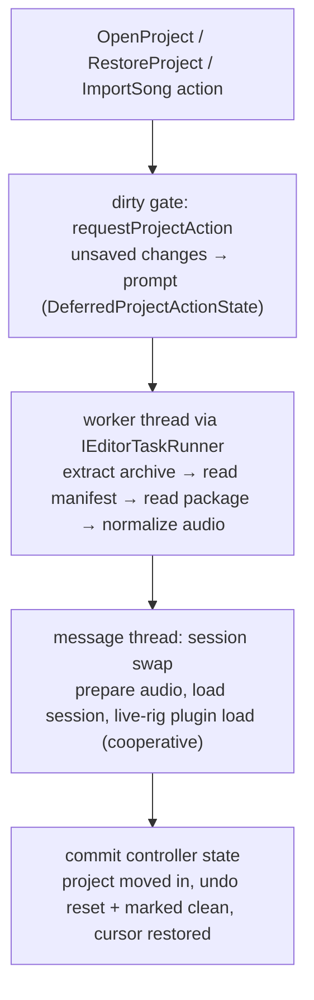

\page guide_project_lifecycle The Project Lifecycle

*Applies to: Editor-only (package IO delegates to common/core).*

"Project" is the editor's unit of work: opening, importing, saving, publishing, and closing songs.
Nearly every editor action is gated by this lifecycle, so its shapes — the workspace model, the
dirty gate, the worker-thread IO pattern — are worth knowing before touching anything
project-adjacent. The code lives in `rock-hero-editor/core/src/project/`.

# A project vs. a song package

A `.rock` **song package** is a flat ZIP: `song.json` plus the files it references. A `.rhp`
**project** is a ZIP wrapping that exact same native content under a `song/` subdirectory, plus a
tiny `project.json` manifest (its own format, its own `formatVersion` — never confuse it with the
song format; `project_io.cpp` owns it).

While a project is open, its contents live **extracted in a temp workspace directory** that the
`Project` object (`project.cpp`) uniquely owns — loaded audio paths point into the workspace,
edits happen on the extracted copy, and the `.rhp` on disk is touched only at save. Loading also
repairs backing-audio loudness-normalization metadata when stale (which counts as an unsaved
change — see dirty tracking below). Audio the analyzer cannot measure — digital silence, or a
level under libebur128's -70 LUFS gate — is normalize-and-report like everything else here, not a
refusal: `analyzeAudioForGainNormalization` answers with no record at all, the asset plays at its
raw level, and `unnormalizedAudioNoticeText` tells the charter once at open through the same
`IEditorView::showNotice` channel the chart-repair notice uses. That channel presents as a warning
box, not an info box — both of its notices report something the load settled without asking, which
the charter has to weigh before saving over the original.

Save and publish share one serializer: both write the song through the identical
`writeRockSongPackageDirectory`, and the only difference is the archive root — save zips the
whole workspace (manifest + `song/`) into `.rhp`; publish zips only the song directory into
`.rock`. That is "save is publish" made literal: a `.rhp` is a published package wrapped with a
manifest. One caveat worth knowing: the archive write is in-place (truncate + rewrite), not
atomic temp-then-rename.

# The open flow

```mermaid
flowchart TB
    act["OpenProject / RestoreProject / ImportSong action"]
    gate["`dirty gate: requestProjectAction
    unsaved changes → prompt (DeferredProjectActionState)`"]
    work["`worker thread via IEditorTaskRunner
    extract archive → read manifest → read package → normalize audio`"]
    swap["`message thread: session swap
    prepare audio, load session, live-rig plugin load (cooperative)`"]
    commit["`commit controller state
    project moved in, undo reset + marked clean, cursor restored`"]
    act --> gate --> work --> swap --> commit
```

Two mechanisms carry the correctness load:

- **The deferred-action state machine** (`deferred_project_action_state.h`) parks the requested
  action inside each prompt phase (`AwaitingUnsavedChangesDecision`, `AwaitingSaveAsPath`,
  `SavingBeforeReplay`) — a prompt with no parked action, or two prompts at once, is
  unrepresentable. After a successful save, the parked action replays exactly once.
- **Busy tokens + ownership transfer.** The open runs under a busy token; a close/exit during the
  load supersedes it and the stale completion self-discards. For writes, the `Project` object is
  *moved out of the controller* into the task state for the worker's duration, so package IO can
  never race controller-side mutation — and moved back on completion, success or not.

# Import

`ISongImporter` is a one-method port: `importSong(source, workspace) -> expected<Song, ...>`.
Two implementations, dispatched by extension:

- `RockSongImporter` — extract a `.rock` into the workspace and read it.
- `GpSongImporter` — Guitar Pro 7/8: parse `Content/score.gpif` (`gp_score_parser`, which rejects
  repeats/jumps — the chart format is linear time), require embedded backing audio, transcode it
  to FLAC (the canonical package audio format), build the tempo map from the score's audio sync
  points, and materialize one arrangement per track (`gp_chart_builder`). The backing track's
  signed `FramePadding` (44.1kHz frames) becomes the asset's signed `start_offset`: positive
  delays the audio, negative means the recording's head precedes the score and playback skips
  it. Most real charts carry a negative value, so dropping it desyncs the song. The builder then
  resolves the score's gestures, clamps each ring at its own string's next onset, and generates
  fret-hand positions per the policy spec below. Chord spans are NOT generated: they are derived
  from the finished notes wherever they are read (rules 10-12a).

An import produces an **unsaved** project: no path, `save_requires_destination` set, so the first
save is forced to Save As — which is also the moment per-project view state starts persisting.

## GP chart normalization policy

The plain-English specification of what the builder does to a Guitar Pro chart beyond literal
conversion. This section is deliberately written as numbered rules so a behavior tweak can be
made by editing a rule here and re-aligning the code
(`gp_chart_builder.cpp` — `generateFretHandPositions`, `resolveSlideIns` (rule 16's scoops), and
`resolveSlideOutExits` (rule 9's trail-off rides and rule 13's exit fret), closing with the one
chart normalizer `normalizeChart` (rule 26), all covered by `test_gp_song_importer.cpp`). Rules
1–25 apply to GP import only; rule 26 is the normalizer every load path runs — `.rock` imports
and saved projects go through exactly the same function, so a chart written under older rules is
repaired and reported rather than refused.

**Ring policy — what the chart STORES.** `ChartNote::sustain` is the actual duration the string
rings: Guitar Pro's notated duration, lengthened where the source says one sounding continues (tie
merges, legato-slide merges), where the source says to LET IT RING (below), or where a synthesized
gesture needs room to travel (rules 13 and 16), and shortened by two rules of the importer's own.
A before-beat grace **steals its lead** from the beat before it in its own voice — Guitar Pro plays
the ornament in the preceding note's time — so every note of that beat still ringing at the run's
first onset ends there instead (rule 17); a bend, whose points Guitar Pro writes as percentages of
the notated duration, is laid out over that duration and CLIPPED with the stolen part rather than
squeezed into what is left.
The steal is a shortening like any other, and a pass that lengthens the same ring afterwards simply
out-rings it — which is how the reference's `max(tie/slide end, let-ring end)` is written here, as
an ORDER of passes rather than as a comparison, and why rule 17 needs no exemption for the marks
that lengthen. And a **re-strike stops the ring**: the same-string clamp (40-Q2-B,
`normalizeSustainOverlaps`) ends every tail at the next onset on its own string. The clamp runs
after every pass that can lengthen a ring — the let-ring pass below is the last of them — and
before the two passes that ride the drawn picture — the chord spans (rules 10–12) and the
trail-off hand exits (rule 9); the fret-hand generator and slide-in resolution run ahead of it,
because the resolver's scoops are one of the passes that lengthen. Payload is trimmed to the ring
ONCE, straight after that clamp, because that is where the ring stops moving: the imported bend is
the only payload written past a ring, and trimming it earlier cut a let-ring note's curve against a
ring the let-ring pass was about to hand back.

**Let ring rings on to what SOUNDS.** Guitar Pro's `LetRing` mark is the mirror of staccato's
halving (rule 22): staccato shortens the imported ring, let ring lengthens it, and neither is ever
a stored field — the ring IS the record. Playback sounds a marked note until the FIRST of three
stops: the next SOUNDING onset on its own string; the next REST in the note's own voice, which is
the transcriber's silence statement; and one full measure-duration measured from the note's own
onset — the ORIGIN bar's metric length, so it is a sliding cap that crosses barlines and can land
mid-beat, and under a meter change it stays that bar's LENGTH rather than becoming a beat count in
the meter it runs into. That is Guitar Pro's own playback rule rather than an invented horizon, and
it is the translation for exactly that reason: the source's author tuned the chart by ear against
that playback. The import walks the rest and the cap (`letRingEnds` in `gp_chart_builder.cpp`,
transcribed from the reference reimplementation `MidiFileGenerator._getNoteDuration`) and leaves
the first stop to the same-string clamp above, which already states it for every ring in the chart.
That delegation is a deliberate DIVERGENCE, not a shortcut: the reference asks the marked note's
own voice for the next beat holding any same-string note, while the clamp asks the built stream for
the next onset on that string that actually SOUNDS, in any voice. It is a different question, and a
better answer — a tie continuation sounds nothing new, and a voice the reference never looks at can
still re-strike the string. Grace beats sit outside the walk entirely, because they take no bar
time and the emission passes over them for the same reason; 23 marks in the local corpus sit on
one, and each keeps its notated ring.

Four notes never lengthen. Three are Guitar Pro's own pre-emptions, where playback returns before
it ever reads the mark: a **dead**, a **palm-muted** and a **staccato** note each keep the ring
their own mark gives them (only the pre-emption is taken from that block — the static durations it
returns are declined, because the notated duration is the timing information the chart reads). The
fourth is ours, and it is what the delegation costs: a note that ABSORBED a same-string merge — a
tie continuation, a legato-slide landing — is never extended, because the merged ring is already
the answer. The reference reaches the same place by arithmetic rather than by exception: the merged
successor's beat is the very next one holding a note on the string, so its walk stops there, its
let-ring end collapses onto the merged end, and `max(tie/slide end, let-ring end)` is the merged
ring in every case. The merge is also the one same-string stop the clamp cannot see, since the beat
that stated it is gone from the built stream by then. A note whose end is already stated by an
unpitched slide-out is likewise left alone, since that release IS the ring's end by definition.

The pass reports the rings it lengthened in the conversion log — counted AFTER the clamp, so a
ring the clamp took straight back is never announced as a change the reader cannot find. One
ordering is deliberate and still open: the fret-hand generator runs BEFORE this pass and therefore
reads pre-extension rings, which measured a −139 placement difference against reading the extended
ones; the question of which is right is queued in the #137 FHP evaluation rather than settled here.

Nothing else shortens a ring. A dead note keeps its notated duration like any other — E25 is a
presentation rule and nothing applies it to the stored note — because that duration is the timing
the legato adjacency test reads, and the picture it does not draw is derived. Readability otherwise
is the next section, and it is drawn, not stored.

**Tail policy — what a surface DRAWS** (GP notates every note at its full duration, and the chart
now *stores* that duration; a chart only *shows* deliberate sustains, so the shortening is a
read-side derivation rather than an import-time edit). Rules 1–4 below are the presentation rules,
implemented once in `presentedChartNotes` (`chart_presentation.h` in common/core, covered by
`test_chart_presentation.cpp`) and applied in the order written, with the dead note's silent tail
(E25) applied last as the fourth. They are not import policy at all
any more: every surface derives them from the stored stream, so the same chart drawn from a `.rock`
file and from a fresh import shows the same tails, and the model behind the split is
`docs/plans/in-progress/note-sustain-model.md`.

1. **Trim to the minimum sustain distance.** A note's drawn tail ends at least the
   minimum-sustain-distance margin — 1/16 of a whole note, the shared constant in
   `grid_arithmetic.h` (1/32 was trialed and reverted on sight, 2026-07-23), the same settled
   margin the editor's
   duration verb clamps to — before the next binding onset, which is the first later note at a
   different grid position on *any* string. The margin bounds sustain
   *tails* only, never note onsets (renamed from "minimum note distance", 2026-07-23): a run of
   32nds imports every onset as notated, with tails trimmed toward zero and then dropped by the
   rule below, so dense passages render as plain heads. Notes sharing a position — chord
   members — never bind each other. The binding onset is the first later onset the ring does not
   *pass* (user rule 2026-08-28, superseding the 2026-07-22 exemption): a ring running *strictly
   past* an onset — merged from a tie or notated across voices — keeps looking and binds on the
   first onset it reaches without passing, trimming there like any other tail, and a ring ending
   exactly *on* an onset passes nothing and binds there too. Passing is still the deliberate hold
   it always was and still earns the group its tails under the drop rule below; what it no longer
   does is switch the trim off, which left a ring-through dying on a later head with no gap at
   all. What the arpeggio class reads is the STORED
   ring, never this drawn one (rule 12, user ruling 2026-08-28), so a dead string presents no tail
   (E25) and still reads as carried under a strum: the finger is down either way.
   A ring that merely *reaches* the next binding onset trims like any other, ties included.
   Binding is decided on the SOUNDING position, because that is what the stored chart has: a
   grace lead is a real onset here, where the old import-time form read the beat the source
   notated and exempted a strum's own grace-shifted members (the measured consequences are listed
   in the model plan's accepted deviations).
   Repeated chords trim too: their held-to-the-restrike reading lives in the merged shape span
   (rule 11), which is derived from the stored rings and already runs through every
   restrike — the box continues while the tails keep the minimum gap.
2. **Clip a technique payload that says nothing new; never clip one that does.** Carrying a
   technique is not a blanket exemption from rule 1 (user rule 2026-08-06, superseding the
   unconditional "never clip a technique payload" form): the margin yields only when a payload
   point *changes* something inside the region the trim would remove, and then only as far as
   that change reaches. The clipping is the drawn note's, never the stored one's — the chart
   keeps every point Guitar Pro wrote. Writing `t_authored` for the stored ring, `t_trim` for the
   end rule 1 alone would give, and `t_info` for the last *changing* payload offset, the tail
   ends at `min(t_authored, max(t_trim, t_info))` — it extends to the change and **stops exactly
   there**, never running on to the notated end. A change landing precisely at the margin
   truncates the tail right there with its information intact. Payload points the trim passes are
   dropped with the tail; only non-changing ones can ever sit past `t_info`, so nothing
   informative is lost and the model's "payload within the sustain" invariant keeps holding.
   What counts as a change is asked per keyframe CHANNEL, against the value the channel opened
   with — the note's own bend, fret and vibrato state: a bend value differing from the one it
   replaces (the note usually starts unbent), and a fret differing from the previous stated fret
   — an **equal-fret keyframe is a HOLD, not a glide** (rule 15), so a trailing hold pins a pitch
   the tail already sounds and cannot hold the tail open. A slide still reaches its target note,
   because a shift glide's landing keyframe is by definition a fret change (exact adjacency stays
   legal). The vibrato channel counts too, and its two directions differ: a bend value and a fret
   are POINTS, complete at the instant they are reached, so the tail may stop exactly there, but a
   statement that leaves the string SHAKING — a start, or a step between the narrow and wide
   widths — is an interval STATE, and a tail ending on it would show the new shake for no time at
   all and read as the old one, so its information reaches one minimum gesture window PAST the
   statement, while a statement that ENDS the shake is a point again (the interval before it
   already showed everything). The techniques that are still whole-note — tremolo, emphasis, muting, harmonics
   — cannot change mid-sustain, so they never override the margin at all. The unpitched
   slide-out is not payload either (user rule 2026-07-28): its end is gesture geometry derived
   from the notated duration,
   not a musical event, so it trims back with the tail and respects the margin. A crowding that
   would crush it — a non-positive target, or one at or under the last *surviving* keyframe —
   compresses it to the smallest
   legal end instead (strictly positive, strictly after the last keyframe) rather than keeping
   its full length: the old keep-the-end fallback could run the gesture through the next sounding
   onset in a crowded passage (first sighted 2026-08-02, when slide-ins still fabricated early
   heads).
3. **Drop short effect-free tails, per strum.** A strum that carries no sustain technique
   (bend, slide, vibrato, tremolo) on any string and whose every member *rings* shorter than the
   kept-sustain bound (`minimumKeptSustainBeats` over `g_minimum_kept_sustain_whole_note` in
   grid_arithmetic.h — a QUARTER NOTE, quarter-note-referenced per the user rule of 2026-08-14
   because one signature beat of 12/8 is an eighth and a beat-referenced bound gave nearly every
   note of a 12/8 song a tail; shared with the legato hold test, which relies on this rule to
   read a missing tail as a proven release)
   draws no tail on any member. The comparison reads the STORED ring, never the trimmed end (user
   rule 2026-07-28, superseding the post-trim comparison): a note held to the
   bound or longer keeps its drawn tail even though the margin leaves it slightly
   shorter than the bound — in 4/4, a chugged riff of one-beat notes keeps its 3/4 tails,
   while a run of shorter notes still renders as plain heads. The decision belongs to the
   **strum**,
   not the single string (user rule 2026-08-06): every string of a chord rings from one stroke, so
   a tail any member earned — a technique on it, a ring reaching the bound, or rule 1's
   deliberate hold — keeps every member's tail. Deciding per string drew a lone tail on a sub-beat
   double stop's bent note while its unbent partner, effect-free and sub-beat, lost its
   tail entirely and read as unsounded. Grouping is the sounding position, the same identity rule
   1's binding scan uses, so cross-voice simultaneities count as one stroke here too. Each member
   still keeps its *own* margin-trimmed end (rule 2 decides length
   per string; only the keep-or-drop verdict is shared), so the bent string's tail runs to its
   last bend change while its partner's stops at the margin. Vibrato and tremolo protect a tail
   from *dropping* but not from *trimming* — in dense passages such a tail can shrink to nothing,
   and where the margin leaves a partner no room at all it still shows no tail.
4. **"One beat" is one signature beat** — a quarter note in x/4, an eighth in x/8 — matching the
   chart model's own sustain unit.

**Fret-hand position generation** (GP has no hand-position concept, so the track is generated by a
corpus-derived algorithm — the metrics and the source-corpus study behind these rules are in
`docs/plans/todo/fhp-corpus-derived-generation.md`):

5. **The hand is a window.** A position covers frets `[fret, fret + width - 1]` with width four,
   widening only when a single onset spans more than four frets (wide chords); the next move
   snaps the width back. A slide *reshape* (rule 9) is the exception to the four-fret floor: it
   follows the exact sounding span and may be narrower than four.
6. **Open strings never constrain, and taps float above.** Fret-zero notes are playable from
   anywhere and neither place nor move the window. A *tapped* note is likewise not a coverage
   event: two-hand taps sit far above the fretting hand (a median seven frets in the corpus), so
   the window tracks the fretted / left-hand notes and any held chord shape while the tap floats
   above it. Only Guitar Pro's *Tapped* (two-hand) articulation becomes a chart tap; a
   *LeftHandTapped* note is the fretting hand striking the note from nowhere and imports as the
   `LeftTap` attack verbatim — so every tap rule in this policy
   refers to two-hand taps only, and left-hand taps anchor the window like any fretted note. A
   note carrying both marks imports as the left-hand tap: left-hand is the specialization, the
   generic tap mark adds nothing to it (user rule 2026-07-28). The 3D-highway camera frames such a tap on its own — it scans the notes, not only the
   hand windows — so the tap stays on screen even though the window light stays low on the left
   hand. (A held chord under tapping renders as an arpeggio, rule 12.)
7. **The hand re-anchors at phrase boundaries.** At a section start, or after a rest of at least
   0.8 seconds, the window re-places fresh — biased low to the phrase's floor fret (its lowest
   fretted note) — even when the previous window still covered the upcoming notes. Most authored
   anchor moves happen at these musical boundaries, not at the first misfit, so the greedy
   first-misfit walk this replaced under-moved. An opening run of notes that anchor nothing
   (open strings, taps) must not pin the hand at the nut-reference window (user rule
   2026-07-28): the first placement's window comes from the first anchoring note but retimes
   back to the chart's first note, so the hand is already settled where the song needs it when
   play begins.
8. **Within a phrase, moves are minimal.** When an onset's fretted notes fall outside the current
   window mid-phrase, the anchor moves the shortest distance that covers them — it never jumps
   further than needed. Slides are the exception (rule 9).
9. **Pitched slides reshape or carry the hand; unpitched slides do neither.** A pitched slide
   keyframe (shift and legato alike) moves the window at its mid-sustain position, but *how*
   depends on whether another finger stays planted:
   - **Reshape — a finger stays planted.** When another fretted note is still ringing at the
     keyframe and is not itself sliding there, it is a planted finger that pins the window's edge
     on its side; the sliding note carries the opposite edge to its landing fret. The window
     becomes the exact sounding hull `[lowest, highest]` — no width floor and no drag — so it
     *shrinks* when an outer note slides inward (a `{2,5}` chord whose 2 slides to 3 under the
     held 5 gives `[3,5]`, not `[3,6]`), *grows* when an outer note slides outward (2 slides to 1
     gives `[1,5]`), and *holds* when the sliding note is interior and both edges are already
     pinned. This is the fret hand deforming as one finger moves while the rest stay down (user
     rule 2026-07-30).
   - **Travel — nothing else is held.** A lone slide, or a whole chord gliding in lockstep by the
     same fret delta, has no planted finger, so the whole hand travels: the anchor drags by the
     keyframe's own fret delta — a five-to-nine glide moves the window up four frets — so the
     fretting finger keeps its slot even when the target would already fit. The dragged anchor
     clamps only as far as staying on the neck and covering the target requires. Simultaneous
     slides whose deltas disagree (a convergence or divergence) are not a rigid translation, so
     they cancel the drag and reshape in place instead.

   The window always rides an unpitched slide-out (user rules 2026-08-02): an exit placement
   at the trail-off's compressed end carries the window with the gesture. **Revised 2026-08-06:**
   that placement now rides the trail-off's OWN segment and eases with the unpitched curve, so
   the window follows the drawn rail precisely instead of approximating it — a trail-off's curve
   is defined, so there is nothing to approximate. It previously arrived through the standard
   margin morph, which left the window stationary for most of the drawn glide and then sprinting
   to catch up (measured: still for 87.5% of the glide, then 4 frets in 0.125 s, peaking 3.29
   frets apart). The margin morph had been chosen in the other direction, to stop the window
   creeping from the note's onset on long notes (sighted 2026-08-02); the creep it avoided is a
   property of the RAIL's own span, so if it reads wrong the fix belongs to the drawn geometry
   rather than to the window, which now simply agrees with whatever is drawn. The hand's next
   move decides the rest. When its next placement departs in the trail-off's direction AND
   arrives by the very next onset, the gesture IS the departure: the exit fret rides the
   anchor travel (widened to the slide-in rule's two-fret minimum) and the window flows
   onward into the arrival. Otherwise the gesture is a release and return: the exit keeps
   the fixed four-fret gesture, the window dips with it, and a restore placement at the very
   next onset brings the window back for the note that follows — so notes after the gesture
   are never stranded in the dipped window. A trail-off with no room before the next onset
   stays planted.

**Posture and shape derivation** — no longer an import rule at all. GP scores in practice carry no
handshape or diagram data, and the chart stores none either: a span is a statement about the notes
under it, so `common::core::deriveChartShapes` (`chart/chart_shapes.h`) derives every span and
posture from the note stream wherever they are read, once per chart revision inside
`chartResolutions`. The one authored input rides in the stream itself: a note whose `attack` is
`none` (rule 12b) — the single posture fact no function of a stream of STROKES can distinguish.
Rules 10 to 12b below are that derivation's
maintained plain-English spec — this page is where they are stated, and `chart_shapes.h` points
here rather than restating them.

One consequence of the move is worth naming: the derivation now sees the SETTLED stream, where the
importer ran before `normalizeChart`. A strum whose notes carried something the rules refuse — a
slide on an open string, say — used to derive its own span from data the chart never contained;
now it reads as what it is, and merges with its identically-played neighbours.

10. **Two or more MEMBERS at one slot form a chord.** A member is a sounding fretting-hand onset
    at that slot or a silently-held stop at it (rule 12b), so one struck string beside one held finger
    forms a shape, two held fingers with nothing sounding form one, and a LONE member of either
    kind forms none (user ruling 2026-08-27, correcting the sounding-only threshold this shipped
    with: converting one member of a two-note chord into a held finger made the shape evaporate
    and took the converted fret off every surface with it). The slot's posture — the fret held
    on each member string, open strings included — becomes a posture entry, deduplicated by fret
    vector across the chart. Postures carry no name and no fingering, because nothing authors
    either; when they are authored they become a dictionary keyed by a posture rather than fields
    on one. Tap-attack notes are excepted: taps belong to the tapping hand,
    not the fretting posture, so they never join a posture — even a multi-string tapped onset
    derives no chord, and a mixed onset is judged by its non-tap members alone (rule 11). A span
    whose members are ALL silently-held stops has nothing ringing to give it length, so it states
    its posture at an instant — which is exactly where the bracket that prints it draws — until
    the content it fronts arrives and lends it one; rule 12b carries that law and the dissolve
    that answers a statement nothing ever justified.
11. **Repeated strums of one articulation share one span.** Consecutive onsets whose strings
    are played *identically in every way except duration* — same frets, attack (legato, left-hand
    tap, tap, slap, pop), muting, harmonics, vibrato, tremolo, emphasis, bends, and slides; the
    comparison is the whole note with position and duration neutralized, so techniques added
    later join it automatically — merge into a single shape span for as long as its statement
    stays in force (rule 11a), which for a chug chain that rings strike into strike is the first
    strum through the last strum's stored *ring* (the hand keeps holding while the chug rings,
    whatever the tails draw). Any intervening non-chord onset or any
    articulation difference on any string ends the span — a muted or hammered chord is its own
    chord with its own box, even on the frets of the chord before it, while frets-identical
    chords share one deduplicated posture (the hand posture is identical; techniques render on
    the notes). Tap-attack notes are invisible to span derivation (user rule 2026-07-28): they
    join no posture and never open or close a span, so a tap-only onset is fully transparent to
    the GROUPING — a chord ringing under taps on other strings keeps its span, which rule 12 then
    renders as a held arpeggio, while a short-ringing chord's span still ends at its own ring,
    before the taps. Transparent to the grouping is not transparent to the ring: a tap is a real
    onset on its own string, so the ring policy's clamp ends any ring there and that string no
    longer joins a later posture. A mixed onset (a fretting-hand note struck under simultaneous
    right-hand taps, the two-hand-tapping staple) counts only its non-tap members: one left-hand
    note is an ordinary single onset, two or more are a chord. An isolated strum gets a span of
    its own ring. **One single-string onset is excepted:** a lone *re-pick* of a string the open
    span already holds — by sound with unchanged articulation, or by a silently-held stop at the
    same fret (rule 12b) — does not close the span while the span's statement is still in force
    (rule 11a). The hand has demonstrably not left the shape, so the span continues over the
    re-pick instead of dying at it, and this is what makes the one-note-at-a-time broken
    chord over a held shape derivable at all. An ADJACENT re-pick — the re-picked string's own
    stored ring ending exactly at it — is continuity itself, which is why no separate witness is
    asked of the other members (user ruling 2026-08-27, the (ii) narrowing: rule 11a already
    states, once, what a witness was a second reading of); one arriving after a stored gap on
    its own string is an ordinary onset, because the statement ended at that gap. It never OPENS a
    span; it CONTINUES one, and from there the re-picked string's own ring is that string's newest
    bound — so a re-pick that rings short ends the span at its own gap exactly as any other
    member's gap does, and only one that rings on carries the span further. Where it does carry it
    further, the longer span widens rule 12's right-hand scan, so a tap that used to fall after a
    span can now fall inside it and turn a box into an arpeggio. The founding figure now derives
    from the gap law rather than from this exception alone: a broken chord whose plucks ring into
    one another is one statement, and detached plucks past the first gap are each their own.
11a. **A span's statement is in force while every SOUNDING member's stored ring is continuous —
    THE CONTINUITY LAW** (user ruling 2026-08-27). Continuous means ringing through, or ending
    exactly at the next onset that SOUNDS that string — the strike-into-strike shape a stored chug
    chain has. The onsets that CONTINUE a string are every sounding one, whichever hand made it
    (user ruling 2026-08-28): a tap on a member string ends that member's tail underneath it with
    no hand lifting anywhere, so the sound was REPLACED and not silenced, and detachment is a
    statement about sound STOPPING — which is what makes the two-hand run over a held shape one
    statement through its own re-picks. A silent hold sounds nothing and stops nothing, so it
    continues nothing. **Continuing a chain and writing one are different acts, and only the
    fretting hand does the second**: a sounding onset of either hand keeps the statement in force
    across it, while a chain's LENGTH is written only by a MEMBER's own strike. A right-hand onset
    says nothing about the fretting hand — which is why it joins no posture (rule 11) — so a chain
    it wrote would let a tapped sixteenth decide a chord's extent, hold a span open through a tap
    run, or stretch one past the last sound the fretting hand made. The derivation stores the two
    facts apart for that reason: one number can only ever be right about one of them.
    The FIRST genuine stored gap on any sounding member ends the span at that ring's end,
    because a ring that simply stops with nothing sounding after it is the chart stating
    DETACHMENT of sound rather than mere silence — the reader's inference about the finger is their
    own. Members still ringing past that end are remainder context and draw as ordinary tails;
    absorption is ink ownership and never trims a presented sustain.

    So a span's extent is the MINIMUM of its members' chains, never the maximum of their rings, and
    minimum extent is this law's box case rather than a rule beside it. A member's own FRET CHANNEL
    bounds its statement the same way its ring does — see rule 11b, which is that bound and the
    span it opens. Two strings of one strum
    with unequal rings end their box together at the shorter. A run of strums that ring into each
    other is one span through the last one's ring. A run with a genuine gap between two strums is
    TWO statements, because a span no longer outlives its own sound waiting for an identical strum
    to rejoin it — a gap is a boundary, not a pause. **Claims are exempt**: a claim has no ring, so
    it states where a finger is and never how long anything sounds, and a zero-sound span's extent
    stays justification-driven (rule 12b) — justification decides whether that span EXISTS, never
    how far it runs, so it states its posture at its own instant until a MEMBER sounds inside it.
    A held-carrying tap answering the claim is where that split shows: its ring IS real evidence
    about the stop (a tapped harmonic dies the moment the held fret lifts), and it still adds no
    length, because the evidence arrives as a claim. **Carried ring-through members are
    extent-inert**: a string ringing across a span's onset joins the posture (rule 12) but must not
    bound it, or let-ring texture under a passage would decide how long the passage's own
    statements are. The closing machinery is unchanged and runs after this: rule 12a's margin trim
    and its last-strum floor shorten what the statement reached, never lengthen it.
11b. **A member's fret TRAVEL splits the span, and the grip its travels land in re-opens**
    (user ruling 2026-08-27, [D2]). A note's fret channel states where its finger is along the
    ring, so it bounds that member's statement exactly as the ring does. The **departure** is the
    last moment the channel still states the shape's stop before a differing statement, and the
    span ends there through rule 11a's same minimum — a member whose finger has gone travelling is
    no longer sounding what the shape says. Where the first differing statement is the member's
    first fret-stating keyframe, the departure is the ONSET, and the span floors at the strike like
    every crowded close (rule 12a): that instant is the chord slide's first fret stack. The bound
    holds for continuity too, which is the point of stating it once — a later strum cannot merge
    back into a statement the hand has already travelled out of.

    **The channel has ONE reader**, asked "what stop does this note state at this offset", and
    every question about a finger's whereabouts is that one question at a different moment: a
    strike asks it at the note's onset, a member's statement end wherever the shape's own start
    falls inside the ring, a landing at the arrival, and rule 12's ring-through fold-in at the slot
    the ring crosses.
    Between a departure and its landing the answer is NOTHING — a finger mid-glide is on no stop, so
    it is a member of nothing. Naming the stop at the asking site instead was the same fact stated
    twice and free to disagree with the channel, which is how a carried finger came to be printed at
    a fret it had already left: every let-ring chord after a chord slide stated the departed grip
    while the successor bracket beside it stated the landed one (user ruling 2026-08-29).

    A **successor span** then opens where the travels LAND, and it is the rule 12b growth split
    made at a moment inside a ring rather than at a slot (a claim's departure and arrival are one
    instant; a travel's are two, with the glide between them). Its members are the arrived rings,
    carrying their landed stops — a member that stayed put keeps the shape's own, which is the
    one-finger slide by symmetry — it wears the bracket digits stating that grip, takes the new
    derived dictionary name, and runs by rule 11a over those rings, ending at its first arrived gap
    with survivors drawing as ordinary remainder tails. It strikes nothing, so rule 12's one
    comparison makes it an ARPEGGIO by construction. The travel between the two spans is covered by
    no span at all: it draws as the members' sliding tails, which is the published chord-slide
    picture — two fret stacks joined by parallel lines. The first restrike of the landed shape opens
    a full non-repeat box by rule 11, with repeat boxes chaining after; that is derived, not ruled.

    **Two conditions open it, and between them they are the four ratified edges.** Every travelling
    member must come to rest at the SAME instant — staggered landings state no single grip, so
    nothing re-opens and the truth stays in the tails (watch item,
    `docs/tracking/watch-items.md`). And two or more members must go on stating a stop there with
    ROOM to be read, the minimum sustain distance every element keeps (rule 12a). That second
    condition is what makes a glide straight into a restrike open nothing: the chart's own encoding
    of "slides into that note" puts the arrival exactly one margin before the landing's onset, so
    the landed grip has no moment of its own and the strike's own box states it. Travels of
    UNEQUAL distance landing together — voice-leading slides — are included, because nothing here
    asks how far a finger moved. And a fret the channel LEAVES again is a point on the path, never
    a grip: "equal frets are a HOLD, different frets are travel" is the model's own reading of the
    channel, so a continuous multi-fret glide is one travel to its end while a glide with a held
    grip between its legs states each grip exactly once.

    ONE span stands at a time, which is the model rather than a limitation: a landing the walk
    reaches with another statement already standing over it opens nothing, and takes the staggered
    case's disposition.
12. **A span is an ARPEGGIO when its members sound separately, and a chord box only while every
    sounding of it is the shape whole.** One law, and the projections' shared arrival rule asks it
    of a span in each place a sounding can be incomplete. Four triggers, all of them that one
    question:

    (a) **A posture string still ringing at the span start with no onset there.** A note still
    ringing through a chord's onset (tie-held from before, not re-struck) joins the derived posture
    on its string — **at the stop its own fret channel states there** (user ruling 2026-08-29), so
    a ring that has slid since its strike is stated at the grip it has reached and one caught
    mid-glide is stated nowhere at all, joining no posture (rule 11b) — and the strum is then
    picking around it rather than strumming the shape whole
    (user rule 2026-07-22: both the chord under a held single note and the re-strum whose tied
    members keep ringing are arpeggios, so a tied passage with a hand move splits into two arpeggio
    shapes). **The whole class law reads the STORED ring** (user ruling 2026-08-28): where the
    fingers are, and which of them the pick reached, is a fact about the HANDS, so a dead string's
    carry classifies exactly like any other — E25 stays a DISPLAY rule, about what a surface draws
    of a ring nobody hears. This trigger has no reading of its own any more: it IS (c) asked at the
    span's own start, one comparison on one stream, answered by the walk that made the posture.

    (b) **A silently-held member** (rule 12b). The bracket is the only mark with anywhere to print a
    fret nothing struck, so a span carrying one must arrive as an arpeggio or the authored fact is
    stored and never shown.

    (c) **Any SOUNDING of the span that is only PART of the shape** — a partial restrike, a lone
    re-pick of one member (rule 11's exception, user ruling 2026-08-27), or the span's own start
    where a member is carried into it rather than struck, which is (a) (user ruling 2026-08-28), or
    a rule 11b landing successor's start, where NOTHING is struck and every member is carried.
    The strings the shape SOUNDS are the denominator, which is well defined for one reason: within
    a span the posture is CONSTANT BY CONSTRUCTION, and every split rule above exists to keep it so.
    These need no clause each because they are one fact at four widths, and every span a lone
    re-pick continues is therefore an arpeggio by definition. Why such a slot is INSIDE the span at
    all is rule 11a's answer rather than a condition here: the strings it does not strike are still
    ringing, which is what let the walk fold them in and merge, or ride the re-pick — a partial
    restrike with no ring behind it is interior to nothing, because rule 11 split it into a span of
    its own. This one is recorded BY the span walk rather than re-read from the finished span,
    exactly as (b) is: answering it means knowing which slots the statement covers, and all a later
    reader can see is the extent rule 12a already trimmed — where the span's own last strum sits
    exactly ON the end whenever the closing onset crowds inside the margin, which a sixteenth-note
    passage does by construction.

    (d) **A tapped note sounding anywhere within the span** (user rule 2026-07-28). The fretting
    hand holds the shape while the right hand taps above it, so the notation shows the chord is
    sustained through the tapping; a pick slide reads the same way, both being right-hand onsets.
    The one trigger the projection still derives, because it asks about the span's EXTENT rather
    than about which slots the statement covers.

    A posture string is either SOUNDED by the span or CLAIMED by it, so "merely silent at the start"
    is not a case to decide: a string nothing sounds and nothing claims is in no posture at all. A
    carried one answers through (a)/(c) and a claimed one through (b) — the distinction rule 12b was
    once needed to draw here is structural now. **"Fewer than two sounds at a span's start" is not a
    trigger either**, but the precondition of (a) and (b): rule 10 needs two MEMBERS to open a span,
    so a thin start always means a carry or a claim. A figure picked one string at a time from its
    FIRST note still opens no span on its own — rule 11's re-pick exception EXTENDS a shape and
    cannot open one, and rule 10 needs two members at one slot — so that grouping waits for the
    corpus-informed pass, or for the charter to state the held members with rule 12b's holds.
12a. **A closed span keeps the minimum sustain distance, like every other element.** Tie
    merging can stretch a strum's ring past the next event, but the shape's box never follows
    it: when a new posture (or a non-chord onset) closes a span, the closed span's end trims to
    at least the minimum-sustain-distance margin (rule 1's shared constant) before that onset —
    the same rule sustains follow, so consecutive shapes keep the same visible gap as
    everything else instead of butting exactly (user rule 2026-07-23, superseding the
    clamp-to-the-onset form). The trim floors at the span's last strum, so the box always
    reaches its final restrike even when events crowd closer than the margin; a span that
    would still lose all length (a single short strum crowded inside the margin) falls back to
    exact adjacency, ending at the earlier of its own reach (rule 11a) and the closing onset.
12b. **A silently-held stop states the one posture member a stroke cannot.** A finger resting on a
    fret makes no sound, extends no ring, and produces no onset, so a hand holding a six-string
    shape and picking four of it streams *identically* to a hand holding four and moving to the
    fifth later. Both are real playing (user ruling 2026-08-25, which is also why growth by a new
    string keeps SPLITTING rather than being read as one shape), so the derivation notates the
    literal notes and a note with `attack: none` is how a charter states the other reading —
    authored by the arpeggio hold verb (`N`, \ref guide_keyboard), which acts on the selection like
    every chart verb, falling back to the armed caret's own slot when nothing is selected (which is
    the only way to reach a slot that holds nothing). Such a note is a POINT record: its slot and its fret are the whole of it, it
    has no ring of its own, and every technique is refused on it (user ruling 2026-08-27, which
    replaced the separate `holdMarkers[]` array with this attack — a second slot-keyed array meant
    disjointness had to be a rule, where one stream owes slot uniqueness anyway).

    A hold lying inside a derived span joins that span's posture on its string, and the span then
    arrives as an **arpeggio** — the bracket is the only mark with a place to print a fret nothing
    struck. One that resolves to nothing — no span covers it, its position falls past the span's
    own end, or the shape already states that same stop on that string — states nothing anywhere,
    and the settle below removes it rather than saving a record no surface draws.
    **A hold is not a strike** — it closes no span, ends no posture and bounds no neighbour's ring —
    but it IS a member, which is what rule 10 counts. What it can join is whatever statement is
    still in force at its slot (rule 11a), which is the same question every other branch asks and
    not "the derivation has not closed the span yet": holds past the shape's own sound state the
    NEXT shape instead of joining a shape that stopped sounding. A hold sounds nothing, so it can
    never bridge a gap either — landing exactly where a member's ring stopped joins nothing.

    **A stop taken inside a shape that the shape does not already STATE splits it** (user ruling
    2026-08-27, which overturned the earlier "holds landing under a held shape join it" clause).
    From that instant the hand is in a different shape, and that is the same answer rule 11 already
    gives a strum growing by a string: growth splits. One comparison decides it, because there is
    one question — what stop does the shape state on this string, by sound or by claim: a string
    it states nothing on is the hand growing into a new shape, and a string it states ANOTHER stop
    on is the finger MOVED, a shape change however the old stop was written down (user ruling
    2026-08-27: *"If the held fret is the same as the span, the span knows to continue. If it is
    different it would split the span"* — so a tap harmonic mid-span whose `held` matches the
    shape's stop leaves one shape, and a differing one leaves two). Only a claim restating the
    shape's own stop takes no new stop at all.

    The new span inherits the shape it grew out of — its articulation and the stops already
    claimed in it — and takes the extent the old one had left, so the two cover that ring end to
    end, and a later strum whose articulation equalizes with the grown one merges into it under
    rule 11 with nothing added. What the splitting slot states DIFFERENTLY is superseded rather
    than inherited:
    the hand has left those stops, so the new span states this slot's claims there instead of the
    ones it moved off — without which the grown shape would print the fret the hand just left and
    the claim that split the span would state nothing anywhere. What the authored hold decides is
    therefore WHERE the statement sits: written at the shape's own onset it states the shape whole
    from its start (the case the verb exists for); written later it says the finger came down later,
    because that is what it says. One exception: a shape the HAND alone stated that is still WAITING
    for its content is one statement being assembled, with nothing to date it by, so later fingers
    join it rather than splitting it; once that content arrives the statement is dated like a
    sounding one and stops being assembled. A stop carried across a split is a member of every span
    it reaches, but its FACE belongs to the FIRST — it was authored at one slot, and that is where
    its bracket draws.

    **A claimed stop states itself in either of two shapes, and the rules above bind both**
    (user ruling 2026-08-27). Where nothing sounds at all the whole note is the statement (`attack:
    none`, whose `fret` is the stop); where the PICKING hand sounds the string, the fretting hand's
    stop rides that note as `held`. They are one statement about one hand at one slot, asked through
    one query (`claimedStop`), so membership, justification, the fret match and the growth split
    read them identically. What a `held` stop may NOT do is lie inside its own note's TRAVEL (user
    ruling 2026-08-27): the planted finger is on the string, so the onset cannot start on it, end on
    it, or pass through it. One rule over both attacks that can carry a stop, because it reads the
    PATH rather than the attack: the range is the closed hull of the note's own fret, every keyframe
    fret and its slide-out terminal — a pick slide always states such a path, a tap does wherever
    the charter wrote one, and an onset that states none has a hull of one point, which is the
    earlier equal-fret refusal as the degenerate case. A refusal rather than a repair, because no
    lift can know the stop the charter meant.

    **A claimed stop that states nothing is REMOVED, not kept** (user ruling 2026-08-27).
    `sweepInertClaimedStops` is the legato settle's sibling: it judges only the stream it is handed,
    runs as the normalizer's last stage on every load and inside the editor's plan gate on every
    edit, and iterates to a fixpoint, because taking one claim can leave a span with a single member
    and strand the claims that had joined it. What it takes is the STATEMENT and never more: a
    `none` note IS its claim, so the record goes; a `held` stop rides an onset the charter wrote, so
    only the field is cleared. And a held stop the note's own PITCH is measured from is not taken at
    all: a tapped harmonic speaks from the stopped length (`physicalStopFret`), so clearing it would
    retune the record and could leave its node at or behind its own stop, which the rules refuse —
    the settle takes statements that reach nothing, never the sound the charter wrote.

    **A claim that JUSTIFIES a span is never inert** (user ruling 2026-08-27), and the sweep needs
    no rule to say so. Answering is reaching: the derivation publishes a claim whose answering
    justified a span as having reached that span, even where it printed no fret and landed past the
    instant a waiting span states its stops at, because taking that record away would dissolve the
    span. So "states nothing" and "does nothing" stay ONE question with one answer, and the plain
    held-carrying tap that plays a shape's own stop stands instead of dissolving the figure it
    justifies. A claim that answers nothing is untouched by this: one restating a stop a shape that
    needed no justifying already states changes nothing anywhere and still goes.

    Two consequences worth naming. An edit that strands a claim takes it
    in the SAME undo entry, so one Ctrl+Z restores the pair; and the `N` verb refuses a press
    unless every slot it named still STATES a stop once the settle has run — whole-plan, never per
    slot, so a chord's members are legal together and illegal one at a time, and a press whose
    statement the settle took does nothing at all instead. Asked of the statement rather than of the
    record, because for a `held` stop the settle takes only the field and leaves the note identical,
    which no diff of what was removed against what was written can see.

    **A shape the HAND alone states must be justified by one of its own HELD FRETS BEING PLAYED**
    (user ruling 2026-08-27: *"a tap should not be able to justify a span on its own, the span
    should require one of its HELD frets to be played at some point during the span for it to be
    justified"*). Two held stops at one slot open a span — rule 10 counts members, not strikes —
    and such a span is authored in front of the passage it describes, so it has no ring to measure
    and waits, unended, until one of its claimed stops SOUNDS on its own string: the same fret-match
    test rule 11's re-pick exception uses, and the only justification there is.

    A stop sounds two ways, and the law has one arm for each. The fretting hand PRESSES it — a
    sounding onset on a claimed string at that claim's stop. Or a right-hand onset SOUNDS IT FROM
    ABOVE: **the tap-harmonic arm** (user ruling 2026-08-27). A tap harmonic's pitch derives from
    the stopped length — the held fret never sounds directly, it sounds as the fundamental this
    overtone divides — so the held fret is sonically participating, and an onset whose `held` stop
    is a claimed one plays that stop as surely as a finger fretting it does. That makes the
    single-string figure self-contained: hold a fret, tap the harmonic above it, and ONE record has
    stated the stop and played it, so it justifies the shape it claims into. What still justifies
    nothing is a right-hand onset holding NOTHING, however many of them ring over the shape — such
    a tap sounds where the TAPPING finger lands, which is evidence about the other hand and says
    nothing about whether the stated stops are still down — or one holding a stop the shape never
    claimed.
    Whether the answering onset is ALONE or one voice of a chord is not part of the test — it is
    the stop that answers, so a strum carrying the claimed fret justifies the statement it fronts
    exactly as a lone re-pick does. A span that closes with nothing having arrived **dissolves**:
    it is evidence of nothing, and its notes state nothing anywhere, exactly as a lone member does.

    Such a span's EXTENT is the ordinary member-ring rule with the ARRIVAL counted as a member ring,
    and the stretch before it runs from the span's own start to that arrival: an arrival that JOINS
    the span (rule 11's re-pick exception) carries it start-to-ring-end with no gap. Until one comes
    the span has no ring at all and states its posture at an instant, which is the waiting the
    record exists for.

    Being justified is not the same as being JOINED, and the two part company in one case worth
    naming. A lone re-pick attaches to the span, so its extent becomes the span's. A chord answers
    the claim and then opens its own shape regardless, because growth by a new string keeps
    splitting; the held shape is emitted at its own instant, stating its posture where the bracket
    draws, and the chord is a second shape after it.

    **The bracket IS the hold's face** (user ruling 2026-08-27): it draws no head and no tail on any
    surface, so the arpeggio bracket at the span's start on its string is what shows the resolved
    stop, what a click selects, and what a typed fret writes to. A typed digit STATES a stop, and a
    transpose SHIFTS one, both reaching a selected hold exactly as they reach a selected head —
    which is also how a transposed chord carries its silent members along. A retyped stop that
    contradicts the note re-picking its string splits the span through rule 11's re-pick exception,
    with no rule of its own. Because the settle above removes every hold that states nothing, there
    is no invisible-and-unreachable record to find: what a chart holds, some bracket prints.

    **A held stop's face is the SATELLITE beside that bracket** (user ruling 2026-08-27). The note
    carrying it has a head of its own, and that head is already printing what the picking hand
    sounds, so the fretting hand's stop takes the digit column outboard of the bracket's closing bar
    — the two-slot rule the posture display was built with, now the ordinary case rather than the
    rare one. It is an independent TARGET: clicking it selects the note like any other mark of it
    and pre-arms the held entry, so the digits that follow state that stop; and the caret visits it
    as a second stop inside one slot, in display order (head, then satellite, reversed leftward),
    where digits do the same and Delete clears the statement rather than the note. Published only
    where the claim's span starts at the note itself, which is exactly where such a satellite draws.

    **The same-slot case the held stop RESOLVED** (recorded 2026-08-27, closed the same day): a
    held fret on the very string being tapped at the very same instant used to need two records
    sharing one `(position, string)`, which slot uniqueness refuses — so the charter had to state
    the hold a quantum early. The `held` field makes it one record at one slot, which is what lets
    the stop under a tap be a MEMBER of the shape at the tap's own instant — and, under the
    tap-harmonic arm above, the sound that justifies it, since the record states the stop and plays
    it at once.

    **A DISPLACED posture digit is its owner's target** (user ruling 2026-08-27, closing the
    drawn-digit-clicks-nowhere gap). Which column a posture string's fret prints in is a property of
    the (span, string) pair — silent string, centred; a right-hand onset sounding a different fret,
    displaced into the satellite column; a head already stating the fret or a fretting-hand onset
    off the template, nothing printed — and the projection publishes it (`ShapeStringViewState::
    digit`, mirrored onto the claiming note as `NoteViewState::stop_mark`) so the painter and the
    hit test read one answer. When a HOLD's own digit is the displaced one, its clickable extent
    runs out to cover the column it was drawn in, so the digit selects exactly what the bracket bars
    select. Drawn extent equals clickable extent in both directions: nothing past the drawn column
    is reachable.

**Slide semantics** (resolved before the ring policy's clamp, so a merged or grown ring is
clamped and then drawn like any other):

13. **A shift slide re-picks its landing.** The origin carries an ordinary pitched keyframe
    that glides to the landing's fret and ARRIVES the minimum-sustain-distance margin before the
    landing's onset (user rule 2026-07-23, superseding the full-gap `slideEnd: "next"` terminal);
    Guitar Pro states no arrival time, so that offset is synthesized. The string itself rings on
    until the landing re-picks it — the clamp is what ends it there — and the drawn tail comes
    back to the arrival through rules 1 and 2. The target note keeps its own onset and head. The
    projections render a glide-end keyframe (one at exactly the sustain end) without the linked
    continuation glyph; the re-picked landing's own head renders after it. Unpitched slide-outs
    are the separate `slideOut` payload, which owns its end offset and gestured fret — no
    landing note exists, so there is nothing to desync from — though the drawn gesture compresses
    back to the margin like any tail (rule 2). The gestured fret defaults to four frets out in
    the flag's direction and rides the hand's next anchor travel instead when it agrees (rule 9's
    departure case, user rule 2026-08-02).
14. **A legato slide is the same note continuing.** The landing is not re-picked, so it never
    becomes a note: it folds into the origin as a pitched keyframe at the junction — the
    sustain extends through the landing's notated end, the landing's sustain techniques
    (vibrato, tremolo, bends) fold in, and its own onward slide continues the chain until a
    shift slide, an unpitched slide-out, or the chain's end stops it. The tab renders the
    junction as Charter's linked continuation head, the same glyph `.rock` linked chains use.
    The importer never second-guesses the notated slide kind (a coercion of chord-landing
    legato slides to shift was tried and rejected 2026-07-22): a source charted with the wrong
    slide kind is fixed in Guitar Pro, not silently rewritten on import.
15. **A slide notated on a tied continuation belongs to the merged note — and leaves from the
    junction.** Tie merging folds the continuation's slide flags into the origin, so a held
    note that slides away at its end — a tie into a chord whose member then shift-slides down —
    keeps its glide instead of silently losing it with the merged onset. A hold keyframe at the
    continuation's own onset pins the pitch until then, so the glide starts where the sliding
    segment was notated (the tied 6 holds through the chord, *then* slides), not at the merged
    note's onset. The tab draws no slide line across a hold segment — the linked continuation
    head at the keyframe renders it as a note tied to itself, and the glide's diagonal leaves
    from there.
16. **A bare slide-in imports as an on-beat scoop — an ordinary slide in the note's own
    slot.** The ornament is the manner of the note's *attack* (user decision 2026-08-02,
    superseding the moved-head model of 2026-07-28; grounded in the notation's semantics:
    Guitar Pro's manual defines slide-in as attacking the note from an adjacent fret, its
    faithful open-source players pluck exactly on the notated tick and resolve to the target
    pitch a quarter of the duration in, and notation practice — MusicXML's scoop, the jazz
    plop — treats such approaches as zero-duration articulations of the note they attach
    to). The head keeps its notated position at a derived approach fret and an ordinary
    pitched keyframe rises to the notated fret over the scoop window: a quarter of the
    notated duration, capped at the minimum-sustain-distance margin, floored at the minimum
    slide window, and kept strictly before the note's slide chain and trail-off end (bend
    curves order only against the sustain, so the scoop leaves them untouched).
    The scoop is synthesis, so it may LENGTHEN a short note's ring to fit — the note sounds
    while it travels. Anticipation — approach before the beat, target landing on it — is what a
    before-beat grace with a slide notates, and that path already resolves through the ordinary
    chain; a bare slide-in never fabricates an early onset. The fret-hand positions supply the start
    fret: the window walk's delta arriving at the note, the flag's stated direction winning
    over a still hand or a contradicting delta (two frets out in the flag's direction), an
    agreeing one-fret delta widening to the same two-fret minimum (user rule 2026-07-29).
    The hand stays planted while the approach sits inside the active window — a two-fret
    scoop is usually a finger gesture, not a hand move (the unpitched-slide precedent). An
    approach OUTSIDE the window drags the window with it for exactly the scoop's duration
    (sighted 2026-08-02: a window anchored on the notated fret left the approach uncovered):
    the onset's window derives backward from the active one so the head keeps its slot, and
    the natural window returns at the scoop's end, yielding to any real placement already
    there. An open-string landing or a start that would leave the neck (into fret 1 from
    below) stays a plain note with a conversion note. The transformed note is a slide before
    anything reads it, so a slide-in into a held landing keeps its hold like any notated slide,
    trimmed like every tail but never dropped as effect-free (user rule 2026-07-28). A grace note
    sliding into its principal already carries its explicit start fret and resolves through the
    ordinary slide chain instead.

**Grace beats** (placed during event collection, before tie merging and every rule above):

17. **A grace beat takes no bar time and attaches to the next sounding beat in its voice.** A
    before-beat grace (GP's plain grace) sounds a thirty-second-note lead ahead of its
    principal — crossing the bar line backward when the principal sits on a downbeat — and
    **steals that lead from the beat before it**: Guitar Pro plays the ornament in the preceding
    note's time, so every note of that voice's previous sounding beat still ringing at the run's
    first onset ends exactly there (user ruling 2026-08-21; without it the stored ring overlapped
    an ornament the score never meant to sound under). A tie origin shortened this way still
    merges, because the merge keys on the tie flag rather than on adjacency. An
    on-beat grace (Ctrl+Shift+G) sounds on the principal's own position and delays the
    principal notes on the grace's strings by the same lead, with their notated ends unchanged
    (user rules 2026-07-27). Runs of grace beats stack lead by lead, and grace notes keep
    their techniques — the classic hammer or slide into the principal resolves through the
    ordinary paths once the grace is a real note.
18. **Leads shrink rather than collide.** When the full leads do not fit — the voice's previous
    sounding onset closer than a before-beat run's leads, or an on-beat run no shorter than the
    principal's duration — the lead shrinks to half the available gap. A grace with no room at
    all (nothing sounds before a principal at the song start) or no principal to attach to (a
    rest follows, or the track ends) is dropped with a conversion note.
19. **Pick-slide flags convert their carrier into a pick-slide note.** GP notates a pick scrape
    as a dead note carrying Slide flag 64 (down) or 128 (up); the carrier is the encoding
    vehicle, so it sheds its mute and becomes an `attack: pickSlide` note with the
    corpus-derived default path (down 17 → 3, up the mirror) across the notated span, ready
    for the user to reshape. The path is the required unpitched `slideOut` terminal at exactly
    the sustain; turnaround keyframes are the user's to author, never synthesized. Simultaneous
    same-direction carriers are ONE scrape sounding on EVERY string the pick crosses, so each
    carrier becomes its own note on its own string, all of them sharing the gesture's longest
    notated span — the pick reaches the end of its travel once. Collapsing them onto the lowest
    string (the behavior originally shipped) understated a two-string scrape as a one-string one.
    A conflicting direction at the same onset is a notation error rather than a chord, so the
    first direction wins and the opposed carrier drops with a conversion note. The synthesized
    start fret is floored above the capo, because a note's `fret` is capo-validated whatever its
    attack. As ordinary notes, scrapes participate in every
    distance rule — margin trims, deliberate holds (a scrape ringing
    strictly past a later onset is a hold; scraping through sounding strings is physically
    real), string occupancy — with one twist: the path is *derived* gesture geometry,
    synthesized from the notated duration rather than authored, so moving its endpoint loses no
    information and the drawn form compresses its final point instead of flooring the tail on it.
    That asymmetry is the whole reason rule 2's payload floor protects an authored bend point but
    not a synthesized gesture end.
    When the room runs short the terminal leg is crunched, and **where the leg starts decides how**
    (user rule 2026-08-07, superseding both the plain minimum-window floor and the `min(d, R/2)`
    revision between them). Writing `d` for the minimum sustain distance at that position:
    a leg that **starts before** the margin line ends **on** it, so the gap is `d` exactly and no
    spacing is surrendered; a leg that **starts on or after** that line is already inside the
    window and cannot yield `d` at all, so it **halves its distance to the onset**, which is the
    one split that always leaves some gap however tight the crowding. That second case is the
    sanctioned exception rather than a violation: the gesture is *literally defined* inside the
    margin, which is exactly when the spacing rule steps aside.
    In 4/4 (`d` = 1/4 beat): a leg starting at the onset with 3/8 of a beat of room ends at 1/8,
    keeping the full 1/4 gap; with 1/4 of a beat of room — a 1/16 whole note against a 1/16
    whole-note margin — it halves into a 1/8 leg and a 1/8 gap, a 1/32 whole note each; with 1/8
    of a beat it halves again to 1/16 and 1/16.
    **No compression floor, deliberately.** Both cases land strictly after the leg's start by
    construction, so the payload stays ascending without one, and a floor here could only buy leg
    length by spending the very spacing the rule protects — the old floor did exactly that, forcing
    the tightest case into exact adjacency with no gap at all. `g_minimum_slide_window` keeps its
    other and unrelated job, **synthesis**: a gesture built from nothing needs a default span.
    The terminal only ever moves *earlier* — a
    trim never lengthens a gesture — and the path still ends exactly at the sustain afterward.
    Dead notes
    carrying ordinary slide-out flags (4/8) are LEFT-hand figures and never reclassify. The
    fret-hand machinery ignores scrapes exactly as it ignores taps (`rightHandOnset`), keeping
    them FHP-transparent.
20. **Tremolo picking spells out as its strokes.** GP's tremolo mark is measured — the gpif
    `Tremolo` element carries the stroke length in quarter-note units ("1/2", "1/4", "1/8"
    for eighth/sixteenth/thirty-second strokes) — while the chart reserves `tremolo` for
    UNMEASURED noise, so a tremolo beat expands into its individual strokes before event
    collection and they flow through positions, graces, ties, and the tail rules like
    hand-notated notes. Strokes re-pick: a tie INTO the beat releases its origin, only the
    last stroke keeps a notated onward tie (a ring-out continuation still binds), and only the
    first keeps the emphasis — accent or ghost — or a legato arrival. A bent tremolo spells out
    too: each
    stroke samples the master curve at its own onset and carries the value as a flat prebend —
    the run reads as progressively larger prebent picks, and a sustainless note's bend
    narrows to that single prebend point generally (a zero-sustain pick has exactly one
    pitch). Only slide payloads keep the mark, with a conversion note: per-stroke frets along
    a glide would be fabricated data, and the payloads include the pick-slide carriers.

20a. **A trill spells out as its legato alternation.** GP's trill stores only the auxiliary note
    (`<Trill>` as a direct `Note` child, an absolute pitch; the format carries no speed), so the
    run expands at sixteenth steps — the one knowing estimate the format forces — principal,
    auxiliary, principal, with the first note keeping the onset's marks and remembering the
    run's take as stolen lead, every continuation claiming legato and carrying only the
    hand-truth mutes, and the last absorbing the remainder and the onward tie. Hammer and pull
    derive from the frets, never stored. A ring within one step, or an auxiliary the hand
    cannot reach — below the capo'd open, off the board, or the note's own stop — leaves the
    note single, with a conversion note; the capo'd open itself is a legal auxiliary (the run
    pulls off to it and hammers back).

20b. **A roll spreads its chord over a held grip.** GP's roll mark (beat-level `Arpeggio`;
    "Down" = a downstroke, lowest pitch first) carries its own spread in a beat XProperty —
    id `687931393` at 480 ticks per quarter, NOT the strum's sibling id `687935489` that
    alphaTab reads for both (its reading would import every real roll with zero spread) — so
    the beat emits as the fronted-claims figure: the first-sounded member struck at the beat
    position, a silent-hold claim there for every not-yet-sounded member, and the rest
    staggered over the spread (ticks are half the chart's lattice, so every offset lands on
    the grid by construction), all rings ending together at the beat's stated end. The
    derivation reads one arpeggio span from those records with zero new rules. A spread the
    beat cannot hold, or a lone-note beat, stays simultaneous with a conversion note; a
    tremolo-split beat drops the roll, counted (per-stroke claims would state a hand re-taking
    stops it never left). The roll's second slider — "Start time", id `687931394` — is
    **honoured**: the figure opens `(1 - start_time)` of its written span before the beat, so at
    0 the last member lands exactly on the beat, and at 1 (or with the property absent, which is
    the field's default) the first member is struck on it as before. The whole figure moves, the
    claims with the first-sounded member — the span opens where the hand takes the grip — while
    the ends stay where the beat states them, so an early member simply rings longer and an
    earlier ring on its string yields through the ordinary same-string clamp. No reference
    implementation exists — every open-source reader ignores this property — so the linear
    reading of the tool's own two labelled endpoints is the recorded semantic; a partial value
    rounds onto the chart's lattice, which is twice as fine as the tick. An anticipation with
    nowhere to open — before the song's start, or onto a slot an earlier sounding already holds
    on the same string, which is a collision the clamp has no bound for — starts on the beat
    instead, with a conversion note.

**The capo frame** (Guitar Pro's frets are capo-*relative*; the chart's are absolute):

21. **A fretted note imports as source fret + capo; an open string stays 0.** Confirmed by an
    authored experiment — with a capo at 3, an entered "1" sounds the pitch at absolute fret 4.
    The chart stores absolute frets with `0` meaning the open string, capo'd or not, so the capo
    never appears as a fret number, and frets `1..capo` are invalid. Every *pressed* position the
    importer generates therefore floors at **capo + 1**: the fret-hand window's anchor, a
    slide-in's approach fret, a slide-out's exit window, and a scrape's synthesized start. The
    capo itself is clamped to `0..12` (`g_max_capo`) with a conversion note when it was out of
    range.

22. **The score's two dynamics marks resolve onto one emphasis axis.** GP notates loudness as an
    `Accent` bitset (1 = staccato, 4 = heavy accent, 8 = accent) and quietness as a separate
    sibling element, `AntiAccent`, whose presence alone is the claim. Both loud bits import as
    `Accent` — a heavier chart tier is deferred, not lost — while **staccato is not dynamics at
    all: it is duration, so a note carrying bit 1 imports with half the ring it states** (Guitar
    Pro sounds it for exactly half, and no staccato field is stored — the short ring is the
    record). The ghost mark imports as `Ghost`. Because the source keeps the two independent, a
    note can in principle claim both; that is contradictory data rather than a state the chart
    models, and the **louder claim wins**, since a hit drawn quiet invites under-playing it where
    the reverse merely over-plays. No file in the corpus exercises the tie-break.

**Harmonics** (Guitar Pro's `HarmonicFret` means two different things, so the two families resolve
differently):

23. **A natural's label is its node; every other harmonic's is a partial label against its stop.**
    For `Natural`, the notated value (or, absent one, the source fret — which for a natural *is*
    the touched position in GP's capo-relative frame) resolves against an open string and lands on
    the real stop as `capo + offset`, with the note's own `fret` set to 0. For the fretted family —
    `Pinch`, `Semi`, `Artificial`, `Tap` — the label is a partial spelled as the familiar
    open-string position (18 of 56 corpus pinches name a position *below* their own fret, which no
    thumb can reach), so the node is `stop + offset`, the stop being the note's absolute fret or
    the capo when the string is open. `Pinch` and `Semi` take the `Pinch` attack (a semi-harmonic
    is a pinch whose fundamental keeps ringing — the honest nearest technique until the format
    distinguishes them, kept loud with its own conversion note), `Tap` takes the `Tap` attack, and
    `Artificial` keeps whatever attack the note had. **`Feedback` and unknown types are
    deliberately unsupported** — feedback needs a real amp in the room, which headphone play cannot
    produce — so the note survives as an ordinary one and the loss is counted.
24. **Labels snap to the node they name, inside a half-fret window.** Notation writes rounded
    labels, not measurements, and a touch even slightly off a node chokes the harmonic, so each
    label snaps to the true node nearest it, capped at the 8th partial
    (`g_max_snapped_partial` — taken from Guitar Pro's own output). Real labels land within 0.331
    of a node while the integer frets with no harmonic near them (1, 11, 13, …) miss by 0.669 or
    more, so a label farther than **half a fret** from every node names nothing: on a natural the
    harmonic is dropped and the note stays ordinary; on the fretted family the **octave** takes
    over (the lowest-order harmonic available at any stop, hence the easiest to ring), as it does
    when the source supplies no label at all. A node that would then sit past what the note can
    reach — `harmonicNodeCeiling`: the neck when the fretting finger stands on the node, the
    string otherwise (a tap harmonic's node is the picking hand's, so it runs to the string) —
    also falls back to the octave. Each case carries a counted conversion note.

**Reductions, and the closing repairs** (import is a commit point, so nothing invalid leaves here):

25. **An out-of-range value is reduced and reported, never carried to validation** — where it would
    refuse the *whole* song over one field. A note naming a string the tuning does not have is
    dropped (the lane does not exist); a fret past the last one, once shifted by the capo, is
    pulled back to `g_max_fret`; a track declaring more than eight courses loses the extra ones.
    Each reduction is counted and named in the import log.
26. **The finished chart goes through the one normalizer, `normalizeChart`.** It lives beside the
    rules it satisfies in `chart_rules` — a list kept in the importer drifted from the list there
    twice, and a dead note carrying a bend reached validation intact and failed a whole import — and
    it is the same function the package reader runs on every load, so import and load cannot
    drift. Per note (`normalizeChartNote`, in stage order): the board ceiling clamps a fret,
    keyframe, or exit; the capo floor lifts a scrape's start and every exit and drops a keyframe;
    the technique exclusions fire — **the deadening wins outright** (a dead note drops its bend and
    its whole vibrato width, at either tier, and keeps its node, which is positional; the dead
    pinch alone loses its harmonic, since
    its node lies off the neck), a tap harmonic drops its tremolo, a fret-hand harmonic drops its
    payload, an open string drops its slide; a strike with nowhere to land becomes a pick; and
    last, a scrape that no longer travels becomes the pick it sounds like. A dead note's tail is
    NOT trimmed here — E25 is a presentation rule (tail rule 4 below), and the stored ring is the
    timing a legato claim after the cluck reads. Then the one stream-level note rule bounds every
    ring at its own string's next onset (40-Q2-B, `normalizeSustainOverlaps`, reported as
    `OverlappingTail`), and hand windows fit onto the board. E4's strike
    requirement is ALSO decided earlier, the moment a note's node is known
    (`flattenStrandedStrike`), because
    the hand-window pass reads the attack and must not shape a song around a tap
    that cannot survive. The relational half is the normalizer's last two stages — the same sweeps
    every settle point runs — so a chart is never born carrying a statement its own notes contradict.
    They run last because they read the finished stream: released frets after the slide chains
    (rules 13-15), holds after the ring policy's clamp. `sweepUnjustifiedLegato` goes first of the
    two, because flattening a claim changes an articulation and articulation is what spans are keyed
    by; `sweepInertClaimedStops` then removes every held stop the resulting spans leave stating
    nothing (rule 12b), iterating to a fixpoint. The spans a reader
    derives therefore describe the SETTLED stream (rules 10-12a).
    The importer counts the repairs by rule in its log; the editor's open shows them once with
    positions. Guitar Pro's hammer-on/pull-off destinations import as the `Legato`
    claim and nothing more — the score says the notes connect but not which way, which is exactly
    what the claim says — so the junk flags real scores carry (a mark with nothing before it, or
    with a predecessor at the same stop) are what this sweep converts, counted in the import log.
    It reads the predecessor's stored RING and asks strict adjacency: a string that stopped
    sounding before the onset is a released string, so a predecessor that no longer reaches
    justifies no connection at all.

Every generated track logs a conversion note ("phrase-aware; verify", "derived N chord
spans", "imported N pick slides") so the guesses stay observable in the import log.

# Startup restore

`restoreLastOpenProject` re-opens the last project, with a crash tripwire: an
interrupted-restore sentinel is written *before* the load worker runs and cleared on success, so
a crash during restore is detected next launch and surfaces a Retry/Cancel prompt instead of a
crash loop. When there is nothing to restore, the editor stands up the Tone Designer — its
resting mode — rather than an empty shell.

Per-project view state (cursor, grid note value, zoom, selected arrangement) persists in
**per-user editor settings keyed by project path, outside the `.rhp`** — deliberately, so moving
the cursor never dirties the project.

*Design in flux: view-state storage is mid-migration
(`docs/plans/in-progress/app-local-project-view-state.md`) — the manifest already carries no
editor state, and the remaining store simplification is active work.*

# Dirty tracking and faulting

`hasUnsavedChanges` is the union of three distinct sources — forget any one and the unsaved
prompt lies:

1. **Tracked edits**: `EditorUndoHistory::hasUnsavedEdits()` relative to the clean marker.
2. **Untracked changes**: dirtiness no undo marker can reach — load-time normalization rewrites
   (including the connection-claim settle every chart load runs, whose conversions arrive on
   `SongPackageRead::conversions`), a failed undo push, a faulted session.
3. **`save_requires_destination`**: an imported project with no path yet.

A **faulted session** (see \ref guide_undo) interacts with the lifecycle deliberately: Save is
blocked while faulted (the state is untrusted), the fault marks the session dirty, and only
reopening or closing the project clears it — recovery over silent corruption.

# Extending the lifecycle — silent steps

1. A new lifecycle-participating action must join the `ProjectAction` variant so the dirty gate
   defers it; a new write action joins `ProjectWriteAction` and gets a busy-operation mapping and
   an error prefix.
2. Anything the manifest gains must bump/gate `project.json` handling in `project_io.cpp` only —
   it is a separate format from `song.json` (see \ref guide_package_format).
3. New importers implement `ISongImporter`, put every produced file inside the given workspace
   (out-of-workspace references are rejected), and speak `SongImportError`.
4. Per-project *view* state goes to `EditorSettings` keyed by path — never into the package.
5. Tests live in `test_project.cpp` and the controller tests driving open/save/import through
   the harness with fake importers and task runners.
