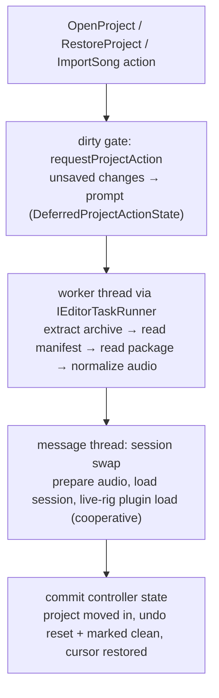

\page guide_project_lifecycle The Project Lifecycle

*Applies to: Editor-only (package IO delegates to common/core).*

"Project" is the editor's unit of work: opening, importing, saving, publishing, and closing songs.
Nearly every editor action is gated by this lifecycle, so its shapes — the workspace model, the
dirty gate, the worker-thread IO pattern — are worth knowing before touching anything
project-adjacent. The code lives in `rock-hero-editor/core/src/project/`.

# A project vs. a song package

A `.rock` **song package** is a flat ZIP: `song.json` plus the files it references. A `.rhp`
**project** is a ZIP wrapping that exact same native content under a `song/` subdirectory, plus a
tiny `project.json` manifest (its own format, its own `formatVersion` — never confuse it with the
song format; `project_io.cpp` owns it).

While a project is open, its contents live **extracted in a temp workspace directory** that the
`Project` object (`project.cpp`) uniquely owns — loaded audio paths point into the workspace,
edits happen on the extracted copy, and the `.rhp` on disk is touched only at save. Loading also
repairs backing-audio loudness-normalization metadata when stale (which counts as an unsaved
change — see dirty tracking below).

Save and publish share one serializer: both write the song through the identical
`writeRockSongPackageDirectory`, and the only difference is the archive root — save zips the
whole workspace (manifest + `song/`) into `.rhp`; publish zips only the song directory into
`.rock`. That is "save is publish" made literal: a `.rhp` is a published package wrapped with a
manifest. One caveat worth knowing: the archive write is in-place (truncate + rewrite), not
atomic temp-then-rename.

# The open flow

```mermaid
flowchart TB
    act["OpenProject / RestoreProject / ImportSong action"]
    gate["`dirty gate: requestProjectAction
    unsaved changes → prompt (DeferredProjectActionState)`"]
    work["`worker thread via IEditorTaskRunner
    extract archive → read manifest → read package → normalize audio`"]
    swap["`message thread: session swap
    prepare audio, load session, live-rig plugin load (cooperative)`"]
    commit["`commit controller state
    project moved in, undo reset + marked clean, cursor restored`"]
    act --> gate --> work --> swap --> commit
```

Two mechanisms carry the correctness load:

- **The deferred-action state machine** (`deferred_project_action_state.h`) parks the requested
  action inside each prompt phase (`AwaitingUnsavedChangesDecision`, `AwaitingSaveAsPath`,
  `SavingBeforeReplay`) — a prompt with no parked action, or two prompts at once, is
  unrepresentable. After a successful save, the parked action replays exactly once.
- **Busy tokens + ownership transfer.** The open runs under a busy token; a close/exit during the
  load supersedes it and the stale completion self-discards. For writes, the `Project` object is
  *moved out of the controller* into the task state for the worker's duration, so package IO can
  never race controller-side mutation — and moved back on completion, success or not.

# Import

`ISongImporter` is a one-method port: `importSong(source, workspace) -> expected<Song, ...>`.
Two implementations, dispatched by extension:

- `RockSongImporter` — extract a `.rock` into the workspace and read it.
- `GpSongImporter` — Guitar Pro 7/8: parse `Content/score.gpif` (`gp_score_parser`, which rejects
  repeats/jumps — the chart format is linear time), require embedded backing audio, transcode it
  to FLAC (the canonical package audio format), build the tempo map from the score's audio sync
  points, and materialize one arrangement per track (`gp_chart_builder`). The backing track's
  signed `FramePadding` (44.1kHz frames) becomes the asset's signed `start_offset`: positive
  delays the audio, negative means the recording's head precedes the score and playback skips
  it. Most real charts carry a negative value, so dropping it desyncs the song. The builder then
  normalizes sustains and generates fret-hand positions per the policy spec below.

An import produces an **unsaved** project: no path, `save_requires_destination` set, so the first
save is forced to Save As — which is also the moment per-project view state starts persisting.

## GP chart normalization policy

The plain-English specification of what the builder does to a Guitar Pro chart beyond literal
conversion. This section is deliberately written as numbered rules so a behavior tweak can be
made by editing a rule here and re-aligning the code
(`gp_chart_builder.cpp` — `normalizeImportedSustains`, `generateFretHandPositions`, both covered
by `test_gp_song_importer.cpp`). These rules apply to GP import only: `.rock` imports and
editor-authored charts are never rewritten.

**Sustain policy** (GP notates every note at its full duration; a chart only shows deliberate
sustains):

1. **Trim to the minimum sustain distance.** A note's tail is shortened so it ends at least the
   minimum-sustain-distance margin — 1/16 of a whole note, the shared constant in
   `grid_arithmetic.h` (1/32 was trialed and reverted on sight, 2026-07-23), the same settled
   margin the editor's
   duration verb clamps to — before the next onset on *any* string. The margin bounds sustain
   *tails* only, never note onsets (renamed from "minimum note distance", 2026-07-23): a run of
   32nds imports every onset as notated, with tails trimmed toward zero and then dropped by the
   rule below, so dense passages render as plain heads. Binding follows the *notated* timeline:
   events sharing a notated beat — chord members, and a strum's own grace-shifted notes — never
   bind each other, even when grace leads stagger their sounding onsets. One hold is exempt
   (user rule 2026-07-22): a tail ringing *strictly past* the next binding onset — merged from
   a tie or notated across voices — is a deliberate hold, exempt from this trim and the drop
   rule below; that ring is what the arpeggio arrival rule reads. The exemption also reads the
   notated timeline (2026-07-28): an importer-fabricated early onset — a grace lead — binds
   the tail at its *sounding* beat, but a ring past it is deliberate only
   if it also passes the beat the source actually *notated*, since the charter never wrote an
   onset at the fabricated position. A tail that merely *reaches* the next binding onset trims
   like any other, ties included.
   Repeated chords trim too: their held-to-the-restrike reading lives in the merged shape span
   (rule 11), which derives from the notated pre-trim durations and already runs through every
   restrike — the box continues while the tails keep the minimum gap.
2. **Never clip a technique payload.** Trimming stops at the note's last bend point or slide
   waypoint, so a slide always reaches its target note and a bend keeps its full curve, even
   when that leaves the tail closer than the margin (exact adjacency is legal). The unpitched
   slide-out is *not* protected (user rule 2026-07-28): its end is gesture geometry derived
   from the notated duration, not a musical event, so it trims back with the tail and respects
   the margin. A crowding that would crush it — a non-positive target, or one at or under the
   last waypoint — compresses it to the smallest legal end instead (strictly positive,
   strictly after the last waypoint) rather than keeping its full length: the old
   keep-the-end fallback could run the gesture through the next sounding onset in a crowded
   passage (first sighted 2026-08-02, when slide-ins still fabricated early heads).
3. **Drop short effect-free tails.** A note that carries no sustain technique (bend, slide,
   vibrato, tremolo) and is *notated* shorter than one beat loses its tail entirely after
   trimming. The comparison reads the notated length, not the trimmed one (user rule
   2026-07-28, superseding the post-trim comparison): a note held a full beat or longer in the
   source keeps its trimmed tail even though the margin leaves it slightly shorter than the
   beat — a chugged riff of notated one-beat notes now keeps its 3/4 tails, while a run of
   shorter notes still renders as plain heads. Vibrato and tremolo protect a tail from
   *dropping* but not from *trimming* — in dense passages such a tail can shrink to nothing.
4. **"One beat" is one signature beat** — a quarter note in x/4, an eighth in x/8 — matching the
   chart model's own sustain unit.

**Fret-hand position generation** (GP has no hand-position concept, so the track is generated by a
corpus-derived algorithm — the metrics and the source-corpus study behind these rules are in
`docs/plans/todo/fhp-corpus-derived-generation.md`):

5. **The hand is a window.** A position covers frets `[fret, fret + width - 1]` with width four,
   widening only when a single onset spans more than four frets (wide chords); the next move
   snaps the width back. A slide *reshape* (rule 9) is the exception to the four-fret floor: it
   follows the exact sounding span and may be narrower than four.
6. **Open strings never constrain, and taps float above.** Fret-zero notes are playable from
   anywhere and neither place nor move the window. A *tapped* note is likewise not a coverage
   event: two-hand taps sit far above the fretting hand (a median seven frets in the corpus), so
   the window tracks the fretted / left-hand notes and any held chord shape while the tap floats
   above it. Only Guitar Pro's *Tapped* (two-hand) articulation becomes a chart tap; a
   *LeftHandTapped* note is the fretting hand hammering the note from nowhere and imports as a
   hammer-on — no separate notation (user rule 2026-07-28) — so every tap rule in this policy
   refers to two-hand taps only, and left-hand taps anchor the window like any fretted note. A
   note carrying both marks imports as the left-hand tap: left-hand is the specialization, the
   generic tap mark adds nothing to it (user rule 2026-07-28). The 3D-highway camera frames such a tap on its own — it scans the notes, not only the
   hand windows — so the tap stays on screen even though the window light stays low on the left
   hand. (A held chord under tapping renders as an arpeggio, rule 12.)
7. **The hand re-anchors at phrase boundaries.** At a section start, or after a rest of at least
   0.8 seconds, the window re-places fresh — biased low to the phrase's floor fret (its lowest
   fretted note) — even when the previous window still covered the upcoming notes. Most authored
   anchor moves happen at these musical boundaries, not at the first misfit, so the greedy
   first-misfit walk this replaced under-moved. An opening run of notes that anchor nothing
   (open strings, taps) must not pin the hand at the nut-reference window (user rule
   2026-07-28): the first placement's window comes from the first anchoring note but retimes
   back to the chart's first note, so the hand is already settled where the song needs it when
   play begins.
8. **Within a phrase, moves are minimal.** When an onset's fretted notes fall outside the current
   window mid-phrase, the anchor moves the shortest distance that covers them — it never jumps
   further than needed. Slides are the exception (rule 9).
9. **Pitched slides reshape or carry the hand; unpitched slides do neither.** A pitched slide
   waypoint (shift and legato alike) moves the window at its mid-sustain position, but *how*
   depends on whether another finger stays planted:
   - **Reshape — a finger stays planted.** When another fretted note is still ringing at the
     waypoint and is not itself sliding there, it is a planted finger that pins the window's edge
     on its side; the sliding note carries the opposite edge to its landing fret. The window
     becomes the exact sounding hull `[lowest, highest]` — no width floor and no drag — so it
     *shrinks* when an outer note slides inward (a `{2,5}` chord whose 2 slides to 3 under the
     held 5 gives `[3,5]`, not `[3,6]`), *grows* when an outer note slides outward (2 slides to 1
     gives `[1,5]`), and *holds* when the sliding note is interior and both edges are already
     pinned. This is the fret hand deforming as one finger moves while the rest stay down (user
     rule 2026-07-30).
   - **Travel — nothing else is held.** A lone slide, or a whole chord gliding in lockstep by the
     same fret delta, has no planted finger, so the whole hand travels: the anchor drags by the
     waypoint's own fret delta — a five-to-nine glide moves the window up four frets — so the
     fretting finger keeps its slot even when the target would already fit. The dragged anchor
     clamps only as far as staying on the neck and covering the target requires. Simultaneous
     slides whose deltas disagree (a convergence or divergence) are not a rigid translation, so
     they cancel the drag and reshape in place instead.

   The window always rides an unpitched slide-out (user rules 2026-08-02): an exit placement
   at the trail-off's compressed end carries the window with the gesture, arriving through
   the standard margin morph so the motion lands with the perceptible release rather than
   creeping from the note's onset (sighted on long notes 2026-08-02). The hand's next
   move decides the rest. When its next placement departs in the trail-off's direction AND
   arrives by the very next onset, the gesture IS the departure: the exit fret rides the
   anchor travel (widened to the slide-in rule's two-fret minimum) and the window flows
   onward into the arrival. Otherwise the gesture is a release and return: the exit keeps
   the fixed four-fret gesture, the window dips with it, and a restore placement at the very
   next onset brings the window back for the note that follows — so notes after the gesture
   are never stranded in the dipped window. A trail-off with no room before the next onset
   stays planted.

**Chord template and shape derivation** (`deriveChordShapes`; GP scores in practice carry no
handshape or diagram data, so the tab's chord boxes are derived):

10. **Two or more strings struck together form a chord.** The onset's posture — the fret held
    on each struck string, open strings included — becomes a reusable template, deduplicated
    across the chart. Derived templates are unnamed and carry no fingering (the name chip only
    renders for named shapes). Tap-attack notes are excepted: taps belong to the tapping hand,
    not the fretting posture, so they never join a posture — even a multi-string tapped onset
    derives no chord, and a mixed onset is judged by its non-tap members alone (rule 11).
11. **Repeated strums of one articulation share one span.** Consecutive onsets whose strings
    are played *identically in every way except duration* — same frets, attack (hammer, pull,
    tap, slap, pop), muting, harmonics, vibrato, tremolo, accent, bends, and slides; the
    comparison is the whole note with position and duration neutralized, so techniques added
    later join it automatically — merge into a single shape span from the first strum through
    the last strum's *notated* duration (the duration before the sustain policy trims tails —
    the hand keeps holding while the chug rings). Any intervening non-chord onset or any
    articulation difference on any string ends the span — a muted or hammered chord is its own
    chord with its own box, even on the frets of the chord before it, while frets-identical
    chords share one deduplicated template (the hand posture is identical; techniques render on
    the notes). Tap-attack notes are invisible to span derivation (user rule 2026-07-28): they
    join no posture, extend no ring, and never open or close a span, so a tap-only onset is
    fully transparent — a chord whose notated ring extends under the taps keeps its span, which
    rule 12 then renders as a held arpeggio, while a short-ringing chord's span still ends at
    its own notated duration, before the taps — and a mixed onset (a fretting-hand note struck
    under simultaneous right-hand taps, the two-hand-tapping staple) counts only its non-tap
    members: one left-hand note is an ordinary single onset, two or more are a chord. An
    isolated strum gets a span of its own notated duration.
12. **A fully-strummed span is a chord box; a ring-through span or a held chord under tapping is
    an arpeggio.** A note still ringing through a chord's onset (tie-held from before, not
    re-struck) joins the derived posture on its string, and the projections' shared arrival rule
    renders any span with a posture string *still ringing at the span start without an onset
    there* as an arpeggio: a strum under held content is picking around it, not a full strum
    (user rule 2026-07-22 — both the chord under a held single note and the re-strum whose tied
    members keep ringing are arpeggios, so a tied passage with a hand move splits into two
    arpeggio shapes). A **tapped note sounding anywhere within the span** also flips a box to a
    held arpeggio (user rule 2026-07-28): the fretting hand holds the shape while the right hand
    taps above it, so the notation shows the chord is sustained through the tapping. A posture
    string that is merely silent at the start (a partial strum of the shape) keeps the chord box;
    no other arpeggio grouping is derived (broken-chord grouping waits for the corpus-informed
    pass).
12a. **A closed span keeps the minimum sustain distance, like every other element.** Tie
    merging can stretch a strum's ring past the next event, but the shape's box never follows
    it: when a new posture (or a non-chord onset) closes a span, the closed span's end trims to
    at least the minimum-sustain-distance margin (rule 1's shared constant) before that onset —
    the same rule sustains follow, so consecutive shapes keep the same visible gap as
    everything else instead of butting exactly (user rule 2026-07-23, superseding the
    clamp-to-the-onset form). The trim floors at the span's last strum, so the box always
    reaches its final restrike even when events crowd closer than the margin; a span that
    would still lose all length (a single short strum crowded inside the margin) falls back to
    exact adjacency, ending at the earlier of its notated ring and the closing onset.

**Slide semantics** (resolved before the sustain policy runs, so merged tails still pass
through the trim rules):

13. **A shift slide re-picks its landing.** The origin carries an ordinary pitched waypoint
    that glides to the landing's fret and ends the minimum-sustain-distance margin before the
    landing's onset — the sustain ends at the glide end, so slides respect the same margin as
    every other tail (user rule 2026-07-23, superseding the full-gap `slideEnd: "next"`
    terminal) — and the target note keeps its own onset and head. The projections render a
    glide-end waypoint (one at exactly the sustain end) without the linked continuation glyph;
    the re-picked landing's own head renders after it. Unpitched slide-outs are the separate
    `slideOut` payload, which owns its end offset and gestured fret — no landing note exists,
    so there is nothing to desync from — though the sustain trim pulls that end back to the
    margin like any tail (rule 2). The gestured fret defaults to four frets out in the flag's
    direction and rides the hand's next anchor travel instead when it agrees (rule 9's
    departure case, user rule 2026-08-02).
14. **A legato slide is the same note continuing.** The landing is not re-picked, so it never
    becomes a note: it folds into the origin as a pitched waypoint at the junction — the
    sustain extends through the landing's notated end, the landing's sustain techniques
    (vibrato, tremolo, bends) fold in, and its own onward slide continues the chain until a
    shift slide, an unpitched slide-out, or the chain's end stops it. The tab renders the
    junction as Charter's linked continuation head, the same glyph `.rock` linked chains use.
    The importer never second-guesses the notated slide kind (a coercion of chord-landing
    legato slides to shift was tried and rejected 2026-07-22): a source charted with the wrong
    slide kind is fixed in Guitar Pro, not silently rewritten on import.
15. **A slide notated on a tied continuation belongs to the merged note — and leaves from the
    junction.** Tie merging folds the continuation's slide flags into the origin, so a held
    note that slides away at its end — a tie into a chord whose member then shift-slides down —
    keeps its glide instead of silently losing it with the merged onset. A hold waypoint at the
    continuation's own onset pins the pitch until then, so the glide starts where the sliding
    segment was notated (the tied 6 holds through the chord, *then* slides), not at the merged
    note's onset. The tab draws no slide line across a hold segment — the linked continuation
    head at the waypoint renders it as a note tied to itself, and the glide's diagonal leaves
    from there.
16. **A bare slide-in imports as an on-beat scoop — an ordinary slide in the note's own
    slot.** The ornament is the manner of the note's *attack* (user decision 2026-08-02,
    superseding the moved-head model of 2026-07-28; grounded in the notation's semantics:
    Guitar Pro's manual defines slide-in as attacking the note from an adjacent fret, its
    faithful open-source players pluck exactly on the notated tick and resolve to the target
    pitch a quarter of the duration in, and notation practice — MusicXML's scoop, the jazz
    plop — treats such approaches as zero-duration articulations of the note they attach
    to). The head keeps its notated position at a derived approach fret and an ordinary
    pitched waypoint rises to the notated fret over the scoop window: a quarter of the
    notated duration, capped at the minimum-sustain-distance margin, floored at the minimum
    slide window, and kept strictly before any payload the note already carries.
    Anticipation — approach before the beat, target landing on it — is what a before-beat
    grace with a slide notates, and that path already resolves through the ordinary chain; a
    bare slide-in never fabricates an early onset. The fret-hand positions supply the start
    fret: the window walk's delta arriving at the note, the flag's stated direction winning
    over a still hand or a contradicting delta (two frets out in the flag's direction), an
    agreeing one-fret delta widening to the same two-fret minimum (user rule 2026-07-29).
    The hand stays planted while the approach sits inside the active window — a two-fret
    scoop is usually a finger gesture, not a hand move (the unpitched-slide precedent). An
    approach OUTSIDE the window drags the window with it for exactly the scoop's duration
    (sighted 2026-08-02: a window anchored on the notated fret left the approach uncovered):
    the onset's window derives backward from the active one so the head keeps its slot, and
    the natural window returns at the scoop's end, yielding to any real placement already
    there. An open-string landing or a start that would leave the neck (into fret 1 from
    below) stays a plain note with a conversion note. Resolution still runs before the sustain
    policy, so the transformed note is a slide when the trim rules run: a slide-in into a
    held landing keeps its hold like any notated slide, trimmed like every tail but never
    dropped as effect-free (user rule 2026-07-28). A grace note sliding into its principal
    already carries its explicit start fret and resolves through the ordinary slide chain
    instead.

**Grace beats** (placed during event collection, before tie merging and every rule above):

17. **A grace beat takes no bar time and attaches to the next sounding beat in its voice.** A
    before-beat grace (GP's plain grace) sounds a thirty-second-note lead ahead of its
    principal — crossing the bar line backward when the principal sits on a downbeat; an
    on-beat grace (Ctrl+Shift+G) sounds on the principal's own position and delays the
    principal notes on the grace's strings by the same lead, with their notated ends unchanged
    (user rules 2026-07-27). Runs of grace beats stack lead by lead, and grace notes keep
    their techniques — the classic hammer or slide into the principal resolves through the
    ordinary paths once the grace is a real note.
18. **Leads shrink rather than collide.** When the full leads do not fit — the voice's previous
    sounding onset closer than a before-beat run's leads, or an on-beat run no shorter than the
    principal's duration — the lead shrinks to half the available gap. A grace with no room at
    all (nothing sounds before a principal at the song start) or no principal to attach to (a
    rest follows, or the track ends) is dropped with a conversion note.

Every generated track logs a conversion note ("phrase-aware; verify", "derived N chord
spans") so the guesses stay observable in the import log.

# Startup restore

`restoreLastOpenProject` re-opens the last project, with a crash tripwire: an
interrupted-restore sentinel is written *before* the load worker runs and cleared on success, so
a crash during restore is detected next launch and surfaces a Retry/Cancel prompt instead of a
crash loop. When there is nothing to restore, the editor stands up the Tone Designer — its
resting mode — rather than an empty shell.

Per-project view state (cursor, grid note value, zoom, selected arrangement) persists in
**per-user editor settings keyed by project path, outside the `.rhp`** — deliberately, so moving
the cursor never dirties the project.

*Design in flux: view-state storage is mid-migration
(`docs/plans/in-progress/app-local-project-view-state.md`) — the manifest already carries no
editor state, and the remaining store simplification is active work.*

# Dirty tracking and faulting

`hasUnsavedChanges` is the union of three distinct sources — forget any one and the unsaved
prompt lies:

1. **Tracked edits**: `EditorUndoHistory::hasUnsavedEdits()` relative to the clean marker.
2. **Untracked changes**: dirtiness no undo marker can reach — load-time normalization rewrites,
   a failed undo push, a faulted session.
3. **`save_requires_destination`**: an imported project with no path yet.

A **faulted session** (see \ref guide_undo) interacts with the lifecycle deliberately: Save is
blocked while faulted (the state is untrusted), the fault marks the session dirty, and only
reopening or closing the project clears it — recovery over silent corruption.

# Extending the lifecycle — silent steps

1. A new lifecycle-participating action must join the `ProjectAction` variant so the dirty gate
   defers it; a new write action joins `ProjectWriteAction` and gets a busy-operation mapping and
   an error prefix.
2. Anything the manifest gains must bump/gate `project.json` handling in `project_io.cpp` only —
   it is a separate format from `song.json` (see \ref guide_package_format).
3. New importers implement `ISongImporter`, put every produced file inside the given workspace
   (out-of-workspace references are rejected), and speak `SongImportError`.
4. Per-project *view* state goes to `EditorSettings` keyed by path — never into the package.
5. Tests live in `test_project.cpp` and the controller tests driving open/save/import through
   the harness with fake importers and task runners.
