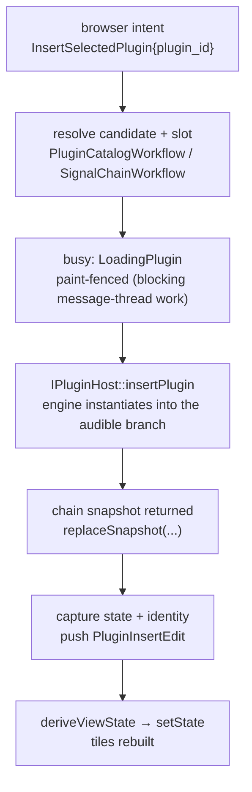

\page guide_signal_chain The Signal Chain and Plugin Ecosystem

*Applies to: Editor-only UI and workflow; the engine layer serves both products.*

The signal chain is the editor's plugin rack: the strip of effect blocks between guitar input and
output. It spans all three layers — JUCE views, headless editor-core workflow, and the
Tracktion-backed engine — and is the richest worked example of the codebase's layering.

# The three layers

- **UI** (`rock-hero-editor/ui/src/signal_chain/`): `SignalChainPanel` is a thin host whose only
  member is `SignalChainView` — the real renderer, owning the meters, the output-gain slider,
  the tone-file button strip, and a scrolling strip of `PluginTileView` (one per plugin) and
  `InsertSlotView` (one per fixed visual block, the "+" cells and drop targets). Everything the
  user does becomes a `SignalChainView::Listener` intent — including the deliberate split of
  `onOutputGainPreviewChanged` (drag) vs `onOutputGainChanged` (release). The plugin browser is a
  separate `PluginBrowserWindow` that renders controller-derived catalog state and never scans or
  mutates anything itself.
- **Editor core** (`rock-hero-editor/core/src/signal_chain/`): two workflow objects hold all
  policy state. `SignalChainWorkflow` owns the plugin list the UI renders plus pending-insert
  bookkeeping; it never calls audio ports — backend truth arrives only via
  `replaceSnapshot(PluginChainSnapshot)`. `PluginCatalogWorkflow` owns the sorted browser catalog
  and its visibility. Actions land in `signal_chain_handlers.cpp`; undo kinds live in
  `signal_chain_edits.h`. `SignalChainBlockPlacement` is the valid-by-construction assignment of
  chain plugins to visual blocks (private constructor; only its factories mint instances).
- **Engine** (`rock-hero-common/audio/`): `engine_plugin_host.cpp` implements catalog scanning,
  instantiation, chain snapshots, and plugin state capture; the audible graph itself is the
  **tone rack** (`src/tracktion/multi_tone_rack.cpp`) — one parallel branch per tone, summed,
  with click-free smoothed switching. The editor always edits exactly one branch: the audible
  (selected) tone's chain. Hidden structural plugins (`LiveRigGainPlugin` for input/output gain,
  meters) are excluded from the user-visible `chain_index`.

# Flow: inserting a plugin

Details that matter when touching this flow: the durable `plugin_id` for tone persistence is
minted editor-side (`generatePackageId()`) and bound to the audible tone; the full plugin state
is captured immediately so `PluginInsertEdit` can redo with the *same instance id*; and if
capture fails after instantiation, `rollbackInsertedPluginAfterUndoPreparationFailure` runs — a
rollback that cannot prove success faults the session (see \ref guide_undo).

# Flow: scanning the catalog

The catalog scan is the codebase's one sanctioned worker-thread port call. The handler offloads
`scanPluginCatalog(progress, cancel)` through `IEditorTaskRunner` with a busy token and a
`CancellationToken`; the engine loops VST3 candidates with a per-file 30-second timeout, reports
the file *about to be validated* (so a hang names its culprit), checks cancellation at each file
boundary (already-validated plugins survive a cancel), and wraps the whole loop in a try/catch
that returns a typed `PluginScanFailed` error. Completion returns to the message thread through
`safeCallback`, validates the busy token, then re-reads the engine's canonical known-plugin list
into the catalog workflow — the worker mutated the engine's list; the controller only ever
renders a snapshot of it.

# Plugin windows

`openPluginWindow(instance_id)` resolves the instance and shows Tracktion's window for the
plugin's own editor (`src/tracktion/plugin_window.cpp`). Two behaviors are project-owned and
worth knowing:

- **Key forwarding.** Cmd/Ctrl+Z/Y inside a plugin window always fire *Rock Hero's* global undo
  — the plugin never gets them — while Space yields to the plugin when its focused control
  actually wants keystrokes (VST3 `onKeyDown` claim or a live text caret). A Windows message hook
  makes this work for natively-focused plugin UIs.
- **Bounds are session-only.** Window positions are restored within a session but deliberately
  not persisted (`docs/plans/todo/plugin-window-persistence.md` tracks the durable version).

# How plugin edits become undo entries

The engine watches every hosted plugin through two trackers
(`src/tracktion/plugin_dirty_tracking.cpp`): every parameter change marks *dirty*, but only a
parameter **gesture** (begin/end edit from the plugin's own GUI) marks *user intent*. A settled
state transaction becomes a `PluginStateEdit` (full before/after state) **only when it carries
user intent** — plugins re-announce their own state constantly (on insert, on undo restore, on
internal preset load), and the gesture gate is what keeps those from becoming phantom undo
entries. During undo/redo restores and monitoring-graph rebuilds, capture is suppressed entirely
(`ScopedPluginUndoCaptureDeferral`).

# Tone Designer: a mode, not a second chain

The Tone Designer (editing a standalone `.tone` file with no project open) reuses everything
above: the same `SignalChainPanel`, the same `SignalChainWorkflow`, the same audible tone-rack
branch, and the same undo history (opening a tone file is an undo *entry*, not a reset). The only
mode-specific state is the small `ToneDesignerState`/`ToneDesignerViewState` slice that re-skins
the header (document name + dirty marker), swaps the button strip to New/Open/Save/Save As, and
relaxes the audio-ready gate so the gain controls work without a project.

*Design in flux: tone parameter automation is under active development
(`docs/plans/in-progress/tone-parameter-automation-plan.md`) — the automation-related fields that
ride along with chain edits (e.g. `PluginRemoveEdit::removed_automation`) may still move.*

# Extending the signal chain — silent steps

1. A new user operation follows \ref guide_add_action; its handler belongs in
   `signal_chain_handlers.cpp` and its policy state in `SignalChainWorkflow` — never in the view.
2. Anything that mutates the chain must go through the engine and return a snapshot; apply it
   with `replaceSnapshot`, never by editing the workflow's list directly.
3. Chain mutations need an `IEdit` in `signal_chain_edits.h` — capture before-state *before*
   calling the port, and decide `instantiatesPlugin()` honestly so replay routes through the
   busy fence.
4. New per-plugin UI state (like the display-type override) rides the snapshot as an opaque
   editor-owned token: the engine shuttles it between tone document and editor without
   interpreting it. Follow that precedent rather than adding engine-side meaning.
5. Tests: `test_signal_chain_workflow.cpp`, `test_signal_chain_block_placement.cpp` (editor
   core), `test_editor_view_signal_chain.cpp` (UI wiring).
