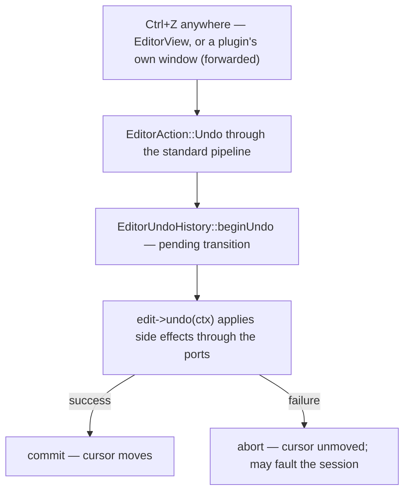

\page guide_undo The Undo System

*Applies to: Editor-only (the engine's capture machinery lives in common/audio).*

Undo is RockHero-owned, by decision: one unified history of `IEdit` mementos spanning every
domain — chart, tones, plugins, automation, gain — where one Ctrl+Z reverses exactly one user
gesture. Tracktion's built-in undo is never the product undo stack.

# The history (`editor_undo_history.h`)

`EditorUndoHistory` is a **pure timeline**: a vector of `IEdit` entries plus a cursor. It applies
no side effects itself, which is what makes it fully unit-testable. Its one non-obvious contract
is **two-phase application**:

1. `beginUndo()` / `beginRedo()` return a pending transition *without* moving the cursor.
2. The caller applies the edit's side effects through `EditorEditContext` (a bundle of the
   session and the ports: signal chain, plugin host, live rig, tone automation, output gain,
   tone designer).
3. Only on success does the caller `commit(pending)`; on failure it `abort(pending, code)` and
   the cursor never moved. Pending transitions carry a token, so a stale commit is rejected.

The history also owns the clean marker (`markClean` on save, `hasUnsavedEdits`, and the
unreachable-marker case when history is truncated) and exposes `snapshot()` for the history
overlay UI.

# The edit families

Every undoable domain contributes an `*_edits.h` family of small memento structs:
`signal_chain_edits.h` (insert/remove/move/placement/display-type/state/gain),
`tone_region_edits.h` (create/delete/resize/rename/boundary-move/reset),
`tone_automation_edits.h` (one full point-list edit per gesture), and `tone_designer_edits.h`
(document replace, tone import). Capture rules that keep fidelity:

- Capture the before-state **before** mutating, and push exactly one entry per user gesture.
- Plugin edits store the **full opaque plugin state** (`PluginInstanceState`, raw
  `getStateInformation` bytes) — granular parameter replay was rejected by decision; full-state
  restore is the fidelity guarantee.
- State that must survive round trips rides along: `PluginRemoveEdit` carries the plugin's
  automation out with it and restores it verbatim on undo.
- Edits that recreate plugins report `instantiatesPlugin(direction)` so replay runs behind the
  busy fence.

# The Ctrl+Z path

Note the first hop: Cmd/Ctrl+Z pressed inside a hosted plugin's *own editor window* is
intercepted and forwarded to this same global history — plugins never see it (see
\ref guide_signal_chain).

# Where plugin edits come from

Users mostly edit plugins inside plugin GUIs, which the editor cannot see directly. The engine
bridges that (`plugin_dirty_tracking.cpp`): every parameter change marks *dirty*, but only a
GUI parameter **gesture** marks *user intent*, and a settled state transaction becomes a
`PluginStateEdit` only when intent was present. Plugin self-re-announces (insert, restore,
internal preset load) fold into the baseline silently — that gate is what keeps phantom "Edit
plugin" entries out of the history. During undo/redo restores the engine defers capture entirely
(`ScopedPluginUndoCaptureDeferral`) so restoring state never records new edits.

# The rollback contract

An edit's apply either succeeds, or rolls back to a provably unchanged state, or — if it can
prove neither — the session **faults** (`faultSessionAfterRollbackContractViolation`): the
editor stops trusting in-memory state, marks unsaved work, and routes the user to reopen. Faulting
is deliberately loud; a silently half-applied undo would corrupt trust in the entire history. If
you write an edit whose failure path cannot restore the before-state, returning
`RollbackContractViolation` is the correct move — never pretend success.

# Adding undo for a new domain — silent steps

1. A new `*_edits.h` family in the feature's folder; each edit captures complete before/after
   values (prefer whole-value mementos over deltas).
2. If apply needs a port the `EditorEditContext` doesn't carry, extend the context — don't reach
   around it.
3. Push through `pushUndoEntry` at gesture end, once per gesture (preview changes push nothing —
   see the output-gain preview/commit split in \ref guide_signal_chain).
4. Tests: round-trip every edit (do → undo → assert exact before-state → redo → assert
   after-state) in `test_editor_undo_history.cpp` style, plus the failure/abort path.
