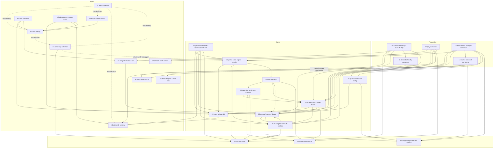

# RockHero implementation roadmap

Status: Living document — maintained continuously. Date: 2026-07-07. Baseline `refactor @ 0ffb6efe`.

This is the consolidated product roadmap. Every plan under `docs/roadmap/` follows the shared
template (status line, goal, constraints, verified current-state inventory, phased implementation,
final acceptance bundle). Plan file numbers are stable file names, **not** execution order —
execution order is defined below and is optimized to reach milestone 0 quickly and to de-risk
note detection early.

Maintenance rules:

- `00-roadmap.md` and any plan currently being executed are kept aligned with reality; unstarted
  plans may lag but must be re-verified against code (fresh inventory stamp) before execution.
- When a plan phase completes, update the [Status board](#status-board) line for that plan.
- Cross-plan references always use repo-relative path + phase number.
- NAMING FIREWALL: the commercial real-guitar game that inspired this project is never named in
  any repo file — use "RS"/neutral phrasing. Charter (BSD 3-Clause) may be cited by name.

---

## 1. Dependency graph

Notes on cyclic-looking edges: 26 ↔ 27 is an ordering constraint, not a cycle —
docs/roadmap/27-in-song-flow-results-profiles.md Phase 1 (IGameSettings) must land before
docs/roadmap/26-game-startup-menus-library.md Phase 4 (settings consumption); 26's menu input layer
(Phase 5) then precedes 27 Phase 6 (pause/results UI). 21 → 22 is an infrastructure edge only
(the engine 22's dry tap rides on); 22 Phase 1 (contract) has no upstream dependency at all.
47's dotted edge to 21 is the whichever-executes-first coordination on the shared loop-port
surface (47 is expected to execute first and land the Tracktion-backed loop; 21 Phase 1 then
adds only the speed surface), not a gate; 47 → 28 is plan 28 Phase 2 consuming the landed loop
backend and reducing to test extension.

---

## 2. Gates

| Gate | Defined in | Condition | Blocks |
|---|---|---|---|
| **G10-DECISIONS** | docs/roadmap/10-format-versioning-and-chart-identity.md Phase 0 | User signs off 10-Q1..Q5 | 10 Phases 1–5; 43 blocked until 10 Phase 2 (migration ladder); 29/26/24/11/27 hash consumers blocked until 10 Phase 3 (each carries a nullable-hash interim, so only the final hash-keyed behavior waits) |
| **G20-RENDER** | docs/roadmap/20-game-architecture-and-render-stack.md Phases 0a–0c | Platform scope declared; SDL3+bgfx spike passes criteria S1–S6 (JUCE/Tracktion message-loop coexistence, bgfx-in-JUCE-child-HWND, Conan-vs-vendored, shaderc in the build graph, headless Noop CI path, measured CI cost); renderer-sharing seam chosen; STOP → user sign-off; architecture.md update confirmed | 20 Phases 1–4; 25 Phase 3+; 44 (all code phases); 26 Phases 5–9; 27 Phase 6; 28 Phase 6; creation of the game-render-expert agent |
| **G21-TRACKTION-GO** | docs/roadmap/21-game-audio-engine-and-session.md Phase 0 | **CLOSED 2026-07-10: GO — embed `common::audio::Engine` in the game** (user sign-off; coexistence proven by 20 Phase 0b criterion S1) | Nothing — 21 Phases 1–6 unblocked |
| **GATE-A (detection contract)** | docs/roadmap/22-note-detection.md Phase 1 | Detectability matrix + per-register latency budget co-signed with plan 24 | 22 Phases 2+; 24 Phase 2 (provisional-hit machine); 23 Phases 1/2/6 (event schema, bot, metrics) |
| **GATE-B (algorithm selection)** | docs/roadmap/22-note-detection.md Phase 3 | Algorithm survey (dsp-guitar-detection-expert) sign-off incl. DSP dependency policy | 22 Phase 6 (v1 detectors) |
| **G28-STRETCH** | docs/roadmap/28-practice-mode.md Phase 0 | Time-stretch backend spike + licensing sign-off (architecture.md licensing-table update needs user confirmation) | 28 Phases 1+ (plan itself Deferred) |
| **G29-STABILITY** | docs/roadmap/29-online-leaderboards.md Phase 0a, measured by plan 23's harness | Byte-identical replay determinism; cross-version per-song score delta ≤0.5% p95 / ≤1.0% max; per-technique precision/recall drift ≤1pp; onset-latency p95 shift ≤5ms; sustained across two releases over ≥4 weeks (numbers to be reconciled with 22's metric definitions at 29 Phase 0) | 29 entirely (also gated on hosting/identity/licensing sign-off, 29 Phase 0b) |
| **G41-TS (time signatures)** | docs/roadmap/41-tempo-map-authoring.md open question Q1 | Content policy for beats-per-measure edits chosen | 41 Phase 6 only |
| **G43-METADATA** | docs/roadmap/43-song-information-and-art.md Phase 0 | 43-Q1..Q6 sign-off (publish-vs-save split etc.) | 43 Phases 1–5 |
| **G45-STRINGS** | docs/roadmap/45-editor-theme-and-string-colors.md Phase 5 | Explicit decision to raise `g_max_chart_strings` to 10 (one-way door once 9/10-string content exists); consumer survey + STOP | 45 Phase 5 only; coordinates with 22's latency budget |
| **G46-KEYMAP** | docs/roadmap/46-editor-keybinds.md Phase 0 | Default keymap + sharing model + mirroring policy sign-off | 46 Phases 1–5 |

Known tensions from the planning mandate, and where each is resolved (none papered over):

1. GH-exact scoring vs detection physics → 24's provisional-hit state machine is mandatory (GATE-A latency budget drives it).
2. Required-metadata export denial vs save==publish normalize-don't-reject → 43-Q1 (recommend split publish gate; G43-METADATA).
3. Chart hash vs load normalization rewriting bytes → 10 Phase 3: semantic hash, never byte-level (settled in plan 10).
4. Editor 3D preview + layering rule (a) → G20-RENDER Phase 0c seam: shared scene model in common, bgfx never enters common.
5. >8 strings vs `g_max_chart_strings` → G45-STRINGS domain gate, not a theme toggle.
6. Keybind centralization crossing into common → 46 Phase 4's injected-binding-data seam (common stays editor-free).
7. Game never rewrites user packages → 11 Phase 5 contract: game recomputes only into 26's library cache.
8. AGPL + hosted leaderboards → 29-Q3 licensing decision + architecture.md amendment (part of G29 sign-off).
9. Smooth-scroll follow evaluation → **DECIDED 2026-07-13**: the user ran the sight-reading test with real tabs and adopted fixed-cursor smooth scrolling; docs/roadmap/51-smooth-scroll-camera.md owns the time-space camera adoption (the todo doc is now a pointer). Plan references to the "pending decision" predate this and read historically.
10. Intensity sorting before the calculator lands → 26 ships the "Unknown" bucket (sorts last) per 11 Phase 5; never authored values.

---

## 3. Recommended execution order

Ordered to reach milestone 0 fast and de-risk note detection early — **not** numeric order.
Stages may overlap where dependencies allow; each bullet names the plan phases in scope.

**AMENDMENT (2026-07-10, user directive): twin-track priority after G20-RENDER closes.** The
editor 3D preview (docs/roadmap/44-editor-3d-preview.md) is promoted from Stage 6 to run at
equal priority with the game render/menu track — it starts immediately after
docs/roadmap/25-note-highway-3d.md Phases 1–2 land (its other prerequisites, plan 12 and plan 45
Phase 1, completed 2026-07-10). The preview ships as its own fullscreen-capable window (plan
44's existing shape, confirmed; the S2 spike proved the JUCE-window + bgfx-child-HWND embedding)
and synchronizes through plan 12's IPlaybackClock + extrapolator — no editor-viewport coupling.
"Game menus" sequencing note: docs/roadmap/26-game-startup-menus-library.md Phases 5–9 (the
visible menu UI) sit behind G20-RENDER, and Phases 1–4 (peek reader, library index, scan,
settings) sit behind plans 10 and 13 — so the menu track's actual next actions are plan 13
Phases 1–2 and plan 10 Phase 0 (G10-DECISIONS answers), both Stage 1 items already.

**Stage 1 — Foundations (start immediately, parallel-friendly)**
1. docs/roadmap/13-audio-device-settings-and-calibration.md Phases 1–2 (shared settings store, editor migration) — earliest shared-infrastructure win; Phases 3–6 may trail.
2. docs/roadmap/12-playback-clock.md Phases 1–4 (clock port, engine publishes, audio-derived publishing, extrapolator) — milestone 0's render loop needs this; Phase 5 closeout with first consumers.
3. docs/roadmap/10-format-versioning-and-chart-identity.md Phase 0 (answer 10-Q1..Q5) then Phases 1–5 — unblocks the widest set of downstream consumers; cheap, pure, no UI.
4. docs/roadmap/22-note-detection.md Phase 1 (detection contract — GATE-A) co-authored with docs/roadmap/24-scoring-star-power-failure.md Phase 1. **This is the single most schedule-critical de-risking step**: it costs no DSP work and settles the latency-budget physics everything else designs around.
5. docs/roadmap/47-editor-loop-selection.md Phase 1 (shared loop-region port + Tracktion adapter in common/audio) — dependency-free and foundation-caliber: it lands the loop backend that docs/roadmap/28-practice-mode.md Phase 2 consumes, and relieves docs/roadmap/21-game-audio-engine-and-session.md Phase 1 to add only the speed surface (whichever-executes-first rule).

**Stage 2 — Decision gates (run while Stage 1 finishes)**
6. docs/roadmap/20-game-architecture-and-render-stack.md Phases 0a–0c (G20-RENDER spike + seam, STOP).
7. docs/roadmap/21-game-audio-engine-and-session.md Phase 0 (G21-TRACKTION-GO, signed jointly with 20 Phase 0b S1).

**Stage 3 — Milestone-0 depth-first + detection de-risk in parallel**
8. docs/roadmap/21-game-audio-engine-and-session.md Phases 1–6 (speed/loop plumbing — loop re-verified rather than re-implemented if 47 Phase 1 landed first; GameplaySession, tone switching, mix, latency stance, hardcoded-song soak). Phases 1–5 do not wait for G20-RENDER; Phase 6 is milestone 0's audio half.
9. docs/roadmap/22-note-detection.md Phases 2–3 (dry tap in common/audio; algorithm survey → GATE-B), then Phases 4–7 (tuning math, pipeline skeleton, v1 detectors, tuner). The tuner ships in the current JUCE shell — not blocked on G20-RENDER.
10. docs/roadmap/23-detection-verification-harness.md Phases 1–3 (event stream, autoplay bot, shared fixture generators) as soon as GATE-A closes; Phases 4–6 alongside 22 Phase 6.
11. docs/roadmap/45-editor-theme-and-string-colors.md Phase 1 (shared string palette in common/ui) — small, and it blocks 25 Phase 3.
12. docs/roadmap/20-game-architecture-and-render-stack.md Phases 1–4 (window/loop swap, resource pack, frame clock, dev diagnostics) after G20-RENDER.
13. docs/roadmap/25-note-highway-3d.md Phases 1–3 (headless scene model, camera math — both pre-gate; board+notes playable skeleton after G20-RENDER). → **MILESTONE 0**.

**Stage 4 — Gameplay loop**
14. docs/roadmap/24-scoring-star-power-failure.md Phases 2–4 (provisional-hit machine on replayed events, score record format, failure meter) — gate-independent, pure game/core; Phases 5–6 (IMidiTrigger, star power) after their decisions.
15. docs/roadmap/25-note-highway-3d.md Phases 4–5 (techniques; feedback/HUD fed by 24's events).
16. docs/roadmap/22-note-detection.md Phase 8 (tuning-gate policy) and docs/roadmap/23-detection-verification-harness.md Phase 7 (local corpus soak).

**Stage 5 — Game shell**
17. docs/roadmap/27-in-song-flow-results-profiles.md Phase 1 (IGameSettings — must precede 26 Phase 4), then Phases 2–4.
18. docs/roadmap/26-game-startup-menus-library.md Phases 1–4 (peek reader, library index, scan, settings), then 5–8 after G20-RENDER (menus, startup, Quick Play, onboarding); Phase 9 (previews) after 43. Phase 8's device/calibration wizard is SDL presentation over plan 32's headless drivers.
18a. docs/roadmap/32-game-native-audio-config.md Phases 1–2 (game native device + calibration; headless, **ungated by G20-RENDER**) — the per-app "game guitar audible, calibrate-first" milestone lands at **32 P2**; depends on plan 13 P1 + plan 14 P3/P4. Phases 3–4 (latency, startup restore) trail off the audible path. Critical path to the milestone: `13 P1 → 14 P1 → 14 P2 → 14 P3 (needs 13 P2) → 14 P4 → 32 P1 → 32 P2`.
19. docs/roadmap/27-in-song-flow-results-profiles.md Phases 5–6 (session integration, pause/fail/results UI).
20. docs/roadmap/11-derived-difficulty-calculator.md Phases 1–5 (any time after 10 Phase 3; calibration checkpoint is a user sign-off).
21. docs/roadmap/42-chart-validation.md Phases 1–6 (arithmetic/pitch utilities early — 40 and 22 reuse them; corpus calibration STOP at Phase 5).

**Stage 6 — Editor track (interleaves with Stages 3–5 at will; independent of the game gates)**
22. docs/roadmap/43-song-information-and-art.md Phase 0 → Phases 1–5 (after 10 Phase 2).
23. docs/roadmap/41-tempo-map-authoring.md Phases 1–5 (Phase 6 behind G41-TS); start Phase 2 only after the in-flight docs/in-progress/tone-track-tempo-map-plan.md editor work commits.
24. docs/roadmap/40-chart-editing.md Phases 1–10 (Phase 2 waits for the in-flight tone work; from-scratch charting promise waits on 41 Phases 1–4).
25. docs/roadmap/46-editor-keybinds.md Phase 0 → Phases 1–5.
26. docs/roadmap/45-editor-theme-and-string-colors.md Phases 2–4 (presets, selection, colorblind-safe); Phase 5 behind G45-STRINGS; Phase 6 stretch.
27. docs/roadmap/44-editor-3d-preview.md Phases 1–5 (after G20-RENDER + 25 Phases 1–2 + 12 + 45 Phase 1).
28. docs/roadmap/47-editor-loop-selection.md Phases 2–4 (editor loop-selection state and persistence, ruler drag surface with grid snap, engagement/wrap semantics; no game gates — Phase 1 already runs as Stage 1 item 5, and docs/roadmap/28-practice-mode.md Phase 2 consumes the landed backend, reducing to test extension).
28a. docs/roadmap/48-editor-audio-setup.md Phases 1–2 (effective-source facade + use-game-settings toggle defaulting on at first run; toggle-aware **separate** device + calibration windows, no consolidation) — depends on plan 14 P3 + plan 13 P1; off the game critical path.
28b. docs/roadmap/50-tone-designer-and-tone-files.md Phases 1–5 (dependency-free and
     gate-free; all decisions user-settled 2026-07-13. Coordination note: plan 50 Phase 3 edits
     the monitoring-context gate flag in `input_calibration_handlers.cpp` that plan 14 P3
     relocates into `LiveInputMonitor` — whichever lands second adapts the other's seam).
28c. docs/roadmap/51-smooth-scroll-camera.md Phases 1–5 (time-space camera + clock-driven
     smooth-scroll follow; depends only on plan 12, complete — user-adopted 2026-07-13, so it
     outranks other unstarted editor items when timeline work resumes). Coordination: plan 47's
     ruler-band loop drag and plan 40 Phase 3's tab-lane interaction both hit-test through the
     viewport — whichever lands after plan 51 maps through the camera's visible window.
29. docs/roadmap/30-game-2d-tab-view.md Phase 1 (scene-model promotion — dependency-free), Phase 2 (shared notation paint core + manifest; 30-Q1 amendment landed, runs before item 24's plan 40 Phase 3 per 30-Q2), Phases 3–5 (game strip renderer, three-way game display modes incl. simultaneous 2D+3D, editor preview display selector); Phase 6 (feedback overlays) after 24's event feed + 25 Phase 5's reduction.

**Stage 7 — Deferred**
30. docs/roadmap/28-practice-mode.md (G28-STRETCH spike first; its one NOW requirement — speed factor + loop-seek in the interfaces — is already delegated to 21 Phase 1 / 47 Phase 1 (whichever executes first) and 12).
31. docs/roadmap/29-online-leaderboards.md (G29-STABILITY + hosting/identity/licensing sign-off).
32. docs/roadmap/31-integrated-game-editor-workflow.md (Deferred; revisit when the game is audible on the per-app audio foundation and an installer/distribution story exists — the concrete driver for the `IDeviceOwnershipArbiter` device handoff).

---

## 4. Milestone 0 — first-playable vertical slice

Definition: **one hardcoded song, fixed audio devices, one preloaded tone, no menus, no-fail,
keyboard start.** A player plugs in, launches the executable with a dev song path, presses a key,
and plays the song on a rendered 3D highway with the backing track and their live tone audible.

Composed of exactly these plan phases:

| Ingredient | Plan phase |
|---|---|
| Playback clock + extrapolation | docs/roadmap/12-playback-clock.md Phases 1–4 |
| Render stack landed (window, loop, frame clock) | docs/roadmap/20-game-architecture-and-render-stack.md Phases 0a–0c (gate) + 1 + 3 |
| Tracktion-in-game GO | docs/roadmap/21-game-audio-engine-and-session.md Phase 0 |
| GameplaySession spine (load → play → live rig) | docs/roadmap/21-game-audio-engine-and-session.md Phases 2–3 |
| Hardcoded-song playthrough soak (audio half) | docs/roadmap/21-game-audio-engine-and-session.md Phase 6 |
| Shared string palette | docs/roadmap/45-editor-theme-and-string-colors.md Phase 1 |
| Highway scene model + camera + playable skeleton | docs/roadmap/25-note-highway-3d.md Phases 1–3 |

Explicitly **not** in milestone 0: detection/scoring (22/24 — de-risked in parallel, integrated
after), menus/library (26), settings UI/calibration wizard (13 architecture may land, fixed
devices suffice), results (27), techniques rendering polish (25 Phases 4–5). No-fail is trivially
satisfied because no failure meter exists yet.

Milestone 0 exit: 21 Phase 6's manual soak checklist signed off **and** 25 Phase 3's exit
criteria (notes scroll in time against the clock with correct lane colors) witnessed on the same
build; result noted on the status board.

---

## 5. Decisions needed

Every open question from every plan, grouped by plan, each with the plan writer's
recommendation. Answer format: the question ID plus your choice (e.g. "10-Q1: A"); any
unanswered item keeps its plan decision-gated. Recommendations are marked **R:**.

### docs/roadmap/10-format-versioning-and-chart-identity.md (gates G10-DECISIONS)

- **10-Q1** formatVersion bump rule: (A) bump on every persisted-schema change; (B) additive changes stay in-version; (C) major.minor split. **R: A** — hand-built writers drop unknown fields, so version+hard-reject is the only data-loss firewall.
- **10-Q2** hash persistence: (A) compute-on-demand, never persisted in the package; (B) stored in song.json at export, validated on read. **R: A** — no staleness, avoids the save==publish tension; consumers store (algorithm id, hex).
- **10-Q3** SHA-256 provider for common/core: (A) link the existing rock_hero juce_cryptography wrapper + one-line design-doc permission extension (needs your confirmation); (B) vendored SHA-256; (C) hash in common/audio (rejected: layering). **R: A**.
- **10-Q4** chart-file vs song.json versioning: (A) independent integer ladders per document kind; (B) one package-wide version. **R: A**.
- **10-Q5** hash scope: (A) entire chart file + tempo map; (B) scoring-relevant subset only. **R: A** — identity = exact authored content; plan 29 can add a looser comparability key later.
- **10-D1** (design-doc confirmations bundled with this gate): bump policy recorded in architecture.md; juce_cryptography permission for common/core. Confirm both.

### docs/roadmap/11-derived-difficulty-calculator.md

- **11-Q1** persistence timing: (A) persist rating into song.json immediately (additive field); (B) editor recompute-on-load only, persistence deferred. **R: A** — deferring forces plan 26 to parse charts.
- **11-Q2** calibration method for the 1–10 mapping: (A) you rate ~12–15 reference corpus arrangements, fit a monotonic mapping; (B) percentile calibration over the 135-chart corpus; (C) hand-tuned thresholds. **R: A** with (B) as cross-check; thresholds ship as constants only.
- **11-Q3** cache the raw scalar beside the integer: (A) store both rating and 3-decimal intensity; (B) integer only. **R: A** — otherwise 26's intensity sort collapses into ten coarse buckets.

### docs/roadmap/12-playback-clock.md

**2026-07-10: answered as the recommendations during execution — 12-Q1: A, 12-Q2: B, 12-Q3: A.
All additive; veto any of them and the surface adjusts cheaply.**

- **12-Q1** snapshot time domain: (A) timeline nanoseconds only at v1, seqlock upgrade revisited at 24's provisional-hit contract; (B) add an output-stream sample-position field now. **R: A**.
- **12-Q2** editor cursor migration: (A) migrate the cursor overlay to IPlaybackClock now and delete ITransport::position(); (B) keep the current correct message-thread path, revisit at plan 44 / the smooth-scroll decision. **R: B**.
- **12-Q3** extrapolation feel defaults (120 ms snap, 5% drift slew, pause hold, snap on resume/seek/loop): (A) accept as starting defaults, tune live during plan 25; (B) review the numbers now. **R: A**.

### docs/roadmap/13-audio-device-settings-and-calibration.md

- **13-Q1** legacy editor settings keys after migration: (A) keep one release; (B) clear immediately (migration test-covered). **R: B**.
- **13-Q2** video-offset storage: (A) one machine-global value, display name advisory; (B) per-monitor keying now. **R: A** — wizard remeasures in under a minute; schema field reserved.
- **13-Q3** ~~per-product buffer-size override~~ **SUPERSEDED 2026-07-12** — per-app **independent** audio config chosen (each app owns its own device configuration + calibration over its own file); the shared-configuration premise is withdrawn. The editor optionally mirrors the game read-only (plan 48). See the plan 13 rework, plans 14/32/48, and RM-4.
- **13-Q4** WASAPI-Shared during gameplay: (A) allow with visible high-latency warning above ~15 ms; (B) allow scoring, force monitoring off; (C) refuse shared mode. **R: A** — calibration keeps scoring correct; (C) locks out users without ASIO.
- **13-Q5** device-loss recovery: (A) auto-pause + non-destructive state + explicit re-setup prompt, never silently switching hardware; (B) silent re-open of default device. **R: A**.

### docs/roadmap/20-game-architecture-and-render-stack.md (gates G20-RENDER)

**2026-07-10: the spike executed with working answers 20-Q2: B, 20-Q3: 1, 20-Q4: A (S3 evidence),
20-Q5: A, 20-Q6: A; 20-Q1 answered A by the user. All final at G20-RENDER sign-off — see the
plan's Gate record.**

- **20-Q1** platform scope (Phase 0a): (A) Windows-first with cross-platform-preserving choices; (B) Windows-only commitment; (C) multi-platform CI now. **R: A**. **ANSWERED 2026-07-09: A** (user; memo in plan 20 Gate record).
- **20-Q2** spike candidate set (Phase 0b): (A) SDL3+bgfx only; (B) SDL3+bgfx primary + JUCE-window+bgfx fallback branch; (C) also SDL3+SDL_GPU. **R: B**.
- **20-Q3** renderer-sharing seam (Phase 0c): (1) headless highway scene model in rock-hero-common/core with thin per-product render backends; (2) shared bgfx surface component in common/ui with Tracktion-style isolation; (3) no sharing (rejected). **R: 1**.
- **20-Q4** dependency delivery: (A) Conan pins; (B) vendored submodules. **R: A** if spike criterion S3 shows clean recipes under the CLion-CMake+VsDevCmd/Ninja environment, else B.
- **20-Q5** dev-diagnostics activation: (A) all builds behind a runtime flag; (B) debug-only compilation. **R: A**.
- **20-Q6** frame pacing default: (A) vsync ON with frame-time instrumentation, toggle later in 26's video settings; (B) uncapped with limiter. **R: A**.

### docs/roadmap/21-game-audio-engine-and-session.md (21-Q1..Q3 ANSWERED 2026-07-11)

- **21-Q1** missing-plugin fallback: **ANSWERED: (A) — refuse to start, listing the missing plugins** (user override of the B+C recommendation: strict fidelity, no partial/substitute tones; "tone degraded" record marking unnecessary). Pinned future enhancement: opt-in "play with default tones" once a default-tone mechanism exists (watch item; dovetails with 26-Q5's starter asset).
- **21-Q2** per-tone reported-latency policy: **ANSWERED (user-refined): silent in the GAME; the guard moves to authoring time** — editor warns on export/publish to `.rock` when a tone's summed latency is high (backlog item; plan 21 Phase 5 keeps the latency surfacing as its data source); a save-file high-latency flag is deferred, recorded so it is not lost (format change via plan 10 if adopted).
- **21-Q3** mix-volume scope: **ANSWERED: global at v1** (as recommended; persisted via 27's IGameSettings; per-song override deferred).

### docs/roadmap/22-note-detection.md (gates GATE-A, GATE-B)

- **22-Q1** v1 detectability tiers (GATE-A): adopt the draft matrix (notably Pop/Slap = Cosmetic, pinch-harmonic timbre = Cosmetic, palm-mute quality = Cosmetic with the note still scored, bend curve = Lenient with scored endpoint)? **R: adopt for v1**, revisit per-technique once plan 23 produces real precision/recall numbers.
- **22-Q2** DSP dependency policy (GATE-B): (a) implement chosen mono-pitch + onset algorithms in-repo; (b) adopt a third-party library (aubio GPL-3, Essentia AGPL, cycfi/Q MIT; Conan availability unverified). **R: in-repo for v1**; adopt a library only on a decisive survey-cited quality win.
- **22-Q3** tuner capo policy: (a) gate on capo-on sounding pitches ("place your capo at fret N"); (b) tune open strings, capo unverified. **R: a**.
- **22-Q4** tuning-gate strictness default: any settled string > 10 cents vs average > 5 cents vs configurable. **R: any string > 10 cents**, always skippable, configurable later via 27's settings.

### docs/roadmap/23-detection-verification-harness.md

- **23-Q1** fixture-song license: (a) CC0 for the whole fixture tree; (b) repo AGPLv3. **R: CC0** — removes all downstream reuse questions for non-product test assets.
- **23-Q2** committed-audio mechanism: (a) plain git, soft 30 MB / hard 50 MB FLAC budget; (b) Git LFS from day one; (c) fixtures submodule. **R: a** — mono DI FLAC is ~1–1.5 MB/min, v1 fits; revisit LFS only on overflow.
- **23-Q3** DI corpus source: (a) you self-author 3–5 short songs/etudes and record DI takes per the Phase 5 protocol; (b) source freely-licensed third-party DI recordings. **R: a** — controlled tuning/technique coverage, unambiguous licensing.
- **23-Q4** baseline update policy: (a) manual regeneration behind an env flag with reviewed committed diffs; (b) CI auto-ratchet. **R: a** — auto-ratchet hides metric drift and hurts bisection.

### docs/roadmap/24-scoring-star-power-failure.md

- **24-Q1** star-power earning model (format has no SP phrase markers): (a) derived phrases via a versioned generator + game-side cache, no format change; (b) authored phrase markers via 10 + 40; (c) continuous streak accrual. **R: a** — (b) contradicts derived-over-authored.
- **24-Q2** does star-power deploy rescue the failure meter: (a) yes — GH-authentic immediate boost + 2x meter gain while active; (b) no, score-only. **R: a**.
- **24-Q3** IMidiTrigger port placement: (a) rock-hero-game/audio; (b) rock-hero-common/audio now. **R: a** — only the game needs pedals today; extraction later is mechanical.
- **24-Q4** meter/star-power visual direction (feeds 25): (A) stage-atmosphere lighting/crowd; (B) amp-top diegetic VU needle + charge lamp; (C) highway edge-light strips. **R: C with B's charge-lamp accent**.
- **24-Q5** vendored JUCE 8.0.12 MIDI UAF (removeConsumer adds instead of removes): (a) design around now (one MidiInput per identifier process-wide + engine-exclusion checkpoint); (b) patch the submodule; (c) wait for a routine submodule bump. **R: a**.

### docs/roadmap/25-note-highway-3d.md

- **25-Q1** fret-width taper: (a) Charter equal-width default; (b) realistic taper. **R: a** — field already exists in HighwayMetrics, revisit with real charts; not blocking.
- **25-Q2** chord fingering panels: (a) on by default (Charter parity); (b) off with setting. **R: a**, setting either way.
- **25-Q3** scroll speed / visibility window: (a) free player setting, no difficulty coupling; (b) tied to derived difficulty; (c) fixed at v1. **R: a**, persisted via 27's store.
- **25-Q4** camera shake on hits: (a) Phase 5 behind a default-off setting; (b) drop. **R: a** — replay-safe after the deterministic-seed fix.

### docs/roadmap/26-game-startup-menus-library.md

- **26-Q1** library index home: (a) rock-hero-game/core with the reusable peek reader in common/core; (b) entirely in common/core. **R: a**.
- **26-Q2** index storage: (a) versioned JSON + thumbnail files with atomic replace; (b) juce::PropertiesFile; (c) SQLite. **R: a** — inspectable, testable, zero new dependencies.
- **26-Q3** gamepad backend: (a) SDL3 gamepad subsystem; (b) minimal Win32 XInput adapter behind the same port; (c) defer gamepad, ship keyboard + MIDI pedal first. **R: a**, falling back to (c) if G20-RENDER rejects SDL3 — JUCE has no gamepad support.
- **26-Q4** bindable-action sharing with editor keybinds (mirrors 46-Q2 — answer once): (a) parallel systems by design; (b) shared bindable-action concept in common. **R: a** — polled game input and JUCE KeyPress dispatch differ in kind; share only naming conventions.
- **26-Q5** bundled starter song: (a) ship one self-authored freely-licensed starter package as a game resource (dual-use as a 23 CI fixture); (b) suggest the first library entry + empty-library help screen. **R: a**.

### docs/roadmap/27-in-song-flow-results-profiles.md

- **27-Q1** pause with one footswitch mapped: (A) press = star power / long-hold = pause; (B) pause needs its own binding, Esc keyboard fallback; (C) user-selectable defaulting to B. **R: B at v1**, binding model leaves C open.
- **27-Q2** song-start count-in: (A) always audible click; (B) visual-only 3-2-1 with guaranteed ≥3.0 s runway (lead-in silence inserted when needed); (C) settings toggle from day one. **R: B**; audible click reserved for resume pre-roll.
- **27-Q3** resume pre-roll: (A) fixed 3.0 s rewind; (B) measure-snapped ≥3.0 s rewind with click + non-scoring ghost replay (verdicts immutable); (C) unpause in place. **R: B** — re-place the fretting hand; pausing can never farm score.

### docs/roadmap/28-practice-mode.md (Deferred; gates G28-STRETCH)

- **28-Q1** time-stretch backend: (A) SoundTouch (vendored, one macro, LGPL v2.1, moderate quality); (B) RubberBand (better quality, not vendored, GPL/commercial dual license); (C) Elastique (commercial, incompatible with zero-cost AGPLv3 distribution). **R: A** for v1; re-evaluate B only if Phase 0 listening tests fail. Requires an architecture.md licensing-table row — confirm.
- **28-Q2** speed range/step: (A) 50–100% UI in 5% steps; (B) 25–100%; (C) include 100–125% over-speed. **R: A for the UI**, port accepts 0.25–1.5 so range stays UI policy.
- **28-Q3** what practice runs record: (A) accuracy-only, nothing persisted; (B) verdict slices in a separate practice-stats store, never the score store, never leaderboard-eligible; (C) normal score records flagged with the speed modifier. **R: B**.
- **28-Q4** hit-window domain at reduced speed: (A) wall-clock-constant windows; (B) song-time windows; (C) song-time capped at 1.5x. **R: A**, co-owned with 24's hit-window spec.
- **28-Q5** loop pre-roll: (A) fixed 2 s; (B) one full measure (min 1.5 s), configurable, count-in click on by default; (C) none. **R: B**; pre-roll notes dimmed and unscored.

### docs/roadmap/29-online-leaderboards.md (Deferred; gates G29-STABILITY)

- **29-Q1** hosting: (A) budget VPS ~$4–7/mo; (B) serverless/free tier; (C) home self-host. **R: A** (B if cost must be zero; C rejected on the RS-leaderboard-companion-app availability record).
- **29-Q2** identity/auth: (A) client-generated keypair + self-asserted display name; (B) third-party OAuth; (C) email magic links. **R: A at v1**, optional B later.
- **29-Q3** backend licensing under AGPLv3: (A) backend in this repo under AGPL, API serves the Corresponding Source link; (B) separate repo/license sharing no project source. **R: A**; either way architecture.md § Licensing needs a confirmed update when the backend lands.
- **29-Q4** backend stack: (A) small C++ service reusing the project's score-record/re-scoring code; (B) managed-runtime service with a reimplemented validator pinned to plan 23 golden fixtures. **R: A if 29-Q3 = A**, else B with golden cross-validation.
- **29-Q5** board visibility: (A) invite-code groups; (B) global public board. **R: A at v1**.
- **29-Q6** ruleset-bump policy: (A) freeze old boards read-only, start new per ruleset major; (B) wipe. **R: A**.

### docs/roadmap/30-game-2d-tab-view.md (30-Q1..Q3 ANSWERED 2026-07-11)

- **30-Q1** common/ui public-header amendment for the shared notation paint core: **ANSWERED: (a)** — `juce_graphics` allowed in designated common/ui public headers; amendment LANDED in docs/design/architectural-principles.md ("UI Modules").
- **30-Q2** sequencing vs plan 40: **ANSWERED: (a)** — extract the paint core BEFORE plan 40 Phase 3 adds tab-lane interaction.
- **30-Q3** display-mode setting home: **ANSWERED: (a), user-amended** — global game display setting on plan 26 Phase 4's surface, as a THREE-WAY mode: 3D highway / 2D tab / both simultaneously (composition decision in plan 30 §7); per-song persistence stays additive later.

### docs/roadmap/40-chart-editing.md

- **40-Q1** arpeggio handling: (A) no dedicated editor — the shapes editor covers arpeggios (bracket rendering derives from note arrival); (B) dedicated authoring mode; (C) stored arpeggio flag (format change via 10). **R: A**.
- **40-Q2** same-string sustain overlap on edit: (A) reject the edit; (B) auto-truncate the earlier sustain inside the same compound undo entry; (C) allow, warn only. **R: B** — GP-like feel, every commit point stays valid; 42 flags residual import overlaps.
- **40-Q3** tab-lane click semantics: **SETTLED 2026-07-09** by `docs/in-progress/editing-interaction-model.md` (outcome A, extended): glyph click selects, empty click seeks + deselects, empty drag marquees, Alt+click/Alt+drag is the insert quasimode, Ctrl bypasses grid snap, Shift extends/constrains.
- **40-Q4** sub-plan registration: (A) one plan; (B) split Phase 7/8 into 40a/40b if a phase exceeds a session. **R: A now, B on demand** — the names docs/roadmap/40a-chord-template-and-shape-editor.md and docs/roadmap/40b-curve-payload-editors.md are hereby reserved.

### docs/roadmap/41-tempo-map-authoring.md (Phase 6 gated on 41-Q1)

- **41-Q1** time-signature edit content policy: (A) preserve global-beat positions via a pure re-addressing transform (time-preserving, measure numbers shift); (B) preserve literal m:b tokens (content shifts in time, destructive clamping); (C) forbid TS edits once downstream content exists. **R: A**.
- **41-Q2** onset analysis source: (A) self-written spectral-flux kernel in common/core + decode adapter in common/audio (no new dependency, reusable by 22/23); (B) third-party DSP dependency; (C) editor-local kernel. **R: A**.
- **41-Q3** tap-tempo semantics: (A) constant-BPM fit over the tapped span, one undoable edit; (B) anchor-per-tap on downbeats (bakes key jitter into anchors). **R: A**.

### docs/roadmap/42-chart-validation.md

- **42-Q1** same-string sustain-overlap severity: (a) structural reject at read; (b) truncate on load; (c) lint Warning only (endpoint == next onset is legal adjacency, never flagged). **R: c** — existing packages must keep loading; Phase 5 reports corpus frequency before freezing severity.
- **42-Q2** corpus harness form: (a) env-gated Catch2 [corpus-lint] suite (skips when ROCKHERO_CORPUS_DIR unset); (b) standalone tools/chart-lint executable; (c) both. **R: a first**.
- **42-Q3** may lint findings ever block: (a) advisory-only, always saveable; (b) Warning+ blocks a future explicit publish action. **R: a now**; blocking semantics revisit under 43's publish-split decision.

### docs/roadmap/43-song-information-and-art.md (gates G43-METADATA)

- **43-Q1** required metadata vs save==publish: (A) split publish-only validation from save (pure publishBlockers gate before publish; shared writer stays validation-free); (B) placeholder-with-warning auto-fill; (C) enforce in the shared writer. **R: A** — publish and save are already distinct code paths.
- **43-Q2** which fields hard-block publish: (A) all five (title, artist, album, year, art); (B) title/artist/year hard, album+art soft. **R: A**; game keeps a fallback tile for legacy packages.
- **43-Q3** canonical art policy: (A) transcode at import to one JPEG master (q0.85, max 1024 px, downscale-only, alpha flattened); (B) store original passthrough. **R: A** (JUCE JPEG writer drops alpha uncomposited; software rescale aliases beyond 2x).
- **43-Q4** sort-field storage: (A) store only explicit overrides, dialog pre-fills article-stripped suggestion, consumers fall back to raw metadata; (B) always write derived sort fields. **R: A**.
- **43-Q5** shared art codec placement: (A) rock-hero-common/ui art/ feature folder (needs juce_graphics; both products need it); (B) duplicate per product; (C) extend common/core's JUCE permission. **R: A**.
- **43-Q6** chart "version" field: (A) no authored version — identity via 10's chart hash; (B) authored integer. **R: A** (derived over authored).

### docs/roadmap/44-editor-3d-preview.md

- **44-Q1** chart-driven cue scope in the preview: (a) render anticipation rings + rolling flip (same drawers as the game); (b) omit for a calmer authoring view. **R: a** — previewing the game's actual read is the point.
- **44-Q2** drawer duplication vs shared geometry layer: (a) accept thin-drawer duplication in game/ui and editor/ui (hard math already shared in common); (b) extract a renderer-agnostic geometry-command layer into common. **R: a to start**, revisit with measured overlap; registered with G20-RENDER's gate record.
- **44-Q3** shared shader/atlas asset home: (a) shared build-time asset location under rock-hero-common (no library dependency), compiled/deployed per product; (b) duplicate in editor/ui. **R: a**; coordinate with 20 Phase 2 and 25 Phase 3 before either lands its shader tree.
- **44-Q4** transport keys in the focused preview window: (a) none; (b) play/pause (+seek) forwarded, via 46's map when landed. **R: b** (plugin windows set the precedent).

### docs/roadmap/45-editor-theme-and-string-colors.md (Phase 5 gated by G45-STRINGS)

- **45-Q1** colorblind-safe preset method (gates Phase 4): (A) Okabe-Ito-derived preset validated by an automated CVD-simulation pairwise-distance test, final hexes signed off visually; (B) hue-rotate the classic palette; (C) rely on lane position, skip the preset. **R: A** (C conflicts with the roadmap requirement that a colorblind-safe preset ships).
- **45-Q2** classic preset lanes 8–10: (A) keep the shipped Charter near-white gray 8th, adopt RYB chartreuse/indigo for 9/10, fix the stale tab_view.h doc; (B) restore the full RYB tier incl. magenta 8th. **R: A**.
- **45-Q3** v1 theme delivery: (A) built-in presets only; (B) file-based user themes at v1. **R: A**; user files are the Phase 6 stretch.
- **45-Q4** when to raise g_max_chart_strings to 10: (A) immediately after Phase 4; (B) defer until a concrete extended-range need. **R: A**, noting detection support lags display support (22) and it is a one-way door once 9/10-string content exists.

### docs/roadmap/46-editor-keybinds.md (gates G46-KEYMAP)

- **46-Q1** default keymap appendix: (a) approve tier A as listed (de-facto keys + conservative file-menu standards; tier B reservation-only); (b) edit specific rows. **R: a** — diff-mode persistence merges later default changes under user overrides; only command IDs lock forever.
- **46-Q2** editor/game bindable-action sharing (mirrors 26-Q4 — answer once): (a) parallel systems (JUCE ApplicationCommandManager for the editor, headless resolver in game/core; shared semantics conventions only); (b) one shared concept in common first. **R: a**.
- **46-Q3** rebinding the three plugin-window-mirrored commands (Undo/Redo/PlayPause) to chords the Win32 hook cannot mirror: (a) restrict capture to mirrorable chords for those commands; (b) allow any chord with a persistent "not active while a plugin window is focused" note. **R: b**.

### docs/roadmap/47-editor-loop-selection.md

- **47-Q1** drag surface for the time selection: (A) timeline ruler band — the track area keeps click-to-seek and stays free for 40 Phase 3's marquee; (B) track area — collides with plan 40's marquee and the shipped tone-row edge-drags; (C) A now, plus a later modifier-drag in the track area added under plan 40 Phase 3. **R: A, with C recorded as a compatible follow-up.**
- **47-Q2** loop engagement: (A) explicit toggle — Ctrl+L arms a passive selection; (B) auto-on — a selection existing means playback loops it; Escape/click-away clears. **R: B**, with sub-policies: play outside the selection snaps to loop start (verified Tracktion behavior); pause resumes in place; seek inside keeps the loop; seek outside clears it; arrangement switch keeps and re-engages; tempo edits keep musical positions and re-convert.
- **47-Q3** persistence home: (A) app-local per-project-path `IEditorSettings` records storing two grid-position tokens (the verified cursor/grid/zoom precedent); (B) project.json editorState beside selectedArrangement. **R: A** — the cursor is app-local per project path, not in project.json (verified); (B) would go stale between saves or start dirtying saves for transient UI state.

### Roadmap-level items

- **RM-1** Licensing audit thread: AGPLv3 network-source obligations (29-Q3), SoundTouch licensing-table row (28-Q1), CC0 fixture tree (23-Q1) — treat as one licensing pass when 28/29 activate.
- **RM-2** Reserved sub-plan names per 40-Q4: docs/roadmap/40a-chord-template-and-shape-editor.md, docs/roadmap/40b-curve-payload-editors.md — create only if a phase exceeds a session.
- **RM-3** Design-doc updates queued behind user confirmation: 10-D1 (bump policy + juce_cryptography permission), 20's architecture.md render-stack update at gate close, 28's licensing-table row, 29's Licensing section amendment.
- **RM-4** Audio-device coexistence + per-app audio config stance (decided 2026-07-12): **single active client** — one app holds the ASIO device; the other surfaces a typed "device busy". A separate "Rock Hero Audio Control Panel" tray/audio-server process was evaluated and **rejected** (ASIO is in-process single-client; an IPC audio server would blow the 1.5–5.8 ms latency budget). Audio settings are **per-app independent** (the editor optionally mirrors the game read-only via an explicit "use game settings" toggle — never a shared read/write store). Concurrent same-device use, if ever justified (docs/roadmap/31-integrated-game-editor-workflow.md's "Launch Editor" handoff), escalates to an **in-process device lease behind an `IDeviceOwnershipArbiter` port** — never a bespoke broker; if true multi-client is ever required, integrate an existing audio server (FlexASIO/JACK). Full detail: docs/roadmap/13 (per-app `IAudioConfigStore`/`ActiveDeviceRoute`, Phases 1–2 reworked), docs/roadmap/14 (shared `LiveInputMonitor` gate over each app's own store), docs/roadmap/32 (game native calibrate-first setup — the "game audible" milestone at 32 P2), docs/roadmap/48 (editor "use game settings" read-only mirror, default-on, toggle-aware windows).

---

## 6. docs/todo/ disposition table

Semantics: **ABSORBED** = content re-verified and merged into the named plan (source deleted, or
moved to docs/completed/ if it records finished work); **SUPERSEDED** = body replaced with a
one-line pointer; **UNTOUCHED** = stays as a docs/todo deferred plan (stale-allowed per
CLAUDE.md). docs/in-progress/ docs are active work — referenced by plans, never absorbed.

| docs/todo file | Disposition | Action | Rationale |
|---|---|---|---|
| 3d-highway-plan.md | ABSORBED into docs/roadmap/25-note-highway-3d.md | delete | Full absorption with re-verification (Charter analysis, seven defects, module placement preserved; stale format-v2 phrasing corrected) |
| arrangement-difficulty-derivation-plan.md | ABSORBED into docs/roadmap/11-derived-difficulty-calculator.md | delete | Fully promoted; preconditions now met (FHPs exist, GP import landed), signature corrected |
| thread-safe-transport-readback.md | ABSORBED into docs/roadmap/12-playback-clock.md | delete | Fully promoted; stale steps (audible-time read, TransportState) corrected against code |
| shared-user-audio-settings-plan.md | ABSORBED into docs/roadmap/13-audio-device-settings-and-calibration.md | delete | Fully promoted; feature-folder placement and already-shipped narrowing corrected |
| audio-device-settings-extraction-followups.md | PARTIALLY ABSORBED into docs/roadmap/13-audio-device-settings-and-calibration.md Phase 6 | edit: strip the absorbed ChangeListener smoke-test item, keep editor-UI follow-ups (view split, window caps) with a pointer to plan 13 | Only the re-derivation smoke test was absorbed; editor-UI follow-ups remain valid deferred work outside the roadmap plan set |
| smooth-scroll-follow-evaluation.md | SUPERSEDED by docs/roadmap/51-smooth-scroll-camera.md | body replaced with pointer (2026-07-13) | Decision made: smooth scroll adopted with real tabs on screen; adoption costs absorbed into plan 51 (known tension 9 resolved) |
| gp-track-part-mapping.md | UNTOUCHED | none | GP-import workflow stopgap outside the roadmap plan set; still accurate as a deferred plan |
| tone-rack-plan.md | SUPERSEDED by docs/in-progress/tone-track-tempo-map-plan.md (slice 5) | replace body with pointer | Largely subsumed by the in-flight tone work; keeping the stale body invites re-implementation of retired surfaces |
| tone-automation-track-plan.md | UNTOUCHED | none | Deferred tone-parameter automation; no plan in this set covers it |
| tempo-grid-declutter-plan.md | UNTOUCHED | none (stale warning stands) | Self-declares partial staleness; motivating perf problem separately fixed; plan 41 lists it out of scope — re-verify fully before any execution |
| test-fixture-opportunities-plan.md | UNTOUCHED | none (stale warning stands) | Sequences against a completed plan; overlaps plan 23 Phase 3's common fixture target — reconcile against docs/roadmap/23 before executing |
| trompeloeil-adoption-plan.md | UNTOUCHED | none | Independent test-tooling proposal, out of roadmap scope |
| test-coverage-badge-plan.md | UNTOUCHED | none (stale-layout warning: predates product-scope restructure) | CI/tooling nicety, out of roadmap scope; paths reference the retired libs/apps layout |
| core-domain-logging-targets-plan.md | UNTOUCHED | none (stale-layout warning: predates product-scope restructure) | Out of roadmap scope; known stale in load-bearing ways — full re-verification required before use |
| cpp26-migration.md | UNTOUCHED | none | Toolchain migration, deliberately deferred |
| audio-asset-catalog-thumbnail-cache-plan.md | UNTOUCHED | none | Waveform-thumbnail caching (editor timeline) — verified unrelated to plan 43's album art |
| audio-engine-multi-track-support.md | UNTOUCHED | none (stale warning: cites retired Engine::createTrack/IEdit/EditCoordinator surfaces per plan 21's inventory) | Deferred engine capability; must be rewritten against current ports before use |
| multiple-audio-clips-plan.md | UNTOUCHED | none | Deferred editor capability outside the roadmap plan set |
| editor-pending-events-design.md | UNTOUCHED | none | Deferred editor-core design note, out of roadmap scope |
| editor-structure-deferred-work.md | UNTOUCHED | none | Deferred structural cleanup, out of roadmap scope |
| editor-ui-scale.md | UNTOUCHED | none | Deferred; plan 26 cites only its game-exclusion decision |
| plugin-window-persistence.md | UNTOUCHED | none | Deferred editor capability, out of roadmap scope |
| remaining-god-object-decomposition-plan.md | UNTOUCHED | none | Deferred cleanup (engine.cpp seam split), out of roadmap scope |
| timeline-origin-rethink.md | UNTOUCHED | none | Deferred; plan 41 lists it out of scope |
| native-package-write-safety-followups.md | PARTIALLY ABSORBED into docs/roadmap/10-format-versioning-and-chart-identity.md Phase 5 | replace body with pointer to plan 10 (atomic-replace core absorbed; broader plan/commit split re-deferred and recorded in plan 10) | Conservative pointer rather than delete because absorption was partial |
| audio-device-settings-performance-investigation.md | UNTOUCHED | none | Deferred investigation, out of roadmap scope |
| ci-build-speed-options.md | UNTOUCHED | none | CI tooling; plan 20's spike measures CI cost (criterion S6) but does not absorb this doc |

---

## 7. Status board

One line per plan; update the right-hand cell as phases complete.

| Plan | Status | Scope (one line) | Progress |
|---|---|---|---|
| docs/roadmap/10-format-versioning-and-chart-identity.md | Decision-gated (G10-DECISIONS) | formatVersion policy, migration ladder, semantic chart-identity hash (RHCI-1), atomic package replace | Not started |
| docs/roadmap/11-derived-difficulty-calculator.md | Ready | Versioned pure difficulty calculator, corpus calibration, additive persistence, game-side degraded contract | Not started |
| docs/roadmap/12-playback-clock.md | **Phases 1–5 complete** | IPlaybackClock atomic mirror of audio-derived time + consumer-side extrapolation policy | Done 2026-07-10 @ c5950abf (12-Q1: A, 12-Q2: B, 12-Q3: A adopted); final acceptance bundle pending user-triggered clang-tidy |
| docs/roadmap/13-audio-device-settings-and-calibration.md | Ready | **Per-app** audio-config store (shared type, independent files), latency-offset model, calibration capture, device-loss policy | Not started — reworked to per-app 2026-07-12 (IAudioConfigStore/ActiveDeviceRoute, no InterProcessLock; 13-Q3 superseded) |
| docs/roadmap/14-shared-live-input-monitoring.md | Ready | Shared calibrate-first live-input monitoring gate (`common::audio::LiveInputMonitor`); editor thin driver; game wiring over the app's own store | Not started — authored 2026-07-12; per-app calibration source; gate logic unchanged |
| docs/roadmap/20-game-architecture-and-render-stack.md | **G20-RENDER CLOSED; Phases 1–4 complete (Phase 4: 2026-07-11)** — final acceptance bundle pending | Platform scope, SDL3+bgfx spike, renderer-sharing seam, window/loop, resources, threading, dev diagnostics | Gate closed: SDL3+bgfx, loop L2, seam Option 1 (amended 2026-07-11: highway renderer shared in common/ui behind a bgfx-free pimpl seam — user promotion decision); Phases 1–3 as recorded in the plan; Phase 4: dev-diagnostics layer (DiagnosticsState/intents/ChartSourceWatcher in game/core with tests, frame-time-graph overlay, chart hot-reload, autoplay stub, --dev flag + F1/F2/F5/PgUp/PgDn toggles, runtime log level, bgfx debug wiring) |
| docs/roadmap/21-game-audio-engine-and-session.md | Gate closed (G21-TRACKTION-GO: embed Engine, 2026-07-10); **Phases 1–3 complete 2026-07-11** | GameplaySession spine, tone switching, mix, latency stance, milestone-0 audio soak | Phase 1: speed + loop on ITransport/Engine (plan 47 Phase 1's full loop surface, whichever-executes-first). Phase 2: GameplaySession in game/core (11 fake-driven tests). Phase 3: scheduled tone switching — envelope math in common/core, IToneTimelinePlayer implemented on Engine (bake-once branch-gain curves), 3d missing-plugin aggregate-and-refuse per 21-Q1(A) with session mapping. Phase 4 (2026-07-12): IMixControls port + Engine master/backing gains over expert-verified surfaces; session single-owner volume forwarding. Phase 5 (2026-07-12): PDC off at edit construction (both products, recorded stance), per-tone summed latency surfaced on the load result, dry-tap contract on ILiveInput. Phase 6 (2026-07-12): session wired into the SDL shell (inject-from-app per the decided watch item; Space/R/PgUp-PgDn drive the session; real clock drives the highway); scripted smoke green (Loading→Playing, 144 fps, ~7 ms mirror, clean exit) — **witnessed soak checklist awaits the user**. clang-tidy pending user trigger |
| docs/roadmap/22-note-detection.md | Decision-gated (GATE-A, GATE-B) | Detection contract + latency budget, dry tap, algorithm survey, pipeline, v1 detectors, tuner, tuning gate | Not started |
| docs/roadmap/23-detection-verification-harness.md | Ready | Event-log replay, autoplay bot, fixture generators, synth render sweeps, CC0 DI corpus, regression metrics | Not started |
| docs/roadmap/24-scoring-star-power-failure.md | Decision-gated (24-Q1..Q5) | Provisional-hit scoring machine, technique matrix, score record format, failure meter, MIDI star power | Not started |
| docs/roadmap/25-note-highway-3d.md | **Phases 0–4 + look-parity pass complete** — Phase 5 (feedback/HUD) gated on plan 24 | Headless highway scene model, camera, Charter-parity board/notes/techniques, feedback + debug HUD | Phase 3 done 2026-07-11 (playable skeleton, locked 144 fps); look-parity pass + refinement round 2026-07-11 (yaw-only camera per user, reference open notes/tails, 4x MSAA; records in the plan); Phase 4 done 2026-07-11: technique icon markers from the reference atlas, chord boxes + names, fingering panels + arpeggio brackets (open question 2: recommendation (a), on by default), bend/vibrato/tremolo/slide tails with adaptive screen-space sampling and end taper (defects 1–2 fixed), hand-shape span rails, harmonic touch positions — record in the plan |
| docs/roadmap/26-game-startup-menus-library.md | **Phases 1–3 complete; Phase 4 scan-roots/first-run + Phase 5 menu-input core 2026-07-12**; Phase 4 video/bindings + Phase 5 adapters/persistence deferred to consumers; Phases 6–8 need presentation; Phase 9 after 43 | Package peek reader, library index cache, scan, menus, Quick Play, onboarding, previews | Phase 1: extraction-free package description peek in common/core, single-site version gate, 6 tests green; song-root defaults decided (AppData primary + exe-relative songs/ secondary) |
| docs/roadmap/27-in-song-flow-results-profiles.md | **Phase 1 complete 2026-07-12**; Phases 2–4 ready; 5–6 gated | IGameSettings + profile, local score store, in-song flow machine, results computation and UI | Phase 1: IGameSettings/GameSettings/NullGameSettings + stable profile id + gameApplicationName (build+tests green; clang-tidy pending user trigger) |
| docs/roadmap/28-practice-mode.md | Deferred (G28-STRETCH) | Section looping, pitch-preserved slow-down, per-section accuracy; NOW requirement delegated to 21/12 | Not started |
| docs/roadmap/29-online-leaderboards.md | Deferred + Decision-gated (G29-STABILITY) | Friends-scale boards, unchanged score-record upload, server-side re-scoring, AGPL-aware hosting | Not started |
| docs/roadmap/30-game-2d-tab-view.md | Ready (Phases 1–5; Phase 6 behind 24 + 25 Phase 5) | Game 2D tab display via the shared JUCE notation paint core + tile strips; layout manifest; three-way display modes (3D/2D/both); editor preview display selector | Not started — architecture decided + 30-Q1..Q3 answered 2026-07-11 (Q3 user-amended: simultaneous 2D+3D mode); design-doc amendment landed |
| docs/roadmap/31-integrated-game-editor-workflow.md | Deferred (someday) | "Launch Editor" from the game + in-process ASIO device handoff (IDeviceOwnershipArbiter); per-app audio, no shared server | Not started — captured 2026-07-12; revisit when the game is audible on the per-app audio foundation + an installer/distribution story exists |
| docs/roadmap/32-game-native-audio-config.md | Ready | Game native audio config (device + calibration, multi-input-aware `GameAudioConfig`/`PlayerInputConfig`); **P2 = "game guitar audible" milestone** (native calibrate-first) | Not started — authored 2026-07-12 |
| docs/roadmap/40-chart-editing.md | Ready | Full chart authorability: selection, notes, techniques, curves, templates/shapes/FHPs/sections, bulk edit | Not started |
| docs/roadmap/41-tempo-map-authoring.md | Ready (Phase 6 behind G41-TS) | Anchor place/drag, tap tempo, onset-assisted snapping, TS editing within the warp-anchor model | Not started |
| docs/roadmap/42-chart-validation.md | Ready | Advisory lint engine + rule set v1 in common/core, corpus-calibrated severities, editor report | Not started |
| docs/roadmap/43-song-information-and-art.md | Decision-gated (G43-METADATA) | song.json metadata/art/sort/preview fields, Song Information dialog, shared art codec, publish gate | Not started |
| docs/roadmap/44-editor-3d-preview.md | **Phases 0–4 substantially complete (2026-07-11)** — remaining: fullscreen, bounds persistence, Phase 5 polish | Editor preview window sharing the highway renderer; playback follow + live edits | View > 3D Preview / F3 opens the preview; shared common/ui renderer (44-Q1: a; 44-Q2 superseded by the user's promotion decision; 44-Q3: a; 44-Q4: b); clock-driven follow with exact paused cursor; live-edit snapshots via EditorViewState::highway; execution record in the plan |
| docs/roadmap/45-editor-theme-and-string-colors.md | Phase 1 complete; rest Ready (Phase 5 behind G45-STRINGS) | Shared string palette in common/ui, theme presets, colorblind-safe preset, string-cap raise gate | Phase 1 done 2026-07-10 @ 050f884e (palette in common/ui, editor byte-identical; 45-Q2 working: A) |
| docs/roadmap/46-editor-keybinds.md | Decision-gated (G46-KEYMAP) | JUCE command-manager keybinds, config UI, diff persistence, plugin-window shortcut injection seam | Not started |
| docs/roadmap/47-editor-loop-selection.md | Ready (47-Q1..Q3 carry recommendations; Phase 1 coordinated with 21 Phase 1 by whichever-executes-first) | Shared loop-region port + Tracktion adapter; editor ruler-drag loop selection, auto-engagement, app-local persistence | Not started |
| docs/roadmap/48-editor-audio-setup.md | Ready | Editor toggle-aware device + calibration surfaces; "use game settings" read-only mirror of the game (default-on first run); no consolidation | Not started — authored 2026-07-12 |
| docs/roadmap/49-game-app-architecture-symmetry.md | **Complete 2026-07-12** | Split GameShell into SDL3Application base + RockHeroGame app + Game content (editor-symmetric layering); renamed RockHeroEditorApplication -> RockHeroEditor | Done 2026-07-12 @ 47947fc8 (editor rename) + 4d61b97b (game restructure); build + 7 suites green |
| docs/roadmap/50-tone-designer-and-tone-files.md | **Phases 1–5 complete 2026-07-13** — final acceptance bundle pending user-triggered clang-tidy + witnessed manual checklist | Tone Designer idle rig mode (no-project = live signal chain) + portable `.tone` files; designer New/Open/Save/Save As document semantics, project Import/Export copy semantics, undoable opens/imports, automation-drop confirm | All five phases landed 2026-07-13 (container; ILiveRig surface; designer mode core; panel UI + choosers + prompts; project Import/Export with automation confirm and whole-chain undo); build + all 7 suites green |
| docs/roadmap/51-smooth-scroll-camera.md | Ready (51-Q1/51-Q2 carry recommendations) | Time-space camera for the editor timeline (subpixel horizontal axis, camera-owned scrollbar) + clock-driven fixed-cursor smooth-scroll playback follow (pin 0.2) via plan 12's IPlaybackClock/extrapolator | Not started — authored 2026-07-13 after the user adopted smooth scroll from the spike (`55f49476`, tuned `7e0a52ee`); spike ships in-tree behind View → Smooth Scroll Follow until Phase 3 replaces it |

Milestone 0: **not reached** — exit = docs/roadmap/21-game-audio-engine-and-session.md Phase 6 soak
checklist + docs/roadmap/25-note-highway-3d.md Phase 3 exit criteria witnessed on the same build.
